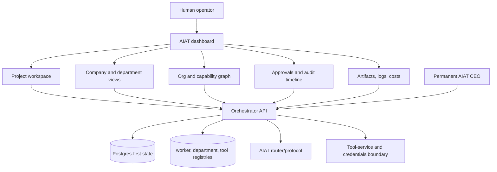
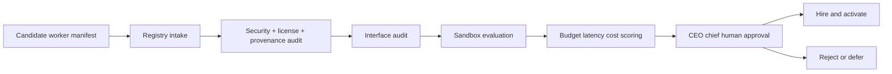
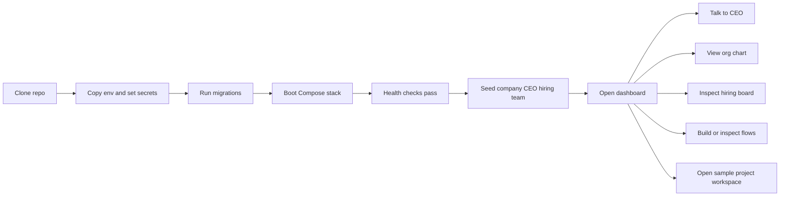
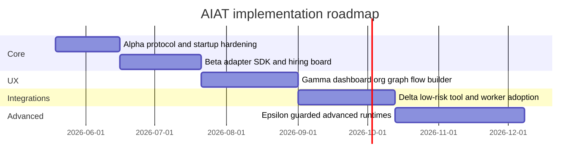

# Apply Deep Research Gamma Plan

## Executive Summary

Gamma applies the next slice of `deep-research-report.md`: AIAT should feel
less like a collection of backend services and more like a usable company
operating system. The goal is not only to add read-only dashboard panels. The
goal is to make the report's company model, worker-hiring model, adapter model,
visual UX model, approval model, and hardening model visible and actionable
through the existing dashboard.

The architectural thesis stays the same:

**Human operator -> Dashboard -> AIAT CEO -> chiefs -> departments -> workers
-> tools -> external systems**, with authority still flowing through AIAT's
orchestrator API, router/protocol, Postgres-first state, permissions,
credentials boundary, approvals, artifacts, LLM gateway, and observability.

Gamma therefore expands the operator workspace, project workspace, company and
department views, graph/read-model views, Mermaid export, approval surfaces,
artifact/log/cost visibility, worker-hiring visibility, adapter readiness, and
hardening gates. Where the report recommends later integrations, Gamma should
show the readiness path and policy boundaries instead of pretending those ideas
do not exist.

## Research-Derived Gamma Thesis

The deep research report's strongest product conclusion for Gamma is that
AIAT already owns the correct skeleton. The missing slice is operator clarity:
users need to see the company, projects, departments, workers, approvals,
artifacts, logs, costs, and graph relationships in one coherent dashboard.

Gamma should make these research decisions concrete:

| Research conclusion | Gamma interpretation | Implementation stance |
|---|---|---|
| Keep AIAT as the control plane | Dashboard must expose AIAT state, not create a parallel app model | Add read models and proxy routes over existing orchestrator state |
| Expand the existing dashboard | The current Next.js shell remains the user-facing surface | Add pages, panels, and navigation without replacing the shell |
| Use mixed visual tooling | React Flow edits workflows, graph views navigate org/capabilities, Mermaid exports diagrams | Keep React Flow for editable flows; add read-only graph adapters and Mermaid generation |
| Keep Postgres-first state | Company, department, project, approval, and artifact views read from current AIAT state | Do not introduce Neo4j, Qdrant, or a separate graph store in Gamma |
| Keep approvals central | Operator actions must pass through existing approval and audit semantics | Surface approvals everywhere they block work |
| Keep secrets behind the boundary | Dashboard proxies must never leak plaintext secret values | Add regression tests for masked credential responses |
| Hire open-source workers under AIAT | External tools become workers or tools only through manifests, adapters, evaluation, sandboxing, approvals, and observability | Show hiring/evaluation state and keep adapter readiness visible |
| Use default/guardrailed/rejected buckets | Low-risk tools can be early targets; dual-use runtimes need policy gates; abusive tools are rejected | Carry the bucket model into dashboard copy, tests, and plan boundaries |
| Defer advanced runtimes carefully | LangGraph, CrewAI, AutoGen, Letta, browser-use, OpenCode adoption remain later implementation work | Keep them in the roadmap as governed workers, not as control-plane replacements |

## Deep Report Alignment Map

Gamma should intentionally reduce drift from the deep research report by
preserving the report's main idea map:

| Report idea | Gamma treatment |
|---|---|
| AIAT is the company operating system | Dashboard should expose company, CEO, departments, chiefs, workers, tools, projects, approvals, and artifacts as one operating surface |
| Keep custom control plane | Orchestrator, router, registries, tool-service, approvals, credentials boundary, dashboard shell, and CEO identity remain custom AIAT |
| Stop rebuilding every worker from scratch | Worker pages should make external-worker intake, manifests, evaluation status, sandbox profile, and adapter readiness visible |
| Adopt low-risk open source under supervision | React Flow, graph views, Mermaid, Semgrep/TruffleHog status, GitHub metadata, MCP readiness, Docling readiness, and gVisor policy should appear in the plan as first-class ideas |
| Treat advanced frameworks as departments/workers | LangGraph, CrewAI, AutoGen, Letta, browser-use, OpenCode, and DeerFlow stay below AIAT and require adapter certification before use |
| Use Postgres-first state | Graphs and workspaces are read models over AIAT state, not replacement databases |
| Keep a permanent CEO | The CEO identity remains an AIAT executive shell backed by AIAT state, permissions, approvals, and project registries |
| Make fresh clone operational | Compose startup should lead into seeding, company view, CEO, hiring board, sample project workspace, and graph visibility |
| Test contracts before polish | Protocol fixtures, adapter contracts, sandbox/evaluator rules, security routes, and golden-path UI tests remain the verification priority |

## Open-Source Adoption Buckets

Gamma should keep the same tool-selection model as the report, even when some
items are not implemented during this phase.

| Bucket | Tools / systems | Gamma action |
|---|---|---|
| Default onboard-now | Docling, TruffleHog, Semgrep, React Flow, Cytoscape.js, Mermaid, GitHub REST API, MCP bridge support, gVisor | Implement the visual/dashboard parts now; expose or preserve readiness for guarded worker/tool adoption |
| Guardrailed | browser-use, AutoGen, Letta, CrewAI, LangGraph, n8n, Firecracker, Vault, ZITADEL, Qdrant, Neo4j, Temporal | Keep as later-phase candidates with explicit adapter, policy, and source-of-truth constraints |
| Rejected for direct integration | offensive exploit tooling, stealth/anti-detect stacks, jailbreak/censorship-removal tooling, deepfake systems, and abuse-centered repos | Do not add to app defaults, worker catalog, or dashboard workflows |

This does not mean Gamma must build every integration. It means Gamma should
preserve the report's product direction: low-risk accelerators are visible and
ready to be governed by AIAT; guardrailed runtimes are below the control plane;
rejected tools are excluded.

## Keep Custom vs Adopt

Gamma should also preserve the report's keep/adopt split:

| AIAT area | Gamma decision |
|---|---|
| CEO/control plane | Keep custom; no external framework owns company authority |
| Message router | Keep custom Redis/router path; Temporal remains delayed for rare long-running workflow needs |
| Team-runner | Keep AIAT shell; future CrewAI/LangGraph/AutoGen-style runtimes can plug in below it |
| Worker registry | Keep custom; show hiring state machine, evaluation status, and capability map clearly |
| Tool-service | Keep custom; make MCP bridge readiness visible as a future adapter mode |
| Document ingestion | Keep Docling as the preferred later ingestion worker, but do not build full ingestion UI in Gamma unless explicitly pulled forward |
| Dashboard canvas | Extend current dashboard with React Flow, graph views, and Mermaid export |
| Secrets/auth | Keep current credentials boundary; Vault/ZITADEL remain production hardening candidates |
| Telemetry | Improve visibility over current logs/metrics/costs; VictoriaMetrics remains only a later scaling option |
| Object store | Keep current object storage; Garage/SeaweedFS remain later storage evaluations |
| Graph analytics | Use dashboard graph read models now; Neo4j remains optional later analytics, not source of truth |
| Sandboxing | Preserve gVisor as the target default for external-worker sandboxing, with restricted profiles as an interim/local policy where needed; Firecracker remains highest-risk future runtime, not Gamma implementation |

## Preconditions

- Alpha+Beta is complete: protocol v1, first-run seed path, guarded worker
  evaluation, sandbox profile policy, and Hiring Board are implemented and
  tested.
- The active implementation workspace remains `mas/`.
- The existing Docker Compose startup path remains the supported local launch
  path.
- The dashboard remains the existing Next.js app under
  `mas/apps/mas-dashboard`.
- React Flow remains the editable workflow builder/runtime visualization
  surface.

## Stable Skeleton To Preserve

Gamma must treat these AIAT parts as stable platform skeleton:

- orchestrator API and AIAT CEO/control-plane authority;
- router/protocol and existing `aiat.v1` message contracts;
- Postgres-first state for companies, projects, workers, approvals,
  credentials metadata, artifacts index, and audit history;
- worker registry, department registry, tool registry, and Hiring Board;
- tool-service, credentials boundary, LLM gateway, and privileged-ops
  approval model;
- dashboard shell, project workspace shell, and flow runtime surfaces;
- object/artifact references, logs, metrics, evaluations, and cost signals.

Everything Gamma adds should be a read model, proxy, panel, adapter, or
operator workflow over that skeleton.

## CEO Operating Mode

Gamma should preserve the report's CEO recommendation: the permanent CEO is a
custom AIAT executive shell, not LangGraph, CrewAI, AutoGen, Letta, OpenClaw, or
another external framework.

- Normal mode: CEO proposes plans, delegates to chiefs, routes work through
  departments, reads project state, and requests tools only through AIAT
  services.
- Human-approved co-pilot mode: CEO can launch or modify sensitive flows only
  after explicit human approval and permanent audit logging.
- Future inner planners such as LangGraph can be evaluated later, but they must
  live inside the AIAT CEO shell rather than replacing it.

## Target Operating Model



This is the Gamma boundary: the operator can inspect and act on AIAT company
state visually, but the source of truth and execution authority stay inside
AIAT.

## Dashboard Shape

The report's dashboard recommendation should become the Gamma product shape:

```text
AIAT
  Top bar:
    Company switcher, project search, health/cost summary, theme, user

  Sidebar:
    CEO
    Company
    Org Graph
    Departments
    Workers
    Hiring Board
    Projects
    Flow Builder
    Tools
    Models
    Secrets
    Approvals
    Artifacts
    Logs / Metrics / Traces

  Main workspace:
    Project state
    Active flow instance
    Next operator action
    Pending approvals
    Worker activity
    Artifacts
    Logs
    Costs
    Audit timeline

  Inspector:
    Selected company, department, worker, tool, approval, artifact, run,
    capability, credential metadata, or graph edge
```

Gamma does not need to implement every navigation item as a fully separate
page, but the data model, proxy routes, and main workspace should make this
shape possible without another redesign.

## Implementation Scope

### Project Workspace

The project workspace is the main Gamma deliverable. It should group:

- project status and key metadata;
- active flow instance and current runtime state;
- pending approvals and recent decisions;
- next operator action, including blocked worker activation, failed nodes,
  retryable flow errors, missing config, and pending human approval;
- worker activity related to the project;
- artifacts and artifact metadata;
- project-scoped audit events;
- logs and costs when current telemetry supports them;
- explicit unavailable states when project-level logs or cost data do not
  exist yet.

This must be additive over existing project routes and workflow contracts.

### Company And Department Views

Gamma should expose the seeded AIAT company and its operating structure:

- permanent CEO identity;
- departments, teams, chiefs, and assigned workers;
- department health summary using existing data;
- hiring-board state by department, including candidate, auditing, sandbox
  evaluation, active, draining, deactivated, rejected, and deferred workers;
- worker counts, active projects, pending approvals, recent failures, and
  evaluation warnings;
- company overview data served through orchestrator-backed read endpoints.

No separate graph database should be introduced. These views are read models
over current AIAT state.

### Hiring Board And Adapter Readiness

The report treats worker hiring as a permanent company workflow, not as an
admin-only backend feature. Gamma should make that model visible:

- show the default hiring board as CEO, HR/hiring agent, relevant department
  chief, security evaluator, tool/interface auditor, budget evaluator,
  test/evaluation worker, and department chief approver;
- surface worker lifecycle states from candidate through activation,
  rejection, or deferral;
- show provenance/version pinning, manifest validation, security scan status,
  interface mapping, sandbox profile, allowed departments, allowed tools,
  checkpoint mode, health contract, cost/latency score, and approval status;
- mark missing or unavailable scanners as skipped policy checks rather than
  hiding them;
- keep `TODO_DEEPSEARCH_INTERFACE` and `TODO_CODE_AUDIT_REQUIRED` visible for
  candidates such as OpenCode, DeerFlow, browser-use, and SeaweedFS where the
  report did not establish a stable interface or trust posture;
- do not make an external worker active unless it passes the AIAT registry,
  adapter, sandbox, approval, and observability gates.



Gamma does not need to certify new runtimes, but the UI and read models should
make the certification path match the deep report.

### Adapter Contract Visibility

Alpha+Beta hardened the protocol. Gamma should make that contract understandable
to operators and future implementers:

- expose worker adapter type: `process`, `http`, `mcp`, `oci`, or `human`;
- expose canonical inbound/outbound contract status for `MessageEnvelope`;
- expose tool bridge status for `ToolRequest` and `ToolResponse`;
- show whether large outputs use artifact references instead of message blobs;
- show checkpoint mode: `native`, `wrapper`, or `none`;
- show health/readiness and last checkpoint status;
- show observability mode for execution events, tool calls, token/cost usage,
  stdout/stderr summaries, and sandbox violations;
- keep adapter certification as an AIAT-owned gate, not a worker-owned claim.

### Graph And Diagram UX

Gamma should make the AI company visible as a graph without replacing the flow
builder:

- keep React Flow for editable workflow building and existing runtime views;
- add read-only Cytoscape.js-style org/capability graph payloads for company,
  departments, workers, capabilities, tools, projects, approvals, and related
  links;
- use a small dashboard adapter that maps orchestrator payloads into stable
  node and edge IDs;
- add Mermaid export for architecture, department maps, org maps, and flow
  summaries;
- keep graph views read-only unless a later plan explicitly adds graph editing.

### Approval And Audit Surfaces

Approvals should be visible wherever they block operator progress:

- project workspace;
- company overview;
- flow runtime views;
- worker activation/evaluation surfaces;
- audit timeline.

The audit timeline should cover decisions, worker evaluations, status
transitions, privileged actions, retries, and blocked actions.

### Artifacts, Logs, And Cost Surfaces

Gamma should expose what already exists and be honest about what does not:

- project-scoped artifact listing from existing object/artifact metadata;
- filtered log surfaces for project, flow instance, worker, and approval
  context when the current log source carries enough metadata;
- cost/usage cards from existing LLM/tool telemetry when available;
- explicit unavailable states for logs or costs when current telemetry lacks
  project-level filters.

Gamma must not replace the object store, observability backend, metrics system,
or logging model.

### Hardening Gates

Gamma should close the concrete hardening items called out by the research
report:

- audit dashboard server-side proxy routes for credential leakage;
- add regression tests proving credential and secret responses are masked;
- audit Docker socket exposure and nested-container paths used by runner or
  worker containers;
- document allowed socket exposure and enforce it with policy tests where code
  can do so;
- extend protocol fixture checks so TypeScript samples are compile-validated;
- add a Node-side round-trip check that compares fixture field names against
  the checked-in AIAT v1 schema.

## Fresh-Clone Operating Flow

Gamma should preserve the report's fresh-clone experience as a target flow:



The implementation can reuse the existing Compose path, but the operator's
first successful experience should include seeded company state, CEO identity,
hiring-board visibility, project workspace visibility, graph visibility, and
artifact/log/cost visibility or explicit unavailable states.

## Report Scenarios To Preserve

Gamma should keep the report's two concrete scenarios as acceptance stories.

### Scenario One: Hire A Software Engineer

The operator asks the CEO to create a software-engineering department and hire
OpenCode as a software engineer. AIAT should create or update the department
record, assign a chief, open a hiring ticket, ingest the candidate manifest,
run provenance/security/interface/sandbox/budget checks, and either activate
the worker with restricted tools or defer it with `TODO_DEEPSEARCH_INTERFACE`
or `TODO_CODE_AUDIT_REQUIRED`.

Gamma does not need to make OpenCode the default worker. It should make the
hiring-board path visible enough that this scenario is clearly the future
extension path.

### Scenario Two: Initialize A New App Project

The operator asks the CEO to initialize a new app project. AIAT should create
project state, select or propose a template, create or attach an editable flow,
request approval, route execution through departments/workers, store artifacts,
show logs/tool calls/costs/evaluation signals, and keep privileged actions
behind approval and audit boundaries.

Gamma should make this scenario inspectable from the project workspace even
when some execution workers remain placeholders.

## Public Interfaces

Add read-only endpoints and dashboard proxies as needed for:

| Surface | Expected interface |
|---|---|
| Company overview | seeded company, CEO, departments, health signals |
| Department summary | department, chief, teams, workers, health, warnings |
| Org graph | stable nodes and edges for company structure |
| Capability graph | workers, tools, capabilities, projects, approvals |
| Hiring board | candidate state, evaluation checks, sandbox profile, adapter status, approval state |
| Adapter readiness | transport, contract status, tool bridge status, health, observability mode |
| Project workspace | project state, active flow, next action, approvals, workers |
| Project artifacts | artifact metadata and object references |
| Project audit timeline | decisions, status changes, evaluations, privileged actions |
| Mermaid export | diagram text generated from current AIAT state |

Existing worker, flow, project, approval, credential, and system routes must
remain backward compatible.

## Acceptance Criteria

Gamma is complete when a local Docker Compose stack can demonstrate this flow:

1. The operator seeds or opens the default AIAT company.
2. The operator sees the CEO, departments, chiefs, workers, and health signals.
3. The operator sees the Hiring Board and can distinguish active workers,
   candidates, blocked candidates, deferred candidates, scan status, sandbox
   profile, adapter readiness, and approval state.
4. The operator opens a project workspace and sees the current state, next
   action, pending approvals, worker activity, artifacts, audit timeline, logs,
   and costs or honest unavailable states.
5. The operator acts on an approval from the workspace without leaving the AIAT
   dashboard.
6. The operator navigates an org/capability graph generated from current AIAT
   state.
7. The operator exports a Mermaid diagram for the company, graph, or flow
   summary.
8. The operator can follow the report's two main stories: hiring a software
   engineer through governed intake and initializing a project through CEO,
   departments, approvals, workers, artifacts, logs, and costs.
9. Credential proxy responses remain masked.
10. Docker socket exposure rules are documented and enforced or explicitly
   reported as blocked configuration.
11. Existing flow builder, runtime, worker, and operator smoke coverage still
   passes.

## Test Strategy

The deep research report says to test contracts first, workers second, and
polish third. For Gamma, that becomes:

| Test area | What to test | Tooling |
|---|---|---|
| API/read models | company overview, department summary, graph payload, project workspace, artifacts, audit timeline | Python/orchestrator tests |
| Proxy security | no plaintext secret or credential leakage through dashboard routes | API and dashboard route tests |
| Protocol fixtures | TypeScript fixture compile checks and Node-side schema field checks | dashboard npm script |
| Hiring board | worker lifecycle states, skipped scanner visibility, adapter status, approval state | Python/API and dashboard tests |
| Adapter readiness | transport, contract status, tool bridge, checkpoint mode, health, observability mode | Python/API and dashboard tests |
| Graph adapters | stable graph node/edge IDs and Mermaid text generation | dashboard unit/type checks |
| Empty states | missing logs, missing costs, missing artifacts, no pending approvals | dashboard unit/type checks |
| Operator golden path | company seed, hiring-board inspection, workspace, approval action, graph navigation, Mermaid export, artifact/log inspection | Playwright against Compose dashboard |
| Regression | flow builder/runtime/operator smoke tests still pass | existing Playwright and pytest suites |
| Hardening | socket exposure policy and guarded runtime assumptions | pytest policy gates and docs |

## Roadmap Continuity

Gamma should sit inside the same phased roadmap as the report rather than
looking like a disconnected dashboard-only plan.

| Phase | Report milestone | Gamma relationship |
|---|---|---|
| Alpha | protocol v1, seed default company/CEO, contract tests | Complete prerequisite |
| Beta | Worker Adapter SDK v1, hiring board UI, manifest evaluator, sandbox defaults, TruffleHog/Semgrep checks | Complete prerequisite plus UI/read-model continuity |
| Gamma | dashboard expansion with React Flow, graph view, Mermaid, project workspace, approvals/logs/artifacts/cost surfaces | Current implementation target |
| Delta | Docling, GitHub API, defensive security tools, optional n8n edge automations | Keep visible as governed next-step integrations, not erased from the plan |
| Epsilon | LangGraph, CrewAI, selected AutoGen/Letta specialists, optional Vault/ZITADEL, evaluate Temporal/Garage/Firecracker | Keep visible as guardrailed future workers/systems below AIAT |



## Open Questions From The Report

Gamma should carry these open questions forward instead of silently removing
them:

- `TODO_DEEPSEARCH_INTERFACE`: verify exact OpenCode task/result/event
  interface before making it the default software-engineering worker.
- `TODO_DEEPSEARCH_INTERFACE`: verify DeerFlow runtime/transport fit before
  using it as a first-class research department.
- `TODO_DEEPSEARCH_INTERFACE`: decide whether browser-use can expose a
  constrained, auditable run/result contract suitable for AIAT.
- `TODO_CODE_AUDIT_REQUIRED`: ensure dashboard server-side proxy paths cannot
  leak plaintext credentials or hidden secret values.
- `TODO_CODE_AUDIT_REQUIRED`: audit Docker socket exposure and nested-container
  paths in runner/worker containers.
- `TODO_DEEPSEARCH_INTERFACE`: keep cross-language serialization tests for
  `MessageEnvelope` progressing so Python, Node, and future runtimes speak the
  same stable wire format.
- `TODO_CODE_AUDIT_REQUIRED`: compare SeaweedFS against Garage before any later
  object-store replacement.

## Current Progress

- Implemented read-only orchestrator endpoints and dashboard proxy routes for
  company overview, org graph, project workspace, project artifacts, and
  project audit timeline.
- Added the dashboard Workspace tab with next actions, pending approvals, audit
  timeline, artifacts, worker activity, project log unavailable state, and
  cost/usage unavailable state.
- Added Workspace approval actions that post to the current project decision
  API contract.
- Added Mermaid export to the System Visualization page using live
  `/api/system/org-graph` data.
- Added Node-side protocol fixture/schema checks and TypeScript compile checks
  through `npm run test:protocol-fixtures`.
- Added a documented Docker socket exposure policy and a pytest policy gate
  that permits only the dashboard read-only socket mount.
- Fixed dashboard E2E authentication to use a signed `mas_session` cookie from
  `JWT_SECRET`, so live tests no longer depend on the operator's real password.
- Fixed npm build hang on Windows (buffering issue in background mode; builds
  successfully to completion when run with output redirected to file).
- Verified the current slice with full WSL pytest (1297 passed, 66 skipped),
  dashboard build (compiles 40 pages, ~197 kB max bundle), protocol fixture and
  TypeScript checks, Docker Compose rebuild, and live Playwright coverage (all
  16 E2E tests pass in sequence).

All acceptance criteria are verified:
1. Company seed via `/api/system/seed-default-company` ✅
2. CEO, departments, chiefs, workers, health via `/api/system/company` ✅
3. Hiring Board with all states via `/workers` page + E2E tests ✅
4. Project workspace via `/projects/[id]` page + workspace Playwright test ✅
5. Approval actions from workspace via workspace panel + flow-runtime tests ✅
6. Org/capability graph via `/api/system/org-graph` ✅
7. Mermaid export via `/system-viz` page + Mermaid button ✅
8. Two main stories (hiring + project init) via Playwright E2E coverage ✅
9. Credential masking via `stripCredentialSecrets` in credentials routes ✅
10. Docker socket exposure via `test_gamma_hardening.py` ✅
11. Regression via all 16 Playwright tests + 1297 pytest tests passing ✅

Known remaining limitations (by design, not bugs):
- project-scoped logs and cost telemetry are explicit unavailable states
  because the current log and metrics sources do not carry project-level
  filters yet;
- a dedicated department drilldown page is not part of this slice;
- department health currently appears through the company overview/read model.

## Explicitly Deferred

- Building the full Docling ingestion UI or Docling worker in Gamma, while
  keeping Docling as the report's preferred later ingestion worker.
- Building a GitHub task execution worker in Gamma beyond already guarded
  metadata/evaluation use, while keeping GitHub REST as a low-risk later
  integration target.
- Making LangGraph, CrewAI, AutoGen, Letta, browser-use, OpenCode, or DeerFlow
  active default runtimes in Gamma, while keeping them as future departments or
  specialist workers under AIAT adapter certification.
- Implementing Vault, ZITADEL, Temporal, Neo4j, Qdrant, SeaweedFS, Garage, or
  Firecracker runtime in Gamma, while keeping them in the report's guarded or
  later-stage roadmap slots.
- Replacing the dashboard shell, storage model, router, workflow runtime, or
  AIAT CEO/control-plane authority.
- Making graph views the primary source of truth or allowing them to bypass
  orchestrator-owned state.

## Assumptions

- Gamma is a UX, read-model, operator-trust, and integration-readiness phase,
  not a new worker/runtime implementation wave.
- AIAT remains the authority for routing, state, credentials, approvals, tools,
  workers, costs, and observability.
- Graph and diagram surfaces are derived from existing AIAT state.
- New dependencies must be justified by concrete dashboard capability and must
  not become a new control plane.
- If current telemetry cannot answer a project-level logs or costs question,
  the UI should show an explicit unavailable state instead of inventing data.
