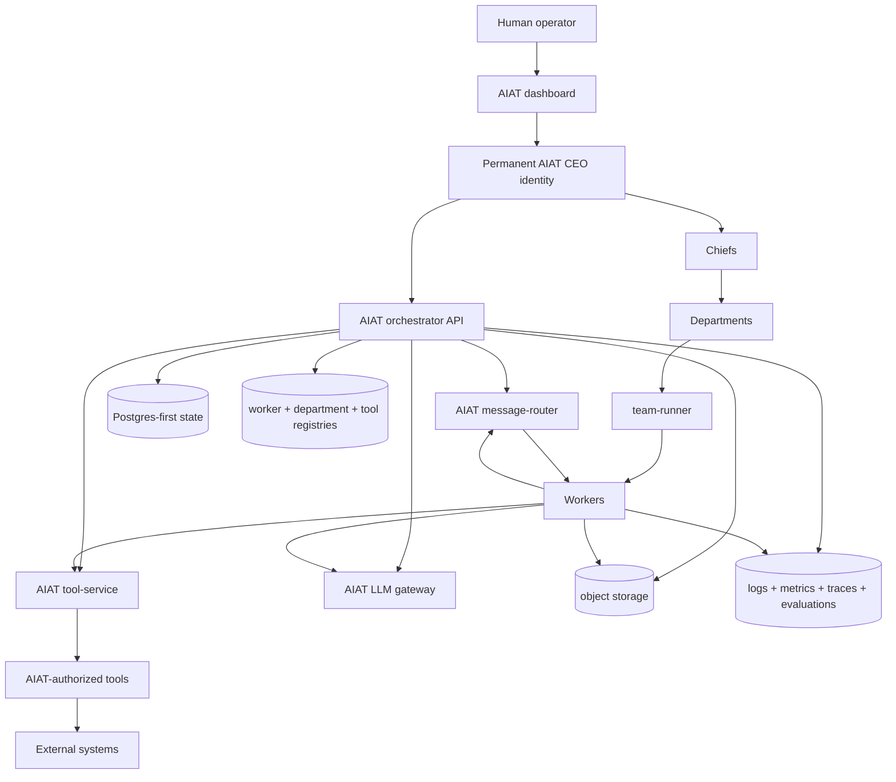
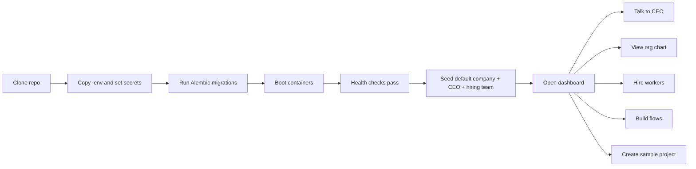
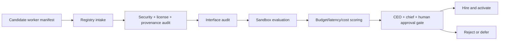
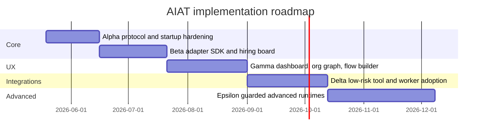

# AIAT as a Modular AI Company Operating System

> **Current policy note (2026-08-09):** This research report is historical
> design evidence. The maintained programme is
> [`AIAT_TARGET_PROGRAMME.md`](../../AIAT_TARGET_PROGRAMME.md) and
> [`ROADMAP.md`](../../ROADMAP.md). Licence, notice, and stated-use findings
> are metadata only for personal/internal use; they do not restrict normal
> resource selection or execution. Technical security, compatibility,
> provenance, resource, and approval boundaries remain current.

## Executive summary

Enabled connector scope for this research pass: **GitHub**. Repo-level inspection was limited to **`Maaroufabousaleh/AIAT`**, then expanded with uploaded project files and official documentation for external tools and runtimes.

The strongest conclusion is that **AIAT should remain the control plane** and should **stop trying to re-implement every worker capability from scratch**. Your repo is already much closer to an operating system than to a basic agent demo: the active workspace lives under `mas/`, the platform already contains an orchestrator API, message router, tool-service, team-runner, dashboard, credentials/privileged-ops boundaries, LLM gateway, worker manifests, worker import/evaluation lifecycle, and a Postgres-first state model. The uploaded technical audit also identifies **19 long-running services**, **2 init jobs**, **11 team YAMLs**, **26 worker manifests**, and **11 role prompts**, which means the right next step is not “replace AIAT,” but **stabilize and harden AIAT while hiring open-source workers through adapters**. fileciteturn56file0

The best architectural move is therefore:

- **Keep custom**: AIAT orchestrator, message protocol, router, team-runner shell, worker registry, department/company registry, permissions, credentials boundary, approval model, dashboard shell, project workspace, logs/evaluations, and the permanent CEO identity. fileciteturn56file0
- **Adopt open source under AIAT supervision**: Docling for document ingestion; React Flow, Cytoscape.js, and Mermaid for visual UX; TruffleHog and Semgrep for worker/tool intake and CI; gVisor as the default sandbox runtime; optional Firecracker for the highest-risk workloads; GitHub’s REST API for code operations; Vault and ZITADEL as later-stage production hardening; and n8n only at the edge for external automations rather than as the core runtime. fileciteturn56file0 citeturn10view0turn6view1turn7view2turn8view0turn17view0turn17view1turn15view0turn15view1turn19view1turn11view5turn11view1turn16view3
- **Use agent frameworks as departments or specialist workers, not as your sovereign control plane**. LangGraph is the strongest fit for durable, stateful, human-interruptible **departmental** execution; CrewAI fits crew-style departments; AutoGen and Letta belong behind stricter guardrails as specialist runtimes; OpenClaw should **not** be your permanent CEO under a conservative threat model; DeerFlow and OpenCode remain interesting but need deeper interface and code audits before they become default building blocks. fileciteturn56file0 citeturn1view0turn1view1turn1view2turn5view0turn21search3turn21academia4turn21academia8turn21academia10turn21academia11

In practical terms, your production architecture should become:

**Human → Dashboard → AIAT CEO → chiefs → departments → workers → tools → external systems**, with **all stateful authority still flowing through AIAT’s router/protocol, Postgres-first state, permissions, object storage, LLM gateway, and observability**. That preserves your original “AI company” vision while using open source where it clearly saves time and lowers build risk. fileciteturn56file0 citeturn6view0turn15view0

## Key information needs

To answer your request rigorously, five information needs matter most.

First, I needed to determine **what AIAT already implements and therefore should not be casually replaced**. The uploaded audit answered that directly by confirming the current scope of the service stack, registries, prompts, storage, dashboard, and privileged operations boundary. fileciteturn56file0

Second, I needed to identify **which open-source components reduce custom code without destroying the AI-company model**. That is why the evaluation below focuses on tools that are good at sub-runtimes, ingestion, visualization, sandboxing, secrets, and observability rather than tools that try to become the whole platform. fileciteturn56file0 citeturn1view0turn1view1turn1view2turn5view0turn6view1turn15view0

Third, I needed to apply your attached **risk/triage rules**: prioritize Low and Low–Medium; explicitly guardrail Medium / dual-use; and exclude High / Avoid from direct integration. The uploaded audit and your attached triage direction strongly support that rule set, especially around defensive tools versus high-risk offensive or stealth tooling. fileciteturn56file0

Fourth, I needed to work out **how external workers actually communicate** so that “hiring” new workers is easy. The official docs for LangGraph, CrewAI, AutoGen, Letta, MCP, Docling, GitHub REST, Vault, and Qdrant are enough to define a realistic adapter spec, but some candidates still have unclear runtime or wire interfaces in this pass and therefore remain marked `TODO_DEEPSEARCH_INTERFACE`. citeturn1view0turn1view1turn1view2turn5view0turn6view0turn10view0turn19view1turn11view5turn12view0

Fifth, I needed to define **what should stay stable even when every company template, department, chief, worker, and tool changes**. That is the purpose of the “stable AIAT skeleton” below: a durable control-plane core plus swappable worker ecosystems. fileciteturn56file0

## AIAT repo audit

The current repo is not a blank slate. It is a **real, partially production-shaped operating substrate** with missing hardening and integration work, not a concept-only prototype. The uploaded audit confirms that the active development workspace is the `mas/` directory, while stale root-level frontend artifacts should be ignored; that matters because deployment and development effort should stay focused on `mas/apps/*`, `mas/packages/*`, `mas/infra/*`, `mas/teams/*`, `mas/workers/*`, and `mas/prompts/*` rather than on legacy root clutter. fileciteturn56file0

The following audit is the high-confidence repo-grounded status picture for planning:

| AIAT area | Current status | What exists now | Recommendation |
|---|---|---|---|
| Active workspace | Verified | `mas/` is canonical; root contains stale/generated artifacts | Keep `mas/` as the only authoritative workspace |
| Control plane | Verified | Orchestrator API, message-router, tool-service, team-runner, dashboard | Keep custom; harden contracts and onboarding |
| State model | Verified | Postgres-first structured state, workflows, approvals, credentials, audits | Keep custom and central |
| Messaging | Partially verified | `MessageEnvelope` exists; router supports publish/subscribe and WS delivery | Freeze a versioned wire contract and add conformance tests |
| Tool execution | Verified | Central tool-service with grants, rate limits, circuit breakers | Keep custom; expose MCP bridge and stronger manifests |
| Worker registry | Verified | Manifest seeding, import/evaluation lifecycle, status monitoring | Keep custom; add hiring board UX and adapter certification |
| Dashboards | Verified | Next.js dashboard exists under `mas/apps/mas-dashboard` | Expand, do not replace wholesale |
| Credentials boundary | Verified | Credentials manager and privileged-ops separation exist | Keep custom boundary; optionally back with Vault later |
| Flow runtime | Verified | Deterministic state transitions, runtime controller, archive/retry logic | Keep; delay Temporal unless multi-day recovery becomes critical |
| E2E tests | Verified | Playwright-based dashboard testing exists | Expand with golden-path, security, and adapter tests |

This table synthesizes the uploaded technical audit and the repo inspection context. fileciteturn56file0

Two repo-audit points matter more than the rest.

The first is that **AIAT already owns the right control-plane seams**: message routing, worker/team registration, credentials separation, workflow state, and operator UI. That means frameworks like LangGraph or AutoGen should plug into those seams rather than replacing them. The second is that **the current weak point is not conceptual architecture but contract hardening**: the uploaded audit explicitly treats `MessageEnvelope` as only partially verified and calls out multi-language serialization compatibility as still uncertain. That is exactly why the adapter SDK and protocol-freezing work should come before aggressive worker onboarding. fileciteturn56file0

My audit verdict is therefore:

**AIAT is already the right skeleton. The missing work is contract stability, safe worker-hiring, dashboard-first onboarding, and selective replacement of commodity subsystems.** fileciteturn56file0

## Critical evaluation and stable AIAT skeleton

Your ideas are directionally strong, but several need modification rather than literal implementation.

| Proposed idea | Decision | Why |
|---|---|---|
| Model the app as a real company with CEO, chiefs, departments, workers, tools | **Keep** | This is AIAT’s differentiator, and the repo already supports the necessary control-plane primitives. fileciteturn56file0 |
| Build every agent/worker from zero | **Reject** | It slows delivery without improving the control plane; open-source workers should be “employees” under AIAT. fileciteturn56file0 |
| Make the CEO permanent in every AIAT company | **Keep, but modify runtime choice** | The CEO should be a stable custom AIAT identity with optional inner planning runtime, not a third-party framework that owns the platform. fileciteturn56file0 citeturn1view0 |
| Replace your control plane with LangGraph / CrewAI / AutoGen / Letta | **Reject** | Those runtimes are useful, but they are better as departments or specialist workers than as sovereign governance. fileciteturn56file0 citeturn1view0turn1view1turn1view2turn5view0 |
| Add external open-source workers/tools under AIAT | **Keep** | This is the best acceleration path if adapters, permissions, and sandboxing are enforced. fileciteturn56file0 |
| Replace Redis Streams immediately with Temporal | **Modify / delay** | Redis suits low-latency streaming; Temporal suits long-running durable workflows. Use Redis now; add Temporal only if the need becomes real. fileciteturn56file0 citeturn8view1 |
| Use one graph/UI library for everything | **Replace with mixed approach** | React Flow is best for interactive flow-building; Cytoscape is better for graph analysis and org/capability views; Mermaid is best for exportable diagrams. fileciteturn56file0 citeturn6view1turn7view2turn8view0 |
| Treat cyber/privacy/browser tools as optional department tools | **Keep, with strict separation** | Defensive tools fit; stealth/offensive tools do not belong in the safe default platform. fileciteturn56file0 citeturn10view1turn17view0turn17view1 |
| Replace current dashboard | **Reject** | Expand the existing Next.js dashboard instead of throwing away the working shell. fileciteturn56file0 |
| Replace all current storage now | **Delay** | Keep Postgres-first and current hot-path object storage early; evolve object storage only after adapter and workflow stability. fileciteturn56file0 citeturn16view4 |

The **stable AIAT skeleton** should be defined as the part of the platform that never changes shape even when companies, departments, and workers do. In my judgment, the stable skeleton is:

- the **Postgres-first system of record** for projects, workers, departments, permissions, approvals, evaluations, credentials metadata, and artifacts index;
- the **router protocol** and delivery semantics;
- the **worker registry**, **department registry**, **tool registry**, and company/org graph;
- the **tool-service** as the enforcement boundary;
- the **LLM gateway** and provider abstraction;
- the **human approval** and privileged-ops boundary;
- the **adapter SDK** and worker-hiring/evaluation lifecycle;
- the **dashboard** and **project workspace** shell;
- the **artifacts/logs/evaluation** chain. fileciteturn56file0

Everything else should be considered swappable:

- company templates,
- departments,
- chiefs,
- worker runtimes,
- tool packs,
- domain memory packs,
- local models,
- sector templates,
- user-created private company configs. fileciteturn56file0

For the **permanent CEO**, the best recommendation is:

**Use a custom AIAT executive shell as the permanent CEO identity, backed by Postgres state, AIAT approvals, AIAT permissions, and AIAT project registries; optionally use LangGraph inside that shell for planning and long-running executive workflows.** LangGraph’s official docs make it attractive for persistence, durability, streaming, memory, subgraphs, and human-in-the-loop control, but those are exactly the reasons it fits as an internal planning runtime rather than as the top-level product architecture. fileciteturn56file0 citeturn1view0

The CEO runtime ranking for AIAT looks like this:

| Candidate | Fit for permanent CEO | Recommendation |
|---|---|---|
| Custom AIAT executive shell | Best fit | **Recommended** |
| LangGraph | Best inner planner/runtime | **Use inside CEO shell** |
| CrewAI | Good for chiefs/departments | Use below CEO |
| AutoGen | Good for specialist multi-agent teams | Guardrailed, below CEO |
| Letta | Good for memory-heavy research specialists | Guardrailed, below CEO |
| DeerFlow | Interesting for research department | `TODO_DEEPSEARCH_INTERFACE` |
| OpenClaw | Poor fit for permanent CEO under conservative threat model | Reject for core CEO; at most optional isolated assistant |

This is not just stylistic. AutoGen and Letta expose useful abstractions, but they widen the runtime surface. OpenClaw, meanwhile, is explicitly aimed at autonomous assistant workflows and recent research has highlighted substantial attack surfaces around plugins, skills, memory, and execution privilege, which makes it a poor default choice for the sovereign executive of a company OS. citeturn1view2turn5view0turn21search3turn21academia4turn21academia8turn21academia10turn21academia11

The CEO should have two modes:

- **Normal mode**: proposes plans, delegates to chiefs, routes through approvals, reads project state, and requests tools indirectly.
- **Human-approved co-pilot mode**: can launch or modify sensitive flows only after explicit human approval and permanent audit logging. fileciteturn56file0

## Open-source tool selection and risk filtering

Your attached triage rule is the right one to operationalize:

**Low / Low–Medium** candidates become default integration targets; **Medium / dual-use** candidates are sandboxed, allowlisted, and disabled by default; **High / Avoid** candidates are not directly integrated into the app and are only discussed at a high level if needed. The uploaded audit also reinforces a strict distinction between defensive tools and offensive or stealth tooling. fileciteturn56file0

That policy produces three buckets.

**Default onboard-now bucket**: Docling, TruffleHog, Semgrep, React Flow, Cytoscape.js, Mermaid, GitHub REST API, MCP bridge support, and gVisor. These are the cleanest accelerators because they improve ingestion, UI, security, external connectivity, and isolation without trying to become the AIAT control plane. fileciteturn56file0 citeturn10view0turn17view0turn17view1turn6view1turn7view2turn8view0turn19view1turn6view0turn15view0

**Guardrailed bucket**: browser-use, AutoGen, Letta, CrewAI, LangGraph, n8n, Firecracker, Vault, ZITADEL, Qdrant, Neo4j, and Temporal. Some are low operational risk, but they still need bounded scope because they expand the surface area or because they solve problems AIAT does not need on day one. browser-use is especially sensitive because its own docs foreground stealth browsers, CAPTCHA solving, and proxies. citeturn10view1turn1view2turn5view0turn1view1turn1view0turn16view3turn15view1turn11view5turn11view1turn12view0turn13view0turn8view1

**Rejected for direct integration**: weapons/military repos, offensive exploit tooling, stealth/anti-detect stacks, jailbreak/censorship-removal tooling, deepfake systems, and any repo whose value depends on high-risk abuse paths rather than on normal software or enterprise operations. Your own instructions and the uploaded material both support excluding them. fileciteturn56file0

The most useful candidate matrix is below.

| Candidate | Role in AIAT | Triage tier in this pass | Exact I/O | Adapter type | Confidence | Recommendation |
|---|---|---|---|---|---|---|
| Docling | document/PDF ingestion worker | Low / core in uploaded audit | Input: PDFs, DOCX, PPTX, XLSX, HTML, media; Output: `DoclingDocument`, Markdown, HTML, JSON, chunks, OCR-enriched structure, optional MCP server | process / mcp / oci | High | **Adopt early** citeturn10view0 |
| TruffleHog | secrets scan in worker intake + CI | Low / core in uploaded audit | Input: repos, history, images, SDLC sources; Output: findings, verified credentials, remediation status, pre-commit/pre-receive prevention hooks | process / oci | High | **Adopt early** citeturn17view0 |
| Semgrep | code/security policy evaluator | Low / core in uploaded audit | Input: codebases, rules, deps; Output: SAST/SCA/secrets findings, 630+ secrets detectors, commit guardrails | process / oci | High | **Adopt early** citeturn17view1 |
| React Flow | flow builder canvas | Low | Input: nodes/edges/custom React nodes; Output: interactive editors and AI workflow editor UI patterns | UI library | High | **Adopt early** citeturn6view1 |
| Cytoscape.js | org graph / capability graph / graph analytics UI | Low | Input: graph nodes/edges; Output: interactive graph visualization and algorithms like BFS/PageRank | UI library | High | **Adopt early** citeturn7view2 |
| Mermaid | exportable architecture/playbook diagrams | Low | Input: text diagram specs; Output: diagrams, editor-rendered exports, integrations | UI/export | High | **Adopt early** citeturn8view0 |
| GitHub REST API | official code-system interface | Low | Input: authenticated HTTP calls; Output: repo/issues/PR/actions/artifacts/secrets endpoints | http | High | **Adopt early** citeturn19view1 |
| MCP | standard tool/data bridge | Low / core | Input: structured client/server tool and resource calls; Output: standardized tool/data/workflow interaction | mcp | High | **Adopt as first-class adapter mode** citeturn6view0 |
| gVisor | default worker sandbox | Low / core in uploaded audit | Input: OCI bundles / `runsc`; Output: sandboxed containers with isolated syscall mediation | oci | High | **Default sandbox** citeturn15view0 |
| Firecracker | highest-isolation worker sandbox | Low-risk optional in uploaded audit, but higher ops cost | Input: microVM config / KVM-backed workloads; Output: microVM-isolated workloads | oci / specialized runtime | High | **Optional for highest-risk jobs** citeturn15view1 |
| LangGraph | departmental long-running runtime | Not explicitly risk-scored in attachment during this pass | Input: graph state/messages; Output: state transitions, persistence, event streaming, interrupts, memory, subgraphs | process / oci / http | High | **Recommended below AIAT control plane** citeturn1view0 |
| CrewAI | crew-style department runtime | Not explicitly risk-scored in attachment during this pass | Input: agents/tasks/flows/triggers; Output: structured outputs, persisted/resumable flow state, HITL callbacks | process / oci / http | High | **Good for chiefs/departments** citeturn1view1 |
| AutoGen | distributed specialist runtime | Treat as Medium / dual-use under conservative model | Input: tasks/messages or actor events; Output: agent runs, extensions, Docker execution, gRPC runtime, MCP workbench | process / oci / http | High | **Guardrailed specialist runtime** citeturn1view2 |
| Letta | memory-heavy research worker | Treat as Medium / dual-use under conservative model | Input: agents/messages/tools/files/memory blocks; Output: streamed messages, runs, steps, memory state, tool approvals | http / oci | Medium-High | **Guardrailed specialist runtime** citeturn5view0 |
| browser-use | autonomous browser worker | Medium / dual-use | Docs confirm AI browser automation with stealth browsers, CAPTCHA solving, residential proxies, and managed infra; exact AIAT-facing event model remains unclear | process / oci / http | Medium | **Optional only; `TODO_DEEPSEARCH_INTERFACE`; disabled by default** citeturn10view1 |
| OpenCode | software-engineering worker | Low-risk core in uploaded audit, but interface not verified in this pass | Candidate coding worker; exact transport and run/result contract not verified from official docs in this pass | `TODO_DEEPSEARCH_INTERFACE` | Medium-Low | **Promising, but `TODO_CODE_AUDIT_REQUIRED`** fileciteturn56file0 |
| DeerFlow | research department runtime | Policy-gated optional in uploaded audit | Candidate research runtime; exact API surface not verified in this pass | `TODO_DEEPSEARCH_INTERFACE` | Low | **Interesting, delayed** fileciteturn56file0 |
| ZITADEL | IAM / SSO / multi-tenant operator auth | Low-risk optional in uploaded audit | Input: authn/authz requests; Output: MFA/SSO/OIDC/SAML/OAuth tokens, audit trail, multi-tenant identity management | http / oidc / saml | High | **Adopt later for production multi-tenancy** citeturn11view1 |
| Vault | secrets engine | Low-risk optional in uploaded audit | Input: auth + secret requests; Output: centralized secret storage, on-demand creds, encryption/tokenization, audit logs | http | High | **Adopt later for production hardening** citeturn11view5 |
| Qdrant | vector retrieval tier | Not explicitly triaged in attached file | Input: vectors/points/payloads; Output: similarity, filtering, hybrid queries, multitenancy, MCP server support | http / mcp | High | **Optional when Postgres-first retrieval is not enough** citeturn12view0 |
| Neo4j | graph analytics store | Not explicitly triaged in attached file | Input: graph data/Cypher; Output: graph queries, visualization tooling, graph data science | bolt / http | Medium | **Optional analytical read-model, not source of truth** citeturn13view0 |
| Temporal | long-running durable workflow engine | Low-risk delayed in uploaded audit | Input: workflows and activities; Output: durable, replayable, pausable stateful execution | process / service | High | **Delay until AIAT truly needs multi-day replay** fileciteturn56file0 citeturn8view1 |
| VictoriaMetrics | telemetry backend | Low-risk core in uploaded audit | Input: metrics/logs/traces (including OTel ingestion noted in docs); Output: scalable monitoring and TSDB behavior | service | High | **Good if Prometheus cardinality becomes painful** fileciteturn56file0 citeturn13view3 |
| Garage | object storage | Not explicitly triaged in attached file | Input: S3 object operations; Output: replicated redundant object chunks across zones | service / s3 | Medium-High | **Strong alternative for later distributed storage** citeturn16view4turn16view5 |
| SeaweedFS | object/file store alternative | Mentioned in project materials, but not verified from official docs in this pass | Interface and deployment fit not verified here | `TODO_DEEPSEARCH_INTERFACE` | Low | **`TODO_CODE_AUDIT_REQUIRED`** |

The biggest practical lesson from this matrix is that the best early speedups are not glamorous “super-agent” frameworks. They are **ingestion, UI, security, sandboxing, and adapter standards**. Those are the areas where mature open source saves you the most custom work while protecting the AIAT identity. fileciteturn56file0

The following **replace vs keep custom** table turns that into concrete implementation guidance.

| Current AIAT component | Current custom implementation | Open-source replacement or complement | What it improves | What must remain custom in AIAT | Integration difficulty | Risk level | Status |
|---|---|---|---|---|---|---|---|
| CEO/control plane | Custom AIAT orchestrator + executive logic | None as full replacement; optionally LangGraph inside | Adds durable executive planning without giving up governance | CEO identity, approvals, budgets, project authority, org model | Medium | Low | Keep custom |
| Message router | Custom Redis Streams + WS | Temporal only for long workflows, not for streaming | Durable replay for rare long jobs | Real-time routing, streaming UX, AIAT protocol | High | Low | Keep custom; delayed Temporal |
| Team-runner | Custom per-team runner | CrewAI / LangGraph / AutoGen as sub-runtimes | Faster specialist-team composition | Supervision, team membership, budgets, tool visibility | Medium | Medium | Keep shell, plug sub-runtimes |
| Worker registry | Custom manifests + import/eval | None | N/A | Registry, hiring state machine, capability map | Low | Low | Keep custom |
| Tool-service | Custom enforcement layer | MCP bridge support | Easier tool interoperability | Grants, rate limits, audit, circuit breakers | Medium | Low | Keep custom, add MCP |
| Document ingestion | Homegrown/unfinished parsing path | Docling | Better structure extraction, OCR, Markdown/JSON, local/private parsing | AIAT project context, artifact indexing, permissions | Low | Low | Replace |
| Coding worker | Complex custom code not fully tested | OpenCode candidate | Faster SE worker bootstrap | Hiring, policy, result contract, approvals, workspace governance | Medium | Low–Medium | `TODO_DEEPSEARCH_INTERFACE`; `TODO_CODE_AUDIT_REQUIRED` |
| Browser worker | Likely brittle custom flows/scripts | browser-use | Adaptive browser interaction | Permissioning, safe domains, artifact/logging, approvals | Medium | Medium / dual-use | Optional only |
| Dashboard canvas | Existing dashboard shell | React Flow + Cytoscape + Mermaid | Rich editing and graph UX | Operator workflow, auth boundary, app IA | Low | Low | Extend current dashboard |
| Secrets | Current custom credentials manager | Vault | Dynamic secrets, rotation, encryption/tokenization, audit | Which worker gets what, approval policy, masking rules | High | Low | Later-stage hardening |
| Operator auth | Current local auth / custom tables | ZITADEL | MFA, SSO, B2B multi-tenancy, auditability | AIAT permission graph and company-specific access semantics | High | Low | Later-stage hardening |
| Telemetry | Current developer monitoring + dashboard logs | LiteLLM UI + OmniRoute analytics; optional Prometheus-compatible platform metrics | LLM usage, cost, routing, provider health, and evaluations | AIAT-specific audit/event semantics and non-LLM service health | Medium | Low | Link the external analytics surfaces; keep platform metrics optional |
| Object store | Current MinIO hot-path | Garage, later maybe SeaweedFS | Better distributed/redundant object patterns | Artifact semantics, lifecycle, retention, ACL mapping | Medium | Low | Keep current now |
| Vector retrieval | Postgres-first knowledge model | Qdrant | Better ANN/hybrid retrieval at scale | AIAT project/context graph and policy | Medium | Low | Delay until needed |
| Graph analytics | Org graph likely in app/data model | Neo4j | Advanced graph querying and analytics | AIAT company source-of-truth and edits | Medium | Low | Optional read-model only |
| Sandboxing | Raw Docker path in parts of stack | gVisor by default; Firecracker for high-risk jobs | Stronger isolation, smaller escape surface | Worker lifecycle, permissions, adapter mediation | High | Low | Prioritize |

This table synthesizes the uploaded audit plus official docs for the replacement candidates. fileciteturn56file0 citeturn1view0turn1view1turn1view2turn10view0turn10view1turn6view1turn7view2turn8view0turn11view5turn11view1turn14view0turn13view2turn13view3turn12view0turn13view0turn15view0turn15view1

## Adapter architecture, fresh clone, and operating flows

The right operating model is **not** “AIAT talks directly to every repo’s private runtime semantics.” It is:

**AIAT publishes one canonical company protocol, and every worker is wrapped until it speaks that protocol.** That is how you preserve the AI-company identity while making hiring easy. This design is directly supported by AIAT’s existing control-plane direction and by MCP’s role as a standardized tool/data interface. fileciteturn56file0 citeturn6view0



This diagram reflects the core principle of the final design: humans, CEO, chiefs, departments, workers, and tools all exist, but **authority and observability are still centralized in AIAT**. fileciteturn56file0

The **AIAT Worker Adapter SDK** should be versioned and explicit. I recommend `aiat-worker-sdk` **v1.0.0** with four transports: `process`, `http`, `mcp`, and `oci`.

| SDK area | Stable v1 recommendation |
|---|---|
| Adapter types | `process`, `http`, `mcp`, `oci` |
| Canonical inbound contract | `MessageEnvelope` target schema |
| Canonical outbound contract | `MessageEnvelope` with standard `msg_type` and artifact refs |
| Tool bridge | `ToolRequest` / `ToolResponse` through tool-service only |
| Artifact rule | Large outputs stored in object store; messages carry refs, not blobs |
| Checkpointing | Worker can declare `native`, `wrapper`, or `none`; replay safety required |
| Health | `/health`, readiness, supported capabilities, last checkpoint status |
| Observability | execution events, tool calls, token/cost usage, stdout/stderr summaries, sandbox violations |
| Security | explicit isolation policy, network profile, filesystem scope, human-approval requirements |
| Hiring metadata | source, version pin, maintenance signal, evaluator results, risk tier, allowed departments |

Because the uploaded audit explicitly says the current `MessageEnvelope` is only partially verified and that cross-language compatibility needs more proof, the table below should be treated as the **target stable wire contract** rather than as a claim that every field is already frozen exactly this way in the repo today. fileciteturn56file0

| Target `MessageEnvelope` field | Purpose |
|---|---|
| `envelope_id` | unique message identity |
| `msg_type` | semantic type such as `TASK`, `RESULT`, `REVIEW`, `APPROVAL_REQUEST`, `APPROVAL_RESULT`, `HEALTH`, `ESCALATION` |
| `sender` | worker/chief/CEO identity |
| `sender_role` | organizational role |
| `recipient` | team, worker, or system target |
| `project_id` | project scope |
| `flow_id` / `node_id` | optional workflow scope |
| `correlation_id` | ties request/response chains |
| `payload` | structured JSON payload |
| `artifact_refs` | object-store refs for large outputs |
| `ttl_seconds` | routing lifetime |
| `retry_count` | delivery attempt count |
| `approval_scope` | whether human/chief/system approval is required |
| `budget_scope` | cost/runtime/tooling budget reference |
| `created_at` | audit and replay timestamp |

The **tool contract** should likewise be versioned and simple:

| Contract | Key fields |
|---|---|
| `ToolRequest` | `request_id`, `tool_name`, `arguments`, `actor_id`, `project_id`, `timeout_s`, `artifact_mode`, `approval_scope` |
| `ToolResponse` | `request_id`, `ok`, `result`, `artifact_refs`, `stdout`, `stderr`, `usage`, `policy_notes`, `error` |

The **worker manifest** should be frozen around the registry needs AIAT already implies:

| Worker manifest field | Why it must exist |
|---|---|
| `worker_id`, `display_name` | durable identity |
| `source_type`, `source_link`, `version_pin` | provenance and update control |
| `adapter_type`, `entrypoint`, `transport` | integration mechanics |
| `runtime_profile`, `sandbox_profile` | execution safety |
| `capabilities` | routing and discovery |
| `allowed_tools` | least privilege |
| `allowed_departments` | org scoping |
| `checkpoint_mode` | replay/resume behavior |
| `observability_mode` | logs/traces/metrics expectations |
| `risk_tier`, `audit_status` | hiring policy |
| `evaluation_scores` | performance and safety history |

The **fresh-clone experience** should be materially better than a raw Compose bring-up. The uploaded audit confirms the current operator path already includes `.env` preparation, bcrypt password hashing, Alembic migration, Docker Compose startup, and explicit service health checks. That is a good base, but it should be followed by a **first-run seeding wizard** that creates a default company, seeds the permanent CEO, installs the default hiring board, loads sample manifests, and creates one sample project workspace. fileciteturn56file0



A good default dashboard shell should look like this:

```text
┌ AIAT ─ Company Switcher ─ Project Search ─ Cost/Health ─ Theme ─ User ┐
│ Sidebar                                                                │
│  CEO Chat                                                              │
│  Companies                                                             │
│  Org Graph                                                             │
│  Departments                                                           │
│  Workers                                                               │
│  Hiring Board                                                          │
│  Projects                                                              │
│  Flow Builder                                                          │
│  Tools                                                                 │
│  Models                                                                │
│  Secrets                                                               │
│  Approvals                                                             │
│  Artifacts                                                             │
│  Logs / Metrics / Traces                                               │
├─────────────────────────────────────────────────────────────────────────┤
│ Main canvas                                                            │
│  React Flow for editable workflows                                     │
│  Cytoscape view for org/capability graph                               │
│  Mermaid export for architecture/playbooks                             │
├─────────────────────────────────────────────────────────────────────────┤
│ Right inspector                                                        │
│  Selected chief / department / worker / tool / permission / run        │
└─────────────────────────────────────────────────────────────────────────┘
```

This UI split follows the natural strengths of the selected libraries: React Flow for editable node-based workflows, Cytoscape.js for graph analysis and rich org/capability visualization, and Mermaid for lightweight text-based exports and documentation views. citeturn6view1turn7view2turn8view0

The **default hiring and evaluation team** should be a permanent board, not an ad hoc prompt. The uploaded audit already describes a worker lifecycle with stages such as Candidate, Auditing, Sandbox Evaluation, Active, Draining, and Deactivated. That should become a visible workflow in the dashboard. fileciteturn56file0

My recommended permanent hiring board is:

- CEO
- HR / hiring agent
- relevant department chief
- security evaluator
- tool/interface auditor
- budget evaluator
- test/evaluation worker
- department chief approver



The hiring board should run at least these checks before a worker becomes active:

- provenance and version pinning;
- secret scanning and code scanning;
- interface mapping into `MessageEnvelope` and `ToolRequest/ToolResponse`;
- sandbox profile assignment (`gVisor` by default, `Firecracker` where needed);
- allowed departments and tools;
- replay/checkpoint declaration;
- health contract;
- cost and latency scoring;
- human approval if the worker is Medium / dual-use. fileciteturn56file0 citeturn17view0turn17view1turn15view0turn15view1

Two end-to-end scenarios make the model concrete.

**Scenario one: the user asks the CEO to create a software engineering department and hire OpenCode as a software engineer.** The CEO creates or updates the department record, assigns a chief, opens a hiring ticket, and pushes the candidate manifest into the worker registry. The hiring board then runs provenance checks, TruffleHog and Semgrep scans, interface review, sandbox trial, and budget scoring. If OpenCode’s runtime and result contract map cleanly into the AIAT adapter SDK, the worker is placed in the software engineering department with restricted tools and workspace permissions. If the interface is still unclear, the ticket is paused with `TODO_DEEPSEARCH_INTERFACE`; if the codebase quality or trust posture still needs more review, it is marked `TODO_CODE_AUDIT_REQUIRED`. That flow preserves your “hire workers like a company” metaphor without trusting the worker before certification. fileciteturn56file0 citeturn17view0turn17view1turn15view0

**Scenario two: the user asks the CEO to initialize a new app project.** The CEO creates a project in Postgres-first state, selects or proposes a project template, creates an editable flow, requests approval, then routes execution to the department chief and relevant workers through AIAT’s router. The coding worker uses only approved tools through the tool-service; artifacts land in the object store and are referenced back into the project workspace; logs, tool calls, costs, and evaluation signals flow into observability; and any privileged operation stays behind approval and audit boundaries. This is exactly the kind of execution that benefits from your company hierarchy while still keeping every critical state transition in AIAT. fileciteturn56file0

## Roadmap, testing, and open questions

The testing strategy should focus on **contracts first, workers second, polish third**. The uploaded audit is clear that AIAT already has enough moving parts that integration mistakes will cost more than missing features. The correct order is therefore: protocol tests, sandbox/evaluator tests, golden-path end-to-end, then operator UX refinement. fileciteturn56file0

The essential test stack is:

| Test area | What to test | Tooling |
|---|---|---|
| Protocol contracts | `MessageEnvelope`, WS ACK/NACK/PING/PONG, `ToolRequest`, `ToolResponse`, worker manifest parsing | Python contract tests + JSON schema tests |
| Golden path | fresh clone → dashboard → CEO chat → department creation → worker hire → project init → artifact/log visibility | Playwright + seeded fixture company |
| Adapter conformance | process/http/mcp/oci adapters all round-trip the same canonical task/result shape | SDK conformance suite |
| Security intake | secrets scans, code scans, unsafe tool requests, permission denials | TruffleHog + Semgrep + policy tests |
| Sandbox controls | filesystem scope, blocked host access, egress rules, syscall restrictions | gVisor tests; optional Firecracker tests |
| Observability | metrics labels, log completeness, trace correlation, cost accounting | LiteLLM/OmniRoute analytics plus AIAT API/Playwright checks; optional Prometheus-compatible checks |

The open-source security tools fit very cleanly here: TruffleHog for exposed secrets and verified live credentials, Semgrep for code and policy quality, and gVisor or Firecracker for runtime containment. LiteLLM and OmniRoute provide the default operator-facing LLM and routing analytics. AIAT keeps its own health, audit, DLQ, workflow, and tool telemetry, with Prometheus-compatible collection available only when broader platform time-series analysis is needed. fileciteturn56file0 citeturn17view0turn17view1turn15view0turn15view1turn14view0turn13view2turn13view3

The phased roadmap below is the shortest safe path to a production-grade AIAT.

| Phase | Duration | Milestones | Acceptance criteria |
|---|---|---|---|
| Alpha | 3–4 weeks | Freeze protocol v1, seed default company/CEO, golden-path startup, root-artifact cleanup, contract tests | Fresh clone lands in dashboard; CEO chat works; sample project can be created; protocol tests pass |
| Beta | 4–5 weeks | Worker Adapter SDK v1, hiring board UI, manifest evaluator, gVisor default sandbox, TruffleHog/Semgrep CI | A candidate worker can be imported, audited, sandbox-tested, and hired through UI |
| Gamma | 4–6 weeks | Dashboard expansion with React Flow, Cytoscape, Mermaid; project workspace; approvals/logs/artifacts/cost surfaces | User can create company, departments, flows, approvals, and inspect results visually |
| Delta | 4–6 weeks | Low-risk worker/tool integrations: Docling, GitHub API, defensive security tools, optional n8n edge automations | Document ingestion, GitHub tasks, and evaluation scans run end-to-end through AIAT |
| Epsilon | 6–8 weeks | Guardrailed advanced runtimes: LangGraph, CrewAI, selected AutoGen/Letta specialists; optional Vault/ZITADEL; evaluate Temporal, Garage, Firecracker | Advanced runtimes operate only through adapters and policy gates; no bypass of AIAT core |



The most important unresolved items are the ones that genuinely require deeper targeted research rather than guesswork.

- **`TODO_DEEPSEARCH_INTERFACE`**: verify exact OpenCode task/result/event interface before making it the default software-engineering worker. The uploaded audit treats it as promising, but this pass did not verify a stable official API surface. fileciteturn56file0
- **`TODO_DEEPSEARCH_INTERFACE`**: verify DeerFlow’s runtime/transport fit before using it as a first-class research department. fileciteturn56file0
- **`TODO_DEEPSEARCH_INTERFACE`**: decide whether browser-use can expose a constrained, auditable run/result contract suitable for AIAT, because the visible docs emphasize capability rather than safely bounded event semantics. citeturn10view1
- **`TODO_CODE_AUDIT_REQUIRED`**: audit the dashboard’s server-side proxy path to ensure no credentials manager response can leak plaintext secrets into operator JSON responses. The uploaded audit flags this as an open issue. fileciteturn56file0
- **`TODO_CODE_AUDIT_REQUIRED`**: audit any Docker socket exposure or nested-container path in runner/worker containers; the uploaded audit explicitly warns about that escape surface. fileciteturn56file0
- **`TODO_DEEPSEARCH_INTERFACE`**: finish cross-language serialization tests for the `MessageEnvelope` so Python, Node, and future runtimes all speak the same stable wire format. The uploaded audit explicitly treats that part as only partially verified. fileciteturn56file0
- **`TODO_CODE_AUDIT_REQUIRED`**: if SeaweedFS remains a serious object-store candidate, run a deeper vendor/code/ops comparison against Garage before replacing current hot-path storage. In this pass, Garage had stronger directly retrievable official documentation. citeturn16view4turn16view5

The final architectural recommendation is therefore clear:

**Preserve AIAT as the company operating system. Keep the Postgres-first control plane, router, tool-service, registries, approvals, CEO shell, project workspace, and observability as your permanent core. Then accelerate delivery by hiring low-risk open-source workers and tools through a strict adapter SDK, a default hiring board, and sandboxed execution.**

That path preserves your full vision, reduces custom-code burden where it is actually expensive, and creates a safer foundation for everything you want AIAT to become. fileciteturn56file0
