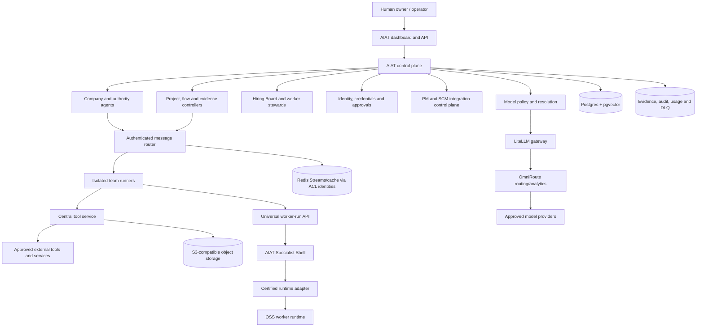

# AIAT Target Programme

**Authoritative personal programme and implementation target**  
**Baseline reviewed:** 2026-08-17
**Programme status:** active  
**Applies to:** the AIAT repository, personal instance, deployment profiles, agents, workers, adapters, integrations, and operator dashboard

**Delivery navigation:** [ROADMAP.md](ROADMAP.md) links the maintained feature specifications and implementation plans derived from this programme.

---

## 1. Authority and purpose

This is the single consolidated target programme for AIAT. It merges the strongest compatible ideas from every project document with the behaviour that is actually present in the repository. It defines what AIAT is intended to become, what already exists, what is only partially proven, what remains to be built, and what is intentionally outside the personal instance.

This document is deliberately not a claim that every target is complete. A feature is complete only when its implementation, migrations, tests, operational evidence, security evidence, and user-facing behaviour satisfy the relevant acceptance gates in this programme. Licence data is descriptive metadata, not a completion or activation gate.

### 1.1 Precedence

When sources disagree, use this order:

1. Explicit current owner instructions and the security/privacy rules of this personal instance.
2. This document for the intended programme and personal-instance target.
3. Versioned schemas, migrations, protocol contracts, company manifests, worker manifests, and code for what the repository currently does.
4. Current certification ledgers and reproducible test evidence for what has been proven in a real environment.
5. Area-specific runbooks for operating an already approved design.
6. Historical PDRs, CDRs, research reports, prompt plans, and obsolete architecture documents as design input only.

If the running code differs from this target, the difference is a programme gap. The target must not be rewritten after the fact merely to make an incomplete implementation appear complete.

### 1.2 Status language

Every material capability is described using one of these states:

| State | Meaning |
| --- | --- |
| **Implemented** | Present in code and supported by repository tests or durable schema evidence. This does not automatically mean production-certified. |
| **Implemented; certification pending** | The implementation exists, but a required live, security, host, provider, or human-action proof is incomplete. |
| **Partial** | A meaningful subset exists, but the complete target contract is not yet implemented. |
| **Target** | Approved programme scope that remains to be implemented. |
| **Optional/external** | Available when the operator configures it, but not enabled in the minimal default stack. |
| **Experimental** | May be evaluated behind isolation and approval gates; it is not a default authority or runtime. |
| **Not selected by default** | Available for personal use, but another option currently has the simpler or safer technical profile. |
| **Superseded** | Historical design retained for traceability but not authoritative for new implementation. |

### 1.3 Programme definition

AIAT is a governed, self-hosted personal company operating system for coordinating one operator's direction, AI authority agents, specialist workers, tools, projects, evidence, budgets, and external systems. Public distribution, resale, and hosted operation for third parties are outside this programme.

Its essential design is:

- AIAT owns the control plane, authority model, policy decisions, project state, evidence, budgets, credentials boundary, and audit history.
- Governance agents are stable AIAT-owned organisational shells.
- Specialist work is performed through versioned AIAT worker shells backed by certified runtime adapters, not through an expanding set of hardcoded AIAT workers.
- External runtimes and tools never become a second control plane.
- Every consequential mutation is scoped, attributable, idempotent where appropriate, policy-checked, and recoverable.
- Human operators retain explicit approval, veto, shutdown, rollback, and audit authority.

### 1.4 Personal-use resource policy

AIAT is operated only by its owner for personal internal work. Resource selection is driven by technical capability, security, privacy, reliability, maintainability, resource cost, and integration quality.

Licence information is kept in third-party metadata when known. Missing, unusual, non-commercial, no-modification, copyleft, redistribution, source-disclosure, network-use, or other terms create an operator-visible notice only. They do not automatically block discovery, installation, worker hiring, activation, execution, updating, or normal internal use. AIAT maintains no licence allowlist or licence-based prohibited-component list for this programme.

The `license_provenance_evaluator` collects and reports this metadata; it is not an approval authority. AIAT does not claim that metadata changes or waives third-party terms. The personal operator owns the decision to use a resource. A future decision to sell, distribute, commercially host, or operate AIAT for other people requires a separate scope-specific review and policy.

---

## 2. Executive baseline: what exists now

The repository is a substantial working implementation rather than a greenfield proposal. The reviewed baseline contains 863 tracked files, 417 Python files, 169 TypeScript/JavaScript files, 116 test files, 41 worker YAML manifests, 11 team manifests, and 11 governance prompts. These counts are a repository snapshot, not release metrics.

The core database migration graph has a single current head at `0036_native_trace_spans`, with historical branches reconciled at `0008`. The identity service has its own migration line, currently headed by `0002_mail_trace_correlation`. The current schema includes durable records for projects, state transitions, documents, reviews, approvals, sprints, issues, context, artifacts, capabilities, workers, stewards, runtime provenance, certification, model profiles, worker runs, flows, company manifests, budgets, API request observations, native payload-free trace spans, directly trace-correlated model/artifact/integration evidence, PM integrations, evidence, and outbox/reconciliation state.

### 2.1 Capability status snapshot

| Capability | Baseline state | Programme interpretation |
| --- | --- | --- |
| Custom orchestrator and project control plane | **Implemented** | Rich API exists for projects, transitions, documents, reviews, evidence, tasks, shutdown, companies, workers, flows, integrations, and governance. It must be decomposed from the oversized API module without changing authority. |
| Message routing and recovery | **Implemented** | Redis Streams routing, authenticated publish/subscribe, ACK/NACK, reclaim, retry, TTL, DLQ, and replay paths exist. Message publication now validates declared sender role/team coherence before dedupe/enqueue; workers cannot claim a CEO/C-suite trust team, and sub-agents require a known parent team (`fb39128`). |
| Tool service | **Implemented foundation** | Central registry, explicit worker grants, policy checks, rate limits, concurrency limits, circuit breakers, audit, cache, usage, MCP bridge, browser identity, and adapter tools exist. The general image now has a lightweight core profile; browser/Docling/Semgrep/Mermaid extensions are separately budgeted. |
| Company control plane | **Implemented** | Versioned company manifests, departments, assignments, budgets, apply/rollback, org graph, and default seed exist. |
| Default company activation | **Partial by design** | The default manifest activates the 11 authority/manager shells. Specialist workers exist in the registry but are hired and activated through governance rather than silently enabled. |
| Universal worker contract | **Implemented foundation** | `aiat.worker.v1`, protocol negotiation, adapter API versioning, normalized events/results, run lifecycle, checkpoints, artifacts, usage, pause/resume/cancel, queue leases, and recovery APIs exist. All 39 team-runner agents now declare exact `worker_manifest_ref` identities; static reconciliation and production startup checks fail closed on missing/mismatched bindings while remaining read-only. The deterministic `check_worker_run_lifecycle.py` fixture proves controller ordering/requeue invariants; live worker/database/sandbox/canary evidence remains open. |
| External Worker Steward architecture | **Implemented foundation** | Dedicated steward, documentation snapshots, immutable candidates/bundles, steward-owned compatibility matrices, certification, rollout, transition history, monitoring, and rollback models/APIs exist. The deterministic lifecycle fixture covers every externally sourced default worker, API restart rehydrates durable compatibility evidence and active immutable pointers, and `scripts/check_default_worker_bindings.py` reconciles the 15 documented default slots with their implementation declarations, runtime-catalogue transport/isolation support, and matching runtime/integration adapter entrypoints; breadth of live-certified runtimes remains incomplete. |
| Third-party licence handling | **Implemented; metadata-only** | Steward/API certification, repository evaluation, and provenance validation record licence/restriction metadata without using it as a gate. Remaining P0 work concerns deployment/image/network evidence, not a licence decision. |
| Model governance | **Implemented foundation** | Versioned model profiles, deterministic policy intersection, override approvals, resolution snapshots, LiteLLM-compatible routes, usage/budget records, explicit transient-status classification, persisted model/provider cooldown failover state, deterministic `aiat.model-profile-catalogue.v1` API/dashboard reconciliation, a fail-closed `scripts/check_model_profile_catalogue.py --live --require-approved` verifier, an idempotent conflict-preserving bootstrap for the evidence-referenced `opencode-phase0b-coding` profile, all registered model identities, and the `omniroute-coding` alias, bounded `aiat.executive-reconciliation.v1` reporting, `aiat.executive-views.v1` CFO/CTO/CEO role projections, dedicated read-only `/executive/views/{role}` endpoints, a secret-safe `scripts/check_executive_reconciliation.py --live --json` verifier with optional finding-free enforcement, and role-scoped `aiat.executive-action.v1` CFO/CTO/CEO write routes exist. The typed governance action panel is implemented; local live evidence observes 92 approved covered profile versions out of 94 persisted versions, with one pending model and two non-registered rows retained as findings; provider-specific live recovery, broader governance forms, and immutable gateway pinning remain release work. |
| Visual flow platform | **Implemented foundation** | React Flow authoring and nine backend node types exist with validation, dry run, instances, node actions, override, switching, retry, escalation, and execution history. Versioned node-schema JSON/API/dashboard metadata, editable generated forms, six canonical reusable templates, deterministic export/hash/diff/import/publication, evidence-preserving compatible instance migration with explicit active-node graph-rewrite mapping, deterministic dry-run alias auditing, operator-approved immutable saved-definition worker migration, deterministic real traversal semantics for fan-out/join/switch, asynchronous governed task binding (`aiat.flow-worker-binding.v1`), safe-retry re-dispatch, non-destructive `SUPERSEDED` retry evidence, and deterministic watchdog/recovery semantics now exist. The dashboard flow editor also has explicit first-load unavailable, retained-canvas, stale-label, and Retry recovery states (`b5098e7`), semantic header/main/palette/canvas/config landmarks, and 44px toolbar/palette/config/generated-form controls (`140af1c`); 401/403 flow reads and saves now expose a named denial state, retain only the last successfully loaded canvas as read-only, and hide refresh/retry, palette, editing, undo/redo, and save controls (`392d264`). The new-flow builder now treats denied worker/profile/template reads and create/readiness mutations as an explicit named denial state, keeps the current draft canvas read-only, and hides templates, palette, validation, activation, and creation controls (`b07299b`); live worker canary/recovery proofs remain target work. The CEO Command Center chat now treats 401/403 history, SSE, and message-submission responses as a named read-only denial state, retaining loaded transcript context while hiding message and confirmation controls (`038d5f2`). |
| Project workspace and evidence | **Implemented** | Project overview, artifacts, documents, review sessions, issues, flow state, audit timeline, context, repository, usage, pending decisions, evidence validation, and next actions are exposed. The canonical project evidence package page now retains the last successful package through a failed refresh and exposes a source-built Retry path (`bc80ad5`); its named main/section landmarks, labeled 44px actions, and captioned/scoped evidence table are covered by the focused accessibility group (`89091c1`). The project evidence package now also fails closed on 401/403 reads, retains a last-known package as read-only context, hides Refresh/Retry, and exposes a named access-status region; its source-built stale, initial-denial, and retained-read denial matrix passes 3/3 (`00f81b5`). The project-detail route distinguishes first-load API failure from a missing project, preserves backend error detail, and recovers into the workspace through keyboard-visible Retry (`f364763`); its focused baseline adds a named page/loading state, explicit project status, 44px refresh/retry/back and primary project-view tabs, and semantic project/workspace tab-panel relationships (`40b87dd`). The dedicated evidence-detail route now has a named page/citation region, semantic bounded-detail landmark with `aria-busy`, decorative-icon suppression, and 44px CEO-chat/canonical-link/Refresh targets (`32f3a76`); 401/403 scalar reads now expose a named denial state, retain any last-known scalar projection as read-only, hide Refresh, and preserve citation identity/safe navigation, with source-built coverage at 11/11 (`23e2db9`). The workspace sub-surface retains activity/resources/cost data and its last repository snapshot through failed workspace/repository refreshes with explicit stale/Retry recovery (`cb1c665`), and its nested tabs now expose semantic tab/tabpanel relationships, roving Arrow/Home/End navigation, and 44px targets (`fcb0f4b`). The Projects list now fails closed on 401/403 project/flow reads and archive/delete mutations, retaining only previously loaded definitions as read-only text and hiding refresh, creation, filters, sorting, selection, and destructive controls; its focused source-built matrix passes 4/4 (`17d25b0`). Project Detail now also fails closed on canonical project-read and workflow-mutation 401/403 responses, retains only the last-known project header as read-only context, and hides refresh, tabs, panels, and mutations; its source-built denial/recovery matrix passes 4/4 (`0671eaa`). Full project-page composition and live provider/worker generation remain separate gates. Evidence-policy scope precedence is centralized and fixture-checked; licence/restriction values remain notices only. |
| Identity and email control plane | **Implemented; production certification pending** | Dedicated identity service, Postgres store, signed clients, mailbox lifecycle, JMAP/Stalwart, approvals, outbound relay, external accounts, browser sessions, credential leases, sync/outbox, audit, and dashboard surfaces exist. The shared identity-resource dashboard surface now exposes named main/status/metadata/table regions, explicit busy state, decorative-icon suppression, 44px refresh/retry/action targets, and a distinct 401/403 access-denied region that removes misleading retry actions while preserving already loaded metadata-only rows (`a260e04`, `0974434`) alongside stale/retry retention (`46eccee`, `651ad11`). The credentials manager now applies the same denial boundary to redacted credential metadata, hiding read/mutation controls and retaining only previously loaded rows (`982c9c0`). The route matrix covers identities, approvals, audit, sessions, external accounts, domains, relay, mailboxes, and outbound mail 9/9 with safe metadata-only fixtures (`485dfd2`). The versioned external-account action taxonomy now makes rotation/closure human gates and suspension safety revocation explicit; independent fixtures cover its five-action/category/fail-closed contract plus the real service's signup idempotency, one-use leases, rotation/closure/suspension revocation, and secret-safe output. The real outbound-mail fixture also proves approval pause, request/submission idempotency, definitive-failure retry, ambiguous-outage reconciliation hold, and secret-safe reporting without an external relay call. Final public-domain, provider, and mail-path certification is operator/environment dependent. |
| PM provider control plane | **Implemented; ACTIVE command certification pending** | Provider-neutral ports, YouTrack adapter, canonical issues, mappings, inbox/outbox, CAS, actor mappings, canaries, lifecycle plans, reconciliation, conflicts, evidence, dashboard, and gateway exist. The real YouTrack declaration and mocked HTTP health/configuration, projection/read-back, cursor, comment/link, actor, and webhook paths are fixture-reconciled without external calls; the latest live evidence ends with the connection ACTIVE and binding READ_ONLY after the required human browser action timed out. |
| Source-control integration | **Partial** | Provider contract and governed GitHub installation/branch/PR/comment/check/commit/run-credential operations exist. GitHub `pm`/`delivery`/`checks` capability declarations, bounded path guards, and mocked HTTP health/issue/branch/PR/check/review/commit/webhook paths are fixture-reconciled without external provider calls; a complete production GitHub App certification matrix remains required. |
| Coding and test worker | **Implemented; security findings require review** | OpenCode 1.17.13 Phase 0B interface evidence is approved. An exact-source Semgrep 1.168.0 run recorded 316 findings and 54 engine warnings; coding/tester manifests remain non-activatable with `security_scan_status: findings_review_required` until triage and a passing technical scan are recorded. |
| Security evaluation and sandboxing | **Partial** | Semgrep/SkillSpector paths and bounded `semgrep`/`skillspector`/`trufflehog` aliases, sandbox policy, gVisor default, Firecracker option, tool limits, and network separation are implemented. Live host proof for `runsc`/Firecracker and provider-specific scanner certification remain environment dependent. |
| Network isolation | **Static contract implemented; live retest required** | Team runners now receive only router/tool/orchestrator/model-gateway variables and use the authenticated control-plane storage API for checkpoints, usage, documents, and reviews. PgBouncer and MinIO remain internal-only and are not on the `workers` network. The old critical defect must be closed only after a new live negative connectivity test. |
| LLM/routing analytics | **Implemented foundation** | LiteLLM and OmniRoute services and dashboard surfaces exist. The target-specific monitoring adapter emits a non-networking `aiat.monitoring-analytics-plan.v1` for their health/dashboard surfaces; AIAT metrics and optional Prometheus-compatible scraping remain complementary. Grafana is not part of the target. |
| Trace evidence and retention | **Bounded query, core native spans, and local transport read-back implemented; model/tool/provider evidence pending** | Request/message/tool/agent propagation and operator-only `aiat.trace-evidence.v1` joins over payload-free API request observations, task logs, project usage, worker-run transitions, direct trace-correlated model-usage/worker-artifact/integration-evidence metadata, PM inbound correlations, native transport/model/tool/audit/worker/integration spans, and optional identity delivery-attempt spans exist with secret-safe fields and company trace sampling/retention metadata. The refreshed local orchestrator is at migration `0036_native_trace_spans`; a bounded `/health` transport span and API-request read-back pass and are retained in [`mas/docs/provenance/trace_observability_live.json`](mas/docs/provenance/trace_observability_live.json). The non-mutating `aiat.trace-retention-plan.v1` classifies bounded span metadata as retain/archive/delete/invalid without deleting data. Live model/tool/audit/worker/integration coverage, provider mail-edge spans, live retention application, and incident views remain P2/live work. |
| SLO and capacity operations | **Descriptive contracts and local API read-back implemented; native model/tool/mail evidence pending** | Versioned `aiat.slo-policy.v1`, `aiat.slo-report.v1`, and `aiat.capacity-forecast.v1` models, operator-only routes, durable usage aggregates, the payload-free `aiat.api-observation.v1` request ledger, optional signed identity-service outbound delivery-attempt projection, confidence/headroom fields, and deterministic fixture/live checkers exist. The refreshed local API returns a bounded report (`9` targets, `6` observed services, SLO `attention`, capacity `clear` with `high` confidence), retained at [`mas/docs/provenance/slo_capacity_live.json`](mas/docs/provenance/slo_capacity_live.json). Existing API, PM/SCM delivery, worker-recovery, and optional mail-attempt rows are projected; missing native model/tool/mail-edge/complete-span sources remain explicit `no_data`, and load/soak/chaos/DR evidence remains P2 work. |
| Operational diagnostics and control CLI | **Implemented; live service lifecycle remains separate** | Read-only `GET /system/diagnostics` probes database, router, tool-service, and optional object storage with bounded secret-safe results (`2860838`). `scripts/mas-ctl` provides authenticated `status`, `diagnostics`, fail-closed `bootstrap`, and explicit `resume`/`shutdown` API commands (`380daf5`, executable mode `f8df50e`); container/service restart remains the Compose/systemd operator boundary. |
| Hierarchy communication-policy visualization | **Implemented; focused local live E2E passed; release image evidence pending** | `HierarchyViz` exposes a sender-role overlay that labels and color-codes allowed/denied team paths from the same permission matrix used by policy (`8b7d9f1`). Dashboard typecheck, focused lint/build, and the authenticated hierarchy/path-tracing E2E pass 1/1 against a current `mas/dashboard:overlay` image (`d5f596e`) rebuilt from a clean explicit context. The normal WSL Docker context still traverses protected `.tmp-*` paths despite generalized exclusions (`b3a2e8e`); native/release image evidence remains separate. |
| Production deployment hardening | **Partial** | Compose, Windows/Linux wrappers, systemd helpers, health checks, resource caps, Redis ACLs, distinct CEO/worker principals, persisted dashboard section ACLs, and optional tunnel/mail profiles exist. Fixed infrastructure refs and Dockerfile bases are digest-pinned; application/gateway refs require deployment-supplied immutable `*_IMAGE_REF` values, SBOMs, and live pull/build evidence. |
| Long-term memory/workflow infrastructure | **Partial** | Postgres/pgvector context and checkpoint storage are real. Letta, Qdrant, and Temporal are approved target adapters/services, not proven default runtime dependencies in the current stack. |
| Object storage | **Contract/copy/backup/migration fixture implemented; local MinIO conformance and same-provider backup/restore retained; external live work pending** | MinIO is the current S3-compatible artifact backend. The provider-neutral `aiat.object-store-conformance.v1` fixture, real-`BlobClient` `--live` conformance runner, checked-in private-network MinIO probe, bounded aggregate `--compose-local` release child, `aiat.object-store-copy.v1` verified-copy/parity helper, live source-inventory/target-parity runner, deterministic `aiat.object-store-backup.v1` manifest, clean-target `aiat.object-store-restore.v1` verifier, three-provider backup/restore runner, and `aiat.object-store-migration.v1` inventory/dual-write/cutover/rollback workflow fixture are implemented. The deployed local MinIO service has retained secret-safe 8/8 conformance and same-provider backup/restore reports at [`mas/docs/provenance/object_store_live_conformance.json`](mas/docs/provenance/object_store_live_conformance.json) and [`mas/docs/provenance/object_store_backup_restore_live.json`](mas/docs/provenance/object_store_backup_restore_live.json). SeaweedFS comparison, provider-pair migration, encryption, routing cutover, benchmark, clean-environment restore, and disaster-recovery evidence remain open. |
| Self-development | **Guarded contract, authenticated project API, durable lifecycle/outcome snapshot, artifact manifest/read-back evidence, and canonical storage writer implemented; live lifecycle pending** | Candidate generation, certification, shadow/canary rollout, rollback, worker upgrades, capability evaluation, and approvals exist. The `aiat.self-improvement.v1` contract creates a typed canonical project request, authenticated `POST /projects/self-improvement` validates creator/company scope, `AgentStorage.create_self_improvement_project` delegates it through the canonical project writer, project config stores a revisioned lifecycle snapshot and project-history entries, and authenticated lifecycle reference/action endpoints link canonical issue/worker-run/artifact/budget/branch/SBOM/deployment/evidence records and apply guarded transitions without copying authority. Coding/testing/review/security/migration/rollback gates remain independent, human promotion is required, exact prior-version rollback passes in a deterministic fixture, terminal outcome actions persist bounded cost/incident/rollback/KPI learning with idempotent IDs, and normalized worker-result records now produce the frozen five-kind artifact manifest with checksum/size read-back evidence; live worker/provider execution and deployment integration remain open. |
| Outside-LAN access | **Partial** | Cloudflare tunnel and mail-edge/gateway deployment profiles exist. Production exposure, identity, TLS, and recovery certification remain operator-owned. |

### 2.2 Evidence that must be interpreted carefully

The July 2026 live ledger disposed all 199 planned rows: 132 pass, 45 partial, 1 fail, 11 blocked, and 10 deferred. It is valuable historical evidence, not a current release certificate. Code and Compose changed after that run.

The OpenCode Phase 0B evidence approves version 1.17.13 and records the sanitized OpenAPI hash. This proves the captured interface, not every production sandbox and supply-chain gate.

The August 2026 PM ledger proves governed activation, rollback, reconciliation, and clean fail-closed behaviour. It explicitly does not certify the ACTIVE command path because the required browser-mediated human action never arrived.

---

## 3. Non-negotiable architecture laws

### 3.1 AIAT is the only authority

Only AIAT may authoritatively write:

- project, document, review, sprint, issue, and flow state;
- company structure, assignments, policies, and budgets;
- worker lifecycle, certification, active adapter/bundle pointers, and rollout state;
- model policy, model resolution, overrides, and budget settlement;
- credential grants, identity lifecycle, approvals, and privileged operations;
- canonical integration mappings, conflicts, cutovers, and audit evidence.

External runtimes may propose actions and return evidence. External PM, SCM, model, mail, identity, automation, browser, coding, or observability systems may project or execute approved actions. None may replace AIAT's authority.

### 3.2 One writer per state machine

- `WorkerRunController` is the sole writer of durable worker-run lifecycle state.
- The flow controller is the sole writer of flow-instance and flow-node execution state.
- The project workflow controller is the sole writer of canonical project transitions.
- Company-manifest application owns company configuration versions and active pointers.
- Integration lifecycle plans and governed apply/rollback operations own PM/SCM connection state.
- Identity-service lifecycle operations own mailbox, account, browser-session, and outbound-mail state.

Other components communicate through commands, events, or approved APIs; they do not update those tables directly.

### 3.3 Fail closed

Missing identity, unknown actor, absent grant, ambiguous model, exhausted budget, incomplete operational evidence, unverified webhook, unsupported protocol version, missing sandbox, or stale compare-and-set revision must deny or pause the action. Missing or unusual licence metadata produces a notice and does not deny the action.

### 3.4 Versions and provenance are first-class data

Every governed external runtime must have an exact release, commit, package version, or OCI digest; canonical source; adapter and protocol versions; documentation snapshot; dependency or image evidence; and security disposition. Licence, notices, and stated use/modification/redistribution conditions are recorded as non-blocking metadata when known.

Mutable labels such as `latest`, `main`, `stable`, `auto`, or an unqualified repository URL are not production provenance.

### 3.5 Evidence precedes promotion

No candidate becomes active merely because a unit test passes or a manifest says `approved`. Promotion requires consistent machine-readable gate records and, where required, human approval. A contradiction between certification and provenance blocks promotion.

### 3.6 External material is untrusted input

Documentation, repository content, webpages, issue text, email, tool output, and generated skills are data. They cannot grant themselves authority, alter policy, exfiltrate secrets, or bypass review.

### 3.7 Human control remains available

Operators must be able to pause, resume, cancel, veto, override within policy, drain, shut down, roll back, revoke credentials, suspend identities, disarm integrations, and inspect complete evidence.

---

## 4. Target system architecture

### 4.1 Trust zones

| Zone | Components | Rules |
| --- | --- | --- |
| Operator/public edge | Dashboard, authenticated API edge, optional tunnel | TLS, strong session identity, CSRF/origin protection, rate limits, no direct infrastructure access. |
| Control | Orchestrator, company compiler, policy engines, worker controller, integration control plane | Durable state authority; operator and service authentication; no arbitrary runtime execution. |
| Worker | Team runners and certified worker sandboxes | No provider keys; no direct Redis/Postgres/object-store access except an explicitly certified narrow path; all tools and models mediated. |
| Tool/integration | Tool service, PM gateway, identity service, mail edge, runtime sidecars | Least-privilege service identities, per-operation grants, egress allowlists, audit and bounded payloads. |
| Data | Postgres, Redis, object storage | Internal only, encrypted credentials, scoped database users, backups, retention, migration and restore tests. |
| Untrusted runtime | External processes, containers, browsers, downloaded repositories | gVisor by default, Firecracker for high risk, immutable provenance, bounded mounts/network/time/output, no control-plane credentials. |

### 4.2 Target service boundaries

The current orchestrator API contains a very broad implementation in one large module. The target retains one public control-plane API but separates internal modules by domain:

- project and evidence service layer;
- company and budget service layer;
- worker registry, steward, certification, and run service layer;
- flow definition and execution service layer;
- model governance service layer;
- integration lifecycle and canonical work-management service layer;
- operator, shutdown, audit, and observability service layer.

This is an internal modularisation, not a premature requirement for separately deployed microservices. Transactional authority should remain cohesive.

---

## 5. Company operating model

### 5.1 Stable authority shells

The following AIAT-owned governance shells are built into AIAT core:

| Authority | Primary mandate | Non-delegable decisions |
| --- | --- | --- |
| `ceo` | Strategic direction, final governed approval, portfolio view, executive copilot | Company policy exceptions, CSO-veto override with evidence, high-risk activation, final human escalation. |
| `coo` | Cross-department orchestration, review fan-out/fan-in, operational health | Coordination state, review completeness, escalation to CEO. |
| `cfo` | Budget, cost, commercial risk, KPI economics | Budget recommendation, cost exception escalation, financial sign-off evidence. |
| `cio` | Information architecture, integration fit, tool and data governance | Technology/integration recommendation and information-boundary review. |
| `chrm` | Capacity, skills, workload, performance learning, hiring need | Workforce recommendation and capacity-risk escalation. |
| `cso` | Security policy, threat review, veto | Security veto; only a governed CEO override may release it. |
| `cto` | Technical delivery, sprint/KPI oversight, model/runtime technical policy | Technical execution recommendation, delivery and architecture escalation. |
| `production_pm` | Requirements and production planning | Production-team assignment and deliverable coordination. |
| `system_pm` | Architecture and solution coordination | System-team assignment and technical document coordination. |
| `qa_lead` | Test, quality, release evidence | QA assignment and release-quality recommendation. |
| `devops_pm` | Infrastructure, delivery, reliability coordination | DevOps assignment and operational-readiness recommendation. |

Prompts guide behaviour but do not define authority. Permission policy, tool grants, company assignments, API validation, and durable decisions do. Company timezone must be a configurable policy value; prompts must not hardcode `America/New_York`. Prompt/tool mismatches, including obsolete tool statements or prohibited-tool references, are defects.

### 5.2 Default company manifest

The default software company has 11 departments/offices and activates the 11 shells above. Its current starter budget is USD 100 with a maximum of 20 concurrent runs, requires human approval for external workers, and selects gVisor as the default sandbox.

Those values are safe seed defaults, not permanent personal-instance limits. All changes must create a new immutable manifest version, validate references and budget constraints, produce a stable digest, and support governed rollback.

### 5.3 Specialist worker target

| Worker | Department | Default implementation target | Current interpretation |
| --- | --- | --- | --- |
| `financial_analyst` | `office_cfo` | LangGraph + AIAT cost/KPI tools + Postgres history | Manifest exists; runtime certification must match installed version. |
| `tech_analyst` | `office_cio` | LangGraph or Microsoft Agent Framework + GitHub/MCP/web adapters | Manifest exists; MAF has an exact compatibility lock/preflight but remains optional until its dependency set is installed and certified. |
| `hr_analyst` | `office_chrm` | ccpm/GitHub Issues adapter + AIAT registry data | Manifest exists. |
| `security_analyst` | `office_cso` | Semgrep CLI + SkillSpector + sandbox evidence | Manifest exists; TruffleHog and other scanners may be added normally. |
| `sprint_planner` | `office_cto` | ccpm/GitHub Issues + optional LangGraph planning | Manifest exists. |
| `kpi_analyst` | `office_cto` | LangGraph over AIAT telemetry and KPI history | Manifest exists. |
| `requirements_writer` | `dept_production` | Docling + Spec Kit + LangGraph/CrewAI | Manifest exists; Docling is an optional extension and `document.ingest` remains usable through an explicit degraded plain-text fallback when the binary is absent. |
| `planner` | `dept_production` | ccpm/GitHub Issues starting profile | Manifest exposes Plane/OpenProject as normal provider options; AIAT remains canonical. |
| `cost_estimator` | `dept_production` | LangGraph using KPI history and CFO rules | Manifest exists. |
| `system_architect` | `dept_system` | LangGraph/CrewAI + Mermaid/export tools | Manifest exists. |
| `solution_designer` | `dept_system` | LangGraph or MAF + MCP/GitHub adapters | Manifest exists; MAF activation remains behind the locked optional preflight. |
| `tech_writer` | `dept_system` | Docling + Mermaid + LangGraph/CrewAI | Manifest exists; the document tool reports the Docling backend when available and `plain_text_fallback` otherwise. |
| `tester` | `dept_qa` | OpenCode/OpenHands core + Playwright + pytest | OpenCode path exists; scan/certification record must be reconciled. |
| `coding_worker` | `dept_qa` | OpenCode default, OpenHands core optional | OpenCode path exists; no unrestricted repository or network access. |
| `test_evaluation_worker` | `dept_qa` | AIAT evaluator over test artifacts and coverage | Manifest exists. |
| `code_review_worker` | `dept_qa` | AIAT deterministic diff reviewer by default; optional pr-agent/open-code-review/stage-cli adapters | Manifest exists; local default is reproducible, while each external candidate remains blocked until exact repository/revision/version evidence is recorded. |
| `devops_eng` | `dept_devops` | OpenTofu + GitHub Actions starting profile | Manifest exposes Ansible through the same bounded adapter policy. |
| `sre_agent` | `dept_devops` | LiteLLM/OmniRoute analytics + Playwright/API checks + optional Prometheus metrics | Manifest exists. |
| `research_worker` | governed shared capability | Scrapling by default; browser-use only sandboxed | Manifest exists; live certification and egress policy required. |

### 5.4 Hiring Board

The Hiring Board is a governed virtual team, not a shortcut around the company manifest. Its worker set is:

- `hiring_agent` — coordinates the pipeline but cannot self-approve it;
- `license_provenance_evaluator` — non-blocking collector for source, version, licence, notices, and stated restriction metadata;
- `tool_interface_auditor` — validates API/MCP/CLI contracts and authority boundaries;
- `adapter_certifier` — verifies the universal contract and adapter behaviour;
- `security_evaluator` — Semgrep CLI, SkillSpector, dependency and sandbox evidence;
- `sandbox_evaluator` — gVisor profile and optional Firecracker requirements;
- `budget_evaluator` — cost and resource-limit decision;
- `policy_grant_reviewer` — least-privilege tool, model, network, filesystem, and credential grants;
- `human_approval_gate` — records the required human decision without fabricating it.

Licence metadata never needs a CEO override because it is not a gate. Source authenticity, version pinning, security, sandbox, compatibility, privacy, budget, and other operational gates remain independent and cannot be bypassed by relabelling a candidate approved.

---

## 6. Worker and steward architecture

### 6.1 Three-layer worker model

Every specialist worker is composed of:

1. **AIAT Specialist Shell** — stable identity, organisational role, lifecycle, permissions, tool grants, budget, sandbox, model requirements, and active-version pointers.
2. **Certified Runtime Adapter** — translates `aiat.worker.v1` to a pinned runtime using native, process, HTTP, MCP, or another certified transport.
3. **Runtime Implementation** — LangGraph, CrewAI, Microsoft Agent Framework, OpenCode, OpenHands core, or another approved OSS runtime.

The runtime never owns the worker's authority or organisational identity. Replacing a runtime changes an immutable adapter/bundle pointer after certification; it does not create a new uncontrolled employee.

### 6.2 Universal contract

The production contract must include and persist:

- `contract_version`, `schema_version`, `adapter_api_version`, runtime API version, and skill-bundle format version;
- worker identity and shell version;
- task type, idempotency key, project/flow/node correlation, timeout, retry, checkpoint, budget, permission, tool, model, and workspace requirements;
- negotiated capabilities for checkpointing, cancellation, streaming, tools, memory, workspace, models, health, readiness, usage, and extensions;
- normalized accepted/start/progress/tool/checkpoint/pause/resume/result/error/cancel/audit/heartbeat events;
- structured artifacts with checksum and durable URI;
- structured usage and error taxonomy;
- an immutable model-resolution snapshot when a model is used.

Unknown optional extensions may be preserved under a namespace. Unknown required capabilities, unsupported major protocol versions, or unrecognized authority fields must fail negotiation.

### 6.3 Worker-run lifecycle

The canonical lifecycle is:

`CREATED -> QUEUED/VALIDATING -> READY -> DISPATCHING -> RUNNING -> SUCCEEDED|FAILED|CANCELLED|TIMED_OUT`

Pause and recovery use explicit `PAUSING`, `PAUSED`, and `RESUMING` transitions. Queue claims and heartbeats are leased. Transitions use compare-and-set semantics. Terminal results become authoritative only after artifacts and usage evidence are durably queryable.

### 6.4 Dedicated External Worker Steward

Each external worker has one AIAT-owned steward. The steward:

- monitors the pinned upstream source and official documentation;
- captures immutable, hashed documentation and capability snapshots;
- treats all upstream content as untrusted;
- prepares versioned skill bundles and adapter candidates;
- runs conformance, compatibility, security, sandbox, budget, and regression checks while collecting licence metadata separately;
- proposes but cannot self-authorise promotion;
- measures shadow and canary results against the active version;
- triggers or proposes rollback when thresholds are exceeded;
- preserves exact prior active pointers for deterministic rollback.

### 6.5 Independent state machines

Shell, steward, candidate intake, bundle, rollout, and worker run have separate state machines. A healthy steward does not imply an approved candidate. An approved bundle does not imply an ACTIVE rollout. An ACTIVE rollout does not change the outcome of an already version-pinned in-flight run.

The target candidate progression is:

`DISCOVERED -> SOURCE_REVIEW -> SECURITY_REVIEW -> INTERFACE_RESEARCH -> GENERATED -> CERTIFYING -> APPROVED|REJECTED|BLOCKED`

`LICENSE_REVIEW` is the existing compatibility name for an optional metadata-capture stage. Older candidates may still pass through it, but the normal path can skip it entirely. It records licence/notices/restrictions when known and never approves, rejects, blocks, or delays a candidate. A future schema version should rename it `LICENSE_METADATA` without rewriting historical transitions.

The target rollout progression is:

`PENDING -> SHADOW -> CANARY -> PROMOTING -> ACTIVE`, with `ROLLING_BACK -> ROLLED_BACK` available from every live stage.

Promotion stages must be independently configurable for task class, sample count, read/write scope, budget, regression threshold, and required approver.

---

## 7. Tool and runtime strategy

### 7.1 AIAT-owned tool boundary

All tools are registered centrally with a typed schema, canonical name, group, permission policy, readiness, timeout, rate limit, concurrency cap, audit policy, and optional cache policy. Workers receive explicit grants. Identity and mail tools are always allowlisted per worker.

The current seven canonical groups remain valid: workflow, document, review, sprint/issue, DevOps, capability, and KPI/utility. Tool aliases are compatibility aids and must resolve to one canonical audited name.

The implemented catalogue already spans project and flow control, documents and reviews, sprints/issues/KPI, repository and safe commands, tests and code review, IaC, diagrams, MCP, PM, SCM, browser actions, identity/mail, memory, files, web research, object storage, credentials, infrastructure, and OpenCode workspace actions.

Document ingestion is intentionally usable in both profiles: `document.ingest`
invokes Docling through the bounded extension when installed, and otherwise
returns the source text with `available: true`, `configured: true`,
`degraded: true`, and `backend: plain_text_fallback`. The response identifies
the missing optional binary; it does not pretend that Docling ran or turn an
optional dependency into an execution gate.

### 7.2 Minimal personal stack

| Category | Default target | Integration boundary |
| --- | --- | --- |
| AIAT core | Orchestrator, router, tool service, registries, credentials, approvals, dashboard, adapter SDK | AIAT-owned code. |
| Worker runtimes | LangGraph 0.6.11, CrewAI 1.6.1, Microsoft Agent Framework 1.13.0 after MCP `>=1.27,<2` compatibility | Python dependency or certified optional adapter; MAF lock/preflight is checked in, but optional installation and live certification remain open. |
| Coding/testing | OpenCode 1.17.13, OpenHands core, Playwright, pytest | Sandboxed runtime/service and AIAT adapter; other configured editions/runtimes are allowed. |
| Documents/specs | Docling, GitHub Spec Kit, Mermaid | Prefer bounded subprocess/sidecar adapters; store normalized artifacts in AIAT. `document.ingest` has an explicit degraded plain-text fallback so the core profile remains usable without the Docling extension. |
| Research/fetch | Scrapling | Guarded adapter with egress, size, timeout, and content controls. |
| Browser automation | Playwright; browser-use only guardrailed | Per-worker isolated browser profile, approved egress/actions, no unrestricted mode. |
| Code review | AIAT deterministic diff reviewer; optional pr-agent/open-code-review/stage-cli | Local default is reproducible; external adapters require exact repository/version pins and sandboxed evidence. |
| Security | Semgrep CLI, SkillSpector, sandbox tests | TruffleHog and other scanners may be added through bounded adapters. |
| Sandboxing | gVisor default; Firecracker optional for high risk | Host-certified runtime profiles. |
| DevOps | OpenTofu and GitHub Actions | External CLI/provider adapter; Ansible and other tools may use the same boundary. |
| Planning | ccpm and GitHub Issues starting profile | Plane/OpenProject are normal provider adapters; AIAT remains canonical. |
| Monitoring | LiteLLM UI, OmniRoute analytics, Playwright/API checks | AIAT audit and health remain authoritative; Prometheus-compatible metrics optional. |
| Memory/workflow | Letta, Qdrant, Temporal | Optional certified services/adapters until production evidence exists. |
| Protocols | MCP SDKs | Each MCP server is separately configured, security-reviewed, and granted. |

### 7.3 Available personal-use integrations

| Component | Personal-use posture | Technical reason/boundary |
| --- | --- | --- |
| TruffleHog | **Available normally** | Add as a bounded secret-scanning tool when useful; Semgrep/SkillSpector remain the current integrated baseline. |
| Plane | **Available provider** | May run as a PM service/adapter; ccpm/GitHub Issues remain the lighter starting profile. |
| ZITADEL | **Available identity provider** | May integrate through the identity boundary; AIAT identity remains canonical. |
| HashiCorp Vault | **Available secrets provider** | May integrate through the credential-provider interface; it does not become worker authority. |
| Ansible | **Available DevOps adapter** | Run through bounded commands, inventory scope, credentials, approvals, and audit. |
| OpenProject | **Available provider** | May run as a PM service/adapter; AIAT remains canonical. |
| Neo4j Community | **Available graph service** | Use when graph queries justify the operational cost; Postgres remains canonical. |
| AutoGen | **Experimental runtime** | MAF remains the preferred new Microsoft path; AutoGen is usable through a certified adapter. |
| OpenClaw | **Experimental runtime** | Do not make it the CEO/control plane because of operational and supply-chain risk; bounded specialist use is allowed. |
| Browser-use | **Available only with guardrails** | Browser autonomy requires network, file, action, identity, and audit limits for security reasons. |
| Firecracker | **Optional high-risk mode** | Higher host and operational complexity than gVisor. |
| Grafana | **Not part of the default target** | LiteLLM and OmniRoute are the model/routing surfaces; Prometheus-compatible platform metrics remain optional. |
| Paperclip/Zeenie/TinyHumans | **Design references only** | Useful patterns may be adapted, but none becomes a second control plane or default embedded authority. |

### 7.4 Third-party metadata

AIAT has no licence allowlist, prohibited-licence list, or licence-based component ban for personal internal use. Licence family, missing metadata, or stated restrictions do not prevent normal installation, activation, updating, or execution.

The metadata catalogue records the declared/detected licence, source link, notices, and stated use/modification/redistribution restrictions when known. Missing or unusual values are operator notices only. Exact version/digest, canonical source, integration type, dependency lock/SBOM, vulnerability disposition, and steward remain operational provenance and may still gate use for reproducibility or security reasons. `THIRD_PARTY_NOTICES.md` and the machine-readable catalogue must agree about the metadata-only policy.

---

## 8. Projects, flows, and evidence

### 8.1 Project is the primary scope

Every task, artifact, document, issue, flow instance, worker run, model call, tool call, approval, credential lease, cost record, and integration projection must carry a project identity whenever the action is project-related. Cross-project reads and writes are denied by default.

Project deletion remains a controlled data-lifecycle operation; archiving is the normal terminal action because it preserves evidence.

### 8.2 Default software-delivery lifecycle

The implemented default project state machine remains a useful governed template:

`INIT -> FEASIBILITY_CHECK -> FEASIBILITY_REPORT -> PDR_CREATION -> PDR_REVIEW -> CDR_CREATION -> CDR_REVIEW -> HUMAN_APPROVAL -> RR_CREATION -> SPRINT_PLANNING -> INFRA_PROVISIONING -> IN_PROGRESS -> RETROSPECTIVE -> KPI_PERSISTENCE -> COMPLETED -> ARCHIVED`

`SECURITY_BLOCKED` and `FAILED` are explicit exceptional states. The CSO veto enters `SECURITY_BLOCKED`; only a governed CEO override with evidence may release it. Retry must resume from a recorded safe state, not guess.

This state machine is a default template, not the only possible project lifecycle. The target flow platform supports versioned lifecycle definitions subject to invariant checks, evidence policies, and migration rules.

### 8.3 Flow definition

The current v1 node types are:

- `start` and `end`;
- `task` for team or worker execution;
- `approval` for human or role decisions;
- `condition` for true/false policy expressions;
- `parallel` and `join` for controlled fan-out/fan-in;
- `switch` for context-based routing;
- `escalate` for authority escalation.

Every flow must have exactly one start, at least one reachable end, no unreachable nodes, valid required configuration, valid branch targets, bounded retries/timeouts, and a deterministic version digest. Parallel branch declarations, join fan-in, and switch case targets must agree with persisted edges; `aiat.flow-topology-check.v1` proves this contract without executing workers. Published instances pin the definition version.

The canonical catalogue currently provides six reusable templates: software
delivery, research, hiring, incident response, integration rollout, and
self-improvement. Template creation reuses the normal parser/topology
validation path and the dashboard remaps node IDs and references without
changing the source template. The portability surface uses a versioned
`aiat.flow-export.v1` envelope, stable definition hashes, deterministic
node/edge/metadata diffs, validated import, and non-destructive publish/
deprecate operations. Import is a definition operation only: it never silently
executes a flow or overwrites an existing immutable version.

Running-instance migration is separate from unrestricted recovery switching.
Matching schema versions and unchanged active node IDs/types are required by
default. A graph rewrite is explicit, one-to-one, and limited to currently
active nodes; the migration updates the pinned flow/version while retaining
historical node executions and recording a bounded actor/mapping record in
instance context and project history.

### 8.4 Flow execution target

The engine must provide:

- idempotent instance creation and node execution;
- task dispatch through the universal worker-run API rather than runtime-specific code;
- durable node inputs, outputs, attempts, timeouts, errors, and artifacts;
- compare-and-set node and instance transitions;
- pause/resume/cancel and operator override with reason;
- parallel branch bookkeeping and join completion;
- condition and switch evaluation in a restricted expression environment;
- escalation, retry from last safe node, watchdog recovery, and DLQ linkage;
- budget reservation and settlement per node/run;
- model-resolution and adapter-version snapshots;
- live event streaming without making WebSocket delivery the source of truth.

### 8.5 Evidence policies

An evidence policy declares required artifacts, document states, approvals, test/security results, provenance, and freshness for a milestone. Transition and rollout APIs validate policy completeness transactionally. The current resolver uses explicit project-milestone → project → flow → company-milestone → company → manual precedence, with a deterministic fixture for every scope; licence/restriction metadata is never used as an evidence or activation gate.

Evidence must be content-addressed where possible, linked to its producer/run/version, previewable without executing it, downloadable under access control, retained according to policy, and preserved through supersession. A UI badge is not evidence unless backed by a durable record.

### 8.6 Knowledge and memory

Postgres is the source of truth for structured project knowledge and metadata. pgvector provides project-scoped semantic retrieval. Context supports raw items, chunks, tags, relations, text search, semantic search, and hybrid search.

Redis is for streams, bounded cache, leases, and ephemeral coordination—not canonical long-term memory. Letta and Qdrant may enrich worker memory through certified adapters, but cannot bypass project scope, retention, deletion, or evidence rules.

---

## 9. Model governance, budgets, and analytics

### 9.1 Gateway chain

Workers call AIAT's stable OpenAI-compatible gateway surface. The default routing chain is:

`worker -> AIAT model policy/resolution -> LiteLLM -> OmniRoute -> approved provider/model`

Provider credentials remain in the gateway/integration zone and never enter team-runner containers. Direct provider calls from governed workers are prohibited.

### 9.2 Model profiles

Governed runs reference a versioned model profile; `auto`, `default`, and `latest` are not acceptable exact production identities. The resolver intersects constraints from company, department, worker, project, flow, task, data/privacy, region, capability, budget, and human override layers. It may only choose an approved profile satisfying every layer.

The resolution snapshot records candidates, rejection reasons, effective constraints, selected provider/profile/model/version, price assumptions, and selection reason. No compliant candidate produces a denied or paused run, not an arbitrary fallback.

The shipped `opencode-phase0b-coding` worker reference is backed by an
evidence-referenced, idempotent profile bootstrap. Startup and the default
company seed endpoint persist the `omniroute-coding` LiteLLM alias and one
explicit profile/version for every registered model identity without
overwriting operator-owned rows; conflicting declarations remain blocked.
This provides the default binding for the coding/tester manifests and a
complete declaration set, while live database reconciliation and provider
health/failover evidence remain separate release gates.

### 9.3 Budgets

Budgets exist at company, project, flow, worker, model, tool, and run levels. Reservations prevent concurrent overspend. Actual usage settles reservations idempotently. Failed, cancelled, and timed-out work must settle or release reservations according to explicit policy.

The current implementation also normalizes model-override expiry values at the
API boundary (aware datetimes and serialized ISO-8601 values) and fails closed
on malformed expiry metadata. Focused tests prove a terminal budget settlement
replay is a no-op, and gateway retry/fallback paths classify transient
408/409/412/425/429/5xx responses separately from permanent client 4xx
failures. A bounded cooldown ledger persists transient model and provider
endpoint failures, filters cooling candidates from automatic fallback, clears
state on success, and retains an earliest-expiry probe when every candidate is
cooling. The deterministic runtime/profile catalogue is exported through the
API and Governance dashboard, and the read-only executive reconciliation
report now summarizes durable spend, delivery, portfolio, budget, and model
coverage. Its `aiat.executive-views.v1` projections provide bounded CFO/CTO/CEO
role cards over that same report, and `/executive/views/{role}` exposes each
read-only projection independently. Its budget section audits reservation sums,
idempotency keys, terminal-run leftovers, state vocabulary, and ledger drift
without writing. Role-scoped CFO, CTO, and CEO writes use the
`aiat.executive-action.v1` envelope: CFO requests create durable model
overrides, CTO requests enter the governed worker-run controller, and CEO
requests enter the audited privileged-action gate. Persisted approved profile
coverage, provider-specific live recovery, broader governance forms, and
broader reservation/settlement chaos evidence remain delivery work.

CFO policy owns financial recommendation; it does not bypass the technical enforcement ledger. Budget overrides require identity, scope, expiry, reason, and audit.

### 9.4 Observability target

The default operator surfaces are:

- LiteLLM UI for gateway/model cost and usage;
- OmniRoute analytics for routing/provider behaviour;
- AIAT dashboard for project, worker, flow, tool, integration, identity, budget, approval, audit, and DLQ truth;
- Playwright/API health checks;
- structured logs, correlation IDs, traces, and optional Prometheus-compatible metrics.

Prometheus is optional platform infrastructure. Grafana is not bundled by default.

Metrics must use bounded labels. The project-state gauge now uses only the bounded `state` dimension and aggregate presence counts reconciled from persisted rows; use logs, exemplars, traces, or queries for per-project drill-down. `metric_label_policy_inventory()` classifies every AIAT-owned label by its protocol, registry, catalogue, or bucket bound, and `check_metric_series_budget.py` rejects an unknown or non-bounded label. Add series-count budgets to CI/live certification.

The bounded operator query `GET /observability/traces/{trace_id}` projects
`aiat.trace-evidence.v1` from task logs, project usage, and worker-run
transition correlations, with payload-free API request observations, direct
trace-correlated model-usage/worker-artifact/integration-evidence metadata,
legacy run-correlated fallback, PM inbound metadata, and the durable
  `native_trace_spans` table when available. The local orchestrator live probe
  verifies the API-request ledger and one native `/health` transport span after
  migration `0036_native_trace_spans`; the check is reproducible with
  `mas/scripts/check_live_trace_observability.py`. When configured, signed identity
  delivery attempts carrying safe trace/span IDs are projected as `mail` spans;
  scalar attribute allow-listing drops request/tool/model/mail payloads and
  secrets before persistence. The shared `aiat.mail-edge-observation.v1`
  normalizer, `aiat.mail-edge-coverage.v1` evaluator, and deterministic
  fail-closed checker now cover delivery attempts, verified provider webhooks,
  bounded bounce/failure states, safe trace correlation, and event-ID conflict
  handling (`85369fe`). Provider persistence, selected-worker live evidence,
  live retention enforcement, and incident views are still P2 work. The local
  `aiat.trace-retention-plan.v1` planner is non-mutating and leaves application
  of archive/delete actions to a separately reviewed storage/recovery worker.

The operator-only `GET /observability/slo` and
`GET /observability/capacity/forecast` routes project descriptive SLO targets
and cost/token forecasts from bounded durable telemetry. They report healthy,
attention, no-data, insufficient-data, confidence, and budget-headroom states
without blocking execution or changing authority. The deterministic contract
and checker are implemented; PM/SCM delivery and worker-recovery records are
projected from existing durable tables, the API request ledger supplies the
platform target, and the signed identity client can supply bounded
`mail_delivery` attempt rows when configured. The mail-edge contract/checker
now reports verified provider webhook and bounce coverage without retaining
payloads; native mail-edge/complete-span deployment evidence remains explicit
`no_data`/`attention` until a selected worker and provider supply it.
The local deployment read-back is retained at
[`mas/docs/provenance/slo_capacity_live.json`](mas/docs/provenance/slo_capacity_live.json)
and is descriptive evidence only.

---

## 10. Identity, credentials, mail, and external accounts

### 10.1 Identity principles

Every worker and service has a stable AIAT identity distinct from its runtime credentials. External accounts, mailboxes, browser profiles, API credentials, and temporary run credentials are resources attached to that identity under policy.

No plaintext secret is returned in list/audit endpoints or placed in worker manifests, prompts, logs, artifacts, or model context. Credential resolution returns the minimum usable value only to an authenticated, authorised service for a bounded purpose and records the event.

### 10.2 Implemented identity service target

The identity service remains a dedicated boundary with its own database and migration line. It owns:

- domain registration and verification;
- mailbox identity provisioning, verification, suspension, and archive;
- deterministic worker email addressing;
- mail list/search/read/processed/delete and verification-code/link extraction;
- outbound request, approval, approved send, delivery status, and cancellation;
- external-account signup, status, login, rotation, suspension, and closure;
- isolated browser-session create/use/lease/revoke;
- signed service-client requests, replay protection, and audit;
- sync events, acknowledgements, outbox, usage holds, reconciliation, and dashboard resources.
- safe outbound delivery-attempt `trace_id`/`span_id` metadata for bounded
  trace/SLO projection; provider IDs, recipients, subjects, relay reasons, and
  content remain identity-owned and are not imported.

### 10.3 Mail deployment profiles

Three profiles are valid, with one selected per environment:

| Profile | Use | Rules |
| --- | --- | --- |
| Local development | `agents.aiat.local` loopback Stalwart profile | No public delivery claim; local-only ports and test credentials. |
| Direct production | Self-hosted Stalwart with Resend outbound | Requires public DNS, inbound reachability, TLS, DKIM/SPF/DMARC, backup, abuse controls, and live send/receive certification. |
| SMTP gateway production | Public VPS gateway over WireGuard to private/home Stalwart, Resend outbound | Preferred where the home ISP blocks or cannot reliably receive TCP/25. Gateway queues safely during tunnel outage and is not the identity authority. |

The historical Oracle-specific topology is superseded as a mandatory design. Oracle may be one operator-selected VPS provider; the contract is provider-neutral.

### 10.4 External-account safety

Signup and login automation require an explicit provider policy, terms/risk review, per-worker identity, isolated browser profile, domain/egress allowlist, action audit, and human approval where the site or action is sensitive. The implemented `aiat.external-account-action-policy.v1` contract makes signup category-sensitive, always gates credential rotation and closure, permits immediate safety suspension, and requires an approved account plus a short-lived lease for browser sessions; unknown actions and categories fail closed. CAPTCHA, MFA, payment, legal acceptance, account recovery, and destructive account actions must pause for a human unless a specific policy explicitly permits them.

### 10.5 CEO identity and UI separation

The target requires a distinct CEO service identity and section-level dashboard ACLs, separate from the human operator session. AIAT now provides `AIAT_CEO_API_KEY`/`AIAT_WORKER_API_KEY` principal mapping, persisted `system_config.dashboard.section_acl.v1`, operator-only ACL updates, bounded dashboard section context, and positive/negative API tests. Native-Linux deployment/network/UI evidence remains a release gate.

---

## 11. PM and source-control integration

### 11.1 Canonical model

AIAT owns canonical projects, issues, sprints, comments, links, revisions, policies, and evidence. External systems are projections and collaboration surfaces.

All providers implement stable ports such as `WorkManagementProvider` and `SourceControlProvider`. Provider-specific fields are normalized at the adapter boundary and retained as evidence when needed; they must not leak into core workflow authority.

### 11.2 Integration lifecycle

Connection and binding changes use versioned lifecycle plans with expected revisions, digest, blast radius, policy snapshot, approval evidence, expiry, kill switch, and rollback. Supported operational stages are `DISABLED`, `SHADOW`, `READ_ONLY`, and carefully scoped `ACTIVE`.

Inbound events require signature/authentication validation, replay protection, actor mapping, canary authorisation, canonical compare-and-set, command evidence, and source-projection suppression. Outbound mutations use a durable outbox, idempotency, bounded retries, disposition, dead-lettering, and reconciliation.

### 11.3 Direct-change policy

The default ACTIVE policy may directly accept only explicitly mapped human actors changing safe fields such as priority or an approved status transition. Assignment, deletion, hierarchy, budget, approval, security, flow, worker, credential, and policy changes remain approval-required or reserved to AIAT.

Unknown actors and unmapped fields are denied or converted into proposals; provider service identities never impersonate a human.

### 11.4 Current YouTrack state

The latest local evidence records:

- connection ACTIVE, revision 2;
- binding READ_ONLY, revision 8;
- doctor ready, no active drift/conflict/projection backlog;
- two safe rollbacks after a human session was unavailable and then timed out;
- no provider mutation performed during the failed certification attempt.

Therefore YouTrack read/projection and lifecycle governance are implemented and live-tested, but the browser-mediated ACTIVE command path is not certified.

### 11.5 GitHub target

GitHub integration uses a GitHub App or similarly scoped installation, not a broad personal token. It must support repository discovery, branches, pull requests, review comments, checks, commit evidence, and short-lived run credentials. Each mutation must link the canonical project/issue/run, provider installation, actor, permission decision, idempotency key, response evidence, and reconciliation result.

GitHub Issues is a default planning projection. GitHub Actions is a default CI/CD adapter. Neither becomes the canonical AIAT database.

---

## 12. Security and resilience

### 12.1 Authentication and authorisation

- Service-to-service calls use distinct signed or secret identities with rotation and replay protection.
- Dashboard sessions use secure, HTTP-only cookies, CSRF/origin defences, expiry, and role/section ACLs.
- WebSocket subscriptions authenticate and enforce team plus optional project scope.
- Tool policy uses worker identity, team, role, company, project, tool grant, identity grant, and request scope.
- CSO veto and CEO override are enforced in code, not merely described in prompts.
- Operator APIs are not exposed to workers.

### 12.2 Runtime isolation

The default external-worker sandbox is gVisor. Firecracker is the optional high-risk mode. A production sandbox profile defines:

- immutable image/root filesystem;
- non-root UID/GID;
- CPU, memory, process, disk, output, and wall-clock limits;
- read-only input mounts and explicit output workspace;
- denied Docker/container sockets;
- denied host paths and device access;
- default-deny network with named egress destinations;
- seccomp/capability restrictions;
- ephemeral secrets and automatic cleanup;
- audit, artifact capture, and kill behaviour.

If the required host runtime is absent, high-risk work is blocked. Falling back silently to ordinary Docker is prohibited.

### 12.3 Network architecture

Team runners communicate only with the router, tool service, orchestrator, and approved gateway endpoints on the worker network. They do not connect directly to Redis, Postgres, PgBouncer, object storage, identity database, or provider APIs. Checkpoints, usage events, documents, and review metadata cross the data-plane boundary through the typed, operation-allowlisted control-plane storage API; a runner fails startup if that durable path is unavailable.

The Compose and API/client contract now encode this boundary, but release evidence must include DNS/TCP negative tests from multiple runner classes and positive tests through the authorised boundaries.

### 12.4 Supply-chain security

Required operational evidence includes source pin, release or commit, package lock, OCI digest where applicable, SBOM, dependency scan, static scan, secret-scan policy, signature/attestation where available, known-vulnerability disposition, and reproducible adapter conformance. Licence information remains adjacent metadata and is not part of the security decision.

Semgrep, SkillSpector, and TruffleHog are invoked as external CLI/process
adapters through `security.scan` (with matching compatibility aliases). The
SkillSpector command is operator-configurable because its CLI surface varies by
installation; absent binaries or sandbox configuration return an honest
unavailable result. Additional scanners may be used normally through the same
bounded adapter whenever the operator enables them.
The static contract is checked by `mas/scripts/check_security_adapters.py`;
that fixture proves alias/manifest/configuration parity without dispatching a
worker or running a scanner.

### 12.5 Recovery

The release contract covers:

- Redis pending-entry reclaim without losing PEL-backed data;
- DLQ persistence before removing unrecoverable work;
- audited replay with refreshed timestamps and retry state;
- queue-lease recovery and worker heartbeat expiry;
- flow watchdog recovery from a recorded safe point;
- Postgres point-in-time/restore rehearsal;
- object-store versioning/backup/restore verification;
- integration outbox replay and reconciliation;
- identity/mail queue recovery;
- shutdown ACK/NACK, drain, resume, and forced termination policy;
- immutable rollout rollback to exact prior adapter/bundle/model versions.

---

## 13. Data and storage target

### 13.1 Current authoritative stores

| Data | Current authority |
| --- | --- |
| Structured company, project, workflow, worker, integration, approval, audit, usage, and KPI records | Postgres through PgBouncer and controlled storage APIs |
| Semantic project context | Postgres + pgvector |
| Streams, queue coordination, leases, cache | Redis with separate ACL identities and keyspaces |
| Artifacts and document blobs | MinIO through an S3-compatible abstraction |
| Identity-control-plane records | Dedicated identity Postgres database |
| LiteLLM operational records | Its dedicated Postgres database/schema boundary |

### 13.2 Object-storage programme

The code-facing contract is S3-compatible object storage, not MinIO-specific business logic. MinIO remains supported until a migration is approved and proven.

The checked-in contract report is implemented at
[`mas/packages/mas-core/mas_core/memory/object_store_conformance.py`](mas/packages/mas-core/mas_core/memory/object_store_conformance.py)
and can be reproduced offline with
[`mas/scripts/check_object_store_conformance.py`](mas/scripts/check_object_store_conformance.py).
Verified copy/parity is implemented at
[`mas/packages/mas-core/mas_core/memory/object_store_migration.py`](mas/packages/mas-core/mas_core/memory/object_store_migration.py)
with the deterministic fixture command
[`mas/scripts/check_object_store_copy.py`](mas/scripts/check_object_store_copy.py).
The deterministic backup manifest and clean-target restore boundary are
implemented at
[`mas/packages/mas-core/mas_core/memory/object_store_backup.py`](mas/packages/mas-core/mas_core/memory/object_store_backup.py)
with the fixture/live runner
[`mas/scripts/check_object_store_backup_restore.py`](mas/scripts/check_object_store_backup_restore.py).
The governed migration record is implemented at
[`mas/packages/mas-core/mas_core/memory/object_store_rollout.py`](mas/packages/mas-core/mas_core/memory/object_store_rollout.py)
with the deterministic fixture
[`mas/scripts/check_object_store_migration.py`](mas/scripts/check_object_store_migration.py).
The retained local MinIO report proves the scoped 8/8 contract on the running
deployment and is reproducible through
[`mas/infra/compose/scripts/check-minio-conformance.sh`](mas/infra/compose/scripts/check-minio-conformance.sh).
A deployed MinIO/SeaweedFS adapter still needs provider-specific
large-object, multipart, concurrency, outage, corruption, benchmark, backup,
and restore evidence before those capabilities are treated as certified.

The desired future profile is:

- SeaweedFS as the benchmark candidate for primary hot artifact storage;
- Garage, Cloudflare R2, Backblaze B2, or another approved S3 target for encrypted backup/replication;
- checksums, metadata, lineage, retention, legal hold, and access policy in AIAT/Postgres;
- dual-write or verified copy during migration;
- parity tests for upload/download/list/delete, large files, multipart, concurrency, outage, corruption, and restore;
- a reversible cutover with no silent URI breakage.

The migration workflow records checksum inventory, provider copy/read-back,
optional dual-write parity, and human-confirmed cutover/rollback decisions. It
does not delete source data or silently mutate deployment routing; provider
configuration remains an explicit operator action.

SeaweedFS is a target choice, not a current implementation claim. Garage is backup/optional unless separately promoted. The migration must be driven by measured reliability, size, resource use, and recovery time.

### 13.3 Retention and deletion

Every data class has retention, archive, export, deletion, and backup rules. The
company manifest includes `trace_days` and `trace_sample_rate` metadata for the
bounded trace evidence projection; project-level narrowing and live erasure/
hold enforcement remain separate storage work. Worker/runtime deletion must
never erase historical project evidence; it retires active pointers and
preserves immutable provenance. Secret deletion revokes access and removes
secret material while retaining non-secret audit metadata.

---

## 14. Dashboard and operator experience

The unauthenticated operator sign-in route is part of the operator UX baseline:
it exposes a named main/operator-sign-in structure, explicit busy/status
announcements, labeled credential fields, password-visibility state, and 44px
password/sign-in targets (`d928834`).

System Overview also classifies its seven independent control-plane/metrics
reads as healthy, partial, or offline, names failed sources without inferring
unavailable state, and exposes a bounded GET retry (`50cee61`).
It now distinguishes 401/403 authorization failures from ordinary outages:
the named access-status surface retains available values as read-only context,
omits retry and first-run seed actions, and identifies the denied sources. A
source-built local 403 fixture passes the denial assertion 1/1 (`b0ab779`).
The shared `EmptyState` primitive hides decorative status icons from assistive
technology (`24be4ba`).
System visualisation now distinguishes a restricted hierarchy read from a
transient outage: 401/403 responses render an explicit access-denied state
without a misleading retry action, while partial failures identify each failed
source (`db898e7`).
The shared `ErrorBanner` primitive also hides decorative severity icons from
assistive technology (`29b700c`).
System Control now treats a 401/403 status read as a security boundary: it
hides refresh and all runtime mutations while preserving only last-known read
context (`14968d4`).
Governance now applies the same boundary across its combined reads: a 401/403
removes Refresh/Retry and executive action forms while preserving only
last-known read context (`888fde3`).
PM integrations now apply the same boundary to provider reconciliation: a
401/403 hides Refresh/Retry and lifecycle-plan mutations while preserving only
last-known reconciliation context (`7373360`).
The Hiring Board now applies the same boundary to worker administration: a
401/403 hides Refresh/Retry and all registration, evaluation, status, drain, and
deletion controls while preserving only last-known worker rows (`553f196`).
The Credentials page now applies the same boundary to sensitive metadata: a
401/403 hides Refresh/Retry, creation, deletion, placeholder copy, selection,
and audit navigation while preserving only previously loaded redacted metadata;
credential creation and bulk mutations also fail closed on authorization loss
(`982c9c0`).
The CEO Live Feed now applies the same boundary across history, SSE, and the
governed composer: a 401/403 exposes a named access-denied region, preserves
only previously loaded messages, invalidates in-flight stream callbacks, and
hides reconnect/retry, copy/clear/filter, and composer controls (`a3cbd99`).
The CEO Command Center chat now applies the same boundary across history, SSE,
and message submission: 401/403 responses expose a named access-status region,
retain any loaded transcript as read-only context, invalidate the stream hook's
in-flight callbacks, and hide Clear, retry, quick commands, composer, and
confirmation controls. Its source-built denial matrix passes 3/3
(`038d5f2`).
Agent Streams now applies the same boundary to history and SSE reads: a 401/403
exposes a named access-denied region, preserves only previously loaded messages,
invalidates in-flight stream callbacks, and hides reconnect/retry, filter, pause,
clear, and copy controls (`118ff18`).
Container Logs now applies the same boundary to SSE reads: a 401/403 exposes a
named access-denied region, preserves only previously loaded lines, invalidates
obsolete stream generations, and hides load/retry, filter, clear, copy, and
download controls (`156597c`).
Metrics now applies the same boundary across its six Prometheus query families:
a 401/403 exposes a named access-denied region, preserves only previously
loaded series, and hides refresh/retry, time-range, and reconnect controls
(`b64b15e`).
The dead-letter queue now applies the same boundary to reads and replay:
401/403 responses expose a named access-denied region, preserve only previously
loaded messages, clear selection/replay state, and hide refresh/retry, filters,
selection, and replay controls while retaining read-only envelope inspection
(`e6ab3a1`).
The Tools catalogue now applies the same boundary to catalogue reads: 401/403
responses expose a named access-denied region, preserve only previously loaded
tool metadata, hide refresh/retry, search, grouping, expansion, and copy
controls, and retain read-only tables/details (`b418f8a`).
The Flows list now applies the same boundary to list reads and deletes:
401/403 responses expose a named access-denied region, preserve only previously
loaded definitions as read-only text, and hide refresh/retry, New Flow,
search/status filters, selection, editing, and deletion controls (`3108b02`).
The flow editor applies the same boundary to canonical reads and saves:
401/403 responses expose a named access-denied region, preserve only the last
successfully loaded canvas as read-only, and hide refresh/retry, palette,
editing, undo/redo, and save controls (`392d264`).
The new-flow builder applies the boundary to its governed worker/profile and
template reads plus create/readiness mutations: denied responses expose a named
status region, keep the local draft canvas read-only, and hide templates,
palette, validation, activation, and creation controls (`b07299b`).
The Projects list now applies the same boundary to its paired project/active-flow
read and project mutations: 401/403 responses expose a named access-denied
region, retain only previously loaded definitions as read-only text, and hide
refresh/retry, New Project, filters, sorting, selection, archive, and delete
controls. Source-built stale, first-load-denial, retained-read-denial, and
mutation-denial coverage passes 4/4 (`17d25b0`).

Project Detail now applies the same boundary to its canonical project read and
workflow/mutation responses: 401/403 responses expose a named access-denied
region, retain only the last-known project header as read-only context, clear
pending interaction state, and hide refresh, retry, tabs, panels, and all
workspace, workflow, flow, context, evidence, repository, approval, transition,
and other mutation controls. Source-built first-load, retained-header, and
workflow-mutation denial coverage plus the existing transient recovery test
passes 4/4 (`0671eaa`).

The Project evidence package now applies the same boundary to its canonical
package read: 401/403 responses expose a named access-denied region, retain
only a previously loaded package as read-only context, hide Refresh/Retry and
package controls, and preserve safe back navigation. Source-built stale,
initial-denial, and retained-read denial coverage passes 3/3 (`00f81b5`).

Evidence Detail now applies the same boundary to bounded scalar reads: 401/403
responses expose a named access-denied region, retain any last-known scalar
projection as read-only, hide Refresh, and preserve citation identity plus safe
CEO/owning-section navigation. Its source-built scalar, stale, initial-denial,
and retained-read matrix passes 11/11 (`23e2db9`).

The current Next.js/React dashboard already includes home, projects, project workspace, flows, workers, governance, tools, integrations, credentials, identity/mail/external-account views, CEO pages/chat, analytics shortcuts, metrics, logs, streams, DLQ, system controls, system visualisation, operator-authenticated proxies, and a typed confirmation panel for the role-scoped CFO/CTO/CEO action routes. The Projects list now has a semantic table caption/scoped headers, explicit description disclosure, responsive overflow, and 44px selection/filter/sort/link/action targets (`7828b48`); the Flows list now has an accessible name/caption, scoped headers, responsive overflow, and 44px refresh/create/search/filter/selection/link/delete targets (`6b0413b`); the flow editor now has semantic editor landmarks and 44px toolbar/palette/config/generated-form controls (`140af1c`); the project evidence page now has named package landmarks, labeled 44px back/refresh actions, and a captioned/scoped evidence table (`89091c1`); the Project Detail page now has a named page/loading state, explicit project status, 44px refresh/retry/back and primary project-view tab targets, and semantic project/workspace tab-panel relationships (`40b87dd`); the dedicated evidence-detail page now has a named page/citation region, semantic bounded-detail busy state, decorative-icon suppression, and 44px CEO-chat/canonical-link/Refresh targets (`32f3a76`); system visualisation now has named loading/error/ready landmarks, horizontal semantic visualization tabs and tabpanels, and 44px breadcrumb/refresh/Mermaid/path-trace/graph/detail/policy/retry/back targets (`ed5e551`); PM integrations now has a named busy main landmark, explicit summary/connections/reconciliation/lifecycle regions, labeled lifecycle inputs, and 44px refresh/retry/generation/approval/apply targets (`bbd6ba3`); System Overview now has a named main/hero/status surface, explicit health/metrics/first-run/company-state/quick-link regions, decorative-icon suppression, and 44px graph/quick-link/seed targets (`c07b4a6`); the Tools catalogue now has named regions, captioned/scoped tables, keyboard expansion controls, and 44px interaction targets (`83e39e6`); the dead-letter queue now has named queue/disclosure regions, pressed-state severity filters, keyboard-visible envelope inspection, and 44px recovery/selection/replay/inspection targets (`99a19a2`); the Credentials page now has named main/security/data regions, a captioned/scoped credentials table, explicit creation-dialog field associations, and 44px refresh/audit/selection/copy/delete/dialog targets (`93fdfbc`); the Metrics page now has named main/summary/chart regions, a semantic time-range control, and 44px range/refresh/retry/empty-state targets (`da113af`); the Container Logs page now has named main/filter/legend/output/status regions, 44px stream/filter/recovery targets, and an `aria-busy` log output (`993b1cb`); the Agent Streams page now has a named main/filter/feed/status structure, a captioned message table, keyboard-accessible expandable rows, 44px stream/filter/action targets, and an `aria-busy` feed state (`d320383`); the Hiring Board now has named main/policy/summary/filter/table regions, integration/runtime status landmarks, a captioned/scoped worker table, keyboard-expandable rows, associated registration-dialog fields, and 44px refresh/register/filter/selection/row-action/dialog targets (`826b4c5`); the CEO Live Feed now has named main/composer/summary/filter/feed/status regions, 44px stream/composer/filter/recovery targets, a busy feed state, and keyboard-expandable messages (`1f947a9`); the CEO Command Center chat now has named main/workspace/transcript/composer regions, a live transcript log with busy state, 44px navigation/composer/quick-command/recovery targets, explicit chat guidance regions, and a mobile-safe accessible activity link (`8ffb5df`); the Governance page now has named main/read-surface and executive/model-profile/WorkerRun/steward/catalogue regions, a captioned/scoped WorkerRun table, accessible catalogue status, and 44px refresh/retry/executive-form/confirmation controls (`f4ae7eb`); System Control now has a named main/loading state, explicit runtime-status/schedule/control/dialog regions, scheduled-event semantics, and 44px refresh/retry/shutdown/resume/schedule-input/save/confirmation controls (`543f392`). React Flow and Recharts are implemented dependencies; Mermaid is currently exported as text rather than rendered by a bundled Mermaid runtime.

### 14.1 Target information architecture

1. **Executive home** — company health, portfolio state, budget, risks, approvals, next actions, incidents, and recent decisions.
2. **Projects** — lifecycle, evidence completeness, documents, issues/sprints, flow, repository, usage/cost, context, decisions, audit, and recovery.
3. **Flows** — templates, visual editor, typed node forms, validation, versions, dry run, instances, live execution, overrides, and migration.
4. **People and workers** — org chart, roles, assignments, manifests, lifecycle, stewards, candidates, certifications, rollouts, health, runs, and cost.
5. **Governance** — company manifests, budgets, model profiles, executive action forms, tool/credential grants, policy decisions, provenance, dependency metadata, and approvals.
6. **Integrations** — PM/SCM connections, bindings, plans, canaries, actor maps, outbox, conflicts, reconciliation, and evidence.
7. **Identity and mail** — domains, mailboxes, outbound requests, approvals, external accounts, browser sessions, relay health, and audit.
8. **Operations** — service health, streams, logs, DLQ, traces, analytics, backups, schedules, shutdown, and recovery actions.

### 14.2 UX requirements

- Desktop, tablet, and mobile layouts must preserve essential actions and evidence.
- Light/dark/system themes use shared design tokens rather than page-local colour decisions.
- Keyboard navigation, focus visibility, labels, contrast, reduced motion, error announcements, and semantic structure meet WCAG 2.2 AA.
- Risky actions show scope, consequence, expected revision, evidence requirement, and rollback before confirmation.
- Live state is never conveyed by colour alone.
- Empty, loading, partial, stale, offline, permission-denied, conflict, and rollback states are designed explicitly.
- Forms should be generated from versioned backend schemas where practical to prevent drift.
- Optimistic UI must not pretend a command is committed before canonical confirmation.
- Every status badge links to the underlying evidence or explains why evidence is missing.

### 14.3 CEO copilot

The CEO experience has two layers:

- an executive cockpit for portfolio, budget, approvals, risk, and company health;
- a conversational copilot that can read authorised evidence and propose or invoke governed flows.

The copilot cannot bypass tool grants, project scope, approvals, budget, model policy, CSO veto, or human-only operations. Deterministic API-owned actions and read responses now return and stream the secret-safe `aiat.ceo-evidence.v1` envelope, and the dashboard renders bounded scalar record references and traces. Known reference kinds link to encoded project/flow/governance/worker/credential/integration/tool/project-evidence/log sections and a dedicated `/evidence/{kind}/{id}` record route; artifact, model, runtime, usage, worker-run, and trace IDs remain citation-only and payload-free. The legacy model fallback accepts only explicit stripped `AIAT_EVIDENCE: kind=id` markers and labels those citations `unverified`; resource-specific detail loading and full golden paths remain. All responses must distinguish facts, inferences, and proposed actions.

---

## 15. Deployment and operations

### 15.1 Supported profiles

- local development using Compose plus development-only port/observability helpers;
- single-host self-hosted production with internal networks and no database/cache host ports;
- hardened Linux production with systemd-managed Compose, gVisor, backups, TLS edge, and optional mail gateway;
- optional high-risk Firecracker worker hosts;
- optional external managed Postgres/object storage/KMS when explicitly configured and certified.

### 15.2 Production image policy

Every production image must be pinned by immutable digest, built from a locked dependency graph, scanned, labelled with source revision, and recorded in provenance. The Compose source now uses digest-pinned infrastructure references and required deployment-supplied `*_IMAGE_REF` values for application/gateway images; `scripts/check_image_provenance.py` validates that structural contract, and `--live --json` provides a fail-closed local Docker `RepoDigests` identity check. The live helper does not claim SBOM, scan, build, or clean-room evidence; actual reconciliation remains release evidence work. Development may use convenient tags only when it cannot be confused with production evidence.

The development-only `mas/infra/compose/mas.sh` wrapper supplies local `:dev`
names when deployment refs are absent; it does not weaken direct production
Compose, which requires the immutable image lock and starts without `--build`
after the locked build/pull step.

### 15.3 Resource and image budgets

The previous live audit found an approximately 19.3 GB tool-service image caused by unqualified Docling/Torch/CUDA and browser assets. The general tool-service image now has a `core` profile; browser, Docling, Semgrep, and Mermaid/Node payloads are installed only by the separately budgeted `extensions` profile. `infra/docker/image-budgets.yaml` and `scripts/check_image_budgets.py` define the compressed/uncompressed size, startup, memory, and future vulnerability ceilings; native measurements remain required evidence.

### 15.4 Configuration and secrets

One documented environment contract defines required variables and validates them before startup. Team runners receive an explicit allowlist only. Raw provider keys, database admin passwords, PgBouncer DSNs, MinIO/object-store credentials, the shared service key, and operator keys never flow into worker containers; each runner receives only its identity-specific CEO or worker control-plane key for narrow persistence calls.

Configuration changes are versioned, diffable, validated, and reversible. Production does not rely on ignored local `.env` residue as authority.

### 15.5 Release operations

Release tooling must provide validate, build, migrate, seed, start, stop, restart, status, health, logs, diagnostics, backup, restore-test, drain, upgrade, rollback, and clean. The API-facing `scripts/mas-ctl` surface is intentionally limited to secret-safe status/diagnostics/bootstrap and explicit resume/shutdown calls; Compose and systemd wrappers own container/service restart because the control plane has no host Docker authority. Destructive cleanup requires exact scope and confirmation. Windows wrappers and Linux/systemd helpers must execute the same supported Compose profiles and migration head.

---

## 16. Safe self-development and autonomy

AIAT may research, propose, implement, test, and stage improvements to its own workers and code only through the same governed system used for the operator's project work.

### 16.1 Allowed autonomy loop

1. Detect a gap, defect, upstream update, performance issue, or operator goal.
2. Create a canonical project/issue with owner, scope, budget, risk, and evidence policy.
3. Research through guarded adapters and immutable source snapshots.
4. Produce a candidate change in an isolated workspace and branch.
5. Run tests, code review, security, source provenance, sandbox, compatibility, cost, and migration checks; collect third-party licence metadata without turning it into a gate.
6. Generate an immutable candidate, diff, SBOM, artifacts, and rollback plan.
7. Obtain required authority/human decisions.
8. Run shadow and canary stages with explicit sample and regression thresholds.
9. Promote immutable versions or roll back automatically within policy.
10. Persist outcomes, costs, incidents, and learning into project/KPI history.

The checked-in [`aiat.self-improvement.v1`](mas/packages/mas-core/mas_core/workflow/self_improvement.py)
contract, authenticated [`POST /projects/self-improvement`](mas/apps/orchestrator-api/orchestrator_api/main.py),
revisioned canonical project-config snapshot/reference/action API, canonical
storage writer, and [`check_self_improvement_lifecycle.py`](mas/scripts/check_self_improvement_lifecycle.py)
fixture implement the metadata/project-request, independent-gate, human-approval,
shadow/canary, promotion, exact-rollback, and durable-link boundary. They are
intentionally not a second project store and do not claim a live worker or
deployment change.
The bounded [`aiat.self-improvement-candidate-detection.v1`](mas/packages/mas-core/mas_core/workflow/improvement_candidates.py)
detector now normalizes defect, metric, upstream-update, cost, and operator-goal
signals into deterministic opportunities, collapses exact duplicate IDs,
rejects conflicting reuse, and preserves licence/restriction notices only as
metadata. Detection cannot create projects, reserve budget, grant credentials,
or change deployments; live signal integrations remain a separate gate.
The lifecycle now also exposes an authenticated `record_outcome` action and
persists bounded `ImprovementOutcome` records for terminal cost, incident,
rollback, evidence, and KPI-learning data in the same revisioned project
snapshot. Stable outcome IDs make retries idempotent; conflicting reuse fails
closed, and no raw logs, credentials, or licence decisions are copied into the
record.
The same lifecycle accepts a frozen `aiat.self-improvement-artifacts.v1`
manifest containing exactly one checksum-bearing change, provenance, SBOM,
migration, and rollback pointer. It links those IDs through the canonical
artifact reference map and rejects incomplete, mutable, or conflicting
manifests. `ImprovementArtifactBundle.from_worker_artifacts` maps normalized
worker records and canonical artifact-row IDs into the manifest, while
`ImprovementArtifactReadback` and the `record_artifact_readback` action verify
provider-returned SHA-256/size parity without copying bytes into the project
snapshot. External certified-worker/provider evidence remains open.
The core lifecycle/candidate contract and deterministic fixture slice is
committed as `4d8dddf`; authenticated API/storage integration and live worker
execution remain separate evidence groups.

### 16.2 Prohibited autonomy

An agent may not grant itself credentials, widen its own policy, alter audit evidence, approve its own mandatory gates, disable security controls, deploy mutable/unreviewed code, change production data directly, accept legal terms, spend beyond budget, or remove the human kill switch.

---

## 17. Delivery programme

The programme is organised around completing and hardening the existing architecture, not rebuilding already working capabilities.

### Programme A — authoritative contracts and modular control plane

**Outcome:** stable versioned contracts and maintainable internal boundaries.

- Keep `aiat.worker.v1`, adapter API, company manifest, flow schema, evidence policy, model profile, PM/SCM provider ports, identity contracts, and tool schemas versioned and exported.
- Split the oversized orchestrator module into domain services and routers while preserving transactional owners.
- [x] Generate deterministic dashboard and internal Python SDK types from
  schemas, add operation metadata, and enforce compatibility fixtures; external
  client-language SDKs remain optional.
- [x] Make company timezone, retention, privacy classes, evidence requirements, model constraints, sandbox profile, and deployment policy explicit manifest fields (`e0f0aee`).
- [x] Reconcile worker manifests, runtime catalogue, default company references,
  OpenCode Compose link/version, provenance inventory, and metadata-only notices
  in CI. Live worker/runtime certification and image/SBOM evidence remain
  separate gates.

### Programme B — worker execution and stewardship

**Outcome:** every default specialist can run through one governed execution path.

- Close the OpenCode manifest/security-scan inconsistency and rerun the activation gate.
- [x] Run the actual LangGraph and CrewAI adapters against the installed locked
  versions in the Compose image with
  `scripts/check_runtime_adapter_conformance.py --live --json`; the bounded
  no-model manifest/message/lifecycle probe passes LangGraph `0.6.11` and
  CrewAI `1.6.1`. Model-backed canary, sandbox, live worker-run, and rollback
  certification remain separate.
- [x] Add static and fail-closed live runtime-import readiness evidence with
  `scripts/check_worker_runtime_readiness.py`; package availability is kept
  separate from security, sandbox, canary, live-run, and rollback certification.
- [x] Reconcile all worker sandbox declarations and add the fail-closed
  `scripts/check_sandbox_runtime_readiness.py` `runsc` registration probe;
  digest-pinned smoke/network, canary, and Firecracker certification remain
  native-host evidence.
- [x] Add the read-only `scripts/check_runtime_benchmarks.py --live --json`
  probe for orchestrator dependency-backed LangGraph/CrewAI dry-runs;
  package/API readiness is kept separate from worker canary/live-run and
  rollback certification.
- [x] Record MAF/MCP compatibility as a technical lock and fail-closed
  preflight; install, canary, and live activation remain separate gates.
- Certify the document, research, security, planning, review, DevOps, and SRE adapters with exact pins.
- Ensure all external workers receive a dedicated steward, immutable bundle, compatibility matrix, and rollback evidence.
- Prove pause/resume/cancel/checkpoint/recovery, artifact persistence, usage settlement, and in-flight version pinning under live failure.

### Programme C — project flow and evidence workspace

**Outcome:** an operator can design, execute, inspect, and recover a complete project without database or log archaeology.

- Finish compatibility-alias consolidation and publish migrated immutable definitions; generated typed node forms, bounded active-node graph-rewrite migration, deterministic legacy-alias dry-run audit, and `POST /flows/{flow_id}/migrate-legacy-tasks` worker mapping/evidence are implemented, while live worker canary/recovery remains.
- [x] Add the canonical reusable-template catalogue and validated create-from-template path; live dashboard selection and persisted template execution remain separate evidence gates.
- [x] Add deterministic flow export/hash/diff/import/publication and evidence-preserving running-instance migration; live storage atomicity, browser confirmation, worker coordination, and recovery rehearsal remain separate gates.
- [x] Add `scripts/check_flow_instance_recovery.py` for read-only flow-instance
  status/history and explicit-confirmation action evidence; full project,
  worker canary, UI, and live failure/recovery proof remain separate gates.
- [x] Add deterministic parallel/join/switch topology validation and the
  `aiat.flow-topology-check.v1` fixture; live fan-out/join, watchdog, and
  crash/recovery proof remain separate gates.
- Prove parallel/join, switch, escalation, retry, timeout, pause, cancellation, watchdog, and cold-crash recovery.
- Make evidence policies selectable by company/project/flow/milestone and visible before transition; company-manifest defaults, project defaults/milestone overrides, and deterministic resolution are implemented, while live transition/recovery proof remains.
- [x] Expose one `aiat.project-evidence-package.v1` read model and operator-only durable snapshot for repository, test, security, deployment, cost, approval, flow, worker, artifact, and audit evidence; live provider/worker artifact generation remains an execution gate.
- [x] Feed sprint outcomes and retrospective observations automatically into durable KPI/profile learning; terminal issue transitions now update profiles exactly once and persist a `sprint_retrospective` KPI snapshot with source issue/profile lineage, while live transition/recovery proof remains.

### Programme D — identity and external integrations

**Outcome:** workers can safely operate real accounts and collaboration systems without secret leakage or authority ambiguity.

- Complete production domain/mail certification for the chosen direct or gateway topology.
- Rehearse mail queue outage, restore, key rotation, and domain migration.
- Complete the YouTrack browser-mediated ACTIVE command certification with the exact approved human action.
- Complete GitHub App live certification across installation, PR/check/comment, short-lived credentials, retries, and reconciliation.
- [x] Add the shared `aiat.provider-conformance.v1` fixture runner and
  provider failure vocabulary so another PM/SCM adapter can be exercised
  without core changes; provider-specific HTTP/live certification remains
  required.
- [x] Expose the deterministic fixture through
  `scripts/check_provider_conformance.py`; unscoped `--live` returns blocked
  until provider-specific sandbox, mock HTTP, outage, and restore evidence is
  supplied.
- [x] Implement CEO-vs-human section ACL and negative API tests; complete native-Linux deployment/UI evidence.

### Programme E — security, supply chain, and operations

**Outcome:** the personal instance has defensible activation and recovery evidence.

- Live-retest team-runner denial to Redis/Postgres/object storage and provider endpoints.
- [x] Remove raw `project_id` metric labels, classify every AIAT label's bounded
  cardinality basis, and add static metric-series budgets.
- [ ] Run many-project native metric evidence and publish the scrape output.
- Pin every production image by digest and reconcile it with the provenance catalogue/SBOM; use `scripts/check_image_provenance.py --live --json` as the fail-closed local identity boundary before native build/scan evidence.
- [x] Add `scripts/check_executive_reconciliation.py --live --json` as the secret-safe, read-only executive coverage/finding boundary; live API/DB population remains environment work.
- [x] Add the read-only `GET /system/diagnostics` dependency summary with
  bounded status/latency/connection facts, degraded aggregation, payload
  redaction, and a 503 boundary when control-plane storage is unavailable
  (`2860838`).
- [x] Add the authenticated `scripts/mas-ctl` status/diagnostics/bootstrap
  wrapper plus explicit resume/shutdown calls (`380daf5`, executable mode
  `f8df50e`); it never exposes upstream error bodies or invokes host lifecycle
  operations.
- [x] Enforce sender role/team coherence before message-router dedupe/enqueue
  (`fb39128`); spoofed worker-to-CEO/admin paths are covered by static and
  mocked-router tests, while live external-router and hierarchy UI evidence
  remain separate.
- [x] Add the hierarchy communication-policy overlay (`8b7d9f1`) with
  sender-role selection and allowed/denied labels/colors; source-built
  typecheck/lint/build pass and the focused authenticated hierarchy/path-tracing
  E2E passes 1/1 against a current locally rebuilt `mas/dashboard:overlay`
  image (`d5f596e`). Normal WSL Docker-context rebuild and release-image
  evidence remain open because protected `.tmp-*` paths are still traversed.
- Split heavyweight tool images and enforce resource budgets.
- Prove gVisor on supported hosts with the sandbox readiness probe and a
  digest-pinned smoke/network run; certify Firecracker separately.
- [x] Add bounded HTTP trace propagation across the orchestrator API, message
  router, and tool service, including safe incoming IDs, orchestrator/SDK
  forwarding, response IDs, tool request/response continuity, and async-context
  cleanup (`5bc0aae` for router/agent forwarding and envelope cleanup); agent
  message dispatch binds envelope IDs for the handler lifetime
  and RouterClient forwards active traces, while envelope correlation IDs
  continue into message/worker records.
- [x] Add the bounded operator-only `aiat.trace-evidence.v1` query over task
  logs, project-usage events, payload-free API request observations, worker-run
  transition correlations, direct trace-correlated model-usage/
  worker-artifact/integration-evidence rows with legacy run fallback, and PM
  inbound metadata; project `trace_days`/`trace_sample_rate` from the company
  manifest, redact raw payloads, and provide deterministic/fail-closed fixture
  commands.
- [x] Add versioned descriptive SLO targets and bounded durable-usage
  capacity/budget forecasts with operator-only read routes and a
  deterministic/fail-closed checker; the API request ledger plus existing
  PM/SCM delivery and worker-recovery records are projected, while native
  mail/complete-span sources and production-like scale evidence remain open.
- [x] Persist the bounded `aiat.api-observation.v1` orchestrator request ledger
  with normalized routes and no payload/header/query/credential fields; feed it
  into trace evidence and the platform SLO without making it an execution gate.
- [x] Project signed identity-service outbound delivery attempts into the
  `mail_delivery` SLO as scalar outcome/time rows with mail content and relay
  metadata removed; persist/filter safe delivery `trace_id`/`span_id` metadata
  for the trace evidence join.
- [x] Add the bounded native transport/model/tool/audit/worker/integration
  span contract, storage table/migration, writers, trace projection, and
  deterministic redaction fixture; identity mail-edge spans, live
  retention/sampling enforcement, and incident views remain open and
  non-gating.
- [x] Add the payload-free `aiat.mail-edge-observation.v1` and
  `aiat.mail-edge-coverage.v1` contracts, provider webhook normalizer, event
  conflict handling, and deterministic/fail-closed checker (`85369fe`);
  provider signature verification, identity-service persistence, selected
  worker live evidence, and complete mail spans remain separate.
- [x] Add the deterministic `aiat.trace-retention-plan.v1` planner and fixture;
  it classifies explicit/derived expiry metadata and never mutates storage or
  treats invalid rows as deletion candidates.
- Automate backup restore, disaster recovery, shutdown/drain, queue recovery, and rollback rehearsals.
- Run browser E2E from native Linux CI rather than relying on problematic DrvFS execution.

### Programme F — memory, storage, analytics, and guarded autonomy

**Outcome:** scalable learning and self-improvement without weakening governance.

- Certify optional Letta, Qdrant, and Temporal integrations behind AIAT authority.
- **Implemented static/provider runner contract:** add the S3 storage
  abstraction conformance fixture/report, checksum-verified copy/parity helper,
  and explicit `--live` runners over the real S3-compatible `BlobClient`
  (including source-inventory/target-parity copy); run the deployed-provider
  suite and benchmark SeaweedFS migration.
- [x] Add a deterministic source → backup → clean-restore fixture with
  checksum manifest/read-back verification; live encrypted Garage/R2/B2 or
  another approved provider profile and clean-environment restore remain.
- [x] Add the deterministic `aiat.object-store-migration.v1` inventory →
  verified-copy → optional-dual-write → human-confirmed-cutover →
  human-confirmed-rollback workflow; provider-specific routing, retention, and
  live rollback evidence remain.
- Complete executive/KPI views using LiteLLM and OmniRoute without duplicating analytics authority.
- [x] Add the descriptive SLO/capacity policy/report contracts over durable
  usage history; keep native service instrumentation, load/soak/chaos, and
  disaster-recovery evidence as operational follow-up.
- Run a full self-improvement candidate from issue through shadow, canary, promotion, and rollback.
- [x] Add bounded self-improvement candidate detection for defect, metric,
  upstream-update, cost, and operator-goal signals with deterministic
  deduplication/risk/budget mapping and no authority side effects; live signal
  integrations remain.
- [x] Add the deterministic self-improvement opportunity/project-request,
  authenticated project API/storage path, revisioned lifecycle snapshot,
  canonical reference-link/action APIs, and shadow/canary/promotion/rollback
  contract fixture; live issue, worker-run, budget, artifact, and deployment
  execution integration remains.
- [x] Persist bounded terminal outcome records through the same lifecycle
  writer, covering cost, incident count, rollback state, KPI learning,
  evidence references, and actor attribution with idempotent outcome IDs;
  live worker/provider reconciliation remains.
- [x] Persist the immutable five-kind self-improvement artifact manifest with
  SHA-256 identity and canonical artifact links; normalized worker-result
  conversion plus checksum/size read-back evidence are fixture-tested, while
  certified worker generation and external provider read-back remain separate
  live work.

---

## 18. Prioritised implementation backlog

### P0 — release blockers and truth gaps

1. **Implemented (`cbdcfa6`):** remove licence/redistribution from worker activation, certification, hiring, rollout, evaluator scoring, and provenance-script failure predicates; preserve the fields as non-blocking metadata and operator notices. The evaluator still emits a diagnostic record for detected, missing, unclassified, or restricted values, but it cannot create a blocker or rejection.
2. **Implemented:** reconcile the prior coding/tester `approved` status with security evidence: the exact OpenCode source scan is recorded as `findings_review_required`, both manifests remain pending/non-activatable, and activation fails closed until findings are triaged and a passing scan is recorded.
3. Live-retest the corrected worker-network boundary and close the old critical Redis exposure only with negative evidence.
4. **Implemented contract:** remove unbounded `project_id` Prometheus labels and enforce static metric-series budgets. **Open evidence:** run the many-project native scrape.
5. **Implemented contract:** production Compose infrastructure refs and Dockerfile bases are digest-pinned; development/release wrapper separation, distinct local principals, and timezone propagation are recorded in `fd41874`; resolve application image refs and align lockfiles, manifests, operational provenance, SBOMs, and notices.
6. **Implemented contract:** CEO service identity and persisted section ACLs with human/CEO/service/worker allow-deny API tests; local wrapper principal separation is hardened in `fd41874`; run native deployment evidence.
7. **Implemented contract:** split the general tool image from browser/Docling/Semgrep/Mermaid extensions and add image/resource budgets; measure both profiles.
8. **Implemented progress ledger:** `mas/docs/AIAT_CURRENT_RELEASE_LEDGER.md` replaces the July snapshot for current static/API evidence; do not call it release certification until native/live gates are closed.
9. **Implemented static/live reconciliation:** `scripts/check_worker_reconciliation.py` checks all 39 worker manifests against the shared runtime catalogue, company manifest, Compose/OpenCode service, provenance inventory, and metadata-only notices; its read-only `--live` mode compares the same defaults with persisted `/capabilities/workers` adapter, sandbox, model, source-pin, capability, and active immutable-record bindings. `scripts/generate_worker_certification_matrix.py` records the exact declaration/evidence state for every row; the universal conformance suite exercises the native/LangGraph/CrewAI bridge contract. Coding/tester manifests now link to exact-source Semgrep findings evidence and remain non-passing until triage; live runtime certification remains open.
10. **Implemented preparatory contract export:** commits `66b8690`, `f2b0961`, and `fd61456` plus the bounded artifact/usage evidence-read group `2ca5f3d` keep `schemas/http/orchestrator.openapi.json`, the checked-in `aiat.v1` protocol schema, deterministic dashboard TypeScript, and internal Python SDK models/operation metadata aligned through `scripts/check_api_contract.py`; the current export contains 236 paths, 130 schemas, and 269 operations after the diagnostics route (`2860838`). External-language SDKs and broader modular router extraction remain P1 work after the P0 exit.
11. **Implemented technical pin contract:** `mas/docs/provenance/operator_pins.yaml` and `scripts/check_operator_pins.py` require exact production runtime/CLI declarations and explicit unavailable reasons for host-, optional-, and deployment-supplied capabilities; this check is independent of licence/restriction metadata.
12. **Implemented communication-policy identity boundary (`fb39128`):** policy and message-router tests reject non-CEO envelopes whose declared sender role/team pair is incoherent, including direct worker-to-CEO/admin spoof paths, before Redis dedupe/enqueue. The hierarchy overlay (`8b7d9f1`) exposes the same allowed/denied paths to operators; focused live dashboard E2E passes against a current rebuilt image (`d5f596e`), while live external-router, normal-context rebuild, and release-image evidence remain separate.

### P1 — complete the default programme promise

1. Certify the default specialist adapters and their exact tool/runtime dependencies.
2. Run reviewed worker mappings through the immutable saved-definition migration endpoint, complete evidence transition coverage, and prove end-to-end crash/recovery for the generated schema-driven flow forms.
3. Complete production identity/mail certification and safe key/domain migration.
4. Complete YouTrack ACTIVE and GitHub App live certification.
5. Complete persisted approved model-profile coverage, provider policy,
   provider-specific live gateway failover/recovery, budget settlement, and
   deeper dedicated executive reconciliation workflows; deterministic catalogue
   export/reconciliation, the bounded executive report, reservation/settlement
   invariant auditing, the bounded cooldown/fallback contract, and the
   role-scoped `aiat.executive-action.v1` write routes and the typed dashboard
   confirmation panel are implemented and tested. Deterministic API-owned CEO
   citations, bounded cross-surface section links, and dedicated evidence-record
   deep links are implemented; broader governance action forms, resource-specific
   detail loading, and free-form response citations remain.
6. Modularise orchestrator internals and add contract compatibility gates.
7. **Implemented contract:** reconcile all 11 shipped authority/manager
   prompts with concrete tool registrations and role/team policy using
   `scripts/check_prompt_tool_reconciliation.py`; `review.submit` and
   `review.submit_veto` publish canonical `REVIEW_RESPONSE` envelopes, and the
   CEO-only `privileged_ops.request` tool calls the audited control-plane gate.
   The configurable company-timezone path is implemented for prompt headers,
   clock tools, scheduler defaults, dashboard display, and Compose defaults.

### P2 — operational maturity

1. Full trace correlation (beyond the implemented API/router/tool/agent and
   bounded API-request/task/usage/worker-transition/worker-usage/artifact/PM
   query), durable sampling/retention,
   bounded metrics, descriptive SLO/capacity reports, alert policy, analytics
   deep links, and incident views.
2. Automated backup/restore and disaster-recovery drills.
3. Native Linux browser, sandbox, and production Compose certification pipeline.
4. Mobile/accessibility/theme completion and the remaining dashboard stale/offline/conflict states. Identity, PM integration, project-list/detail (including source-built project-detail first-load unavailable/Retry recovery, its focused page/tab accessibility baseline, and canonical-read/workflow-mutation 401/403 denial recovery, plus project-list 401/403 read and mutation denial recovery), project workspace (including retained activity/resources/cost and repository data through failed refreshes plus semantic nested tab keyboard recovery), project evidence package (including canonical package-read 401/403 denial recovery), system-visualisation (including named loading/error/ready landmarks, semantic visualization tabs/tabpanels, and focused 44px control coverage), evidence-detail (including bounded scalar 401/403 access-denied recovery), governance, System Control, Tools catalogue (including catalogue access-denied recovery), dead-letter queue (including read/replay access-denied recovery), credentials (including redacted-metadata access-denied recovery), Metrics (including six-query access-denied recovery), Flows (including list read/delete access-denied recovery), flow editor (including canonical read/save access-denied recovery), Container Logs (including SSE access-denied recovery), Agent Streams (including history/SSE access-denied recovery), Hiring Board, and CEO Live Feed (including history/SSE/composer access-denied recovery) read surfaces now have focused stale/retry coverage; System Overview now has focused home landmark/health/metrics/first-run/quick-link coverage; native-Linux/page-level visual and broader recovery evidence remain open.
5. Provider-neutral PM/SCM adapter certification UI and provider-specific live
   conformance evidence (the shared fixture kit is implemented).

### P3 — scale and safe autonomy

1. SeaweedFS benchmark and reversible object-storage cutover if it wins the gate.
2. Optional Letta/Qdrant/Temporal certification.
3. Multi-host worker scheduling and high-risk Firecracker pools.
4. Full governed self-development programme with measured canary and rollback outcomes.

---

## 19. Acceptance and release gates

### 19.1 Contract gate

- All schemas validate and export deterministically.
- Backward/forward compatibility fixtures pass for supported versions.
- Unsupported required fields and major versions fail closed.
- Dashboard and SDK types match the server contracts.

### 19.2 Data gate

- One migration head per database boundary.
- Upgrade from the previous supported release succeeds.
- Rollback/forward-fix strategy is documented for irreversible migrations.
- Project/company scope and compare-and-set concurrency tests pass.
- Backup restore proves checksums, counts, ownership, and referential integrity.

### 19.3 Worker gate

- Exact runtime/adapter/bundle/model versions are recorded.
- Universal conformance, capability negotiation, tools, permissions, budgets, artifacts, usage, checkpoint, cancel, timeout, and recovery pass.
- Source/version provenance, security, sandbox, and human gates agree; licence fields are metadata only.
- Shadow/canary thresholds pass and rollback restores exact prior pointers.

### 19.4 Security gate

- No secrets in repository, logs, artifacts, prompts, model context, images, or API lists.
- Worker network negative matrix passes.
- gVisor default is actually active for external workers on supported production hosts.
- Authentication, replay, CSRF/origin, WebSocket scope, tool grants, CSO veto, CEO override, and CEO section ACL negative tests pass.
- SBOM, scan, signature/attestation where available, and vulnerability disposition exist for every active component. Licence metadata is recorded when known but never blocks this gate.

### 19.5 Flow/project gate

- Golden path and every exceptional state are tested.
- Evidence prevents premature transitions.
- Document lineage/supersession, review fan-in, CSO veto, human decisions, sprint/issues, KPI learning, archive, and retry are durable.
- Cold crash, duplicate command, stale revision, worker loss, tool loss, model failure, and partial artifact failure do not corrupt state.

### 19.6 Integration gate

- Provider doctor and capabilities are green.
- Inbound signature, replay, actor mapping, canary, CAS, source suppression, and evidence are proven.
- Outbox retry, idempotency, dead letter, disposition, reconciliation, cutover, and rollback are proven.
- Human-only certification steps are completed by a human and never replaced with synthetic evidence.

### 19.7 UX gate

- Critical workflows pass Playwright on desktop and mobile viewports.
- Keyboard and screen-reader checks pass for all consequential actions.
- Empty/loading/error/offline/stale/conflict/permission/rollback states are covered.
- Every risky action exposes scope, decision, evidence, and recovery.

### 19.8 Operations gate

- Immutable images and dependency locks match provenance.
- Health/readiness distinguish required degraded dependencies.
- Resource, image, startup, throughput, latency, queue-age, and metric-series budgets pass.
- Upgrade, drain, shutdown, restart, restore, rollback, and disaster-recovery rehearsals produce retained evidence.

No open Critical defect may enter the active baseline. A High defect requires an explicit owner-approved risk acceptance with expiry and compensating controls; documentation wording is not a compensating control.

---

## 20. Definition of programme completion

AIAT reaches the target release when a fresh operator can:

1. install a pinned, reproducible, scanned build;
2. validate configuration and seed a versioned company;
3. authenticate as a human operator with distinct CEO/service identities;
4. create a project and select or design a valid flow;
5. hire/certify needed specialist workers through mandatory gates;
6. execute work through isolated workers, central tools, governed model profiles, and bounded budgets;
7. create and review versioned documents, issues, code, tests, security results, infrastructure plans, and deployment evidence;
8. collaborate through certified PM, SCM, identity, mail, and browser integrations without losing canonical authority;
9. observe cost, routing, health, risk, audit, and evidence through the dashboard;
10. pause, veto, approve, cancel, retry, recover, roll back, archive, back up, and restore safely;
11. upgrade an external worker through stewarded shadow/canary rollout and exact rollback;
12. prove all of the above from a current release ledger with no hidden Critical failures.

---

## Appendix A — consolidated source disposition

All project documentation available in the reviewed workspace was read and used as input. No historical file is deleted by this consolidation.

### A.1 Normative supporting sources

- `agents.md` — current personal internal-use architecture and metadata-only licence policy.
- `tools.md` — current tool authority catalogue and adapter boundary; licence
  language in older tool tables is superseded by its metadata-only policy.
- `mas/docs/provenance/third_party_components.yaml` and `THIRD_PARTY_NOTICES.md` — machine-readable and human-readable third-party metadata; must be kept synchronized.
- `mas/docs/ARCHITECTURE.md` — detailed current architecture reference subordinate to this programme.
- Runtime contracts, migrations, manifests, Compose definitions, and code — current implementation truth.
- `mas/packages/mas-core/mas_core/worker_registry/runtime_catalog.py` and
  `mas/scripts/check_worker_reconciliation.py` — canonical runtime declarations,
  static reconciliation of worker/company/Compose/provenance/notice metadata,
  and read-only `--live` comparison with persisted default-worker bindings.
- `mas/scripts/check_worker_run_lifecycle.py` and
  `mas/packages/mas-core/tests/test_worker_run_lifecycle.py` — deterministic
  real-controller evidence for checkpoint persistence, pause/resume, cold
  cancellation, cold-crash failure normalization, lease-expiry requeue, and
  artifact/usage-before-terminal ordering;
  `--live` is an explicit non-mutating boundary until an operator supplies a
  project, worker, budget, sandbox, and recovery window.
- `mas/scripts/generate_worker_certification_matrix.py` and
  `mas/docs/provenance/worker_certification_matrix.yaml` — deterministic
  declaration/evidence status for all checked-in workers; this is not live
  certification.
- `mas/docs/provenance/security_scan_evidence.yaml` — secret-safe exact-source
  Semgrep evidence for coding/tester; findings-review status remains a
  technical activation blocker until triaged.
- `mas/scripts/check_worker_runtime_readiness.py`,
  `mas/scripts/check_runtime_install_profile.py`,
  `mas/scripts/check_worker_steward_contract.py`,
  `mas/scripts/check_sandbox_runtime_readiness.py`, and
  `mas/scripts/check_runtime_benchmarks.py` — runtime package, sandbox
  registration, steward lifecycle, and dependency-backed benchmark readiness
  boundaries; the install-profile check reconciles the default extra, lock,
  runtime imports, and production Dockerfile command, while the steward
  contract fixture exercises candidate/matrix/rollout/rollback transitions;
  none is a worker canary or full live-run certificate.
- `mas/scripts/check_flow_instance_recovery.py` — guarded flow-instance
  status/history and explicitly confirmed recovery-action evidence boundary.
- `mas/scripts/check_runtime_compatibility.py` and
  `mas/docs/provenance/runtime_compatibility.yaml` — exact optional
  Microsoft Agent Framework/MCP compatibility lock and non-mutating activation
  preflight.
- `mas/apps/tool-service/tool_service/code_review_runner.py`,
  `mas/docs/provenance/code_review_adapters.yaml`, and
  `mas/scripts/check_code_review_adapters.py` — reproducible local code-review
  default plus fail-closed external adapter pin catalogue.
- `mas/scripts/check_flow_topology.py`,
  `mas/scripts/check_flow_execution_semantics.py`, and
  `mas/packages/mas-core/mas_core/workflow/flow_engine.py` — deterministic
  parallel/join/switch topology and traversal-semantic validation; duplicate
  join scheduling and unselected switch branches are rejected by the real
  traversal path, with no worker or storage mutation.
- `mas/packages/mas-core/mas_core/workflow/templates.py`,
  `mas/packages/mas-core/mas_core/workflow/definition_tools.py`,
  `mas/apps/orchestrator-api/tests/test_flow_definition_lifecycle_api.py`,
  and `Docs/current/FLOW_DEFINITION_PORTABILITY_STATUS.md` — canonical
  reusable templates plus deterministic flow export/hash/diff/import and
  publication controls; imported definitions reuse normal validation and do
  not execute or overwrite existing versions.
- `mas/apps/orchestrator-api/orchestrator_api/main.py` (the
  `/flows/instances/{instance_id}/migrate` route),
  `mas/packages/mas-core/mas_core/memory/storage.py`,
  `mas/apps/mas-dashboard/app/api/flows/instances/[id]/migrate/route.ts`,
  and `Docs/current/FLOW_INSTANCE_MIGRATION_STATUS.md` — compatible running
  instance migration with explicit active-node graph rewrites, preserved
  execution history, and bounded migration evidence.
- `mas/packages/mas-core/mas_core/workflow/worker_binding.py`,
  `mas/scripts/check_flow_worker_binding.py`, and
  `mas/packages/mas-core/tests/test_flow_worker_binding.py` — governed task
  binding semantics: asynchronous Worker Run states keep a node active,
  terminal states settle it, parallel bindings are copy-on-write, and unknown
  states fail closed; live canary/recovery remains separate.
- `mas/scripts/check_workflow_watchdog_recovery.py`,
  `mas/packages/mas-core/tests/test_workflow_watchdog_recovery.py`, and
  `mas/packages/mas-core/mas_core/workflow/watchdog.py` — deterministic boot
  grace, downtime-aware timeout, watchdog failure, safe-state retry, and
  terminal-state exclusion; native watchdog/cold-recovery evidence remains
  operator dependent.
- `mas/scripts/check_provider_conformance.py` — deterministic PM/SCM fixture
  evidence; provider-specific live HTTP/outage/restore certification remains
  separate.
- `mas/scripts/check_prompt_tool_reconciliation.py` — authority-prompt,
  concrete-tool, and role/team grant parity check.
- `mas/apps/orchestrator-api/orchestrator_api/main.py` and
  `mas/apps/orchestrator-api/tests/test_test10_ops_scripts.py` — read-only
  `/system/diagnostics` dependency probes, bounded degraded/no-storage
  behaviour, and payload-redaction coverage.
- `mas/scripts/mas_ctl.py`, `mas/scripts/mas-ctl`, and
  `mas/scripts/tests/test_mas_ctl.py` — secret-safe authenticated operator
  status/diagnostics/bootstrap/resume/shutdown transport and deterministic
  failure-mode tests; host container restart remains in Compose/systemd.
- `mas/packages/mas-core/mas_core/policy/engine.py`,
  `mas/apps/message-router/message_router/routes_publish.py`, and the policy
  and router tests — sender role/team coherence before dedupe/enqueue,
  including direct worker-to-CEO spoof rejection.
- `mas/apps/mas-dashboard/components/system-viz/HierarchyViz.tsx`, the system
  visualization page, and `app-operations.spec.ts` — sender-role policy
  overlay with labeled/color-coded allowed and denied paths plus explicit
  healthy/partial/offline/permission-denied page states; source-built checks
  and the focused live E2E pass against `mas/dashboard:overlay`, while
  normal-context and release-image evidence remain pending (`db898e7`).
- `mas/docs/provenance/production_images.yaml`,
  `mas/infra/compose/production-image-lock.example.env`, and
  `mas/scripts/check_image_provenance.py` — production image identity,
  fail-closed local live probe, and release-ledger inputs.
- `mas/docs/P0_NATIVE_LINUX_EXIT_RUNBOOK.md` — reproducible native-host
  procedure for the remaining P0 live gates.
- `mas/scripts/check_release_ledger.py`, `mas/scripts/check_release_environment.py`,
  `mas/scripts/check_operator_pins.py`,
  `mas/scripts/check_metric_series_budget.py`, `mas/scripts/check_docs_index.py`,
  `mas/docs/provenance/operator_pins.yaml`, and
  `mas/docs/provenance/release_ledger.yaml`
  — machine-readable aggregation of
  current static/contract/recovery/live evidence; blocked or failed live checks,
  pending security evidence, licence metadata, and dirty-worktree state remain
  explicit and cannot become a release pass.
- `ROADMAP.md`, `Docs/current/FEATURE_TRACE_EVIDENCE_AND_RETENTION.md`,
  `Docs/current/FEATURE_MAIL_EDGE_OBSERVABILITY.md`, and
  `Docs/current/plans/P2_SCALE_STORAGE_AND_AUTONOMY_PLAN.md` — maintained
  delivery navigation and the bounded trace/mail-edge evidence and retention
  contracts, including native span persistence and deterministic checkers.
- `mas/packages/mas-core/mas_core/observability/native_spans.py`,
  `mas/migrations/versions/0036_native_trace_spans.py`,
  `mas/apps/identity-service/migrations/versions/0002_mail_trace_correlation.py`,
  and `mas/scripts/check_native_trace_spans.py` — payload-free native span
  contract, durable core/identity delivery-attempt correlation, and redaction
  fixture; provider mail-edge and live retention evidence remain open.
- `mas/packages/mas-core/mas_core/observability/mail_edge.py`,
  `mas/packages/mas-core/tests/test_mail_edge.py`, and
  `mas/scripts/check_mail_edge_observations.py` — payload-free provider
  webhook/bounce normalization, coverage evaluation, conflict handling, and
  the selected-worker live evidence boundary (`85369fe`).
- `mas/packages/mas-core/mas_core/observability/retention.py` and
  `mas/scripts/check_trace_retention.py` — deterministic, non-mutating
  `aiat.trace-retention-plan.v1` decisions with explicit archive/delete mode
  and invalid-row fail-safe handling.
- `Docs/current/FEATURE_SLO_CAPACITY_AND_OPERATIONS.md` and
  `mas/scripts/check_slo_capacity.py` — maintained SLO/capacity contracts and
  deterministic/fail-closed operational evidence boundary.

### A.2 Evidence and operational sources

- `Docs/AIAT_LIVE_TEST_LEDGER.md` — historical July 2026 test disposition and defect evidence.
- `mas/docs/PM_ACTIVE_CERTIFICATION_LEDGER.md`, `PM_ACTIVE_READINESS.md`, `PM_ACTIVE_DASHBOARD.md`, `PM_ACTIVE_DEPLOYMENT.md`, `PM_INTEGRATION_PLAN.md`, and `PM_INTEGRATION_RUNBOOK.md` — latest local PM work and evidence.
- `Docs/PM_Platform_*` documents — provider architecture, authoring, deployment, setup, dashboard, certification, bootstrap, and runbook history.
- `Docs/AIAT_Email_Identity_Implementation_Map.md`, `AIAT_Email_Identity_Changed_Files.md`, and `AIAT_Email_Identity_Domain_Migration.md` — identity implementation and migration evidence.
- `mas/infra/compose/README.stalwart-local.md`, `mail-edge/README.md`, `smtp-gateway/README.md`, `sandbox/README.md`, and `systemd/README.md` — bounded operator runbooks.
- `mas/docs/opencode/phase0b/1.17.13/interface-verification-report.md` and fixture READMEs — OpenCode interface evidence.
- `mas/docs/OMNIROUTE.md` — current OmniRoute integration detail.

### A.3 Consolidated design inputs

- `README.md` and `mas/README.md`.
- `next.txt`.
- `plan-externalWorkerStewardArchitecture.prompt.md`.
- `Docs/AIAT_Deep_Research_Implementation_Plan.md`.
- `deep-research-report.md`, `Docs/obs/deep-research-report.md`, and `.github/prompts/deep-research-report.md`.
- `Docs/AIAT as a Modular AI Company Operating System.md`.
- `.github/prompts/PLAN_alpha_beta.md`, `PLAN_gamma.md`, `PLAN_delta.md`, and `PLAN_epsilon.md`.
- `tools.md`.
- `AIAT_Email_Identity_Plan_Oracle_Stalwart_Resend.md`.
- `Docs/PM_Platform_Integration_ADR.md`, integration plans, setup guides, and runbooks.
- `mas/packages/mas-core/capabilities/README.md` and `workflow/README.md`.
- The 11 authority prompt documents under `mas/prompts/`.
- `pdr_draft.md` and `cdr_document.md`.
- `mas/apps/identity-service/constraints.txt` and small fixture/status text files.

### A.4 Superseded or corrected decisions

| Historical proposal | Authoritative decision |
| --- | --- |
| TruffleHog excluded because of licence | Superseded. TruffleHog may be used normally as a bounded scanner; its licence is metadata only. |
| Plane or OpenProject excluded because of licence | Superseded. Both may be used normally as PM providers; ccpm/GitHub Issues remain the simpler starting profile. |
| Grafana as default monitoring UI | Removed; LiteLLM UI and OmniRoute analytics are defaults, with optional Prometheus-compatible platform metrics. |
| Vault/ZITADEL excluded because of licence | Superseded. Both may be configured normally through AIAT provider boundaries. |
| Ansible restricted to a licence-isolated adapter | Superseded. Ansible may be used through the normal bounded DevOps adapter for technical safety. |
| Neo4j excluded because of licence | Superseded. Neo4j may be used as an optional graph service while Postgres remains canonical. |
| Paperclip or another agent platform as control plane | Rejected; useful patterns may be adapted, but AIAT remains the only control plane. |
| Hardcoded AIAT specialist workers | Replaced by Specialist Shell + certified adapter + runtime, governed by a dedicated steward. |
| Oracle as mandatory mail topology | Replaced by provider-neutral direct or SMTP-gateway profiles; Oracle is one optional VPS provider. |
| MinIO already replaced by SeaweedFS | Incorrect. MinIO is current; SeaweedFS is a benchmarked, reversible target migration. |
| AutoGen as preferred new Microsoft runtime | Replaced by Microsoft Agent Framework after compatibility certification; AutoGen is experimental. |
| OpenClaw as CEO/default authority runtime | Rejected; experimental only. |
| Prompt text as permission authority | Rejected; policy, grants, manifests, controllers, and durable evidence are authoritative. |
| Generated PDR/CDR as programme truth | Rejected; they remain examples/versioned project artifacts. |

### A.5 Archived source

`.github/prompts/obsolete/AIAT_PLAN.md` is retained only for historical traceability. It must not be used as an active implementation plan.

---

## Appendix B — current repository facts to keep synchronized

These are snapshot facts as of the 2026-08-11 baseline and must be regenerated rather than manually preserved forever:

- 11 default authority/manager departments and 11 active default assignments.
- 39 non-placeholder worker manifests plus 2 non-seeded placeholders.
- Core migration head `0036_native_trace_spans`.
- Identity migration head `0002_mail_trace_correlation`.
- Universal contract `aiat.worker.v1` and adapter API `aiat.adapter.v1`.
- Canonical runtime catalogue in `mas/packages/mas-core/mas_core/worker_registry/runtime_catalog.py`; checked-in manifest reconciliation currently reports 39 manifests, with only coding/tester security evidence in `findings_review_required`.
- OpenCode certified interface version 1.17.13 with recorded sanitized OpenAPI evidence.
- Current object store: MinIO.
- Current default analytics services: LiteLLM and OmniRoute.
- Current default PM/planning choices: ccpm and GitHub Issues; YouTrack is the implemented live provider adapter under governed lifecycle.
- Current default security choices: Semgrep CLI, SkillSpector, gVisor; Firecracker optional.
- Current dashboard: Next.js 16.2.10, React 19.2.0, React Flow, Recharts.
- Current PM live stable state recorded locally: connection ACTIVE revision 2, binding READ_ONLY revision 8; ACTIVE command path not certified.

If any fact changes, update this appendix, the relevant manifest/provenance source, and the release evidence in the same change.

---

## Appendix C — decision checklist for every new feature

Before accepting a feature into AIAT, answer all of the following:

1. Which AIAT-owned authority decides and writes its state?
2. What is the project/company/worker scope?
3. What is the versioned contract and compatibility policy?
4. Which identity acts, and how is it authenticated and authorised?
5. What credentials are required, where are they stored, and how are they revoked?
6. What tool, model, network, filesystem, time, budget, and concurrency limits apply?
7. What source provenance, SBOM, security evidence, and non-blocking third-party metadata should be recorded?
8. What durable artifacts, audit, usage, and decision evidence prove the result?
9. How are retries, duplicates, partial failure, cancellation, crash recovery, and rollback handled?
10. Which human approval or veto applies?
11. How is it presented accessibly in the dashboard, including stale/error states?
12. How is it tested locally, in CI, and in a real certified environment?
13. How is it backed up, retained, exported, archived, and deleted?
14. What is explicitly out of scope or prohibited?

A feature that cannot answer these questions is research, not a production capability.
