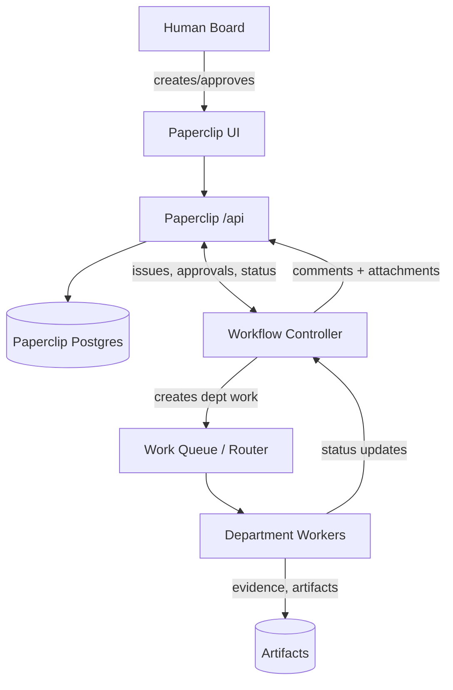

# Paperclip and Your Three Plans: Unified Architecture for Company-Style Orchestration

> **Historical research notice (2026-08-09):** Current authority is
> [`../../AIAT_TARGET_PROGRAMME.md`](../../AIAT_TARGET_PROGRAMME.md) and
> [`../../ROADMAP.md`](../../ROADMAP.md). Licence classifications in this
> report are non-blocking metadata for personal internal use; historical
> licence-based exclusions and distribution assumptions are superseded.

## Executive summary

Your three plans describe a “company simulation” orchestration system with deterministic workflow control, durable messaging, role-gated tools, and restart-proof execution. fileciteturn0file0 fileciteturn0file1 fileciteturn0file2  
The entity["organization","paperclipai","github org for paperclip"] **Paperclip** repo provides a strong *control plane* (org chart, ticketing/tasks, budgets, approvals, audit logs, agent heartbeats, and agent adapters) but explicitly positions itself **not** as a workflow builder and does **not** aim for automatic orchestration self-healing in V1. citeturn1view0turn10view0

The most actionable synthesis is a **two-plane architecture**:

- **Control Plane (Paperclip-first):** Use Paperclip for company/org modeling, UI, tickets (issues), governance/approvals, budgets/cost visibility, secrets, and auditability. citeturn1view1turn10view0turn10view2turn10view5  
- **Execution Plane (Your MAS):** Implement the deterministic workflow controller, durable router/queue semantics, tool gateway, sandboxing, checkpoint/resume, and worker execution. Represent workflow state and handoffs back into Paperclip as tickets + comments + attachments + approvals, so humans and “chiefs” control flows the way a real company does. fileciteturn0file0 fileciteturn0file1

This report covers Paperclip first (per your instruction), then summarizes Plan A/B/C, identifies overlaps/conflicts, and proposes two concrete implementation plans: “Vibe coding” (automated coding workers) and “Manual steps” (human-in-the-loop governance).

## Paperclip repository analysis

Paperclip positions itself as “open-source orchestration for zero-human companies,” with a server + UI that orchestrates external agents (“bring your own agent”) under an org chart with budgets, governance, and goal alignment. citeturn2view0turn1view1turn1view0  

image_group{"layout":"carousel","aspect_ratio":"16:9","query":["paperclip.ing Paperclip dashboard screenshot","paperclipai paperclip UI org chart screenshot","paperclip ai company task board screenshot"],"num_per_query":1}

### Architecture and modules

Paperclip’s repo structure and docs describe these major modules:

| Module (Paperclip) | What it does | Evidence |
|---|---|---|
| `server/` | REST API + orchestration services | citeturn1view2turn10view0 |
| `ui/` | Board/operator UI (React + Vite) | citeturn1view2turn6view1turn10view0 |
| `packages/db/` | Drizzle schema, migrations, DB clients | citeturn1view2turn7view0turn10view0 |
| `packages/shared/` | Shared types/validators (Zod) | citeturn1view2turn7view6 |
| `packages/adapters/*` | Built-in adapters for local agent runtimes (e.g., “codex-local”, “claude-local”, “cursor-local”, “openclaw”) | citeturn12view0turn13view0turn6view0 |
| `skills/` | Reusable “skills” to teach agents to use Paperclip | citeturn3view4turn11view2 |
| `cli/` | Onboarding/config CLI | citeturn1view1turn4view1 |
| `doc/` | SPEC + implementation spec + operational docs | citeturn2view1turn10view0turn4view0 |

### Core primitives Paperclip gives you

Paperclip’s docs and spec-implementation detail a set of primitives that map cleanly onto “company simulation” requirements:

- **Company / org chart model:** `companies`, `agents` with `reports_to` and “company-scoped invariants.” citeturn10view0turn1view2  
- **Tickets as the universal coordination channel:** Inter-agent “communication” is modeled as tasks/issues and comments; agents’ “inbox” is tasks assigned + comments. citeturn3view1turn10view1  
- **Atomic task checkout (single assignee):** Explicit checkout endpoint designed to avoid double-work (conflict → `409`). citeturn10view4turn1view0turn1view2  
- **Heartbeats + adapters:** A heartbeat protocol plus an adapter contract (`invoke/status/cancel`) with default `process` and `http` adapter shapes. citeturn3view0turn10view5turn3view1  
- **Governance / approvals:** Approval flows exist for “hire agent” and “CEO strategy approval,” with decisions logged and board override capabilities. citeturn3view3turn3view9turn10view5  
- **Budgets + cost tracking:** Per-agent monthly budgets and hard-stop behavior (auto-pause), plus cost events and rollups. citeturn1view0turn3view2turn10view2turn3view8  
- **Auditability by default:** Append-only activity log + ticket threads + run logs. citeturn1view0turn10view2turn1view1  
- **Secrets and storage:** DB-backed secret metadata + versions; local encryption option; S3-compatible object storage is supported; embedded Postgres is a “zero config” default. citeturn4view0turn10view2turn10view0turn6view0

### Strengths for your goals

Paperclip is unusually aligned with the “company control plane” part of your goal:

- It models **companies, org charts, tasks, budgets, approvals, and audit logs** explicitly, rather than being “just” an agent framework. citeturn1view0turn1view1turn10view0  
- It provides a concrete, implementable adapter boundary (process/http + invoke/status/cancel + scheduled heartbeats). That is a strong integration axis for “GitHub repo workers” and external agent runtimes. citeturn10view5turn3view1  
- It already carries local adapters for common coding agents/runtimes (e.g., “codex-local”, “claude-local”, “cursor-local”), which is directly relevant to your “workers from GitHub” direction. citeturn12view0turn6view0  

### Weaknesses and mismatches vs your plans

Your plans assume (and explicitly design for) **deterministic orchestration and restart-proof execution**, whereas Paperclip’s core spec emphasizes visibility and manual recovery rather than automatic self-healing.

Key mismatches:

- **Not a workflow builder:** Paperclip explicitly frames itself as not providing drag-and-drop pipelines/workflow-building. citeturn1view0turn1view1  
- **Automatic self-healing is out of scope V1:** The spec-implementation lists “automatic self-healing orchestration” as out-of-scope. citeturn10view0  
- **Crash recovery philosophy differs:** The spec states that, when an agent disappears mid-task, Paperclip surfaces stale work but does not auto-reassign; recovery is handled by humans or emergent processes. citeturn3view1  
- **Access-control model conflict:** The spec describes “agent visibility” as full-org visibility (org structure defines delegation lines, not access control). Your plans define strict chain-of-command and role-based communication/tool gating. citeturn3view1turn10view3 fileciteturn0file0 fileciteturn0file1  

Net: Paperclip is a strong control-plane base, but your deterministic workflow + durable execution fabric will likely need to be implemented *alongside* Paperclip (or by extending it).

## Summaries of your three plans

Your uploaded plans are internally consistent as a layered architecture: infrastructure durability (Plan A), company/organizational semantics (Plan B), and human/manual action checklist (Plan C). fileciteturn0file0 fileciteturn0file1 fileciteturn0file2  

**Plan A (MAS Architecture Upgrade):** A Python monorepo rewrite into services (`orchestrator-api`, `message-router`, `tool-service`, `team-runner`) and shared packages, emphasizing shutdown-safety, Redis Streams durability, router-enforced policy, role-gated tools, Postgres tables for state and checkpoints, and MinIO for large payload blobs. fileciteturn0file0  

**Plan B (Organizational Architecture):** A corporate hierarchy with ~20–40 agents across 11 teams (CEO/COO/C-suite + departments), a deterministic workflow controller owning state transitions, a 14-step project lifecycle (feasibility → PDR/CDR → infra gate → sprints → KPIs), CSO veto/circuit breakers, INFRA_READY gating, and structured message and review models. fileciteturn0file1  

**Plan C (Manual Actions):** A phase-by-phase checklist of decisions the human must make, secrets/credentials to generate, external setup steps, and verification tests—explicitly separating what the AI coding agents can automate vs what requires human judgment and environment control. fileciteturn0file2  

A concise comparison:

| Area | Plan A | Plan B | Plan C |
|---|---|---|---|
| Main focus | Durable execution fabric (router/tools/storage/checkpointing) | Corporate hierarchy + deterministic workflow state machine | Human-in-loop operational checklist |
| Key differentiator | Redis Streams + DLQ + checkpoint/resume + tool gateway | 14-step workflow, reviews, vetoes, KPI learning | “What humans must do” to make the system real |
| Operational posture | “Restart-proof automation” | “Company rules encoded as workflow controller” | “Reality checks, secrets, infra, tests” |

## Common components, gaps, and conflicts across Paperclip and plans

### Common components

The overlap is meaningful enough to justify integration over replacement:

- **Org chart + delegation:** Paperclip has hierarchical reporting via `reports_to`. citeturn10view0turn3view1  
  Plan B also defines an explicit corporate hierarchy and delegation. fileciteturn0file1  
- **Tickets/tasks as traceable work units:** Paperclip uses issues + comments as the coordination fabric. citeturn3view1turn10view1  
  Plan B similarly expresses work as structured steps, reviews, and document submissions (it just models them as message types and controller events). fileciteturn0file1  
- **Human approval gates:** Paperclip has board approval flows and “board override”. citeturn3view3turn3view9turn10view5  
  Plans include human-in-the-loop gates and escalation. fileciteturn0file1turn0file2  
- **Budget enforcement:** Paperclip has budget hard stops and cost events. citeturn1view0turn10view2  
  Plans include budgets/backpressure and cost controls embedded in message/task budgets. fileciteturn0file0  

### Gaps

| Gap | Paperclip (today) | Your plans |
|---|---|---|
| Deterministic workflow engine | Explicitly “not a workflow builder”; only generic state machines for agents/issues/approvals | Deterministic controller owns project transitions, fan-out/fan-in, veto/circuit breakers, and restart-safe transitions citeturn1view0turn10view3 fileciteturn0file1 |
| Durable messaging beyond DB atomicity | Uses DB atomic checkout for conflict avoidance; “separate queue not required for V1” | Redis Streams consumer groups, ACK/NACK, reclaim, DLQ, idempotency safeguards citeturn10view0 fileciteturn0file0 |
| Tool governance layer | No first-class “tool-service” boundary described; tools mostly agent-domain | Tool-service is central: role-gated tool groups, caching, circuit breakers fileciteturn0file0turn0file1 |
| Artifact + document lifecycle | Tracks assets/attachments, but spec says work artifacts are agent-domain/out of scope | Explicit document lifecycle (PDR/CDR/RR) and blob/object references for large payloads citeturn3view1turn10view3 fileciteturn0file0turn0file1 |
| Automated restart-safe continuation | Crash recovery is intentionally manual/visible; self-healing is out-of-scope V1 | Orchestrated shutdown/resume with agent checkpoints and workflow replay citeturn3view1turn10view0 fileciteturn0file0turn0file1 |

### Conflicts you must resolve in the synthesis

1. **“Tasks as the only communication channel” vs “messages + router”**  
   Paperclip’s spec frames inter-agent communication as tasks and comments. citeturn3view1  
   Your plans build a message bus with explicit routing constraints, consumer semantics, and message types. fileciteturn0file0turn0file1  
   **Resolution:** keep **Paperclip issues** as the *human-auditable* contract and treat router messages as *internal execution mechanics*. The deterministic controller can map “workflow events ↔ issue updates” to preserve traceability.

2. **Full visibility vs chain-of-command enforcement**  
   Paperclip’s spec leans toward full visibility, with reporting lines defining delegation rather than access control. citeturn3view1turn10view3  
   Your plans enforce strict policy checks on who can talk to whom and which tools they can use. fileciteturn0file0turn0file1  
   **Resolution:** implement access control in the **execution plane** (router/tool-service), while accepting that Paperclip UI can remain board-centric. If you need strict visibility boundaries in the UI, that becomes a Paperclip extension effort.

3. **“Manual recovery” vs “automatic resume”**  
   Paperclip treats auto-reassignment as intentionally avoided. citeturn3view1turn10view0  
   Your plans explicitly design for restart-proof and auto-resume. fileciteturn0file0turn0file1  
   **Resolution:** aim for “automatic resume when safe” (idempotent + checkpointed tasks) and “manual escalation when ambiguous” (DLQ entries, safety vetoes, review timeouts), and surface both in Paperclip via tickets and approvals.

## Refactored unified architecture

A unified architecture that satisfies your “simulate a company” goal should implement **roles + capabilities + controlled workflows**, while allowing you to drop in “new hires” (new workers/tools) later without rewriting orchestration.

### Synthesis: control-plane + execution-plane

**Control plane (Paperclip)**  
- Source of truth for: companies, agents (org chart), issues/tasks, approvals, budgets, activity log, secrets, attachments. citeturn10view0turn10view2turn4view0turn10view4  
- Adapter boundary for invoking workers: `process` + `http` with `invoke/status/cancel`. citeturn10view5  

**Execution plane (your MAS)**  
- Source of truth for: workflow templates + deterministic transitions + project state history + checkpoint/resume + tool gateway policies. fileciteturn0file0turn0file1  
- Durable task distribution: Redis Streams consumer groups (ACK/pending/reclaim). Redis Streams’ consumer-group design tracks pending messages (PEL) until explicitly acknowledged (XACK), and XAUTOCLAIM can transfer ownership after a minimum idle time (Redis 6.2+). citeturn8search0turn8search1turn8search24turn8search4  

**Credential and secret posture alignment**  
- Paperclip already includes secret tables and a local-encrypted provider; you can reference secrets rather than embedding them in configs. citeturn4view0turn10view2  
- Your execution plane should read secrets from Paperclip (via a constrained “secret reference” protocol) or from a separate vault, but never from plain-text worker manifests.

### Unified “worker” abstraction

Define one worker abstraction that works for both Paperclip and your MAS:

- **Worker = (identity + runtime adapter + capabilities + policy + sandbox + telemetry + checkpoint contract)**  
- **Capability registry** becomes the company’s internal “skills inventory,” enabling leaders to resolve: “I need mechanical engineering review” → “which worker(s) can do it?” (Plan B’s “hire later” scenario). fileciteturn0file1 citeturn3view1turn10view0  

### Security baseline for GitHub-sourced workers

Because you explicitly want “agents/tools from GitHub as workers and tools,” treat workers as potentially untrusted code:

- Container hardening primitives: default seccomp profile and capability dropping are part of a typical least-privilege baseline. citeturn9search2turn9search6  
- For stronger isolation, run workers under a sandbox like gVisor (protects against certain kernel exploit classes by limiting direct host-kernel exposure) or microVM isolation via Firecracker. citeturn9search0turn9search1turn9search29  
- At the orchestration layer, apply Kubernetes Pod Security Standards (“baseline” or “restricted”) if you move to Kubernetes. citeturn9search3turn9search15turn9search11  

### Storage and durability posture

- Paperclip supports Postgres and can run an embedded Postgres mode locally; for production it can use hosted Postgres (including Supabase) and S3-compatible object storage. citeturn4view0turn10view0turn10view3  
- Your plans explicitly call for Postgres + PgBouncer (transaction pooling) and recommend disabling prepared statements in the client (or asyncpg statement cache) to avoid prepared-statement errors behind PgBouncer transaction/statement pooling; asyncpg’s FAQ confirms PgBouncer transaction/statement pooling does not support prepared statements. citeturn4view0turn8search9  
- If using MinIO for S3-compatible blobs, note its dual licensing under AGPLv3 + commercial license. citeturn8search3  

## Vibe coding implementation plan

This plan focuses on automated “coding workers” (repo-based workers, Codex/Claude/Copilot-like workflows) while retaining enterprise-style orchestration controls.

### Goals

- Make GitHub repos and agent tools plug-in “workers” via `worker.yaml`.
- Ensure deterministic workflows (CEO → PM → Engineering → QA → Docs → Release) are enforced by software rules, not by agent vibes.
- Provide at-least-once delivery with effectively-once processing via idempotency + checkpoints.
- Enforce security boundaries so bringing in GitHub code/tools does not compromise the host.
- Integrate with Paperclip so you get UI, audit trails, approvals, and budgets “for free.”

### High-level architecture diagram

Paperclip already defines `process/http` adapters and a heartbeat scheduler. citeturn10view5turn10view0  
The diagram below uses Paperclip as the control plane and your services as the execution plane.

```mermaid
flowchart LR
  subgraph CP[Control Plane: Paperclip]
    UI[Board UI]
    API[Server /api]
    DB[(Postgres: companies, agents, issues, approvals, costs)]
    UI --> API --> DB
  end

  subgraph EP[Execution Plane: MAS]
    WC[Workflow Controller\n(deterministic transitions)]
    MR[Message Router\n(Redis Streams + WS)]
    TS[Tool Service\n(role-gated tools)]
    PS[(Postgres: workflow state, checkpoints, artifacts meta)]
    OS[(Object Store: S3/MinIO)]
    R[(Redis Streams)]
    WC --> PS
    WC -->|dispatch| MR
    MR <--> R
    TS --> PS
    TS --> OS
  end

  subgraph W[Workers]
    W1[Repo-based Worker\n(Codex/Claude/Copilot loop)]
    W2[QA Worker]
    W3[Docs Worker]
    W1 <--> MR
    W2 <--> MR
    W3 <--> MR
    W1 --> TS
    W2 --> TS
    W3 --> TS
  end

  API <--> WC
  API -->|invoke via adapter| W1
```

### Adapter/worker spec and transport modes

Paperclip’s adapter contract (`invoke/status/cancel`) and `process`/`http` config shapes are a direct fit for your “worker adapters.” citeturn10view5turn3view1  
Your execution plane should support these transport modes:

| Transport mode | Intended use | How it maps to Paperclip |
|---|---|---|
| **Process** | Run a local CLI agent (Codex/Claude/Cursor-style), or a repo tool inside a sandbox | Paperclip `process` adapter already has `command/args/cwd/env/timeout/grace`. citeturn10view5turn3view6 |
| **HTTP webhook** | Remote worker (self-hosted service, serverless job runner) | Paperclip `http` adapter config supports URL/method/headers + payload template. citeturn10view5turn3view6 |
| **Container job (OCI)** | Run GitHub-sourced workers safely with pinned images | Implement as `process` adapter calling a container runner, or as an HTTP adapter to a “worker-executor” service |
| **MCP tool endpoint** | Treat tools as standardized RPC endpoints | Implement behind your tool-service; Paperclip sees it as an HTTP tool gateway (not native in Paperclip V1) |
| **GitHub Actions / CI worker** | Offload heavy tests/builds | Invocation via HTTP adapter to a CI-trigger endpoint (out-of-band) |

### Capability registry

Paperclip stores a free-form `capabilities` field on agents, plus goal/task ancestry; your MAS should define a **structured registry** and then **sync a human-readable summary back into Paperclip** for discoverability. citeturn10view0turn1view0turn3view1

Recommended minimal schema in MAS Postgres:
- `capabilities(id, name, version, input_schema, output_schema, risk_level, cost_model)`
- `workers(id, name, adapter_type, adapter_config, sandbox_profile, capability_ids[])`
- `role_capability_map(role, capability_id, priority, constraints)`

### Security and sandboxing

Baseline (practical, “today”):
- Run workers in containers with least privilege (default seccomp profile; drop capabilities). citeturn9search2turn9search6  
- For Kubernetes, enforce Pod Security Standards (baseline/restricted) on worker namespaces. citeturn9search3turn9search11turn9search15  
- Network egress defaults to **deny**, then allowlist domains/services per capability (e.g., allow GitHub + package registries for “build/test” workers).

Harder isolation (when pulling random GitHub workers at scale):
- gVisor for stronger container isolation properties against certain kernel exploit classes. citeturn9search0turn9search12  
- Firecracker microVMs for higher isolation boundaries where needed. citeturn9search1turn9search29turn9search5  

### Checkpointing and monitoring

- Redis Streams consumer groups keep messages pending until acknowledged; you can reclaim messages when consumers stall, but you must build idempotency and checkpointing around that. citeturn8search0turn8search1turn8search24  
- Paperclip has `heartbeat_runs` and an `activity_log`; your MAS should emit workflow events into Paperclip as issue comments + attachments for traceability. citeturn10view2turn10view1turn10view4  

Checkpoint contract (recommended):
- Every worker task execution writes:
  - `inputs_ref` (artifact pointer)
  - `current_step` (deterministic step key)
  - `resume_token` (tool-specific)
  - `repo_state` (branch/commit) for repo workers
  - `last_successful_action` (idempotency key)

### Component mapping to Paperclip modules

Paperclip module list is shown first, as requested.

| Component (Vibe coding) | Paperclip module(s) | Build/extend outside Paperclip | Notes |
|---|---|---|---|
| Board UI, approvals, budgets, audit | `ui/`, `server/`, `packages/db` | — | Approvals + activity log already exist. citeturn10view2turn1view0turn6view1 |
| Worker invocation | `server/` adapters + packages/adapters | Extend | Use adapter contract; add “worker-executor” adapter or wrap via http/process. citeturn10view5turn12view0turn6view0 |
| Deterministic workflow controller | — | Build | Either separate service calling Paperclip API, or a Paperclip server extension. citeturn10view4turn10view0 |
| Durable routing + replay | — | Build | Redis Streams XACK/XAUTOCLAIM semantics for at-least-once delivery. citeturn8search0turn8search1turn8search4 |
| Tool gateway + RBAC | — | Build | Your plan’s tool-service is the policy perimeter for tools. fileciteturn0file0turn0file1 |
| Artifact store | `assets`, `issue_attachments` + storage provider | Extend | Paperclip tracks assets; MAS adds doc lifecycle + blob refs. citeturn10view3turn10view2turn10view0 |
| Secrets | `company_secrets`, secret provider | Prefer reuse | Use Paperclip secret refs; avoid plain env values. citeturn4view0turn10view2 |

### Prioritized milestones, effort, risks

| Milestone | Scope | Effort | Key risks | Mitigation |
|---|---|---:|---|---|
| Vertical slice “one workflow step” | Paperclip company + one worker + MAS controller posts/updates one issue | S | Integration churn | Lock a minimal API contract: issue create/checkout/comment + status updates. citeturn10view4turn10view1 |
| Worker manifest + registry | `worker.yaml` format, capability registry, Paperclip sync | M | Capability explosion | Start with ~20–40 core capabilities aligned to your departments; version them. |
| Worker executor (process + http) | Generic runner that can execute repo workers; maps to Paperclip adapters | M | Unsafe code execution | Sandbox baseline: seccomp + dropped caps; egress allowlist. citeturn9search2turn9search6 |
| Durable router on Redis Streams | Consumer groups, ACK/NACK, reclaim, DLQ | M | Duplicate processing | Enforce idempotency keys + checkpoint writes before ACK. Redis PEL semantics require explicit ACK. citeturn8search0turn8search24turn8search1 |
| Tool service boundary | Role/tool permissions, caching, circuit breakers | M | Tool abuse / runaway costs | Gate tools by role; add rate limits + budget checks; enforce budget hard-stops using Paperclip budgets when possible. citeturn10view2turn3view2 |
| Deterministic workflow templates | Encode your company flows as templates + transition tables | L | “Workflow drift” between Paperclip and MAS | Make MAS the source of truth; Paperclip reflects state via issues + approvals; log transitions. |
| Strong isolation option | gVisor/Firecracker for untrusted worker pools | L | Ops complexity | Only apply to “untrusted” worker class; keep default workers on standard container sandbox. citeturn9search0turn9search29turn9search1 |

### Example `worker.yaml` schema and sample workflow template

The manifest must be stable enough to “hire” new roles later (e.g., mechanical engineer) without editing core orchestration.

```yaml
# worker.yaml (schema example)
apiVersion: mas.company/v1
kind: Worker
metadata:
  name: repo-coder
  version: 0.1.0
  description: "Repo-based coding worker (automated PR implementation)."
  source:
    repo: "github.com/your-org/your-worker-repo"
    revision: "main"
  tags: ["software", "engineering", "coding"]

runtime:
  transport: process   # process | http | oci | human
  process:
    command: "codex"   # or "claude", "cursor-agent", custom CLI
    args:
      - "--workspace"
      - "{{workspace.path}}"
      - "--task"
      - "{{task.id}}"
    timeoutSec: 3600
    graceSec: 30

capabilities:
  - name: implement_feature
    inputs:
      schemaRef: "jsonschema://capabilities/implement_feature.input.json"
    outputs:
      schemaRef: "jsonschema://capabilities/implement_feature.output.json"
    limits:
      maxConcurrent: 1
      maxCostUsd: 10.0
      maxToolCalls: 200

sandbox:
  profile: "restricted"
  filesystem:
    readOnlyRoot: true
    writableDirs: ["{{workspace.path}}", "/tmp"]
  network:
    mode: "egress-allowlist"
    allow:
      - "api.github.com:443"
      - "pypi.org:443"
  linux:
    dropCapabilities: true
    seccompProfile: "docker-default"

checkpointing:
  supported: true
  strategy: "on-step"   # on-step | periodic | on-signal
  store:
    kind: "postgres"
    table: "agent_checkpoints"
  resume:
    includes: ["repo.branch", "repo.commit", "task.cursor"]

observability:
  logs: { format: "json" }
  metrics: { enabled: true }
  traces: { enabled: true }

paperclip:
  agent:
    adapterType: "process"
    contextMode: "thin"
    schedule:
      enabled: true
      intervalSec: 900
```

```yaml
# workflow-template.yaml (sample)
apiVersion: mas.company/v1
kind: WorkflowTemplate
metadata:
  name: software-project-standard
  version: 0.1.0
spec:
  description: "CEO -> PM -> Engineering -> QA -> Docs -> Release"
  states:
    - id: INITIATED
      ownerRole: CEO
      onEnter:
        createPaperclipIssue:
          title: "Project initiated"
          assigneeRole: CEO
      transitions:
        - on: CEO_APPROVES
          to: PLANNING

    - id: PLANNING
      ownerRole: PROJECT_MANAGER
      tasks:
        - capability: write_project_plan
          assigneeRole: PROJECT_MANAGER
        - capability: draft_requirements
          assigneeRole: PROJECT_MANAGER
      approvals:
        - type: HUMAN_GATE
          prompt: "Approve project plan?"
      transitions:
        - on: HUMAN_APPROVED
          to: IMPLEMENTATION

    - id: IMPLEMENTATION
      ownerRole: ENGINEERING_MANAGER
      tasks:
        - capability: implement_feature
          assigneeRole: SOFTWARE_ENGINEER
          retry:
            maxAttempts: 3
            dlqOnFail: true
      transitions:
        - on: ALL_FEATURES_DONE
          to: QA

    - id: QA
      ownerRole: QA_LEAD
      tasks:
        - capability: run_test_suite
          assigneeRole: QA_ENGINEER
      transitions:
        - on: QA_PASSED
          to: DOCS

    - id: DOCS
      ownerRole: DOCS_LEAD
      tasks:
        - capability: write_release_notes
          assigneeRole: TECHNICAL_WRITER
      transitions:
        - on: DOCS_DONE
          to: RELEASE

    - id: RELEASE
      ownerRole: CEO
      approvals:
        - type: HUMAN_GATE
          prompt: "Approve release?"
      transitions:
        - on: HUMAN_APPROVED
          to: COMPLETE

    - id: COMPLETE
      ownerRole: CEO
      onEnter:
        closePaperclipProject: true
```

## Manual steps implementation plan

This plan is optimized for human governance, approvals, and operational realism, while keeping the same unified architecture.

### Goals

- Make processes “feel like a real company”: chiefs decide, departments execute, humans can intervene at key gates.
- Provide auditable decision trails (who approved what, when, and why).
- Enable onboarding/hiring of new roles (including non-software roles later) as largely configuration changes.
- Maintain safety and compliance boundaries in tools and data access.

### High-level architecture diagram

Paperclip’s ticketing (“tasks + comments”) and approval primitives become the backbone of human-in-the-loop workflows. citeturn3view1turn10view2turn10view5



### Role/capability mapping and onboarding

Paperclip supports agent creation and governance for hires; your manual plan should formalize hiring as:

- **Define role:** e.g., MECHANICAL_ENGINEER.
- **Map to capabilities:** e.g., `design_component`, `review_tolerances`, `run_simulation`.
- **Register worker:** add one `worker.yaml` and create the corresponding Paperclip agent record (or have a “hiring assistant” do it, subject to approval). Paperclip’s approval system explicitly supports hire approvals and logs decisions. citeturn10view2turn3view9turn10view5  

### Approval gates and UI flows

Paperclip’s V1 approval types include hire and CEO strategy approval. citeturn10view2turn3view9turn10view5  
For broader enterprise “approval gates” (architecture review, security veto, release approval), you can implement one of two approaches:

- **Approach 1 (no schema changes):** model approvals as **human-assigned issues**. Paperclip already supports assigning tasks to humans and logging all conversation and actions in the ticket trail. citeturn3view1turn10view1turn1view0  
- **Approach 2 (extend Paperclip):** add new approval types (e.g., `security_review`, `release_gate`) and enforce them in the workflow controller before progressing.

Given your plans include CSO veto/circuit breakers and formal review sessions, Approach 2 is higher fidelity to your “company simulation,” but Approach 1 gets you running faster. fileciteturn0file1 citeturn10view0  

### Auditability

Paperclip provides:
- `activity_log` for mutations and governance actions. citeturn10view2turn1view0  
- Ticket threads as an immutable record of instructions, tool calls, and decisions (as described in their public positioning). citeturn1view0turn1view1  

Your MAS should add:
- `workflow_state_history` per project (your plans already call for this). fileciteturn0file1  
- DLQ records, checkpoint records, and tool-audit logs.

### Component mapping to Paperclip modules

Paperclip module list is shown first, as requested.

| Component (Manual steps) | Paperclip module(s) | Build/extend outside Paperclip | Notes |
|---|---|---|---|
| Human UI flows + approvals | `ui/`, `server/`, `approvals`, `activity_log` | Possibly extend | Paperclip already logs and enforces key governance gates. citeturn10view2turn1view0turn10view5 |
| Role catalog | `agents.role`, `agents.title` | Extend | Use Paperclip fields initially; add structured role tables in MAS for richer mapping. citeturn10view0 |
| Capability discovery | `agents.capabilities` (text) | Extend | Sync from MAS capability registry to keep UI helpful. citeturn10view0turn3view1 |
| Controlled workflow transitions | — | Build | Deterministic workflow controller remains required to match your plans. fileciteturn0file1 |
| Human-in-the-loop verification checklist | — | Build (process) | Plan C’s manual actions become your runbooks and operator playbooks. fileciteturn0file2 |

### Prioritized milestones, effort, risks

| Milestone | Scope | Effort | Key risks | Mitigation |
|---|---|---:|---|---|
| Adopt Paperclip as control-plane UI | Run Paperclip locally; create one company + initial agents + goals | S | Misaligned assumptions | Anchor on Paperclip’s spec-implementation entities/APIs. citeturn10view4turn10view0 |
| Encode one end-to-end manual workflow | CEO kickoff → PM plan → engineer → QA → docs → release, with human gates | M | Too many customizations early | Use “approval as issues” first; extend approvals later. citeturn3view1turn10view2 |
| Hiring/onboarding playbook | Worker manifest intake + secret provisioning + approval | M | Secret sprawl | Use Paperclip secret refs and strict mode options; store no plaintext in manifests. citeturn4view0turn10view2 |
| Audit layer consolidation | Ensure every key action emits: issue comment + activity log + workflow history | M | Gaps in traceability | Define “auditable events” contract; block state transitions if missing evidence. |
| “Manual actions” runbook integration | Turn Plan C into operational runbooks and checklists | S | Human fatigue | Automate verifications; keep only irreducible manual steps. fileciteturn0file2 |

### Example `worker.yaml` schema and manual workflow template

```yaml
# worker.yaml (manual/human worker variant)
apiVersion: mas.company/v1
kind: Worker
metadata:
  name: human-approver
  version: 0.1.0
  description: "Human board member who approves gates via Paperclip UI."
  tags: ["human", "governance"]

runtime:
  transport: human
  human:
    paperclipUserGroup: "board"

capabilities:
  - name: approve_gate
    inputs: { schemaRef: "jsonschema://capabilities/approve_gate.input.json" }
    outputs: { schemaRef: "jsonschema://capabilities/approve_gate.output.json" }

audit:
  requiredEvidence:
    - type: paperclip_issue_comment
    - type: paperclip_activity_log
```

```yaml
# workflow-template.yaml (manual-heavy sample)
apiVersion: mas.company/v1
kind: WorkflowTemplate
metadata:
  name: enterprise-project-with-human-gates
  version: 0.1.0
spec:
  states:
    - id: FEASIBILITY
      ownerRole: CEO
      tasks:
        - capability: financial_feasibility
          assigneeRole: CFO
        - capability: security_feasibility
          assigneeRole: CSO
      approvals:
        - type: HUMAN_GATE
          assignee: HUMAN_BOARD
          prompt: "Approve feasibility report?"
      transitions:
        - on: HUMAN_APPROVED
          to: REQUIREMENTS

    - id: REQUIREMENTS
      ownerRole: PROJECT_MANAGER
      tasks:
        - capability: draft_requirements
          assigneeRole: PROJECT_MANAGER
      approvals:
        - type: HUMAN_GATE
          assignee: HUMAN_BOARD
          prompt: "Approve requirements?"
      transitions:
        - on: HUMAN_APPROVED
          to: EXECUTION

    - id: EXECUTION
      ownerRole: ENGINEERING_MANAGER
      tasks:
        - capability: implement_feature
          assigneeRole: SOFTWARE_ENGINEER
        - capability: run_test_suite
          assigneeRole: QA_ENGINEER
      transitions:
        - on: ALL_DONE
          to: COMPLETE

    - id: COMPLETE
      ownerRole: CEO
      onEnter:
        createPaperclipIssue:
          title: "Project closed (complete)"
          assigneeRole: CEO
```

## Recommended next steps

1. **Pick the system-of-record split explicitly:** Paperclip for org/tasks/approvals/budgets/audit; MAS for deterministic workflow + durable execution + tool governance. This aligns with Paperclip’s stated scope (control plane, not workflow builder). citeturn1view0turn10view0  
2. **Build a single vertical slice before designing every department:** One workflow template, one repo-based worker, one tool call, one approval gate, end-to-end trace in Paperclip (issue + activity log). citeturn10view1turn10view2turn10view4  
3. **Stand up the capability registry early:** It’s the mechanism that makes “hire a mechanical engineer later” a config change, not an architecture change. fileciteturn0file1  
4. **Define your sandbox “tiers”:** baseline container hardening everywhere; gVisor/Firecracker only for untrusted GitHub workers. citeturn9search2turn9search0turn9search1  
5. **Decide your artifact policy and licensing posture:** If you adopt MinIO for S3-compatible blobs, confirm AGPL/commercial implications for your intended distribution/hosting model. citeturn8search3
