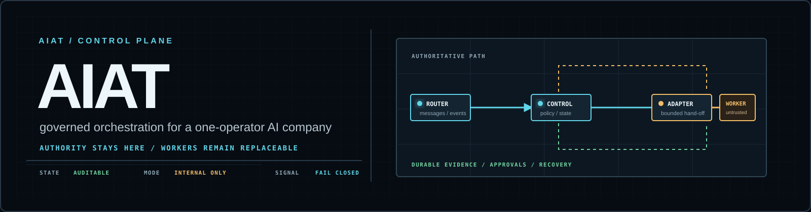
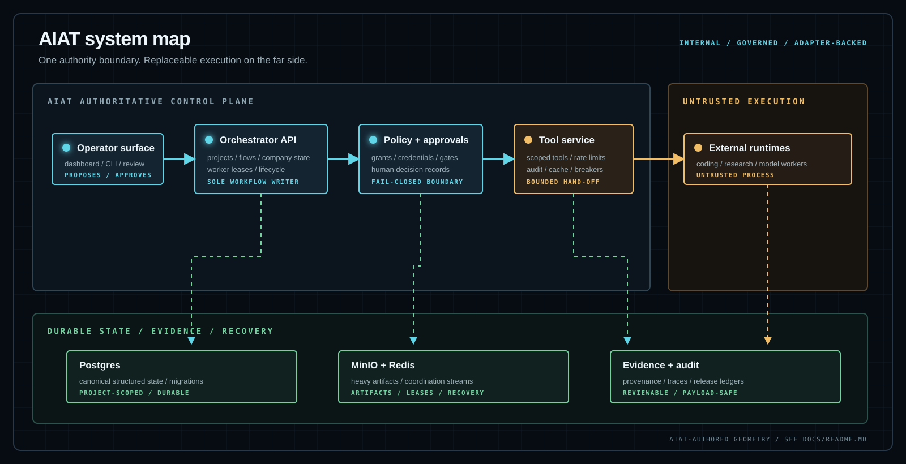

<!--
THESIS: AIAT is the control plane where authority, project state, and evidence stay visible while external runtimes remain replaceable workers.
OWN-WORLD: A graphite instrument field with cyan routing signals, amber approval gates, and crisp system-map geometry.
STORY: An operator can understand the boundary in seconds, then move from architecture to a safe local run without hunting through the repository.
FIRST VIEWPORT: Banner, one-line promise, scope callout, status strip, and the control-plane boundary before the first long section.
FORM: Read-mode repository landing page; the category-default marketing hero is intentionally replaced by an operational brief.
FINISH: unreviewed and undocumented is unfinished; this build ends with the finish review, the verdict, and DESIGN.md
-->

<p align="center">
  
</p>

<h1 align="center">AIAT / Multi-Agent Operating System</h1>

<p align="center">
  Governed orchestration for a one-operator AI company.
</p>

<p align="center">
  <a href="https://github.com/Maaroufabousaleh/AIAT/actions/workflows/aiat-ci.yml"></a>
  <a href="https://www.python.org/"></a>
  <a href="https://www.docker.com/products/docker-desktop/"></a>
  <a href="LICENSE"></a>
</p>

<p align="center">
  <a href="Docs/README.md">Documentation</a> ·
  <a href="AIAT_TARGET_PROGRAMME.md">Target programme</a> ·
  <a href="ROADMAP.md">Roadmap</a> ·
  <a href="mas/README.md">MAS workspace</a> ·
  <a href="THIRD_PARTY_NOTICES.md">Provenance</a>
</p>

> [!IMPORTANT]
> AIAT is a personal, single-operator, internal-use programme. It is not being
> prepared as a product for sale, public distribution, managed hosting, or
> third-party commercial deployment. External runtimes are treated as untrusted
> execution and are reached through bounded, versioned adapters.

## The short version

AIAT keeps the authority layer in one place: the orchestrator, router, tool
service, registries, credentials boundary, approvals, dashboard, company
control plane, managers, and evidence systems. Workers can change underneath it;
they run through AIAT shells and pinned adapters.

```text
operator → AIAT authority → policy / approvals → adapter shell → external runtime
                    ↘ project state / evidence / audit ↗
```

The useful distinction is simple: a model or worker may propose, inspect, test,
or explain. AIAT-owned services decide what may be executed, what state is
durable, and what evidence is sufficient to move forward.

## Current shape

| Signal | Current posture |
| --- | --- |
| Programme | Personal, single-operator, internal use |
| Authority | AIAT-owned control plane and approval boundary |
| Workers | Adapter-backed external runtimes; treated as untrusted execution |
| State | Postgres-first structured state, MinIO-backed heavy artifacts, Redis coordination |
| Evidence | Versioned provenance, release ledgers, audit trails, and deterministic checks |
| Activation | Security, compatibility, sandbox, privacy, budget, recovery, and human-approval gates remain enforceable |

## Architecture at a glance



The canonical implementation view is [`mas/docs/ARCHITECTURE.md`](mas/docs/ARCHITECTURE.md).
The maintained feature specifications and ordered plans are indexed in the
[`documentation hub`](Docs/README.md).

## What is in the repository

| Area | Role |
| --- | --- |
| [`mas/apps/`](mas/apps/) | Orchestrator API, message router, tool service, team runner, identity service, and PM gateway |
| [`mas/packages/`](mas/packages/) | Shared protocols, policy, workflow, storage, agent, gateway, and tool SDK packages |
| [`mas/companies/`](mas/companies/) | Versioned company, organisation, and budget manifests |
| [`mas/teams/`](mas/teams/) · [`mas/workers/`](mas/workers/) | 11 department definitions and 39 worker manifests |
| [`mas/prompts/`](mas/prompts/) | 11 role prompts used by the company control plane |
| [`mas/infra/`](mas/infra/) | Compose, image, systemd, mail-edge, and sandbox integration profiles |
| [`mas/docs/provenance/`](mas/docs/provenance/) | Machine-readable component, pin, image, security, and release evidence |
| [`Docs/current/`](Docs/current/) | Maintained feature specifications, status notes, and delivery plans |
| [`docs/assets/`](docs/assets/) | Repository-owned visual assets used by this landing page and its architecture map |

## Quick start

The default loop is local and deterministic. No provider credentials or live
actions are needed to run the unit and contract suites.

```bash
cp .env.example .env
# Set the required local secrets in .env before starting services.
mas/infra/compose/mas.sh up --build
```

For migrations and health checks:

```bash
uv --directory mas run alembic upgrade head
curl http://localhost:8000/health
curl http://localhost:8001/health
curl http://localhost:8002/health
curl http://localhost:4000/api/health
```

Open the operator dashboard at <http://localhost:4000>.

## Developer checks

Run from `mas/`:

```bash
cd mas
uv sync
uv run python -m compileall -q packages apps
uv run python scripts/check_provenance.py
uv run python scripts/check_docs_index.py --json
uv run python scripts/check_release_ledger.py --json
uv run pytest
uv run ruff check .
uv run mypy .
```

Dashboard checks:

```bash
cd mas/apps/mas-dashboard
npm install
npm run typecheck
npm run build
npm run test:e2e
```

Provider, Docker, native-sandbox, and live release checks remain explicit
operator workflows. Passing local tests does not manufacture external evidence
or unlock a consequential action.

## Documentation map

Start at [`Docs/README.md`](Docs/README.md) for the source-of-truth order and
the maintained reading paths.

| Need | Start here |
| --- | --- |
| Programme intent and boundaries | [`AIAT_TARGET_PROGRAMME.md`](AIAT_TARGET_PROGRAMME.md) |
| Ordered implementation work | [`ROADMAP.md`](ROADMAP.md) |
| Current feature truth | [`Docs/current/`](Docs/current/) |
| System architecture | [`mas/docs/ARCHITECTURE.md`](mas/docs/ARCHITECTURE.md) |
| Deployment and local operations | [`Docs/PM_Platform_Deployment.md`](Docs/PM_Platform_Deployment.md), [`mas/docs/PM_ACTIVE_DEPLOYMENT.md`](mas/docs/PM_ACTIVE_DEPLOYMENT.md) |
| Dashboard and operator UX | [`Docs/current/FEATURE_DASHBOARD_AND_OPERATOR_UX.md`](Docs/current/FEATURE_DASHBOARD_AND_OPERATOR_UX.md) |
| Workers, runtimes, and adapters | [`Docs/current/FEATURE_WORKERS_STEWARDS_AND_MODELS.md`](Docs/current/FEATURE_WORKERS_STEWARDS_AND_MODELS.md) |
| Security and recovery | [`Docs/current/FEATURE_SECURITY_OBSERVABILITY_AND_OPERATIONS.md`](Docs/current/FEATURE_SECURITY_OBSERVABILITY_AND_OPERATIONS.md) |
| Component and licence metadata | [`THIRD_PARTY_NOTICES.md`](THIRD_PARTY_NOTICES.md), [`third_party_components.yaml`](mas/docs/provenance/third_party_components.yaml) |

## Safety and trust boundaries

- AIAT-owned services keep authority, project state, credentials, approvals, and evidence.
- External runtimes execute through versioned adapters with bounded tools, network, filesystem, and credential scopes.
- Security, authenticity, compatibility, privacy, sandbox, data-loss, budget, recovery, and human-approval checks remain independent of licence metadata.
- The dashboard is an operator surface, not a second ledger, policy engine, or live-action authority.
- Live/provider evidence is labelled separately from deterministic fixtures and local contract tests.

Read [`agents.md`](agents.md) for the internal architecture and resource policy,
and [`mas/docs/provenance/release_ledger.yaml`](mas/docs/provenance/release_ledger.yaml)
for machine-readable evidence posture.

## Licence and provenance

AIAT’s original source and repository-owned visual assets are covered by
[`LICENSE`](LICENSE). Third-party software, services, model references, data,
and provider terms remain their own; AIAT records known version, source, licence,
notice, and restriction metadata in [`THIRD_PARTY_NOTICES.md`](THIRD_PARTY_NOTICES.md)
and [`mas/docs/provenance/third_party_components.yaml`](mas/docs/provenance/third_party_components.yaml).

Licence metadata is informational for this personal internal-use instance. It
does not create an allowlist or block discovery, installation, activation,
execution, updating, or normal internal use. If the programme’s distribution
scope changes, perform a separate distribution review.

## Working agreements

- [`CONTRIBUTING.md`](CONTRIBUTING.md) — change boundaries, checks, docs, and asset rules.
- [`SECURITY.md`](SECURITY.md) — safe handling and private reporting guidance.
- [`DESIGN.md`](DESIGN.md) — visual language, diagram, and documentation maintenance rules.
- [`THIRD_PARTY_NOTICES.md`](THIRD_PARTY_NOTICES.md) — provenance and metadata policy.

<p align="center">
  <sub>AIAT / internal control plane · authority stays here · workers remain replaceable</sub>
</p>
