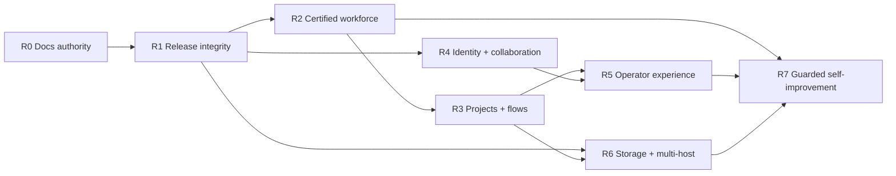

# AIAT Roadmap

**Roadmap baseline:** 2026-08-10
**Last updated:** 2026-08-12
**Programme authority:** [AIAT_TARGET_PROGRAMME.md](AIAT_TARGET_PROGRAMME.md)  
**Current phase:** P0 release integrity

This is the root navigation and delivery-order document for the personal AIAT instance. The target programme defines the system; the feature specifications define each subsystem; the plans below define execution. Historical plans remain useful evidence but do not override this roadmap.

## Current phase snapshot

| Phase | State | Evidence-backed status |
| --- | --- | --- |
| R0 — documentation authority | complete | Canonical target, eleven feature documents, three plans, root navigation, the tracked `mas/uv.lock`, and the personal/internal metadata-only policy are present. Both the current workspace and a clean Git archive pass `check_docs_index.py`. |
| R1 — P0 release integrity | in progress | Static ledger: 48/48 pass. The current unconfigured local live ledger records 51 pass, 0 fail, 14 blocked, 4 pending, and `NO-RELEASE` across 65 checks; the native release-host preflight is now included in that aggregate. The retained configured loopback profile remains 59 pass, 0 fail, 5 blocked, 4 pending across 64 checks. Native-Linux, deployment-wide trace/tool coverage, operator-selected worker certification, deployment image digests/SBOM/scan artifacts, gVisor, provider/mail, clean-worktree, and selected self-improvement evidence remain open. |
| R2–R5 — P1 default programme completion | preparatory implementation | Control-plane, worker, flow, evidence, identity, provider, executive, SDK, and dashboard contracts are substantially implemented and statically tested; the current local Compose dashboard suite passes 58/59 tests (one explicit operator-fixture skip), including hierarchy communication-policy/path tracing, retained hiring evaluation details, focused 2/2 shell accessibility, 2/2 theme preference, identity stale-record/retry, PM integration conflict/stale retry, project-detail stale/retry, and system-visualization partial/offline retry coverage. Source-built governance, System Control, Projects list, Project evidence package, Tools catalogue, dead-letter queue, credentials, Metrics, Flows, flow editor, project detail, project workspace, Container Logs, Agent Streams, Hiring Board, CEO Live Feed, CEO Command Center chat, evidence-detail, system-visualisation, PM integrations, System Overview, and shared identity-resource stale/recovery/accessibility tests also pass; selector repairs are recorded in `d5f596e` and `514aeeb`, the project evidence package stale/retry group is recorded in `bc80ad5`, its focused accessibility baseline in `89091c1`, the Tools catalogue focused accessibility baseline in `83e39e6`, the dead-letter queue focused accessibility baseline in `99a19a2`, the credentials focused accessibility baseline in `93fdfbc`, the Metrics focused accessibility baseline in `da113af`, the Container Logs focused accessibility baseline in `993b1cb`, the Agent Streams focused accessibility baseline in `d320383`, the Hiring Board focused accessibility baseline in `826b4c5`, the CEO Live Feed focused accessibility baseline in `1f947a9`, the CEO Command Center chat focused accessibility baseline in `8ffb5df`, the Governance focused accessibility baseline in `f4ae7eb`, the System Control focused accessibility baseline in `543f392`, the Project Detail focused accessibility baseline in `40b87dd`, the evidence-detail focused accessibility baseline in `32f3a76`, the system-visualisation focused accessibility baseline in `ed5e551`, the PM integrations focused accessibility baseline in `bbd6ba3`, the System Overview focused accessibility baseline in `c07b4a6`, and the shared identity-resource accessibility baseline in `a260e04`; flow-editor load/stale/retry recovery is recorded in `b5098e7`, project-detail first-load/retry recovery is recorded in `f364763`, and project-workspace stale/retry recovery is recorded in `cb1c665`. Compose also passes the bounded LangGraph/CrewAI adapter lifecycle probe with exact locked package parity (LangGraph `0.6.11`, CrewAI `1.6.1`); page-by-page light/dark parity, native-Linux, workforce, model-backed canary/live-run, sandbox, rollback, and provider certification remain open. |
| R6–R7 — P2 scale and guarded autonomy | partial | Local MinIO conformance and same-provider backup/restore pass; restore copies now fail closed on non-empty target prefixes (`93bf755`); a bounded local `time_now` run now proves project-usage plus `tool_service` native trace read-back; authenticated self-improvement lifecycle persistence, revision/CAS actions, typed references, and bounded outcomes are committed in `64218ab`; provider-pair migration, encrypted/clean-environment recovery, model-backed worker/mail-edge coverage, multi-host/Firecracker, optional memory services, and live self-improvement worker/provider/control-plane evidence remain later work. |

The preceding bounded dashboard increment was shared empty-state accessibility:
the reusable `EmptyState` primitive marks decorative status icons as hidden
from assistive technology, with the offline System Overview fixture asserting
that contract (`24be4ba`).

The preceding bounded dashboard increment was System Visualization denial-state
recovery: a 401/403 hierarchy response now renders an explicit access-denied
region without a misleading Retry action, while partial notices identify each
failed source; the focused source-built matrix passes healthy, partial, offline,
and denied states 4/4 (`db898e7`).

The preceding bounded dashboard increment was shared identity-resource denial-state
recovery: 401/403 resource reads now expose a named access-status region,
preserve already loaded metadata-only rows when authorization is lost, and
remove misleading Refresh/Retry actions; stale/retry and denial fixture coverage
passes 2/2 (`0974434`).

The preceding bounded dashboard increment was shared ErrorBanner decorative-icon
semantics: status banners now hide their severity icon from assistive technology,
covered by the System Visualization partial-state assertion (`29b700c`).

The preceding bounded dashboard increment was System Control denial-state recovery:
401/403 status reads now remove Refresh/Retry and all runtime mutations while
preserving only last-known read context; stale, first-load-denial, and post-read-
denial fixture coverage passes 3/3 (`14968d4`).

The preceding bounded dashboard increment was Governance denial-state recovery:
401/403 responses from any combined governance read now remove Refresh/Retry and
all executive action forms while preserving only last-known read context; stale,
first-load-denial, and post-read-denial fixture coverage passes 3/3 (`888fde3`).

The preceding bounded dashboard increment was PM integrations denial-state recovery:
401/403 responses now remove Refresh/Retry and lifecycle-plan generation, review,
approval, and apply controls while preserving only last-known reconciliation
context; stale, first-load-denial, and post-read-denial fixture coverage passes
3/3 (`7373360`).

The latest bounded dashboard increment is Hiring Board denial-state recovery:
401/403 worker reads now remove Refresh/Retry and registration, evaluation,
activation/deactivation, drain, and deletion controls while preserving only
last-known worker rows; stale, first-load-denial, and post-read-denial fixture
coverage passes 3/3 (`553f196`).

The latest bounded dashboard increment is Credentials denial-state recovery:
401/403 credential reads now expose a named access-denied region, retain only
previously loaded redacted metadata, and hide Refresh/Retry, creation, deletion,
placeholder copy, selection, and audit navigation controls; mutation denials
also close the creation surface and bulk actions. Source-built stale,
first-load-denial, and post-read-denial fixture coverage passes 3/3
(`982c9c0`).

The latest bounded dashboard increment is CEO Live Feed denial-state recovery:
401/403 history, SSE, and composer responses now expose a named access-denied
region, retain only previously loaded messages, and hide reconnect/retry,
copy/clear/filter, and CEO composer controls; in-flight stream callbacks are
invalidated when authorization is lost. Source-built stale, first-load-denial,
and post-read-denial fixture coverage passes 3/3 (`a3cbd99`).

The latest bounded dashboard increment is Agent Streams denial-state recovery:
401/403 history or SSE responses now expose a named access-denied region,
retain only previously loaded messages, invalidate in-flight stream callbacks,
and hide reconnect/retry, filter, pause, clear, and copy controls. Source-built
stale, first-load-denial, and post-read-denial fixture coverage passes 3/3
(`118ff18`).

The latest bounded dashboard increment is Container Logs denial-state recovery:
401/403 SSE responses now expose a named access-denied region, retain only
previously loaded log lines, invalidate obsolete stream generations, and hide
load/retry, filter, clear, copy, and download controls. Source-built stale,
first-load-denial, and post-read-denial fixture coverage passes 3/3
(`156597c`).

The latest bounded dashboard increment is Metrics denial-state recovery:
401/403 responses from any of the six Prometheus query families now expose a
named access-denied region, retain only previously loaded series, and hide
refresh/retry, time-range, and reconnect controls. Source-built stale,
first-load-denial, and post-read-denial fixture coverage passes 3/3
(`b64b15e`).

The preceding bounded dashboard increment is the shared identity-resource route
matrix: identities, approvals, audit, sessions, external accounts, domains,
relay, mailboxes, and outbound mail all pass the shared accessible metadata
surface with safe fixtures 9/9 (`485dfd2`).

The preceding bounded dashboard increment is the System Overview source-status
recovery group: healthy/partial/offline classification for seven independent
control-plane/metrics reads, named failed sources, and a bounded GET retry
(`50cee61`) in explicit offline and partial fixture tests.

The preceding bounded dashboard increment is the unauthenticated operator sign-in
accessibility group: named main/operator-sign-in regions, explicit busy/status
announcements, labeled credential fields, password-visibility state, and 44px
password/sign-in targets (`d928834`) in the source-built login accessibility
test.

The preceding bounded dashboard increment is the shared identity-resource
accessibility group: named main/status/metadata/table regions, explicit busy
state, decorative-icon suppression, and the existing 44px refresh/retry/action
targets (`a260e04`) in the source-built identity stale/retry test.

The preceding bounded dashboard increment is the System Overview accessibility
group: a named main/hero/status surface, explicit health, metrics, first-run,
company/project-state, and quick-link regions, decorative-icon suppression, and
44px quick-link, graph, and seed controls (`c07b4a6`) in the source-built
first-run test. The test passes 1/1 for both `seeded` and `not_seeded` local
deterministic orchestrator fixture runs; live backend availability remains a
separate gate.

The preceding bounded dashboard increment is the PM integrations accessibility
group: a named busy main landmark, explicit summary/connections/reconciliation/
lifecycle regions, labeled lifecycle inputs, and 44px refresh/retry/generation/
approval/apply controls (`bbd6ba3`) in the existing source-built conflict/stale-
retry test.

The preceding bounded dashboard increment is the system-visualisation
accessibility group: named loading/error/ready page landmarks, horizontal
visualization tabs with semantic tab/tabpanel links, and 44px breadcrumb,
refresh, Mermaid-copy, path-trace, graph/detail, policy, retry, and back-link
targets (`ed5e551`) in a deterministic source-built hierarchy/path-tracing test.

The preceding bounded dashboard increment is the evidence-detail accessibility
group: a named page and canonical-citation region, semantic bounded-detail
region with an explicit busy state, 44px CEO-chat/canonical-link/Refresh
targets, and decorative citation icons hidden from assistive technology
(`32f3a76`) in the existing source-built 9/9 evidence-detail suite.

The preceding bounded dashboard increment is the Project Detail accessibility
group: a named page/loading state, explicit project status, 44px
refresh/retry/back and primary project-view tab targets, and semantic
project/workspace tab-panel relationships (`40b87dd`) in the existing
source-built first-load/retry test.

The preceding bounded dashboard increment is the System Control accessibility
group: a named main/loading state, explicit runtime-status/schedule/control/
dialog regions, scheduled-event semantics, and 44px refresh, retry, shutdown/
resume, schedule-input/save, and confirmation controls (`543f392`) in the
existing source-built stale/retry test.

The preceding bounded dashboard increment is the Governance accessibility group:
a named main/read-surface structure, explicit executive/model-profile/
WorkerRun/steward/catalogue regions, a captioned/scoped WorkerRun table,
accessible catalogue status, and 44px refresh, retry, executive-form, and
confirmation controls (`f4ae7eb`) in the existing source-built recovery test.

The preceding bounded dashboard increment is the CEO Command Center chat
accessibility group: named main/workspace/transcript/composer regions, a live
transcript log with busy state, 44px navigation/composer/quick-command/recovery
targets, explicit chat guidance regions, and a mobile-safe accessible activity
link (`8ffb5df`) in the existing source-built stream-recovery test.

The preceding bounded dashboard increment is the Hiring Board accessibility
group: named main/policy/summary/filter/table regions, integration/runtime
status landmarks, a captioned/scoped worker table, keyboard-expandable rows,
associated registration-dialog fields, and 44px refresh/register/filter/
selection/row-action/dialog targets (`826b4c5`) in the existing source-built
stale/retry test.

The preceding bounded dashboard increment is the CEO Live Feed accessibility
group: named main/composer/summary/filter/feed/status regions, 44px
stream/composer/filter/recovery targets, a busy feed state, and
keyboard-expandable messages (`1f947a9`) in the existing source-built
reconnect/recovery test.

The preceding bounded dashboard increment is the Agent Streams accessibility
group: named main/filter/feed/status regions, a captioned message table,
keyboard-accessible expandable rows, 44px stream/filter/action targets, and an
`aria-busy` feed state (`d320383`) in the existing source-built reconnect/
recovery test.

The preceding bounded dashboard increment is the Container Logs accessibility
group: named main/filter/legend/output/status regions, 44px container/tail/
follow/load/stop/clear/copy/download/filter/search/retry targets, and an
`aria-busy` log stream (`993b1cb`) in the existing source-built stale/retry
test.

The preceding bounded dashboard increment is the Metrics accessibility
group: named main/summary/chart regions, a semantic time-range control, and
44px range, refresh, retry, and empty-state controls (`da113af`) in the existing
source-built partial/stale/retry test.

The preceding bounded dashboard increment is the credentials accessibility
group: named main/security/data regions, a captioned/scoped credentials table,
a labeled creation dialog, and 44px refresh, audit, selection, copy, delete,
and dialog controls (`93fdfbc`) in the existing source-built stale/retry test.

The earlier bounded dashboard increment is the dead-letter queue accessibility
group: named main/summary/filter/list/disclosure regions, `aria-pressed`
severity filters, keyboard-visible envelope inspection, and 44px recovery,
selection, replay, and inspection targets (`99a19a2`) in the existing
source-built stale/retry test.

The earlier bounded dashboard increment is the Tools catalogue accessibility
group: named main/search/group regions, captioned/scoped tool tables,
keyboard-visible expansion, and 44px interaction targets (`83e39e6`) in the
existing source-built stale/retry test.

The preceding bounded dashboard increment is the project workspace nested-tab
accessibility group: Activity/Resources/Cost now expose semantic tab/tabpanel
relationships, roving Arrow/Home/End keyboard recovery, and 44px targets
(`fcb0f4b`) in the existing source-built workspace recovery test.

The current dashboard increment also hardens the Projects list table with a
caption, scoped headers, explicit description disclosure, responsive overflow,
and 44px selection/filter/sort/link/action targets (`7828b48`).

The Flows list now has the same focused table/accessibility baseline: an
accessible name/caption, scoped headers, responsive overflow, and 44px
refresh/create/search/filter/selection/link/delete targets (`6b0413b`).

The flow editor now adds semantic header/main/palette/canvas/config landmarks
and 44px targets for toolbar, palette, config, and generated schema-form
controls (`140af1c`).

The project evidence package page now adds a named main/section structure,
keyboard-visible action labels with 44px targets, and a captioned evidence
table with scoped column headers (`89091c1`).

The Tools catalogue now adds named main/search/group regions, captioned/scoped
tool tables, keyboard-visible expansion controls, and 44px targets across
refresh, grouping, search, copy, retry, and empty-state actions (`83e39e6`).

The dead-letter queue now adds a named main/entry-list structure, semantic
envelope disclosure regions, `aria-pressed` severity filters, and 44px targets
across refresh, retry, selection, replay, filtering, and envelope inspection
actions (`99a19a2`).

The Credentials page now adds a named main/security/data structure,
captioned/scoped credentials table, labeled creation dialog, and 44px refresh,
audit, selection, copy, delete, and dialog controls (`93fdfbc`).

The Metrics page now adds named main/summary/chart regions, a semantic
time-range control, and 44px range, refresh, retry, and empty-state controls
(`da113af`).

The Container Logs page now adds named main/filter/legend/output/status regions,
44px stream/filter/recovery targets, and an `aria-busy` log output (`993b1cb`).

The Agent Streams page now adds named main/filter/feed/status regions, a
captioned message table, keyboard-accessible expandable rows, 44px
stream/filter/action targets, and an `aria-busy` feed state (`d320383`).

The Hiring Board page now adds named main/policy/summary/filter/table regions,
integration/runtime status landmarks, a captioned/scoped worker table,
keyboard-expandable rows, associated registration-dialog fields, and 44px
refresh/register/filter/selection/row-action/dialog targets (`826b4c5`).

The CEO Live Feed now adds named main/composer/summary/filter/feed/status
regions, 44px stream/composer/filter/recovery targets, a busy feed state, and
keyboard-expandable messages (`1f947a9`).

The CEO Command Center chat now adds a named main/workspace/transcript/composer
structure, a live transcript log with busy state, 44px navigation/composer/
quick-command/recovery targets, explicit chat guidance regions, and a
mobile-safe accessible activity link (`8ffb5df`).

The Governance page now adds a named main/read-surface structure, explicit
executive/model-profile/WorkerRun/steward/catalogue regions, a captioned/scoped
WorkerRun table, accessible catalogue status, and 44px refresh, retry,
executive-form, and confirmation controls (`f4ae7eb`).

## 1. How to use this documentation

| Need | Read |
| --- | --- |
| Programme vision, architecture laws, minimal/optional stack, consolidated decisions, programme completion | [AIAT Target Programme](AIAT_TARGET_PROGRAMME.md) |
| Documentation audit, authority precedence, and clean-checkout limitation | [Documentation Authority Status](Docs/current/DOCUMENTATION_AUTHORITY_STATUS.md) |
| Current control plane, company, authority, policy, and budget target | [Control Plane and Company](Docs/current/FEATURE_CONTROL_PLANE_AND_COMPANY.md) |
| Worker contract, stewards, tools, models, certification, and runtime target | [Workers, Stewards, Tools, and Models](Docs/current/FEATURE_WORKERS_STEWARDS_AND_MODELS.md) |
| Projects, lifecycle, flow builder/runtime, knowledge, and evidence target | [Projects, Flows, Knowledge, and Evidence](Docs/current/FEATURE_PROJECTS_FLOWS_AND_EVIDENCE.md) |
| Identity, credentials, mail, external accounts, and browser sessions | [Identity, Mail, Credentials, and External Accounts](Docs/current/FEATURE_IDENTITY_MAIL_AND_CREDENTIALS.md) |
| PM/SCM provider model, YouTrack evidence, and GitHub target | [PM and Source-Control Integrations](Docs/current/FEATURE_INTEGRATIONS_PM_AND_SCM.md) |
| PM rollout/runbook/readiness and certification evidence | [`PM_INTEGRATION_PLAN.md`](mas/docs/PM_INTEGRATION_PLAN.md), [`PM_INTEGRATION_RUNBOOK.md`](mas/docs/PM_INTEGRATION_RUNBOOK.md), [`PM_ACTIVE_READINESS.md`](mas/docs/PM_ACTIVE_READINESS.md), [`PM_ACTIVE_DEPLOYMENT.md`](mas/docs/PM_ACTIVE_DEPLOYMENT.md), [`PM_ACTIVE_DASHBOARD.md`](mas/docs/PM_ACTIVE_DASHBOARD.md), [`PM_ACTIVE_CERTIFICATION_LEDGER.md`](mas/docs/PM_ACTIVE_CERTIFICATION_LEDGER.md) |
| Security boundaries, sandbox, observability, recovery, and operations | [Security, Observability, and Operations](Docs/current/FEATURE_SECURITY_OBSERVABILITY_AND_OPERATIONS.md) |
| Trace evidence, sampling metadata, retention, and bounded query contract | [Trace Evidence and Retention](Docs/current/FEATURE_TRACE_EVIDENCE_AND_RETENTION.md) |
| Versioned SLOs, durable usage forecasts, and operational capacity evidence | [SLO, Capacity, and Operational Forecast](Docs/current/FEATURE_SLO_CAPACITY_AND_OPERATIONS.md) |
| Postgres/pgvector/Redis/object storage, retention, and memory services | [Data, Storage, Memory, and Retention](Docs/current/FEATURE_DATA_STORAGE_AND_MEMORY.md) |
| Object-store conformance, copy, backup/restore, migration, and benchmark workflow | [`object_store_conformance.py`](mas/packages/mas-core/mas_core/memory/object_store_conformance.py), [`object_store_migration.py`](mas/packages/mas-core/mas_core/memory/object_store_migration.py), [`object_store_backup.py`](mas/packages/mas-core/mas_core/memory/object_store_backup.py), [`object_store_rollout.py`](mas/packages/mas-core/mas_core/memory/object_store_rollout.py), [`object_store_benchmark.py`](mas/packages/mas-core/mas_core/memory/object_store_benchmark.py), [`check_object_store_conformance.py`](mas/scripts/check_object_store_conformance.py), [`check_object_store_copy.py`](mas/scripts/check_object_store_copy.py), [`check_object_store_backup_restore.py`](mas/scripts/check_object_store_backup_restore.py), [`check_object_store_migration.py`](mas/scripts/check_object_store_migration.py), [`check_object_store_benchmarks.py`](mas/scripts/check_object_store_benchmarks.py), and the local MinIO probes [`check-minio-conformance.sh`](mas/infra/compose/scripts/check-minio-conformance.sh)/[`check-minio-backup-restore.sh`](mas/infra/compose/scripts/check-minio-backup-restore.sh) (`--live` paths included) |
| Object-store migration review status | [Object-Store Migration Review Status](Docs/current/FEATURE_OBJECT_STORE_MIGRATION_STATUS.md) |
| Dashboard information architecture, CEO UX, accessibility, and E2E | [Dashboard and Operator UX](Docs/current/FEATURE_DASHBOARD_AND_OPERATOR_UX.md); finite section ACL policy `d405ccb`, fail-closed enforcement/operator proxies `e9b4da4`, project-evidence typecheck repair `fc4f0fa`, operation-selector hardening `e378f40`, bounded artifact/usage evidence reads `2ca5f3d`, stale-refresh retention `6c52552`, governance read-surface stale/retry recovery `52de581`, governance accessibility `f4ae7eb`, Governance denial-state recovery `888fde3`, System Control stale/retry recovery `f445c17`, System Control accessibility `543f392`, System Control denial-state recovery `14968d4`, Project Detail accessibility `40b87dd`, evidence-detail accessibility `32f3a76`, system-visualisation accessibility `ed5e551`, system-visualisation denial-state recovery `db898e7`, PM integrations accessibility `bbd6ba3`, PM integrations denial-state recovery `7373360`, Hiring Board denial-state recovery `553f196`, Credentials denial-state recovery `982c9c0`, CEO Live Feed denial-state recovery `a3cbd99`, Agent Streams denial-state recovery `118ff18`, Container Logs denial-state recovery `156597c`, Metrics denial-state recovery `b64b15e`, System Overview accessibility `c07b4a6`, System Overview source-status recovery `50cee61`, shared identity-resource accessibility `a260e04`, shared identity-resource route matrix `485dfd2`, shared identity-resource denial-state recovery `0974434`, shared EmptyState decorative-icon semantics `24be4ba`, shared ErrorBanner decorative-icon semantics `29b700c`, operator sign-in accessibility `d928834`, Projects list stale/retry recovery `d3482ab`, Project evidence package stale/retry recovery `bc80ad5`, Project evidence package accessibility `89091c1`, Tools catalogue stale/retry recovery `5f4b0eb`, Tools catalogue accessibility `83e39e6`, dead-letter queue stale/retry recovery `823fa6d`, dead-letter queue accessibility `99a19a2`, credentials metadata stale/retry recovery `970f09c`, credentials render-state lint repair `e6e6980`, credentials accessibility `93fdfbc`, Metrics partial/stale/retry recovery `85596b0`, Metrics accessibility `da113af`, Container Logs accessibility `993b1cb`, Agent Streams accessibility `d320383`, Hiring Board accessibility `826b4c5`, CEO Live Feed accessibility `1f947a9`, CEO Command Center chat accessibility `8ffb5df`, Flows list stale/retry recovery `a0faf5b`, flow-editor load/stale/retry recovery `b5098e7`, project-detail first-load/retry recovery `f364763`, project-workspace stale/retry recovery `cb1c665`, Container Logs stale/retry recovery `280d363`, Agent Streams stale/retry recovery `3e8a0ea`, shared identity-resource stale/retry recovery `46eccee`, identity table accessibility `651ad11`, Hiring Board stale/retry recovery `7541b84`, CEO Live Feed stale/retry recovery `1761429`, and CEO Command Center chat stale/retry recovery `beabb95` |
| Local dashboard E2E evidence | [`dashboard_e2e_live.json`](mas/docs/provenance/dashboard_e2e_live.json) — 58/59 Playwright tests pass on the WSL2 Compose stack, including hierarchy communication-policy/path tracing, retained hiring evaluation details, skip-link/mobile navigation focus, identity stale-record/retry, PM integration conflict/stale retry, project-detail stale/retry, and system-visualization partial/offline retry coverage; native-Linux and provider-owned paths remain separate gates |
| Tool authority catalogue and adapter boundary | [Tool Catalogue](tools.md) |
| Worker/runtime declaration, persisted-binding reconciliation, run-lifecycle fixture, and selected run-readiness preflight | [Worker feature specification](Docs/current/FEATURE_WORKERS_STEWARDS_AND_MODELS.md), [`check_worker_reconciliation.py`](mas/scripts/check_worker_reconciliation.py) (static/`--live`), [`check_worker_run_lifecycle.py`](mas/scripts/check_worker_run_lifecycle.py), [`check_worker_run_readiness.py`](mas/scripts/check_worker_run_readiness.py) (fixture/read-only `--live`), [`generate_worker_certification_matrix.py`](mas/scripts/generate_worker_certification_matrix.py), [`test_worker_certification_matrix.py`](mas/packages/mas-core/tests/test_worker_certification_matrix.py), [matrix](mas/docs/provenance/worker_certification_matrix.yaml) |
| Model-profile catalogue dashboard proxy | [`/model-profiles/catalogue`](mas/apps/orchestrator-api/orchestrator_api/main.py), [Governance proxy](mas/apps/mas-dashboard/app/api/governance/model-profiles/catalogue/route.ts), [`test_model_profile_catalogue.py`](mas/apps/orchestrator-api/tests/test_model_profile_catalogue.py) |
| Default worker implementation binding matrix | [`check_default_worker_bindings.py`](mas/scripts/check_default_worker_bindings.py), [`test_default_worker_bindings.py`](mas/packages/mas-core/tests/test_default_worker_bindings.py), [worker feature specification](Docs/current/FEATURE_WORKERS_STEWARDS_AND_MODELS.md) |
| Default runtime packaging contract | [`check_runtime_install_profile.py`](mas/scripts/check_runtime_install_profile.py), [`pyproject.toml`](mas/apps/orchestrator-api/pyproject.toml), [`uv.lock`](mas/uv.lock), and [orchestrator Dockerfile](mas/infra/docker/Dockerfile.orchestrator-api) |
| Optional Microsoft Agent Framework/MCP compatibility | [`runtime_compatibility.yaml`](mas/docs/provenance/runtime_compatibility.yaml), [`maf_compatibility.py`](mas/packages/mas-core/mas_core/worker_registry/maf_compatibility.py), [`check_runtime_compatibility.py`](mas/scripts/check_runtime_compatibility.py) |
| Default worker steward lifecycle contract | [`check_worker_steward_contract.py`](mas/scripts/check_worker_steward_contract.py), [`ExternalWorkerSteward`](mas/packages/mas-core/mas_core/worker_registry/steward.py), [worker matrix](mas/docs/provenance/worker_certification_matrix.yaml) |
| Selected steward/candidate certification-readiness preflight | [`check_worker_steward_readiness.py`](mas/scripts/check_worker_steward_readiness.py), [`worker_steward_readiness.py`](mas/packages/mas-core/mas_core/worker_registry/worker_steward_readiness.py), [`test_worker_steward_readiness.py`](mas/packages/mas-core/tests/test_worker_steward_readiness.py) |
| Team-runner agent→worker manifest identity bindings | [`check_team_worker_manifest_refs.py`](mas/scripts/check_team_worker_manifest_refs.py), [`team_manifest_refs.py`](mas/packages/mas-core/mas_core/worker_registry/team_manifest_refs.py), [`team_runner/main.py`](mas/apps/team-runner/team_runner/main.py), [`agent_runtime/config.py`](mas/packages/mas-core/mas_core/agent_runtime/config.py), [`test_team_worker_manifest_refs.py`](mas/packages/mas-core/tests/test_team_worker_manifest_refs.py), [`test_team_config.py`](mas/apps/team-runner/tests/test_team_config.py), [`mas/teams/`](mas/teams/) |
| Third-party and production-image metadata/evidence | [Third-party notices](THIRD_PARTY_NOTICES.md), [component provenance](mas/docs/provenance/third_party_components.yaml), [production images](mas/docs/provenance/production_images.yaml), [image budgets](mas/infra/docker/image-budgets.yaml), [`check_image_provenance.py`](mas/scripts/check_image_provenance.py), [`check_image_budgets.py`](mas/scripts/check_image_budgets.py) |
| Deterministic API/protocol/dashboard/Python SDK contracts | [API contract artifact](mas/schemas/http/orchestrator.openapi.json), [dashboard types](mas/apps/mas-dashboard/lib/generated/orchestrator-api.ts), [Python SDK](mas/packages/mas-api-sdk/mas_api_sdk/generated.py), [contract provenance](mas/docs/provenance/api_contract.yaml), [`check_api_contract.py`](mas/scripts/check_api_contract.py), [`generate_typescript_api.py`](mas/scripts/generate_typescript_api.py), [`generate_python_api.py`](mas/scripts/generate_python_api.py) |
| Executive model/budget reconciliation and role views | [`aiat.executive-reconciliation.v1` / `aiat.executive-views.v1`](mas/packages/mas-core/mas_core/observability/executive_reconciliation.py), [`/executive/reconciliation`](mas/apps/orchestrator-api/orchestrator_api/main.py), [`/executive/views/{role}`](mas/apps/orchestrator-api/orchestrator_api/main.py), [System Overview](<mas/apps/mas-dashboard/app/(dashboard)/page.tsx>) |
| Executive write actions | [`aiat.executive-action.v1`](mas/apps/orchestrator-api/orchestrator_api/main.py), [`/executive/actions/cfo/model-overrides`](mas/apps/orchestrator-api/orchestrator_api/main.py), [`/executive/actions/cto/worker-runs`](mas/apps/orchestrator-api/orchestrator_api/main.py), [`/executive/actions/ceo/privileged-actions`](mas/apps/orchestrator-api/orchestrator_api/main.py), [dashboard proxies](mas/apps/mas-dashboard/app/api/executive/actions/) |
| CEO evidence envelope and citation route | [`aiat.ceo-evidence.v1`](mas/apps/orchestrator-api/orchestrator_api/main.py), [CEO chat](<mas/apps/mas-dashboard/app/(dashboard)/ceo/chat/page.tsx>), [dedicated evidence record](<mas/apps/mas-dashboard/app/(dashboard)/evidence/[kind]/[id]/page.tsx>), [`test_ceo_chat.py`](mas/apps/orchestrator-api/tests/test_ceo_chat.py) |
| External-account action policy fixture | [`aiat.external-account-action-policy.v1`](mas/apps/identity-service/identity_service/external_accounts/service.py), [`check_external_account_action_policy.py`](mas/scripts/check_external_account_action_policy.py), [`test_external_account_action_policy.py`](mas/packages/mas-core/tests/test_external_account_action_policy.py) |
| External-account lifecycle fixture | [`aiat.external-account-lifecycle.v1`](mas/scripts/check_external_account_lifecycle.py), [`check_external_account_lifecycle.py`](mas/scripts/check_external_account_lifecycle.py), [`test_external_account_lifecycle.py`](mas/packages/mas-core/tests/test_external_account_lifecycle.py) |
| Outbound-mail lifecycle fixture | [`aiat.outbound-mail-lifecycle.v1`](mas/scripts/check_outbound_mail_lifecycle.py), [`check_outbound_mail_lifecycle.py`](mas/scripts/check_outbound_mail_lifecycle.py), [`test_outbound_mail_lifecycle.py`](mas/packages/mas-core/tests/test_outbound_mail_lifecycle.py) |
| Built-in PM/SCM adapter declarations | [`aiat.provider-adapter-declarations.v1`](mas/scripts/check_provider_adapter_declarations.py), [`check_provider_adapter_declarations.py`](mas/scripts/check_provider_adapter_declarations.py), [`test_provider_adapter_declarations.py`](mas/packages/mas-core/tests/test_provider_adapter_declarations.py) |
| Built-in PM/SCM mocked HTTP conformance | [`aiat.provider-adapter-http-conformance.v1`](mas/scripts/check_provider_adapter_http_conformance.py), [`check_provider_adapter_http_conformance.py`](mas/scripts/check_provider_adapter_http_conformance.py), [`test_provider_adapter_http_conformance.py`](mas/packages/mas-core/tests/test_provider_adapter_http_conformance.py) |
| Prompt/tool reconciliation and governed review/privileged adapters | [`check_prompt_tool_reconciliation.py`](mas/scripts/check_prompt_tool_reconciliation.py), [`mas/prompts/`](mas/prompts/), [`review.submit`](mas/apps/tool-service/tool_service/tools/project.py), [`privileged_ops.request`](mas/apps/tool-service/tool_service/tools/project.py) |
| Versioned flow-node schemas and evidence policies | [`generate_flow_node_schemas.py`](mas/scripts/generate_flow_node_schemas.py), [node schema artifact](mas/schemas/workflow/flow_nodes.v1.json), [`/flows/node-schemas`](mas/apps/orchestrator-api/orchestrator_api/main.py), [`/evidence-policies`](mas/apps/orchestrator-api/orchestrator_api/main.py) |
| Evidence-policy scope resolution fixture | [`resolve_evidence_policy_selection`](mas/packages/mas-core/mas_core/workflow/evidence.py), [`check_evidence_policy_resolution.py`](mas/scripts/check_evidence_policy_resolution.py), [`test_evidence_policy_resolution.py`](mas/packages/mas-core/tests/test_evidence_policy_resolution.py) |
| Project evidence package fixture | [`check_project_evidence_package.py`](mas/scripts/check_project_evidence_package.py), [`aiat.project-evidence-package.v1`](mas/packages/mas-core/mas_core/workflow/evidence.py), project workspace/read model group `1112d5e`, and source-built evidence-page accessibility group `89091c1` |
| Governed asynchronous flow-task binding | [`worker_binding.py`](mas/packages/mas-core/mas_core/workflow/worker_binding.py), [`check_flow_worker_binding.py`](mas/scripts/check_flow_worker_binding.py), [`test_flow_worker_binding.py`](mas/packages/mas-core/tests/test_flow_worker_binding.py), and the governed `flow_node_action` route |
| Flow worker-binding review status | [Governed Flow Worker-Binding Status](Docs/current/FLOW_WORKER_BINDING_STATUS.md) |
| Flow execution semantics review status | [Flow Execution Semantics Status](Docs/current/FLOW_EXECUTION_SEMANTICS_STATUS.md), [`check_flow_execution_semantics.py`](mas/scripts/check_flow_execution_semantics.py), [`test_flow_execution_semantics.py`](mas/packages/mas-core/tests/test_flow_execution_semantics.py) |
| Flow node-schema and topology status | [Flow Node Schema and Topology Status](Docs/current/FLOW_NODE_SCHEMA_TOPOLOGY_STATUS.md), [`node_schema.py`](mas/packages/mas-core/mas_core/workflow/node_schema.py), [`check_flow_topology.py`](mas/scripts/check_flow_topology.py), [`test_flow_node_schema.py`](mas/packages/mas-core/tests/test_flow_node_schema.py) |
| Generated flow-node schema artifacts | [Flow Node Schema Generation Status](Docs/current/FLOW_NODE_SCHEMA_GENERATION_STATUS.md), [`generate_flow_node_schemas.py`](mas/scripts/generate_flow_node_schemas.py), [JSON catalogue](mas/schemas/workflow/flow_nodes.v1.json), [dashboard TypeScript catalogue](mas/apps/mas-dashboard/lib/generated/flow-node-schemas.ts), [`test_flow_node_schema_generation.py`](mas/packages/mas-core/tests/test_flow_node_schema_generation.py) |
| Canonical reusable flow templates | [Canonical Flow Template Status](Docs/current/FLOW_TEMPLATE_STATUS.md), [`templates.py`](mas/packages/mas-core/mas_core/workflow/templates.py), [`/flow-templates`](mas/apps/orchestrator-api/orchestrator_api/main.py), [`/flows/from-template`](mas/apps/orchestrator-api/orchestrator_api/main.py), [dashboard proxy](mas/apps/mas-dashboard/app/api/flow-templates/route.ts), [`test_flow_templates.py`](mas/packages/mas-core/tests/test_flow_templates.py) |
| Flow definition portability | Schema/retry hardening `234adfb`; [Flow Definition Portability Status](Docs/current/FLOW_DEFINITION_PORTABILITY_STATUS.md), [`definition_tools.py`](mas/packages/mas-core/mas_core/workflow/definition_tools.py), [`/flows/{flow_id}/export`](mas/apps/orchestrator-api/orchestrator_api/main.py), [`/flows/diff`](mas/apps/orchestrator-api/orchestrator_api/main.py), [`/flows/import`](mas/apps/orchestrator-api/orchestrator_api/main.py), [`test_flow_definition_lifecycle_api.py`](mas/apps/orchestrator-api/tests/test_flow_definition_lifecycle_api.py) |
| PM inbound canary and activation governance | [PM inbound canary status](Docs/current/PM_INBOUND_CANARY_STATUS.md), [`/integrations/inbound-canaries/{plan_id}/replay-verified-event`](mas/apps/orchestrator-api/orchestrator_api/main.py), [`AgentStorage.update_issue_with_pm_projections`](mas/packages/mas-core/mas_core/memory/storage.py), [`test_pm_control_plane.py`](mas/apps/orchestrator-api/tests/test_pm_control_plane.py) |
| Saved-definition legacy-task migration | [Flow Legacy-Task Migration Status](Docs/current/FLOW_LEGACY_TASK_MIGRATION_STATUS.md), [`/flows/{flow_id}/migrate-legacy-tasks`](mas/apps/orchestrator-api/orchestrator_api/main.py), [`migrate_legacy_task_aliases`](mas/packages/mas-core/mas_core/workflow/node_schema.py), [dashboard proxy](mas/apps/mas-dashboard/app/api/flows/[id]/migrate-legacy-tasks/route.ts), [`test_flow_legacy_migration.py`](mas/apps/orchestrator-api/tests/test_flow_legacy_migration.py) |
| Evidence-preserving flow-instance migration | [Flow Instance Migration Status](Docs/current/FLOW_INSTANCE_MIGRATION_STATUS.md), [`/flows/instances/{instance_id}/migrate`](mas/apps/orchestrator-api/orchestrator_api/main.py), [`migrate_flow_instance`](mas/packages/mas-core/mas_core/memory/storage.py), [dashboard proxy](mas/apps/mas-dashboard/app/api/flows/instances/[id]/migrate/route.ts), [`test_flow_instance_migration_api.py`](mas/apps/orchestrator-api/tests/test_flow_instance_migration_api.py) |
| Flow-instance recovery probe status | [Flow-Instance Recovery Probe Status](Docs/current/FLOW_INSTANCE_RECOVERY_STATUS.md), [`check_flow_instance_recovery.py`](mas/scripts/check_flow_instance_recovery.py), [`test_flow_instance_recovery.py`](mas/packages/mas-core/tests/test_flow_instance_recovery.py) |
| Workflow watchdog and safe-recovery review status | [Workflow Watchdog and Safe-Recovery Status](Docs/current/WORKFLOW_WATCHDOG_RECOVERY_STATUS.md), [`check_workflow_watchdog_recovery.py`](mas/scripts/check_workflow_watchdog_recovery.py), [`test_workflow_watchdog_recovery.py`](mas/packages/mas-core/tests/test_workflow_watchdog_recovery.py) |
| Request/message trace propagation | Core/router group `5bc0aae`; API/storage integration `84a1c01`; worker trace/span context persistence `ceb7011`; [`propagate_trace_context`](mas/apps/orchestrator-api/orchestrator_api/main.py), [`propagate_trace_context`](mas/apps/message-router/message_router/main.py), [`propagate_trace_context`](mas/apps/tool-service/tool_service/main.py), [`AgentBase._dispatch`](mas/packages/mas-core/mas_core/agent_runtime/base.py), [API test](mas/apps/orchestrator-api/tests/test_trace_propagation.py), [router test](mas/apps/message-router/tests/test_trace_propagation.py), [tool test](mas/apps/tool-service/tests/test_trace_propagation.py), [agent/SDK tests](mas/packages/mas-core/tests/test_phase4_5.py) |
| Cross-service trace evidence and retention planning | Integration group `84a1c01`; worker artifact/usage correlation `ceb7011`; [`aiat.trace-evidence.v1`](mas/packages/mas-core/mas_core/observability/trace_evidence.py), [`aiat.native-trace-span.v1`](mas/packages/mas-core/mas_core/observability/native_spans.py), [`aiat.trace-retention-plan.v1`](mas/packages/mas-core/mas_core/observability/retention.py), [`/observability/traces/{trace_id}`](mas/apps/orchestrator-api/orchestrator_api/main.py), signed identity delivery-attempt correlation [`identity_client.py`](mas/apps/orchestrator-api/orchestrator_api/identity_client.py), [`check_trace_evidence.py`](mas/scripts/check_trace_evidence.py), [`check_live_trace_observability.py`](mas/scripts/check_live_trace_observability.py), [`check_native_trace_spans.py`](mas/scripts/check_native_trace_spans.py), [`check_trace_retention.py`](mas/scripts/check_trace_retention.py), [`check_api_observability.py`](mas/scripts/check_api_observability.py), [local live transport evidence](mas/docs/provenance/trace_observability_live.json), [trace evidence tests](mas/packages/mas-core/tests/test_trace_evidence.py) |
| Trace retention review status | [Trace Retention Review Status](Docs/current/TRACE_RETENTION_REVIEW_STATUS.md) |
| SLO and capacity forecast read models | Integration group `84a1c01`; [`aiat.slo-policy.v1` / `aiat.slo-report.v1` / `aiat.capacity-forecast.v1`](mas/packages/mas-core/mas_core/observability/slo.py), [`/observability/slo`](mas/apps/orchestrator-api/orchestrator_api/main.py), [`/observability/capacity/forecast`](mas/apps/orchestrator-api/orchestrator_api/main.py), [`check_slo_capacity.py`](mas/scripts/check_slo_capacity.py), signed identity mail projection [`identity_client.py`](mas/apps/orchestrator-api/orchestrator_api/identity_client.py) |
| Immediate release-truth and security work | [P0 Release Integrity Plan](Docs/current/plans/P0_RELEASE_INTEGRITY_PLAN.md) |
| Current P0 implementation evidence and open gates | [P0 Release Integrity Status](Docs/current/P0_RELEASE_INTEGRITY_STATUS.md) |
| Current implementation/release evidence ledger | [AIAT Current Release Ledger](mas/docs/AIAT_CURRENT_RELEASE_LEDGER.md) |
| Machine-readable release evidence aggregation | [`check_release_ledger.py`](mas/scripts/check_release_ledger.py), [`check_release_environment.py`](mas/scripts/check_release_environment.py), [`check_operator_pins.py`](mas/scripts/check_operator_pins.py) (`dd857ae`), [`check_image_provenance.py`](mas/scripts/check_image_provenance.py), [`check_image_budgets.py`](mas/scripts/check_image_budgets.py), [`check_metric_series_budget.py`](mas/scripts/check_metric_series_budget.py), [`check_docs_index.py`](mas/scripts/check_docs_index.py), [release-ledger inventory](mas/docs/provenance/release_ledger.yaml) |
| Guarded self-improvement candidate detection | [`aiat.self-improvement-candidate-detection.v1`](mas/packages/mas-core/mas_core/workflow/improvement_candidates.py), [`check_self_improvement_candidates.py`](mas/scripts/check_self_improvement_candidates.py), [`test_improvement_candidates.py`](mas/packages/mas-core/tests/test_improvement_candidates.py) |
| Native-Linux P0 exit procedure | [P0 Native-Linux Exit Runbook](mas/docs/P0_NATIVE_LINUX_EXIT_RUNBOOK.md) |
| Complete the default personal-instance experience | [P1 Default Programme Completion Plan](Docs/current/plans/P1_DEFAULT_PRODUCT_COMPLETION_PLAN.md) |
| Scale, storage migration, optional services, and self-improvement | [P2 Scale, Storage, and Guarded Autonomy Plan](Docs/current/plans/P2_SCALE_STORAGE_AND_AUTONOMY_PLAN.md) |

## 2. Delivery principles

1. Harden and complete what exists before replacing it.
2. Code, schemas, manifests, source/version provenance, and evidence must agree; licence data is informational metadata and never an activation gate.
3. AIAT remains the sole control plane; integrations remain adapters/projections.
4. Governance shells remain AIAT-owned; specialist execution remains adapter-backed.
5. Missing or contradictory mandatory evidence blocks activation.
6. Human-only actions are never simulated to obtain certification.
7. No open Critical defect ships.
8. A roadmap item is complete only when its acceptance evidence is durable and current.

## 3. Current implementation baseline

The codebase already includes:

- custom orchestrator, router, tool service, dashboard, team runners, identity service, and PM gateway;
- versioned company manifests, typed policy fields (`e0f0aee`), 11 authority/manager teams, budgets, permissions, and org graph;
- 39 non-placeholder worker manifests plus two placeholders;
- universal `aiat.worker.v1`, worker-run controller, stewards, candidates, certification, compatibility matrices, canary, rollback, and a deterministic controller lifecycle fixture;
- read-only selected `aiat.worker-run-readiness.v1` preflight with explicit
  worker/project/profile/assignment/budget/sandbox/health blockers; live
  worker dispatch and certification remain separate gates;
- read-only selected `aiat.worker-steward-readiness.v1` preflight with explicit
  worker/candidate/steward/provenance/security/evidence blockers; candidate
  generation, certification, approval, activation, rollout, and dispatch remain
  separate gates;
- explicit `worker_manifest_ref` bindings for all 39 team-runner agents; the
  static identity reconciliation is separate from runtime registration,
  activation, and live certification;
- production team-runner startup repeats the read-only reconciliation against
  mounted worker manifests and carries exact references into agent config and
  health metadata (`569231f`); missing or mismatched declarations fail closed;
- visual flows with nine node types and durable instances/executions;
- project/document/review/approval/sprint/issue/KPI/context/evidence workspaces;
- LiteLLM/OmniRoute gateway and analytics paths;
- a target-specific monitoring adapter that emits a bounded LiteLLM/OmniRoute
  analytics plan while keeping Prometheus-compatible output optional;
- identity/mail/external-account/browser-session and credential boundaries;
- provider-neutral PM/SCM control plane with YouTrack live READ_ONLY evidence;
- Postgres/pgvector, Redis Streams/cache, MinIO, DLQ/recovery, and extensive tests.
- provider-neutral `aiat.object-store-conformance.v1` fixture and deterministic
  offline report for scoped artifact integrity and isolation;
- canonical runtime catalogue plus CI reconciliation for all 39 worker manifests,
  default-company references, OpenCode Compose/version links, provenance, and
  metadata-only notices.
- the authenticated local Compose worker reconciliation (`80e0ca3`) now matches all 39
  persisted default-worker rows with zero missing rows or binding mismatches;
  the cleanup fixture no longer deletes the canonical `test_evaluation_worker`,
  and the container default-company manifest bootstrap now resolves both source
  and image layouts. Evidence: [`worker_reconciliation_live.json`](mas/docs/provenance/worker_reconciliation_live.json).
- default worker manifests expose normally selectable scanner, PM-provider, and
  DevOps adapters (including TruffleHog, Plane/OpenProject, and Ansible);
  starting profiles are technical packaging choices and no licence-derived
  exclusion remains.
- the bounded `security.scan` adapter now supports `semgrep`, `skillspector`,
  and `trufflehog` aliases through the configured sandbox process, with output
  limits and the same audit/grant/rate/approval controls as the existing
  scanner path.
- `document.ingest` uses Docling through the optional extensions profile when
  installed and returns an explicit, usable degraded `plain_text_fallback`
  result otherwise; missing Docling is not treated as a tool or licence gate.
- typed company policy values are projected into runner prompt timestamps,
  schedule defaults, clock-tool responses, dashboard display, and Compose
  environment defaults; scheduler/display fallback hardening is committed as
  `ee1361f` and durable records remain UTC.
- the generated dashboard and Python SDK contract surfaces both contain 130
  models and 268 operation records tied to the same OpenAPI/provenance hash;
  the three role-scoped executive action routes are included in that export.
- the 11 shipped authority/manager prompts resolve only concrete, policy-allowed
  tools; review submissions publish canonical `REVIEW_RESPONSE` envelopes and
  privileged CEO requests use the audited control-plane route.
- the checked-in worker matrix covers all 39 manifests and distinguishes
  declaration, security evidence, runtime dependencies, and live-certification
  work without turning licence metadata into a gate.
- `scripts/check_default_worker_bindings.py --json` reconciles the 15 documented
  default worker slots with their department, runtime tier, transport,
  isolation, runtime-catalogue support pair, capability, adapter configuration,
  runtime/integration adapter entrypoints, and required tools. It is a
  deterministic implementation-coherence check; it does not claim installed
  runtimes, security/canary/live-run evidence, and licence metadata remains
  informational only.
- certification persistence now records steward-owned compatibility matrices
  alongside the candidate/certification evidence; the domain fixture covers
  both externally sourced default workers without claiming live certification.
  The steward fixture now also blocks a regressing replacement and preserves
  the active immutable pointers when rollback happens before activation; its
  report is [`worker_steward_contract.json`](mas/docs/provenance/worker_steward_contract.json).
- `scripts/check_release_ledger.py --json` now aggregates the checked-in
  static/contract/recovery verifiers into `aiat.release-ledger.v1`; its live
  profile preserves current network failures and externally blocked evidence,
  and never changes the release decision to pass while scans, live gates, or a
  clean worktree are missing.
- The release ledger bounds every child verifier with a capped timeout
  (`AIAT_RELEASE_CHECK_TIMEOUT_SECONDS`, default 60 seconds for live checks),
  runs independent checks with a bounded four-worker pool (overrideable up to
  16 through `AIAT_RELEASE_LEDGER_WORKERS`), and preserves inventory order
  (`fe97b87`); timed-out live probes are recorded as `blocked`, keeping
  aggregate evidence finite without treating unavailable infrastructure as a pass.
- `scripts/check_docs_index.py --json` verifies the maintained target,
  eleven-feature/three-plan set, local Markdown links, roadmap references, and the
  personal/internal metadata-only policy; CI and the release ledger fail on
  documentation drift.
- `scripts/check_runtime_install_profile.py --json` reconciles the default
  LangGraph/CrewAI dependency extra, locked versions, runtime-catalogue imports,
  and production Dockerfile install command; it is packaging evidence only and
  does not replace runtime, security, sandbox, canary, or live-run proof.
- `scripts/check_operator_pins.py --json` verifies exact production image
  runtime/CLI declarations and records explicit unavailable reasons for
  host-, optional-, and deployment-supplied capabilities. It is a technical
  reproducibility check and does not inspect or gate OSS licence metadata.
- `scripts/check_worker_steward_contract.py --json` runs the actual steward
  domain through immutable candidate, compatibility-matrix, staged-rollout,
  regression blocking, and pre-activation rollback transitions for every
  externally sourced default worker; its domain fixture does not claim
  persisted database or live worker evidence.
- API steward rehydration restores durable active bundle/adapter pointers and
  fails closed on unknown IDs, keeping restart-time rollback state coherent;
  this is persistence/cache evidence, not live worker certification.
- bounded HTTP trace propagation is implemented in the orchestrator API,
  message router, and tool service with safe incoming-header handling,
  orchestrator/SDK/RouterClient forwarding, response correlation, agent
  message-handler context cleanup, and async-context cleanup; durable native
  core spans now cover transport/model/tool/audit/worker/integration writers,
  while full mail-edge span retention/query evidence is still a P2/live concern.
  The
  operator-only trace-evidence projection now joins task logs, project-usage
  events, durable API request observations, worker-run transition correlations,
  direct trace-correlated model-usage/worker-artifact/integration-evidence
  metadata (with legacy run fallback), PM inbound correlations, and durable
  native transport/model/tool/audit/worker/integration spans, with manifest
  trace sampling/retention metadata, optional safe identity delivery-attempt
  mail spans, and explicit provider mail-edge partial-span notices.
- Versioned descriptive SLO targets and bounded durable-usage cost/token
  forecasts are implemented through operator-only read routes. The
  payload-free API request ledger now feeds the platform `orchestrator_api`
  target, and the signed identity-service delivery-attempt projection can feed
  `mail_delivery` when configured; missing native mail/full-span service
  sources remain explicit `no_data` rather than a false pass.
- The metric-series verifier now emits a complete AIAT label inventory and
  bounded-cardinality policy for every `mas_*` family, rejecting unknown or
  non-bounded labels in the static fixture. Its live parser folds the
  Prometheus histogram `_created` sample into the declared family, and the
  current local scrape passes at 31 bounded series; native many-project scrape
  evidence remains open.
- The bounded project-state metric contract is committed as `90a7d82` and its
  orchestrator lifecycle wiring as `cbeb9db`; resume-time reconciliation also
  has a bounded compatibility fallback for older storage doubles (`541d6e0`);
  creation, transition, decision, retry, watchdog, and archive paths update aggregate state, while resume-time
  reconciliation restores counts from durable project rows without reintroducing
  a `project_id` label.
- `scripts/check_release_environment.py` emits a secret-safe
  `aiat.release-environment.v1` manifest with thirteen release-input hashes,
  tool-version identities, environment-presence flags, and a deterministic
  digest; dirty/frozen-worktree state remains explicit release evidence.

This roadmap therefore starts with integrity and certification gaps rather than another architecture rewrite.

## 4. Milestones

### R0 — documentation authority established

**Status:** complete — the authority set and policy are consolidated, and both
the working-tree and clean Git-archive documentation checks pass

- One normative target programme.
- Eleven current feature specifications.
- Three ordered delivery plans.
- Root roadmap linking the maintained set.
- Repository-checked documentation index and metadata-policy markers.
- Historical documents retained and explicitly consolidated/superseded by decision.

### R1 — release integrity

**Plan:** [P0 Release Integrity](Docs/current/plans/P0_RELEASE_INTEGRITY_PLAN.md)  
**Status:** in progress — metadata-only policy and worker evaluator/manifest
group (`cbdcfa6`), shared certification checks,
scan-state/findings reconciliation, static worker/runtime/provenance
reconciliation, bounded metric label inventory, persisted CEO/service section
ACLs, immutable image-input contract, fail-closed local image identity probe,
tool-service profile split and opt-in browser dependency boundary (`b24ca0c`, `e6ee8b8`), bounded image budgets, read-only persisted default-worker binding
reconciliation, the bounded metric contract (`90a7d82`) and lifecycle wiring
(`cbeb9db`), and the secret-safe release-environment/provenance input group
(`64771b5`) plus the bounded release-ledger aggregator (`eff4eef`)
implemented; the latest static ledger run is 48/48 pass with two pending
technical evidence items and `NO-RELEASE`; the read-only secret-safe
`/system/diagnostics` route and regenerated 236-path/269-operation API
contract are covered by focused tests (`2860838`), and the API-facing
`scripts/mas-ctl` status/diagnostics/bootstrap wrapper is covered by six
deterministic CLI cases (`380daf5`); message-router sender role/team coherence
is enforced before dedupe/enqueue with static and mocked-router coverage
(`fb39128`); native/live/release gates remain open
The hierarchy graph communication-policy overlay and source-built allowed/denied
path coverage are implemented in `8b7d9f1`; the focused authenticated hierarchy
and path-tracing E2E passes 1/1 against a current locally rebuilt
`mas/dashboard:overlay` image (`d5f596e`). The `mas.sh` build wrapper now stages
all disposable `.tmp*` paths and fails closed on an incomplete tar context
(`45ee42c`); direct unwrapped WSL Docker-context and release-image evidence
remain separate gates because protected paths can still be traversed there.

The deterministic evidence-package core/resolver/fixtures are reviewed and committed as `a44a1aa`, package-level workflow exports are isolated in `d0472af`, the isolated API/snapshot/policy route group is committed as `cbf00d9` with its router boundary clarified in `33e0384`, bounded dashboard evidence/proxy surfaces are committed as `82bbaeb`, project workspace/read-model composition, durable package upsert, terminal profile learning, and sprint retrospective lineage are committed as `1112d5e`, and the dashboard typecheck repair is committed as `fc4f0fa`; live storage/provider/worker evidence remains a separate gate.

The flow editor's bounded UI recovery is now source-built proven: a failed
first load is explicit and retryable, and a failed refresh retains the last
known canvas before successful Retry (`b5098e7`). Its focused accessibility
baseline now adds semantic editor landmarks and 44px toolbar/palette/config/
generated-form controls (`140af1c`). This does not certify live flow
execution, worker recovery, or provider integrations.

The project-detail route's bounded UI recovery is also source-built proven: a
failed first project read is explicit, retains backend error detail, and
recovers into the project workspace through Retry (`f364763`). This does not
certify live project/provider/worker generation.

Project Detail now also has a focused accessibility baseline: named
page/loading landmarks, explicit project status, 44px refresh/retry/back and
primary project-view tab targets, and semantic project/workspace tab-panel
relationships are covered 1/1 by the existing source-built recovery test
(`40b87dd`). This is a page-level baseline; full project composition, WCAG,
native-Linux, and live provider/worker evidence remain separate.

Required outcomes:

- [x] licence and redistribution fields are metadata-only in code and cannot block discovery, installation, hiring, activation, rollout, updating, or execution; evaluator diagnostics retain operator notices without score weight or rejection power (`cbdcfa6`), and certification/rollout predicates plus delta integration gates were hardened to use source/version and technical security evidence only (`9b84af3`);
- [x] the historical `LICENSE_REVIEW` label is optional metadata capture; the normal source-review path can continue directly to technical security review;
- [x] worker certification/provenance records use a shared operational predicate;
- [x] coding/tester scan-state contradiction is closed; exact-source Semgrep
  evidence is recorded as findings-review-required and activation remains blocked;
- [x] CEO and human operator identities have tested API section separation; native-Linux network/UI evidence remains open;
- [x] all checked-in worker manifests reconcile with the runtime catalogue, default company references, Compose/OpenCode link, provenance inventory, and metadata-only notices; authenticated local read-only `--live` reconciliation now matches 39/39 persisted `/capabilities/workers` defaults with zero missing rows or binding mismatches; live default-runtime certification remains open;
- [x] deployed team runners use the authenticated control-plane storage API (`43bee16`, typed/fail-closed hardening `22fc21a`) for checkpoints, usage, documents, and COO review persistence without PgBouncer/MinIO/shared-service credentials or private data-plane network membership; checkpoint access is team-scoped, OpenCode is off the runner network, and startup fails closed when storage health is unavailable; the refreshed local WSL2 matrix passes for all 11 runners and is retained at [`provenance/network_boundary_live.json`](mas/docs/provenance/network_boundary_live.json), while native denial/allow evidence remains open;
- [x] production Compose fixed references and Dockerfile bases are digest-pinned or require deployment-supplied immutable `*_IMAGE_REF` values (`7d69fbd`); the non-secret `production-image-lock.example.env` template and complete Compose-variable coverage regression are committed as `1d373ee`; the fail-closed `check_image_provenance.py --live --json` probe compares local `RepoDigests` when Docker/configuration is available; `42b03a3` makes `--require-sbom` validate the declared artifact as structured CycloneDX evidence without inspecting licence metadata; development-only wrapper defaults are isolated in `b9a77e9`; deployment refs, clean-build, SBOM artifact, and scan reconciliation remain open;
- team runners are live-proven unable to reach Redis/Postgres/object storage/provider endpoints directly on the refreshed local Linux engine; native-Linux release-host evidence remains open;
- production images and runtimes are live-reconciled against their provenance/SBOM; the structural CycloneDX check is implemented, while clean native-Linux artifact generation and image-to-SBOM/scan identity remain open;
- [x] raw project IDs are removed from metric labels and every AIAT label has a
  declared bounded-cardinality policy; the current local scrape passes at 31
  bounded series after histogram `_created` normalization; runtime lifecycle
  paths record bounded aggregate state and resume-time reconciliation restores
  persisted counts; native many-project scrape evidence remains open;
- [x] heavyweight tool image is split or reduced within explicit budgets (`b24ca0c`); [x] local Linux engine measurements pass for both profiles (core 267,957,904 bytes, 26,836 ms/112.3 MiB; extensions 4,155,668,123 bytes, 29,913 ms/137.7 MiB) with retained evidence; clean native-Linux build/pull, compressed archive, generated SBOM/scan artifacts, and vulnerability measurements remain open;
- [x] production runtime/CLI declarations are exact in the operator-pin
  manifest, while host-, optional-, and deployment-supplied capabilities are
  explicitly unavailable until identified; native/live certification remains
  open;
- [x] a current progress/release ledger and secret-safe environment manifest
  replace reliance on the July snapshot; final frozen release certification
  remains open.
- [x] a read-only `/system/diagnostics` route reports database, router,
  tool-service, and optional object-store health with bounded fields and
  payload redaction; dependency failures remain explicit `degraded` states,
  missing storage remains a 503 boundary, and no licence/restriction metadata
  is consulted as a gate (`2860838`).
- [x] `scripts/mas-ctl` provides authenticated `status`, `diagnostics`, and
  fail-closed `bootstrap` commands plus explicit `resume`/`shutdown` actions;
  it does not invoke container lifecycle operations or expose upstream error
  bodies (`380daf5`; executable mode `f8df50e`).
- [x] message-router publication validates declared sender role/team coherence
  before dedupe/enqueue; workers cannot claim CEO/C-suite trust teams,
  sub-agents require a known parent team, and spoofed direct worker-to-CEO
  paths are covered by policy and mocked-router tests (`fb39128`). Live
  external-router and dashboard hierarchy evidence remain separate.
- [x] hierarchy visualization exposes a sender-role communication-policy
  overlay with color-coded/labeled allowed and denied team paths; dashboard
  typecheck and focused lint/build pass; the focused authenticated hierarchy
  and path-tracing E2E passes 1/1 against a current locally rebuilt
  `mas/dashboard:overlay` image (`d5f596e`). The `mas.sh` wrapper now stages
  all disposable `.tmp*` paths and fails closed on an incomplete context
  (`45ee42c`); direct unwrapped WSL Docker-context and release-image evidence
  remain open while protected paths can still be traversed there.

**Exit:** no Critical defects and every P0 gate has current reproducible evidence.

### R2 — certified default workforce

**Plan:** [P1 Default Programme Completion](Docs/current/plans/P1_DEFAULT_PRODUCT_COMPLETION_PLAN.md)  
**Depends on:** R1
**Status:** pending until R1/P0 exit; deterministic OpenAPI/protocol/dashboard/Python SDK contract exports and CI verification are preparatory work only

**Progress:** checked-in worker/runtime declarations and a deterministic 39-row certification matrix are reconciled; the worker readiness/binding group `4c5fd68` now includes deterministic generation of the 39-row matrix, 15-slot default binding reconciliation, and static plus local Compose runtime-import checks; regression coverage for generated matrix parity and exact 39-manifest coverage is committed as `a62ddb7`; the new `scripts/check_default_worker_bindings.py --json` contract also reconciles all 15 documented default worker slots with their intended runtime, adapter, transport, isolation, capability, and tool bindings; the shared universal conformance suite now exercises native, LangGraph, and CrewAI bridge adapters; the MAF compatibility, deterministic code-review catalogue, and scanner-alias policy group is committed as `fc528a8`; it provides a fail-closed `agent-framework==1.13.0`/MCP `>=1.27,<2` preflight, the local reviewer default, exact-pin external candidate metadata, and Semgrep/SkillSpector/TruffleHog aliases behind the shared sandbox boundary; the current workspace MCP `1.23.3` and missing optional MAF package are surfaced as activation blockers; `scripts/check_worker_runtime_readiness.py --live --json --compose-local` now probes the running orchestrator image and confirms required LangGraph/CrewAI imports without certifying workers; the reproducible `runtime-default` source/lock/Dockerfile contract and deterministic LangGraph/CrewAI adapter conformance fixtures are committed as `9a10a4b`; `scripts/check_runtime_install_profile.py` reconciles the default LangGraph/CrewAI extra, `uv.lock`, runtime-catalogue imports, and production Dockerfile install command; `scripts/check_worker_steward_contract.py` runs the real steward domain through candidate, compatibility-matrix, staged rollout, and rollback transitions for both externally sourced default workers; certification records compatibility evidence in the same-process steward cache and durable store, while API restart rehydrates persisted rows with profile/capability-shape normalization; the fail-closed `scripts/check_sandbox_runtime_readiness.py` contract and tests are committed as `a24c554`, reconciling all 39 declarations and requiring `runsc` for external workers; `fe6fb8d` adds the deterministic real-controller worker-run lifecycle fixture for checkpoint persistence, pause/resume, cold cancellation/crash normalization, lease expiry/requeue, and artifact/usage ordering; and the bounded `scripts/check_runtime_benchmarks.py --live --json` probe now sends valid deterministic configs, runs package imports off-loop, and passed both LangGraph and CrewAI in the retained [`runtime_benchmarks_live.json`](mas/docs/provenance/runtime_benchmarks_live.json) report. Commit `5553b19` adds the read-only `aiat.worker-run-readiness.v1` preflight for one explicitly selected model-backed worker/project; its fixture passes, while the current local live selection is blocked by inactive workers, a terminal project, missing immutable worker pointers, and a missing company assignment. The lifecycle fixture and readiness preflight remain explicit boundaries: no live worker run, identity provisioning, sandbox runtime, canary, or rollback evidence is claimed. Optional MAF installation/canary, external review-adapter pins, gVisor smoke/network, live worker-run, and rollback evidence remain open.
The checker/test contract is committed as `ad31793`, and bounded off-loop
timeout/error handling is committed as `4d61279`; the current live probe
remains explicitly blocked when the API is unavailable.
The authenticated local `scripts/check_runtime_benchmarks.py --live --json`
probe now passes deterministic LangGraph/CrewAI dependency dry-runs; the
retained report is [`runtime_benchmarks_live.json`](mas/docs/provenance/runtime_benchmarks_live.json).
This remains package benchmark evidence only and does not certify a worker
canary, project run, sandbox, or rollback.

Commit `d9b1262` binds all 39 team-runner agent declarations to exact checked-in
worker manifest IDs. The static checker passes 11 team files and 39 agents
without inferring missing references or registering workers. Runtime
registration, activation, and live certification remain separate.

Commit `569231f` makes the production team-runner entrypoint repeat that
read-only reconciliation against its mounted worker directory before agent
instantiation. The exact reference is retained in `AgentConfig` and health
metadata; missing or mismatched declarations fail closed without registration
or activation.

Commit `adc7b26` adds the read-only `aiat.worker-steward-readiness.v1`
preflight for one explicitly selected external worker/candidate. Its fixture
passes, while the current coding-worker selection is blocked by
`PROVISIONING` steward state, a pending technical scan, and no candidate. The
preflight never generates or certifies a candidate, approves, activates, rolls
out, or dispatches; licence metadata remains informational only.

The new `scripts/check_runtime_adapter_conformance.py --live --json` probe
passes both actual framework adapter classes in Compose (LangGraph `0.6.11`,
CrewAI `1.6.1`) with exact lock parity for bounded no-model
lifecycle/message translation. Representative model-backed canaries, sandbox,
live worker-run, and rollback evidence remain open.

The document adapter also has a coherent local fallback contract: the optional
Docling extension is used when present, while the core profile returns usable
plain text with an explicit degraded/backend reason when it is absent. This is
not external Docling certification; installation and live adapter evidence
remain part of the open R2 work.
The bounded security adapter also exposes tested `semgrep`, `skillspector`, and
`trufflehog` compatibility aliases; the SDK/manifest forwarding group is
`965ba38`. Worker registry registration and authority-bearing updates now
constrain update-policy values and revalidate persisted capability grants before
mutation (`d8cafbb`; focused worker configuration coverage 66/66).
provider-specific PM/DevOps adapters still need their own conformance evidence.

Required outcomes:

- [x] Compose package/lifecycle and exact lock-parity conformance is recorded
  for the LangGraph and CrewAI adapters at
  [`runtime_adapter_conformance_live.json`](mas/docs/provenance/runtime_adapter_conformance_live.json)
  (LangGraph `0.6.11`, CrewAI `1.6.1`); representative model-backed canaries,
  sandbox, live-run, and rollback certification remain open.
- [x] sandbox declarations require hardened profiles for external workers and
  have a fail-closed `runsc` registration verifier; host smoke/network and
  Firecracker proof remain live evidence;
- [x] read-only orchestrator runtime benchmark probe sends valid deterministic
  configs, keeps third-party imports off-loop with a bounded timeout, classifies
  unavailable evidence as blocked, and retains a live LangGraph/CrewAI pass;
  dependency dry-runs do not count as worker canaries or live project runs;
- [x] Microsoft Agent Framework has an exact lock and fail-closed preflight;
  optional installation, MCP upgrade, canary, and live activation remain open;
- [x] Code review has a deterministic local default and exact-pin catalogue;
  external candidate source/revision/version evidence remains open;
- OpenCode coding/testing fully coherent; OpenHands core remains optional;
- document, planning, research, review, security, DevOps, and SRE adapters certified;
- each external worker has a dedicated steward, immutable candidate,
  compatibility matrix, deterministic canary/regression-block/rollback domain
  evidence, and a separate open live-certification gate;
- [x] deterministic controller fixture covers pause/cancel/checkpoint/lease/artifact ordering; live worker-run, database, sandbox, canary, and rollback semantics remain open.
- [x] `aiat.worker-run-readiness.v1` and
  `scripts/check_worker_run_readiness.py` provide a bounded read-only preflight
  for an explicitly selected model-backed worker/project. It checks status,
  immutable pointers, project/company/assignment state, approved profile,
  bounded budgets, declared sandbox, and health without selecting or mutating
  runtime state; the current live selection is blocked and does not count as
  worker-run certification.
- [x] `aiat.worker-steward-readiness.v1` and
  `scripts/check_worker_steward_readiness.py` provide a bounded read-only
  preflight for an explicitly selected external worker/candidate. It checks
  steward status, source/version pin, technical scan, candidate stage,
  documentation/capability snapshots, and immutable adapter/bundle bindings;
  the current live selection is blocked and does not count as certification.
- [x] `aiat.team-worker-manifest-reconciliation.v1` and
  `scripts/check_team_worker_manifest_refs.py` reconcile all 11 team files and
  39 exact agent→manifest bindings; no registration/activation or live
  certification is claimed.
- [x] Production team-runner startup repeats the read-only team/worker
  reconciliation and carries each exact reference into `AgentConfig` and
  health metadata (`569231f`); missing or mismatched references fail closed
  without registering or activating a worker.
- [x] deterministic default-worker binding matrix reconciles all 15 documented
  worker slots with implementation declarations and runtime/integration
  adapter entrypoints; installed runtime, adapter conformance, canary, live-run,
  and rollback evidence remain separate.
- [x] worker registry registration and partial updates constrain the four
  manifest `update_policy` values and revalidate persisted capability grants
  when capability IDs or team context changes (`d8cafbb`); forbidden grants are
  rejected before persistence, and licence metadata remains informational only.
- pause/cancel/checkpoint/lease/crash/artifact/usage semantics proven live.

### R3 — complete project and flow execution

**Plan:** [P1 Default Programme Completion](Docs/current/plans/P1_DEFAULT_PRODUCT_COMPLETION_PLAN.md)  
**Depends on:** R2 for real worker task nodes

Project-detail refresh failures are covered by the existing project workspace golden path: canonical project data remains visible, the page labels it stale, and an operator can retry without losing workspace context. Project-detail first-load failures now also show an explicit unavailable state with backend error detail and Retry before recovering into the workspace (`f364763`). The flow editor now has the same bounded load/recovery contract: first-load failures are explicit and retryable, while refresh failures retain the last-known canvas (`b5098e7`).

The project workspace sub-surface now retains activity, resources, cost, and the
last repository snapshot through failed `/workspace` or `/repository` refreshes,
labels the state as last known, and recovers through Retry (`cb1c665`). This is
source-built dashboard evidence; live provider/worker generation remains open.
Its nested Activity/Resources/Cost tabs now add semantic tab/tabpanel
relationships, roving Arrow/Home/End keyboard navigation, and 44px targets
(`fcb0f4b`).

The project evidence package page now has a focused accessibility baseline:
named main/section landmarks, labeled 44px back/refresh actions, and a
captioned evidence table with scoped headers are covered by its source-built
recovery test (`89091c1`).

**Progress:** versioned node-schema validation/export, generated dashboard schema metadata and editable node forms, evidence-policy catalogue, required-artifact-kind checks, company/project/milestone/flow policy persistence and resolution, complete operator evidence dry-run inputs, the deterministic `resolve_evidence_policy_selection` precedence contract and `aiat.evidence-policy-resolution-check.v1` fixture, the consolidated `aiat.project-evidence-package.v1` repository/test/security/deployment/cost read model plus operator-only durable snapshot, deterministic flow lifecycle endpoints, evidence-preserving compatible instance migration, explicitly mapped active-node graph rewrites, six validated reusable templates, dashboard consumption of the canonical template catalogue, exactly-once terminal-issue-to-agent-profile learning, a durable `sprint_retrospective` KPI snapshot with source issue/profile lineage, deterministic dry-run auditing of legacy task aliases, operator-approved immutable saved-definition worker migration, static parallel/join/switch topology validation, deterministic real traversal semantics for fan-out/join/switch execution, asynchronous governed task binding, governed safe-retry re-dispatch, non-destructive retry evidence preservation in both recorded-safe-node and no-safe-node fallback paths, deterministic watchdog/recovery semantics, and a local Compose UI golden path are implemented. The project evidence package page now retains its last successful package through failed refreshes and exposes Retry with source-built `project-evidence-states.spec.ts` coverage 1/1 (`bc80ad5`); full project-page composition and live provider/worker generation remain open. The traversal engine now prevents duplicate join scheduling and completed-join reactivation; `aiat.flow-worker-binding.v1` keeps queued/running task nodes active until terminal Worker Run evidence and the retry endpoint re-enters the same path for restored governed tasks, while prior node executions are retained as `SUPERSEDED`; `aiat.workflow-watchdog-recovery.v1` covers boot grace, downtime-aware timeout, failure transition, safe retry, and terminal exclusion; `scripts/check_flow_instance_recovery.py` still provides read-only/explicit-confirmation instance action evidence. The current Playwright run passes 58/59 local tests, including hierarchy communication-policy/path tracing, retained hiring evaluation details, skip-link/mobile shell focus, identity stale-record/retry, PM integration conflict/stale retry, and system-visualization partial/offline retry coverage (the DLQ fixture is explicitly skipped); live worker recovery, native-Linux UI, and provider-owned golden paths remain open.

Required outcomes:

- versioned node schemas and generated dashboard schema metadata/editable forms (legacy compatibility aliases remain collapsed);
- published flow versions, diff/import/export, and migration policy (publish/deprecate/diff/import/export, compatible active-node migration, and bounded explicitly mapped graph rewrites are implemented);
- task nodes exclusively use universal governed worker runs; dry-run reports legacy aliases and required concrete worker bindings, and `POST /flows/{flow_id}/migrate-legacy-tasks` creates an immutable worker-bound version with `aiat.flow-legacy-task-migration.v1` evidence; live canary/recovery remains;
- [x] evidence policies enforce milestone completeness through explicit project-milestone → project → flow → company-milestone → company → manual precedence and core checks; `aiat.evidence-policy-resolution-check.v1` covers every scope without using licence metadata, while live transition/recovery proof remains;
- [x] consolidated evidence-package read and operator snapshot views group repository, test, security, deployment, cost, approval, flow, worker, artifact, and audit sources without adding a second completion authority; live provider/worker generation remains;
- [x] flow-instance recovery status/history and explicit-confirmation action
  evidence has a fail-closed helper; full project and live worker recovery
  proof remain;
- [x] parallel branch declarations, join fan-in, and switch case targets are
  reconciled with persisted edges by `aiat.flow-topology-check.v1`; live
  fan-out/join, watchdog, and crash/recovery proof remain;
- [x] real traversal semantics are covered by `aiat.flow-execution-semantics.v1`:
  branch fan-out, one-branch join waiting, exactly-once join scheduling,
  selected switch routing, and unknown-case blocking; live fan-out/join,
  watchdog, and crash/recovery proof remain;
- [x] governed asynchronous task binding is covered by
  `aiat.flow-worker-binding.v1`: queued/claimed/running runs keep their node
  active, terminal runs are the only settlement authority, parallel bindings
  are preserved copy-on-write, safe retry re-enters governed dispatch, and
  unknown states fail closed; live canary and recovery proof remain;
- [x] flow retry preserves prior node executions as `SUPERSEDED` evidence and
  makes the new retry attempt the only traversal authority; live database and
  failure/recovery proof remain;
- [x] deterministic watchdog/recovery semantics are covered by
  `aiat.workflow-watchdog-recovery.v1`: boot grace, downtime-aware timeout,
  watchdog failure, recorded-safe-state retry, and terminal-state exclusion;
  native watchdog/cold-crash proof remains;
- first terminal issue completion observations update durable agent profiles exactly once; terminal transitions also persist sprint-level KPI aggregates with source issue/profile lineage, while live transition/recovery proof remains;
- parallel/join, switch, escalation, timeout, cancellation, watchdog, cold crash, and safe retry pass live;
- one complete software-delivery project succeeds from UI and API, including archive and evidence.

### R4 — certified identity and collaboration edge

**Plan:** [P1 Default Programme Completion](Docs/current/plans/P1_DEFAULT_PRODUCT_COMPLETION_PLAN.md)  
**Can overlap:** R2/R3 after R1 security gates

**Progress:** the governed identity/mail group `f577675` implements the identity-service external-account action policy, real in-memory lifecycle fixture, outbound-mail approval/idempotency/retry/outage fixture, and payload-free signed delivery trace projection; category-sensitive signup, credential-rotation approval, closure approval, immediate suspension, governed browser-session rules, one-use leases, session revocation, idempotency, and fail-closed unknown categories are explicit. The deterministic `aiat.external-account-action-policy-check.v1` fixture reconciles all five actions and four category dispositions without creating identity or provider state. The real-service `aiat.outbound-mail-lifecycle.v1` fixture now proves approval pause, request/submission idempotency, definitive-failure retry, ambiguous-outage reconciliation hold, and secret-safe output with no external relay calls. The provider conformance group `7f6bfc5` adds the reusable `aiat.provider-conformance.v1` PM/SCM fixture runner, reproducible `scripts/check_provider_conformance.py` CLI, shared rate-limit/stale-revision/outage/permission-loss classifier, `aiat.provider-adapter-declarations.v1` real YouTrack/GitHub capability/readiness fixture, and `aiat.provider-adapter-http-conformance.v1` local mocked HTTP fixture; all pass without external provider HTTP calls. Production mail, provider-specific live mutation, and outage/restore certification remain open.

Required outcomes:

- chosen direct or SMTP-gateway mail topology certified with DNS/TLS/send/receive/bounce/outage/restore evidence;
- key rotation and domain migration rehearsed;
- YouTrack mapped-human ACTIVE command certified without synthetic substitution;
- GitHub App branch/PR/review/check/commit/run-credential and webhook/reconciliation paths certified;
- provider conformance fixtures cover pagination, idempotent projection, archive/deactivation, renamed fields, rate limits, stale revisions, partial outage, and permission loss;
- [x] real built-in YouTrack/GitHub adapter declarations are reconciled across
  all supported capability profiles and bounded identifier helpers without
  provider HTTP calls; provider-specific mock/live execution remains separate;
- [x] real built-in YouTrack/GitHub adapter methods pass deterministic mocked
  HTTP conformance for health/configuration, projection/read-back, cursors,
  deactivation, comments/links, GitHub source-control paths, webhook handling,
  and retryable/permanent failure propagation; live account/outage/restore
  certification remains separate;
- [x] deterministic provider fixture CLI reports machine-readable evidence and
  explicitly blocks unscoped live mode; provider-specific mock/live mutation,
  outage, and restore certification remain;
- [x] external-account high-risk actions pause for human policy; `aiat.external-account-action-policy-check.v1` covers category-sensitive signup, always-approved rotation/closure gates, immediate suspension, governed browser sessions, and fail-closed unknown inputs without using licence metadata (provider-specific live conformance remains).
- [x] the real identity service lifecycle fixture covers category approval,
  signup idempotency, one-use browser leases, rotation/session revocation,
  immediate suspension, closure approval/revocation, and secret-safe output;
  live provider/browser/outage/restore evidence remains separate.
- [x] the real identity service outbound-mail fixture covers approval pause,
  request/submission idempotency, definitive provider-failure retry,
  ambiguous-outage reconciliation hold, and secret-safe output without an
  external relay call; live send/receive/bounce/outage/restore evidence
  remains separate.

### R5 — production operator experience

**Plan:** [P1 Default Programme Completion](Docs/current/plans/P1_DEFAULT_PRODUCT_COMPLETION_PLAN.md)  
**Depends on:** stable contracts from R2/R3/R4

**Progress:** role-scoped CFO model-override requests, CTO governed worker
dispatch, and CEO privileged-action requests now use the canonical write
services behind the secret-safe `aiat.executive-action.v1` envelope. The
dashboard exposes operator-authenticated proxies and a typed confirmation panel
for each route. Local live catalogue evidence observes 92 approved covered
profile versions out of 94 persisted versions, with one pending registered
model and two non-registered profile findings; provider-specific live recovery,
broader governance forms, and broader chaos/live evidence remain open.
The checked-in `opencode-phase0b-coding` profile now has an idempotent,
conflict-preserving startup/default-seed bootstrap bound to the current
`omniroute-coding` LiteLLM alias, and the same declaration path covers all 93
registered model identities (`09bdd19`); the current environment has bounded live database
profile evidence with the findings recorded above. `scripts/check_executive_reconciliation.py --live
--json` now provides a secret-safe canonical DB/API reconciliation probe with
optional finding-free enforcement. The authenticated local dashboard suite now
passes 58/59 Playwright tests, including project workspace creation, CEO hiring
context, schema-driven flow editing, all eight branching/recovery scenarios,
credential/tools/worker operations, PM integration conflict/stale retry,
runtime-status panels, shell skip-link/mobile focus recovery,
identity stale-record/retry state, and system-visualization partial/offline
retry states; the
secret-safe result is retained at
[`mas/docs/provenance/dashboard_e2e_live.json`](mas/docs/provenance/dashboard_e2e_live.json).
Native-Linux accessibility/mobile/visual certification and operator-owned
provider/mail paths remain open. The existing project workspace test also
retains project-detail state on refresh failure and exposes stale/retry copy.
The project workspace sub-surface now separately retains activity, resources,
cost, and the last repository snapshot through failed workspace/repository
refreshes and recovers through Retry (`cb1c665`).
Its nested Activity/Resources/Cost tabs also provide semantic relationships,
roving keyboard focus, and Arrow/Home/End recovery with 44px targets
(`fcb0f4b`).
The project evidence package page now retains its last successful package
through a failed refresh and exposes a source-built Retry path (`bc80ad5`).
Its accessibility baseline now covers named package sections, labeled 44px
actions, and captioned/scoped evidence-table semantics (`89091c1`).
The Projects list now separately proves its semantic table/accessibility
baseline and 44px control targets in the source-built stale/retry test
(`7828b48`).
The Flows list now separately proves its accessible table name/caption, scoped
headers, responsive wrapper, and 44px interaction targets in the same style of
source-built stale/retry test (`6b0413b`).
The flow editor now separately proves its semantic editor landmarks and 44px
toolbar/palette/config/generated-form targets in the source-built recovery test
(`140af1c`).
The dead-letter queue now separately proves named queue/disclosure regions,
`aria-pressed` severity filters, keyboard-visible envelope inspection, and
44px recovery/selection/replay/inspection targets in its source-built recovery
test (`99a19a2`).
The Credentials page now separately proves its named main/security/data regions,
captioned/scoped table, labeled creation dialog, and 44px refresh/audit/
selection/copy/delete/dialog targets in the source-built recovery test
(`93fdfbc`).
The Metrics page now separately proves named main/summary/chart regions, a
semantic time-range control, and 44px range/refresh/retry/empty-state targets
in the source-built partial/stale/retry test (`da113af`).
The Container Logs page now separately proves named main/filter/legend/output/
status regions, 44px stream/filter/recovery targets, and an `aria-busy` log
output in the source-built recovery test (`993b1cb`).
The Agent Streams page now separately proves named main/filter/feed/status
regions, a captioned message table, keyboard-accessible expandable rows, 44px
stream/filter/action targets, and an `aria-busy` feed state in the source-built
recovery test (`d320383`).
The CEO Live Feed now separately proves named main/composer/summary/filter/feed/
status regions, 44px stream/composer/filter/recovery targets, a busy feed state,
and keyboard-expandable messages in the source-built recovery test (`1f947a9`).
The shared identity-resource dashboard loader now aborts obsolete refreshes and
proves stale-to-recovered retry without rendering sensitive fields (`46eccee`).
Its table captions, column scopes, explicit action names, named main/status/
metadata/table regions, explicit busy state, decorative-icon suppression, and
44px targets are covered by the focused accessibility assertion (`651ad11`,
`a260e04`).
The shared identity-resource surface now distinguishes 401/403 denial from
transient refresh failure, removes misleading Refresh/Retry actions while
denied, and preserves already loaded metadata-only rows; the focused stale and
denial fixture coverage passes 2/2 (`0974434`).
System Visualization now distinguishes a denied hierarchy read from a
transient outage: its explicit access-denied region omits Retry, and partial
notices identify each failed source; healthy, partial, offline, and 403
source-built fixture states pass 4/4 (`db898e7`).
The shared `ErrorBanner` primitive now hides decorative severity icons, with
the partial-state fixture asserting `aria-hidden="true"` on the rendered
warning icon (`29b700c`).
System Control now distinguishes a denied runtime read from transient failure:
it preserves only last-known read context, hides Refresh/Retry and all runtime
mutations, and passes stale, first-load-denial, and post-read-denial fixture
states 3/3 (`14968d4`).
Governance now distinguishes denied combined reads from transient failure: it
preserves only last-known read context, hides Refresh/Retry and all executive
action forms, and passes stale, first-load-denial, and post-read-denial fixture
states 3/3 (`888fde3`).
PM integrations now distinguish denied reconciliation reads from transient
failure: they preserve only last-known context, hide Refresh/Retry and all
lifecycle mutations, and pass stale, first-load-denial, and post-read-denial
fixture states 3/3 (`7373360`).
Hiring Board now distinguishes denied worker reads from transient failure: it
preserves only last-known rows, hides Refresh/Retry and all worker mutations,
and passes stale, first-load-denial, and post-read-denial fixture states 3/3
(`553f196`).
The unauthenticated operator sign-in route now exposes named main/operator-sign-in
regions, explicit busy/status announcements, labeled credential fields,
password-visibility state, and 44px password/sign-in targets in its focused
source-built test (`d928834`).
The CEO Command Center chat now retains its transcript through a live-stream
failure and exposes a retryable last-known state (`beabb95`); its focused
source-built recovery test passes 1/1, while native/live Redis/router evidence
remains separate.
The System Overview home now separately proves named main/health/metrics/
first-run/company-state/Quick Links regions, decorative-icon suppression, and
44px graph/Quick Links/seed targets in source-built first-run tests 1/1 for
both `seeded` and `not_seeded` local deterministic orchestrator fixtures
(`c07b4a6`); live backend availability and full visual/WCAG certification
remain open.
The System Overview source-status group now classifies its seven independent
reads as healthy, partial, or offline, names failed sources without inferring
unavailable values, and exposes a bounded GET retry; explicit offline and
partial fixture runs pass 1/1 (`50cee61`). The shared `EmptyState` primitive
also hides decorative status icons, covered by the offline fixture assertion
(`24be4ba`). Retained stale history and live control-plane evidence remain
open.
The implementation group for transient gateway status classification,
model/provider cooldown persistence and fallback filtering, deterministic model
catalogue reconciliation, the conflict-preserving default profile bootstrap,
and the internal LiteLLM alias is committed as `288996e`; provider-specific
live recovery remains open.

Required outcomes:

- modular control-plane internals with unchanged public authority;
- [x] secret-safe live executive reconciliation probe with optional
  finding-free release enforcement; live DB population/provider recovery
  remains environment work;
- [x] generated dashboard/Python SDK types and compatible schemas; external
  client-language SDKs remain optional;
- [x] API-owned CEO actions and read responses carry secret-safe
  `aiat.ceo-evidence.v1` references and traces in both synchronous and streamed
  responses; the chat renders them, links bounded project/flow/governance/
  worker/credential/integration/tool/project-evidence/log kinds, and exposes a
  dedicated evidence-record route. Scalar `aiat.evidence-detail.v1` summaries
  now load fourteen kinds (including model, integration, tool, trace, artifact,
  and usage), with operator-authenticated artifact/usage read authorities that
  exclude nested metadata, pricing, resource, and detail payloads. Legacy fallback output accepts only
  explicit stripped `AIAT_EVIDENCE` markers and labels those citations
  `unverified` (`f1801bb`); complete governed-flow coverage, broader detail
  loading, and recovery states remain;
- model profile, routing, cost, and budget records reconcile (model-override expiry and terminal-settlement replay hardening `63b2db5`, explicit LLM transient-status classification, persisted model/provider cooldown filtering, deterministic runtime/profile catalogue export/reconciliation, fail-closed `--live` catalogue and executive reconciliation verifiers with explicit approval/finding gates, the idempotent conflict-preserving bootstrap `09bdd19` for the shipped `opencode-phase0b-coding` profile and all 93 registered model identities, the `omniroute-coding` alias, bounded `aiat.executive-reconciliation.v1` reporting, `aiat.executive-views.v1` role projections, dedicated read-only `/executive/views/{role}` endpoints, and reservation/settlement invariant auditing now pass); local live evidence covers 92 approved profile versions out of 94 persisted versions, while one pending registered model and two non-registered rows remain findings; role-scoped `aiat.executive-action.v1` CFO/CTO/CEO write routes, dashboard proxies, and the typed confirmation panel are implemented, while provider-specific live recovery, broader governance forms, and broader chaos/live evidence remain;
- mobile, themes, WCAG 2.2 AA, stale/conflict/rollback states, and evidence deep links complete;
- native-Linux Playwright golden paths pass.

### R6 — storage and multi-host scale

**Plan:** [P2 Scale, Storage, and Guarded Autonomy](Docs/current/plans/P2_SCALE_STORAGE_AND_AUTONOMY_PLAN.md)  
**Depends on:** R1 release controls and R3 evidence model

**Progress:** the provider-neutral `aiat.object-store-conformance.v1` fixture
and offline report command pass against the deterministic in-memory adapter.
The `aiat.object-store-copy.v1` helper also verifies explicit source/target
checksum and size parity and cleans failed target copies. The new
`aiat.object-store-backup.v1` manifest and `aiat.object-store-restore.v1`
fixture path proves source → backup → clean restore with exact key and
checksum parity.
The same conformance command now has an explicit `--live` path over the real
S3-compatible `BlobClient`, with fail-closed blocked reporting for missing
credentials or an unavailable provider. A run against the deployed local
MinIO service now passes all 8/8 scoped cases (including checksum read-back,
project isolation, path validation, and cleanup); the secret-safe report is
retained at [`mas/docs/provenance/object_store_live_conformance.json`](mas/docs/provenance/object_store_live_conformance.json).
The checked-in reconciliation helper
[`mas/infra/compose/scripts/reconcile-minio-agent-user.sh`](mas/infra/compose/scripts/reconcile-minio-agent-user.sh)
(`5558f3c`)
repairs a persisted local IAM secret after rotation without touching object
data. The same result is reproducible with the checked-in private-network
probe [`mas/infra/compose/scripts/check-minio-conformance.sh`](mas/infra/compose/scripts/check-minio-conformance.sh).
The aggregate release child now invokes that probe with
`check_object_store_conformance.py --live --json --compose-local`, so the host
cannot time out while trying to resolve the private `minio:9000` alias; the
refreshed local aggregate records the object-store child as an 8/8 pass.
The copy helper also has an explicit live source-inventory/target-parity path.
The `aiat.object-store-migration.v1` workflow now composes checksum inventory,
verified copy, optional dual-write parity, and explicit human-confirmed
cutover/rollback into a secret-safe migration evidence record; the deterministic
fixture passes the full sequence without changing live routing or deleting the
source.
The local MinIO service also passes a disposable same-provider backup → clean
restore rehearsal with two objects, manifest/read-back parity, and scoped
cleanup; secret-safe evidence is retained at
[`mas/docs/provenance/object_store_backup_restore_live.json`](mas/docs/provenance/object_store_backup_restore_live.json).
Commit `93bf755` now makes the restore path fail closed before copying when the
target project prefix is non-empty, and records `clean_target_verified` in the
restore evidence. This protects the target from stale-prefix mutation but does
not certify a clean host, encrypted provider backup, or disaster recovery.
The bounded `aiat.object-store-benchmark.v1` contract now measures disposable
checksum read-back timings for deterministic fixture mode and has a fail-closed
`--live` runner requiring both named MinIO and SeaweedFS configurations. The
fixture is contract evidence only; the provider comparison, reliability,
large-object/multipart, outage/recovery, encrypted/provider backup,
clean-environment restore, provider-pair migration, and multi-host proof remain
open. The retained MinIO runs are local deployment evidence, not a claim about
another provider or disaster recovery.
The bounded `aiat.trace-evidence.v1` operator query and company trace
sampling/retention metadata are implemented over payload-free API request,
task, usage, worker-transition, direct model-usage/worker-artifact/
integration-evidence, PM-inbound, and durable native
transport/model/tool/audit/worker/integration span records. The native span
normalizer drops sensitive/non-scalar attributes before persistence; signed
identity delivery-attempt rows can add safe `mail` spans, while provider
mail-edge spans and live retention enforcement remain open.
The deterministic `aiat.trace-retention-plan.v1` planner now classifies
metadata-only native-span rows as retain/archive/delete/invalid without
mutating storage; live application, project narrowing, and restore parity
remain open. The refreshed local orchestrator deployment is now at migration
`0036_native_trace_spans`; a bounded `/health` request and operator trace read
observed one API-request row and one native transport span in the fresh
2026-08-11 local run, with secret-safe
evidence retained at
[`mas/docs/provenance/trace_observability_live.json`](mas/docs/provenance/trace_observability_live.json)
and reproducible through
[`mas/scripts/check_live_trace_observability.py`](mas/scripts/check_live_trace_observability.py).
The rebuilt tool-service usage writer also passes a bounded pure `time_now` run:
one project-usage row plus one `tool_service` native span are retained at
[`mas/docs/provenance/tool_trace_live.json`](mas/docs/provenance/tool_trace_live.json)
and reproducible through
[`mas/scripts/check_live_tool_trace.py`](mas/scripts/check_live_tool_trace.py)
(`eac83ae`). Both trace probes are fail-closed and never emit payloads or
credentials; deployment-wide model/worker/mail-edge sources remain open.
The host-side checker resolves the Compose-only `tool-service:8002` alias to
the published loopback port only for a loopback orchestrator, so the corrected
aggregate live profile now passes both trace children without rewriting remote
service URLs.
`24c2e35` adds the `aiat.worker-trace-coverage.v1` evaluator and
[`check_worker_trace_coverage.py`](mas/scripts/check_worker_trace_coverage.py):
native model/worker source categories are now explicit in trace coverage, the
fixture and optional integration requirement pass, and live read/dispatch
paths are fail-closed. Dispatch requires an operator-selected active
model-backed worker, project, approved profile, bounded budget, and explicit
confirmation; it does not auto-select or activate a worker. Live worker-run,
audit/integration, identity provider mail-edge/bounce spans, live retention
enforcement, and multi-service/host coverage remain open.
Commit `5553b19` adds the read-only
[`check_worker_run_readiness.py`](mas/scripts/check_worker_run_readiness.py)
contract (`aiat.worker-run-readiness.v1`) so those live prerequisites are
reported individually before any optional dispatch confirmation. The local
selection is currently blocked by inactive workers, a terminal project, absent
immutable worker pointers, and no company assignment; this is diagnostic
evidence only and makes no activation, identity, budget, or run mutation.
The `aiat.slo-policy.v1`, `aiat.slo-report.v1`, and
`aiat.capacity-forecast.v1` read models now cover descriptive service targets
and bounded cost/token projections over durable usage aggregates. PM/SCM
delivery and worker-recovery transitions are projected from existing durable
tables, and the `aiat.api-observation.v1` request ledger supplies platform API
observations; signed identity-service delivery attempts can supply bounded mail
observations when configured. The refreshed local API returns a bounded SLO
report (`9` targets, `6` observed services, `attention`) and capacity forecast
(`clear`, `high` confidence), retained at
[`mas/docs/provenance/slo_capacity_live.json`](mas/docs/provenance/slo_capacity_live.json).
Native model/tool/mail-edge sources, many-project production evidence, and
scale exercises remain open.

Required outcomes:

- [x] formal object-store conformance suite (static/unit fixture plus explicit
  live-provider runner);
- [x] execute the scoped suite against the deployed local MinIO service and
  retain secret-safe 8/8 evidence; external provider-pair, benchmark,
  encryption, and disaster-recovery evidence remain separate;
- [x] deterministic checksum-verified copy/parity helper (static/unit fixture);
- [x] explicit live copy/parity runner with source inventory and empty-inventory
  fail-closed behavior;
- [x] deterministic checksum manifest plus source → backup → clean-target
  restore fixture; the explicit three-provider `--live` runner blocks until
  provider, encryption, retention, and clean-environment evidence exists;
- [x] run the disposable same-provider backup → restore rehearsal against local
  MinIO with exact manifest/checksum/read-back parity and cleanup verification;
  provider-diverse, encrypted, retention, and disaster-recovery evidence
  remain separate;
- [x] fail closed on a non-empty restore prefix before copy and retain the
  `clean_target_verified` restore evidence (`93bf755`); clean-environment,
  encrypted, provider-diverse, and disaster-recovery proof remain separate;
- [x] governed inventory → verified-copy → optional-dual-write →
  human-confirmed-cutover → human-confirmed-rollback workflow and deterministic
  fixture; provider-specific routing, retention, and rollback evidence remain;
- [x] bounded `aiat.object-store-benchmark.v1` fixture/live-boundary contract
  measures upload/download checksum read-back and cleanup without selecting a
  provider; actual MinIO-vs-SeaweedFS comparison and recovery evidence remain;
- [x] bounded operator trace-evidence query and company trace sampling/
  retention metadata; task/usage/worker-transition rows plus direct
  model-usage/worker-artifact/integration-evidence, PM-inbound metadata, native
  transport/model/tool/audit/worker/integration spans, and optional safe
  identity delivery-attempt mail spans are joined without raw payloads, with
  legacy run fallback; provider mail-edge spans and live retention enforcement
  remain;
- [x] versioned descriptive SLO policy/report and bounded capacity/budget
  forecast contracts with operator-only routes and deterministic fixture;
- [x] payload-free API request observation ledger and trace/SLO projections;
- [x] signed identity-service outbound delivery-attempt projection for
  `mail_delivery` SLO evidence, including bounded trace filtering and safe
  delivery `trace_id`/`span_id` metadata;
- [x] deterministic native-span retention planner/fixture with explicit
  non-mutating archive/delete decisions and invalid-row fail-safe handling;
- native mail-edge/bounce/complete-span telemetry and production-like
  SLO/capacity evidence (PM/SCM and worker-recovery table projections are
  implemented);
- SeaweedFS benchmark against current MinIO;
- migration only if decision gate passes, using checksum parity and exact rollback;
- encrypted Garage/R2/B2 or approved backup and clean restore proof;
- optional Letta/Qdrant/Temporal adopted only after measurable-value and removal gates;
- multi-host gVisor pools and separately certified Firecracker high-risk pools.

### R7 — guarded self-improvement

**Plan:** [P2 Scale, Storage, and Guarded Autonomy](Docs/current/plans/P2_SCALE_STORAGE_AND_AUTONOMY_PLAN.md)  
**Depends on:** R2 workers, R3 flows/evidence, R5 operator UX, R6 reliable execution

**Progress:** the `aiat.self-improvement.v1` contract now carries a typed
opportunity and canonical project request with owner, risk, budget, evidence
policy, and source metadata. Independent coding/testing/review/security/
migration/rollback gates are separate from human approval; the deterministic
fixture completes shadow, canary, promotion, and an exact rollback to the prior
immutable version. The authenticated `POST /projects/self-improvement` path
and `AgentStorage.create_self_improvement_project` now delegate the request
through the canonical project writer (`64218ab`). The project config now stores
a validated revisioned lifecycle snapshot with project-history entries, and
authenticated read/reference/action endpoints can link issue, worker-run, artifact, budget,
branch/SBOM, deployment, repository, and evidence records without duplicating
their authority; the authenticated action endpoint applies gate, shadow,
observation, canary, promotion-request, human-approval, and rollback commands
through the same compare-and-set writer. `scripts/check_self_improvement_lifecycle.py --live --json`
still fails closed until a live control-plane/worker integration is configured.
Live provider, issue/worker execution, branch/artifact generation, budget
settlement, and deployment evidence remain open.
The bounded `aiat.self-improvement-candidate-detection.v1` detector now
normalizes defect, metric, upstream-update, cost, and operator-goal signals,
collapses exact duplicate IDs, rejects conflicting reuse, maps risk/budget
deterministically, and cannot create projects, reserve budget, grant
credentials, or change deployments. The lifecycle now persists bounded
terminal outcome records containing cost, incident count, rollback state, KPI
learning, evidence references, and an actor through the same revisioned
project-config/CAS writer; identical outcome IDs are idempotent and conflicting
retries fail closed. Live signal integrations, worker execution, and provider
reconciliation remain open. The lifecycle also records a frozen
`aiat.self-improvement-artifacts.v1` five-kind manifest for change, provenance,
SBOM, migration, and rollback artifacts, links each checksum-bearing artifact
ID through the canonical reference map, and rejects incomplete, mutable, or
conflicting manifests. `ImprovementArtifactBundle.from_worker_artifacts` now
converts normalized worker-result records (including canonical artifact-row
IDs) into that manifest, and `ImprovementArtifactReadback` verifies provider
bytes by SHA-256 and size without retaining bytes in lifecycle state; the
deterministic lifecycle fixture exercises all five records and read-backs.
Live certified-worker generation and external provider read-back remain open.
The core lifecycle, artifact/read-back, candidate-detection contracts and
deterministic fixtures are now committed as `4d8dddf`; the authenticated
API/storage integration described above remains a separate review group and
does not count as live worker or provider certification.

Required outcomes:

- improvement opportunities create canonical projects with owner, risk, budget, and evidence (typed request, authenticated project API, canonical storage writer, revisioned lifecycle snapshot, reference-link API, and governed action API implemented; live database/provider evidence remains);
- [x] bounded candidate detection covers defect, metric, upstream-update, cost,
  and operator-goal signals with deterministic deduplication/risk/budget
  mapping and no project, budget, credential, or deployment side effects;
  live signal integrations remain open;
- coding, test, review, security, migration, and rollback gates remain independent while licence metadata is collected without gating (contract implemented; live workers remain);
- [x] deterministic fixture completes shadow/canary/promotion with explicit regression thresholds;
- [x] deterministic fixture proves exact rollback to the prior immutable version;
- [x] no agent can approve promotion or self-grant authority through the contract; credential, budget, and deployment integrations remain separate gates.
- [x] persist bounded outcome, cost, incident, rollback, and KPI-learning
  records in the revisioned lifecycle snapshot with idempotent outcome IDs;
  live worker/provider reconciliation remains open;
- [x] persist a frozen five-kind artifact manifest for change, provenance,
  SBOM, migration, and rollback references with SHA-256 identity and canonical
  artifact links; normalized worker-result conversion and checksum/size
  read-back evidence are implemented; live certified-worker/provider evidence
  remains open;

## 5. Dependency view

## 6. Now, next, later

Project-detail stale/retry state is recorded in the dashboard evidence fixture; it extends the existing project workspace test and is included in the current 58/59 matrix count. A source-built project-detail first-load failure path is separately proven with explicit backend error detail and keyboard-visible Retry recovery (`f364763`). The project workspace sub-surface now separately retains canonical activity/resources/cost data and its repository snapshot through failed refreshes with Retry recovery (`cb1c665`), and its nested tabs have semantic relationships plus keyboard recovery (`fcb0f4b`).

### Now — R1/P0

1. [x] Remove licence/redistribution from code-level gate predicates and retain it as metadata/notices only.
2. [x] Make the remaining operational certification gates consistent and executable in steward/API certification paths.
3. [x] Reconcile OpenCode worker scan/certification records.
4. [x] Reconcile all checked-in worker manifests with the runtime catalogue, company references, OpenCode Compose/version link, provenance, and metadata-only notices.
5. [x] Add the fail-closed local image identity probe (`7d69fbd`) and development/release wrapper separation (`fd41874`); [x] add fail-closed CycloneDX artifact validation (`42b03a3`); resolve deployment image refs and generate matching source/version provenance/SBOM remain release work.
6. [x] Add CEO identity/section ACL contract and API matrix. [x] Exercise the authenticated local operator/CEO/service/worker matrix. [x] Exercise the local Compose dashboard/UI matrix (58/59, one explicit DLQ-fixture skip; evidence at [`provenance/dashboard_e2e_live.json`](mas/docs/provenance/dashboard_e2e_live.json)), including hierarchy communication-policy/path tracing, retained hiring evaluation details, shell focus, identity stale-record/retry state, PM integration conflict/stale retry, and system-visualization partial/offline retry states. [x] Keep local wrapper principals distinct and propagate the company timezone (`fd41874`). [ ] Repeat the dashboard/UI matrix on native Linux.
7. [x] Remove high-cardinality metric labels and classify every AIAT label's
   bounded cardinality basis; [x] reconcile the current local scrape (31
   bounded series, retained at [`provenance/metric_series_live.json`](mas/docs/provenance/metric_series_live.json)). [ ] Run the native many-project scrape.
8. [x] Split the heavyweight tool image and define budgets (`b24ca0c`). [x] Measure both profiles on the current local Linux engine. [x] Validate the minimum CycloneDX artifact shape when an SBOM is supplied (`42b03a3`). [ ] Repeat on a clean native-Linux release host with compressed archive/SBOM/scan evidence.
9. [x] Codify the static/live network boundary verifier and remove the OpenCode runtime from the runner network (`43bee16`). [x] Recreate the local stack and pass the 11-runner denial/allow matrix; [ ] repeat on a native-Linux release host.
10. [x] Add the fail-closed native release-host preflight (`--require-native-linux`), include it in the aggregate `release_environment:live` child (`4d7a495`), and retain the current WSL blocked result at [`native_release_preflight.json`](mas/docs/provenance/native_release_preflight.json); [ ] run the live network/sandbox/recovery evidence on native Linux.
11. [x] Publish a current progress ledger.
12. [ ] Refresh the frozen release ledger after native/live evidence.

The trace-evidence/native-span core is now reviewed and committed as `77d5494`;
API/storage writer wiring, native deployment read-back, model/mail coverage, and
retention enforcement remain separate R1/P2 evidence gates.
The bounded model-routing/profile group is committed as `288996e`; its static
and unit evidence passes while provider-specific live outage/recovery remains
an explicit open gate.

### Next — R2 to R5/P1

1. Keep the 15-slot default-worker binding matrix green, then certify all
   default worker adapters and stewards.
2. Finish versioned, schema-driven flows and evidence policies (catalogue/export, editable generated forms, canonical template consumption, scoped persistence, deterministic scope precedence, core checks, consolidated API/dashboard evidence-package views, bounded graph-rewrite migration, exactly-once profile learning, sprint retrospective lineage, deterministic legacy-alias dry-run audit, operator-approved immutable saved-definition worker migration, and the local Compose UI golden path are implemented; native UI and live recovery proof remain).
3. Complete identity/mail, YouTrack ACTIVE, and GitHub App certification.
4. Modularise the control plane and generate clients.
5. Finish model/budget/executive paths; focused override-expiry normalization,
   terminal-settlement replay, explicit LLM transient-status classification,
   bounded persisted model/provider cooldown filtering, deterministic
   runtime/profile catalogue export/reconciliation, the bounded executive
   reconciliation report, the fail-closed `--live --require-approved` model
   profile verifier, `aiat.executive-views.v1` role projections, dedicated
 read-only `/executive/views/{role}` endpoints, reservation/settlement
   invariant auditing, role-scoped `aiat.executive-action.v1` CFO/CTO/CEO writes,
   and the typed dashboard confirmation panel now pass. Local persisted profile
   coverage is 92/94 approved covered versions with one pending model and two
   non-registered rows retained as findings; provider-specific live recovery,
   broader governance forms, and broader chaos/live evidence remain. CEO API-owned action/read citations,
   explicit fallback markers, bounded project/flow/governance/worker/credential/
   integration/tool/project-evidence/log links, payload-free artifact/model/
   runtime/usage/worker-run/trace references, dedicated evidence records, and
   the bounded fourteen-kind `aiat.evidence-detail.v1` scalar projection,
   operator-authenticated artifact/usage read authorities, temporary-detail-
   unavailable identity recovery, and stale-refresh retention with an explicit
   retry control now pass. The combined governance model-profile/catalogue/
   WorkerRun/steward view also retains its last known state with explicit
   stale/retry recovery (`52de581`), and System Control retains its last known
   runtime status with explicit stale/retry recovery (`f445c17`); the Projects
   list retains its paired project/flow read state with explicit stale/retry
   recovery (`d3482ab`); the Tools catalogue retains its last known data with
   explicit stale/retry recovery (`5f4b0eb`); the dead-letter queue retains its
   last known messages (`823fa6d`), the credentials list retains redacted
   metadata (`970f09c`) and now fails closed on denied reads while retaining
   only previously loaded metadata (`982c9c0`), Metrics retains successful series through partial
   query failures (`85596b0`) and fails closed on denied query-family responses
   while preserving only last-known series (`b64b15e`), and the shared
   identity-resource tables retain
   rows through failed refreshes and recover cleanly on retry (`46eccee`); their
   semantic table/action baseline plus named main/status/metadata/table
   regions is covered by `651ad11` and `a260e04`; the operator sign-in route's
   accessibility baseline is covered by `d928834`; the shared `EmptyState`
   primitive hides decorative status icons (`24be4ba`); the
   System Overview source-status surface classifies healthy/partial/offline
   reads and exposes a bounded GET retry (`50cee61`); the
   Flows list retains definitions through
   failed refreshes (`a0faf5b`); the flow editor exposes explicit first-load
   unavailable and retained-canvas stale/retry recovery (`b5098e7`); the project
   workspace retains its last summary and repository snapshot through failed
   refreshes with Retry (`cb1c665`) and its nested tabs expose semantic
   keyboard recovery (`fcb0f4b`); Container
   Logs retains its last buffer through
   failed SSE reloads (`280d363`) and fails closed on denied 401/403 SSE
   responses while preserving only last-known lines (`156597c`), Agent Streams retains history/messages
   through reconnect or history failures (`3e8a0ea`) and fails closed on
   denied history/SSE responses while preserving only last-known messages
   (`118ff18`), the Hiring Board retains
   workers through failed refreshes (`7541b84`), and the CEO Live Feed retains
   history/messages through reconnect failures (`1761429`) and fails closed on
   denied history/SSE/composer responses (`a3cbd99`), and the CEO Command
   Center chat retains its transcript through stream/history failures with a
   keyboard-visible retry (`beabb95`), and the Project evidence package page
   retains its last successful package through a failed refresh and recovers
   through Retry (`bc80ad5`); the Tools catalogue now has named regions,
   captioned/scoped tables, keyboard expansion, and 44px controls (`83e39e6`);
   the dead-letter queue now has named queue/disclosure regions, pressed-state
   severity filters, and 44px recovery/selection/replay/inspection controls
   (`99a19a2`);
   the Credentials page now has named main/security/data regions, a
   captioned/scoped table, a labeled creation dialog, and 44px refresh/audit/
   selection/copy/delete/dialog controls (`93fdfbc`);
   the Metrics page now has named main/summary/chart regions, a semantic
   time-range control, and 44px range/refresh/retry/empty-state controls
   (`da113af`);
   the Hiring Board now has named main/policy/summary/filter/table regions,
   integration/runtime status landmarks, a captioned/scoped worker table,
   keyboard-expandable rows, associated registration-dialog fields, and 44px
   refresh/register/filter/selection/row-action/dialog controls (`826b4c5`);
   broader stale/offline recovery remains.
6. Complete accessible, mobile, evidence-linked operator UX; the local WSL2 Compose Playwright suite passes 58/59 with one explicit safe-fixture skip, including hierarchy communication-policy/path tracing and retained hiring evaluation details. Focused shell/identity regressions pass 2/2 and 1/1 for skip-link/mobile focus recovery and stale-record/retry preservation, and source-built theme preference tests pass 2/2 for persisted light/dark and system-media switching. A targeted system/PM resilience filter passes 4/4 for partial/offline visualization and conflict-preserving integration refresh, source-built governance, System Control, Projects list, Project evidence package, Tools catalogue, dead-letter queue, credentials, identity-resource, Metrics, Flows, flow editor, project detail, Container Logs, Agent Streams, Hiring Board, CEO Live Feed, CEO Command Center chat, evidence-detail, system-visualisation, and PM integrations read-surface stale/recovery tests pass 1/1; Governance, System Control, Project Detail, evidence-detail, system-visualisation, PM integrations, Projects, Flows list, flow-editor, Tools catalogue, dead-letter queue, credentials, Metrics, Container Logs, Agent Streams, Hiring Board, CEO Live Feed, and CEO Command Center chat focused accessibility baselines also pass 1/1 (`f4ae7eb`, `543f392`, `40b87dd`, `32f3a76`, `ed5e551`, `bbd6ba3`, `7828b48`, `6b0413b`, `140af1c`, `83e39e6`, `99a19a2`, `93fdfbc`, `da113af`, `993b1cb`, `d320383`, `826b4c5`, `1f947a9`, `8ffb5df`), and the flow-builder golden path is restored by disabling stale project flow-list caching. Page-by-page parity, native-Linux WCAG/mobile/visual evidence remains open.
The dashboard matrix's project-detail stale/retry path is an extension of the
project workspace test and is included in the current 58/59 evidence count.
The source-built project-detail state test additionally covers a failed first
read, backend error detail, and recovery through Retry (`f364763`).

The same source-built project-detail test now also covers the named
page/loading state, explicit project status, 44px refresh/retry/back and
primary project-view tab targets, and semantic project/workspace tab-panel
relationships (`40b87dd`). This is a focused page-level baseline, not full
WCAG or native-Linux certification.

The same source-built workspace test now also covers semantic nested
Activity/Resources/Cost tab relationships and Arrow/Home/End keyboard recovery
(`fcb0f4b`); this is a focused accessibility baseline, not the full WCAG or
native-Linux gate.

The source-built Projects list test also covers its table caption/scoped
headers, description disclosure, responsive table wrapper, and 44px controls
(`7828b48`); native-Linux and broader WCAG evidence remain open.

7. [x] Project the typed company timezone through prompts, scheduler, clock
   tool, dashboard, and Compose defaults; reconcile prompt/tool-grant drift
   with the manifest/policy checker and canonical review/privileged adapters.
   Runner prompt propagation and invalid-zone fallback are committed as
   `c955ac8`.
   The prompt/tool reconciliation implementation is committed as `20f0499`.

The local operator UX evidence now includes stale/retry handling for project
detail, including explicit first-load unavailable/Retry recovery (`f364763`),
project evidence package (`bc80ad5`), identity (`46eccee`), PM
integrations, system visualization, governance, system Control, Projects,
Tools, DLQ, credentials metadata, Metrics, Flows, Container Logs, Agent
Streams, Hiring Board, CEO Live Feed, and CEO Command Center chat;
the Credentials page also has a focused table/dialog accessibility baseline
(`93fdfbc`);
the Metrics page also has a focused summary/chart/time-range accessibility
baseline (`da113af`);
the Container Logs page also has a focused stream/filter accessibility baseline
(`993b1cb`);
the Agent Streams page also has a focused stream/filter/feed accessibility
baseline (`d320383`);
the Hiring Board page also has a focused policy/table/dialog accessibility
baseline (`826b4c5`);
the CEO Live Feed also has a focused composer/filter/feed accessibility baseline
(`1f947a9`);
the CEO Command Center chat also has a focused main/workspace/transcript/
composer baseline with live status, 44px navigation/composer/quick-command/
recovery targets, guidance regions, and a mobile-safe accessible activity link
(`8ffb5df`);
System Control also has a focused main/loading baseline with explicit runtime-
status/schedule/control/dialog regions, scheduled-event semantics, and 44px
refresh, retry, shutdown/resume, schedule-input/save, and confirmation controls
(`543f392`);
the Governance page also has a focused main/read-surface baseline with explicit
executive/model-profile/WorkerRun/steward/catalogue regions, a captioned/scoped
WorkerRun table, accessible catalogue status, and 44px refresh, retry,
executive-form, and confirmation controls (`f4ae7eb`);
native-Linux and broader WCAG/mobile/visual evidence remain open.

### Later — R6 to R7/P2

1. [x] Implement the object-store conformance, verified-copy, backup/restore,
   and governed migration workflow fixtures; execute the scoped conformance
   against the current deployed local MinIO and retain its 8/8 evidence; run
   the disposable same-provider backup/restore rehearsal and retain its
   parity/cleanup evidence. [x] Add the bounded benchmark contract and
   fail-closed two-provider runner; provider comparison, migration, and
   optional routing changes remain separate follow-up work.
2. Certify optional memory/workflow services only where justified.
3. Add multi-host and Firecracker worker pools.
4. Complete a governed self-improvement lifecycle and rollback.
5. [x] Define versioned SLO targets and deterministic durable-usage capacity/
   budget forecasts; establish production SLO, capacity, soak, chaos, and
   disaster-recovery cadence with native evidence.
6. [x] Verify the local tool-service usage/native-span read-back with the
   bounded `time_now` probe; [ ] add model-backed worker, identity provider
   mail-edge, and live retention evidence.

## 7. Available choices outside the minimal roadmap

The roadmap does not require every useful resource to be enabled in the minimal stack. The personal operator may configure and use these normally at any time:

- TruffleHog, Plane, OpenProject, ZITADEL, Vault, Ansible, Neo4j Community, Grafana, and other technically suitable tools;
- AutoGen, OpenClaw, and other runtimes through bounded specialist adapters rather than as the AIAT control plane;
- browser-use and other browser runtimes with the same identity, network, file, action, and audit guardrails;
- any PM, SCM, identity, secrets, storage, memory, monitoring, or workflow provider that preserves AIAT authority;

The following architectural claims remain outside the roadmap:

- embedding Paperclip or another external control plane;
- claiming SeaweedFS is current before a measured, reversible migration;
- treating historical PDR/CDR/research documents as implementation completion.

Licence family does not decide inclusion. The metadata catalogue records licence/notices when known. Security, privacy, compatibility, resource use, operations, and personal value determine how a resource is integrated.

## 8. Roadmap maintenance

Update this file when milestone order, status, or dependencies change. Update the target programme when an architectural/programme decision changes. Update a feature specification when its contract or current implementation changes. Update a plan when execution scope or its exit gate changes.

Every completion change must include:

- the exact code/schema/manifest/provenance change;
- tests and live evidence appropriate to risk;
- the defect or acceptance item closed;
- remaining limitations;
- roadmap and feature-status updates in the same commit.

Do not mark a milestone complete from implementation alone when its stated live, human, security, migration, or recovery certification is still pending.
