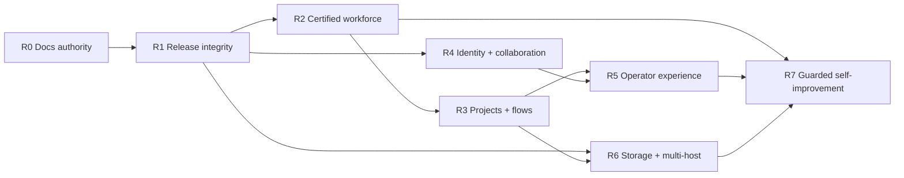

# AIAT Roadmap

**Roadmap baseline:** 2026-08-10
**Last updated:** 2026-08-11
**Programme authority:** [AIAT_TARGET_PROGRAMME.md](AIAT_TARGET_PROGRAMME.md)  
**Current phase:** P0 release integrity

This is the root navigation and delivery-order document for the personal AIAT instance. The target programme defines the system; the feature specifications define each subsystem; the plans below define execution. Historical plans remain useful evidence but do not override this roadmap.

## Current phase snapshot

| Phase | State | Evidence-backed status |
| --- | --- | --- |
| R0 — documentation authority | complete | Canonical target, ten feature specifications, three plans, root navigation, and 19 maintained links pass `check_docs_index.py`; personal/internal metadata-only resource policy is explicit. |
| R1 — P0 release integrity | in progress | Static ledger: 48/48 pass. Current configured live ledger: 55 pass, 0 fail, 9 blocked, 4 pending, `NO-RELEASE` across 64 checks; local runtime benchmark, model-profile, private-network object-store, container runtime-import, network-boundary, and authenticated 39/39 default-worker binding evidence are retained. Native-Linux, trace/tool endpoint configuration, immutable image/SBOM, sandbox, provider/mail, clean-worktree, and selected live evidence remain open. |
| R2–R5 — P1 default programme completion | preparatory implementation | Control-plane, worker, flow, evidence, identity, provider, executive, SDK, and dashboard contracts are substantially implemented and statically tested; the local Compose dashboard suite now passes 34/35 tests (one explicit operator-fixture skip), including a focused 2/2 shell accessibility regression for skip-link and mobile focus recovery, identity stale-record/retry, PM integration conflict/stale retry, project-detail stale/retry, and system-visualization partial/offline retry coverage. Compose also passes the bounded LangGraph/CrewAI adapter lifecycle probe with exact locked package parity (LangGraph `0.6.11`, CrewAI `1.6.1`); native-Linux, workforce, model-backed canary/live-run, sandbox, rollback, and provider certification remain open. |
| R6–R7 — P2 scale and guarded autonomy | partial | Local MinIO conformance and same-provider backup/restore pass; a bounded local `time_now` run now proves project-usage plus `tool_service` native trace read-back; provider-pair migration, model-backed worker/mail-edge coverage, multi-host/Firecracker, optional memory services, and live self-improvement lifecycle remain later work. |

## 1. How to use this documentation

| Need | Read |
| --- | --- |
| Programme vision, architecture laws, minimal/optional stack, consolidated decisions, programme completion | [AIAT Target Programme](AIAT_TARGET_PROGRAMME.md) |
| Current control plane, company, authority, policy, and budget target | [Control Plane and Company](Docs/current/FEATURE_CONTROL_PLANE_AND_COMPANY.md) |
| Worker contract, stewards, tools, models, certification, and runtime target | [Workers, Stewards, Tools, and Models](Docs/current/FEATURE_WORKERS_STEWARDS_AND_MODELS.md) |
| Projects, lifecycle, flow builder/runtime, knowledge, and evidence target | [Projects, Flows, Knowledge, and Evidence](Docs/current/FEATURE_PROJECTS_FLOWS_AND_EVIDENCE.md) |
| Identity, credentials, mail, external accounts, and browser sessions | [Identity, Mail, Credentials, and External Accounts](Docs/current/FEATURE_IDENTITY_MAIL_AND_CREDENTIALS.md) |
| PM/SCM provider model, YouTrack evidence, and GitHub target | [PM and Source-Control Integrations](Docs/current/FEATURE_INTEGRATIONS_PM_AND_SCM.md) |
| Security boundaries, sandbox, observability, recovery, and operations | [Security, Observability, and Operations](Docs/current/FEATURE_SECURITY_OBSERVABILITY_AND_OPERATIONS.md) |
| Trace evidence, sampling metadata, retention, and bounded query contract | [Trace Evidence and Retention](Docs/current/FEATURE_TRACE_EVIDENCE_AND_RETENTION.md) |
| Versioned SLOs, durable usage forecasts, and operational capacity evidence | [SLO, Capacity, and Operational Forecast](Docs/current/FEATURE_SLO_CAPACITY_AND_OPERATIONS.md) |
| Postgres/pgvector/Redis/object storage, retention, and memory services | [Data, Storage, Memory, and Retention](Docs/current/FEATURE_DATA_STORAGE_AND_MEMORY.md) |
| Object-store conformance, copy, backup/restore, and migration workflow | [`object_store_conformance.py`](mas/packages/mas-core/mas_core/memory/object_store_conformance.py), [`object_store_migration.py`](mas/packages/mas-core/mas_core/memory/object_store_migration.py), [`object_store_backup.py`](mas/packages/mas-core/mas_core/memory/object_store_backup.py), [`object_store_rollout.py`](mas/packages/mas-core/mas_core/memory/object_store_rollout.py), [`check_object_store_conformance.py`](mas/scripts/check_object_store_conformance.py), [`check_object_store_copy.py`](mas/scripts/check_object_store_copy.py), [`check_object_store_backup_restore.py`](mas/scripts/check_object_store_backup_restore.py), [`check_object_store_migration.py`](mas/scripts/check_object_store_migration.py), and the local MinIO probes [`check-minio-conformance.sh`](mas/infra/compose/scripts/check-minio-conformance.sh)/[`check-minio-backup-restore.sh`](mas/infra/compose/scripts/check-minio-backup-restore.sh) (`--live` paths included) |
| Dashboard information architecture, CEO UX, accessibility, and E2E | [Dashboard and Operator UX](Docs/current/FEATURE_DASHBOARD_AND_OPERATOR_UX.md) |
| Local dashboard E2E evidence | [`dashboard_e2e_live.json`](mas/docs/provenance/dashboard_e2e_live.json) — 34/35 Playwright tests pass on the WSL2 Compose stack, including skip-link/mobile navigation focus, identity stale-record/retry, PM integration conflict/stale retry, project-detail stale/retry, and system-visualization partial/offline retry coverage; native-Linux and provider-owned paths remain separate gates |
| Tool authority catalogue and adapter boundary | [Tool Catalogue](tools.md) |
| Worker/runtime declaration, persisted-binding reconciliation, and run-lifecycle fixture | [Worker feature specification](Docs/current/FEATURE_WORKERS_STEWARDS_AND_MODELS.md), [`check_worker_reconciliation.py`](mas/scripts/check_worker_reconciliation.py) (static/`--live`), [`check_worker_run_lifecycle.py`](mas/scripts/check_worker_run_lifecycle.py), [`generate_worker_certification_matrix.py`](mas/scripts/generate_worker_certification_matrix.py), [matrix](mas/docs/provenance/worker_certification_matrix.yaml) |
| Default worker implementation binding matrix | [`check_default_worker_bindings.py`](mas/scripts/check_default_worker_bindings.py), [`test_default_worker_bindings.py`](mas/packages/mas-core/tests/test_default_worker_bindings.py), [worker feature specification](Docs/current/FEATURE_WORKERS_STEWARDS_AND_MODELS.md) |
| Default runtime packaging contract | [`check_runtime_install_profile.py`](mas/scripts/check_runtime_install_profile.py), [`pyproject.toml`](mas/apps/orchestrator-api/pyproject.toml), [`uv.lock`](mas/uv.lock), [orchestrator Dockerfile](mas/infra/docker/Dockerfile.orchestrator-api) |
| Optional Microsoft Agent Framework/MCP compatibility | [`runtime_compatibility.yaml`](mas/docs/provenance/runtime_compatibility.yaml), [`maf_compatibility.py`](mas/packages/mas-core/mas_core/worker_registry/maf_compatibility.py), [`check_runtime_compatibility.py`](mas/scripts/check_runtime_compatibility.py) |
| Default worker steward lifecycle contract | [`check_worker_steward_contract.py`](mas/scripts/check_worker_steward_contract.py), [`ExternalWorkerSteward`](mas/packages/mas-core/mas_core/worker_registry/steward.py), [worker matrix](mas/docs/provenance/worker_certification_matrix.yaml) |
| Third-party and production-image metadata/evidence | [Third-party notices](THIRD_PARTY_NOTICES.md), [component provenance](mas/docs/provenance/third_party_components.yaml), [production images](mas/docs/provenance/production_images.yaml), [`check_image_provenance.py`](mas/scripts/check_image_provenance.py) |
| Deterministic API/protocol/dashboard/Python SDK contracts | [API contract artifact](mas/schemas/http/orchestrator.openapi.json), [dashboard types](mas/apps/mas-dashboard/lib/generated/orchestrator-api.ts), [Python SDK](mas/packages/mas-api-sdk/mas_api_sdk/generated.py), [contract provenance](mas/docs/provenance/api_contract.yaml), [`check_api_contract.py`](mas/scripts/check_api_contract.py), [`generate_typescript_api.py`](mas/scripts/generate_typescript_api.py), [`generate_python_api.py`](mas/scripts/generate_python_api.py) |
| Executive model/budget reconciliation and role views | [`aiat.executive-reconciliation.v1` / `aiat.executive-views.v1`](mas/packages/mas-core/mas_core/observability/executive_reconciliation.py), [`/executive/reconciliation`](mas/apps/orchestrator-api/orchestrator_api/main.py), [`/executive/views/{role}`](mas/apps/orchestrator-api/orchestrator_api/main.py), [System Overview](<mas/apps/mas-dashboard/app/(dashboard)/page.tsx>) |
| Executive write actions | [`aiat.executive-action.v1`](mas/apps/orchestrator-api/orchestrator_api/main.py), [`/executive/actions/cfo/model-overrides`](mas/apps/orchestrator-api/orchestrator_api/main.py), [`/executive/actions/cto/worker-runs`](mas/apps/orchestrator-api/orchestrator_api/main.py), [`/executive/actions/ceo/privileged-actions`](mas/apps/orchestrator-api/orchestrator_api/main.py), [dashboard proxies](mas/apps/mas-dashboard/app/api/executive/actions/) |
| CEO evidence envelope and citation route | [`aiat.ceo-evidence.v1`](mas/apps/orchestrator-api/orchestrator_api/main.py), [CEO chat](<mas/apps/mas-dashboard/app/(dashboard)/ceo/chat/page.tsx>), [dedicated evidence record](<mas/apps/mas-dashboard/app/(dashboard)/evidence/[kind]/[id]/page.tsx>), [`test_ceo_chat.py`](mas/apps/orchestrator-api/tests/test_ceo_chat.py) |
| External-account action policy fixture | [`aiat.external-account-action-policy.v1`](mas/apps/identity-service/identity_service/external_accounts/service.py), [`check_external_account_action_policy.py`](mas/scripts/check_external_account_action_policy.py), [`test_external_account_action_policy.py`](mas/packages/mas-core/tests/test_external_account_action_policy.py) |
| External-account lifecycle fixture | [`aiat.external-account-lifecycle.v1`](mas/scripts/check_external_account_lifecycle.py), [`check_external_account_lifecycle.py`](mas/scripts/check_external_account_lifecycle.py), [`test_external_account_lifecycle.py`](mas/packages/mas-core/tests/test_external_account_lifecycle.py) |
| Outbound-mail lifecycle fixture | [`aiat.outbound-mail-lifecycle.v1`](mas/scripts/check_outbound_mail_lifecycle.py), [`check_outbound_mail_lifecycle.py`](mas/scripts/check_outbound_mail_lifecycle.py), [`test_outbound_mail_lifecycle.py`](mas/packages/mas-core/tests/test_outbound_mail_lifecycle.py) |
| Built-in PM/SCM adapter declarations | [`aiat.provider-adapter-declarations.v1`](mas/scripts/check_provider_adapter_declarations.py), [`check_provider_adapter_declarations.py`](mas/scripts/check_provider_adapter_declarations.py), [`test_provider_adapter_declarations.py`](mas/packages/mas-core/tests/test_provider_adapter_declarations.py) |
| Built-in PM/SCM mocked HTTP conformance | [`aiat.provider-adapter-http-conformance.v1`](mas/scripts/check_provider_adapter_http_conformance.py), [`check_provider_adapter_http_conformance.py`](mas/scripts/check_provider_adapter_http_conformance.py), [`test_provider_adapter_http_conformance.py`](mas/packages/mas-core/tests/test_provider_adapter_http_conformance.py) |
| Prompt/tool reconciliation and governed review/privileged adapters | [`check_prompt_tool_reconciliation.py`](mas/scripts/check_prompt_tool_reconciliation.py), [`mas/prompts/`](mas/prompts/), [`review.submit`](mas/apps/tool-service/tool_service/tools/project.py), [`privileged_ops.request`](mas/apps/tool-service/tool_service/tools/project.py) |
| Versioned flow-node schemas and evidence policies | [`generate_flow_node_schemas.py`](mas/scripts/generate_flow_node_schemas.py), [node schema artifact](mas/schemas/workflow/flow_nodes.v1.json), [`/flows/node-schemas`](mas/apps/orchestrator-api/orchestrator_api/main.py), [`/evidence-policies`](mas/apps/orchestrator-api/orchestrator_api/main.py) |
| Evidence-policy scope resolution fixture | [`resolve_evidence_policy_selection`](mas/packages/mas-core/mas_core/workflow/evidence.py), [`check_evidence_policy_resolution.py`](mas/scripts/check_evidence_policy_resolution.py), [`test_evidence_policy_resolution.py`](mas/packages/mas-core/tests/test_evidence_policy_resolution.py) |
| Project evidence package fixture | [`check_project_evidence_package.py`](mas/scripts/check_project_evidence_package.py), [`aiat.project-evidence-package.v1`](mas/packages/mas-core/mas_core/workflow/evidence.py) |
| Governed asynchronous flow-task binding | [`worker_binding.py`](mas/packages/mas-core/mas_core/workflow/worker_binding.py), [`check_flow_worker_binding.py`](mas/scripts/check_flow_worker_binding.py), [`test_flow_worker_binding.py`](mas/packages/mas-core/tests/test_flow_worker_binding.py), and the governed `flow_node_action` route |
| Request/message trace propagation | [`propagate_trace_context`](mas/apps/orchestrator-api/orchestrator_api/main.py), [`propagate_trace_context`](mas/apps/message-router/message_router/main.py), [`propagate_trace_context`](mas/apps/tool-service/tool_service/main.py), [`AgentBase._dispatch`](mas/packages/mas-core/mas_core/agent_runtime/base.py), [API test](mas/apps/orchestrator-api/tests/test_trace_propagation.py), [router test](mas/apps/message-router/tests/test_trace_propagation.py), [tool test](mas/apps/tool-service/tests/test_trace_propagation.py), [agent/SDK tests](mas/packages/mas-core/tests/test_phase4_5.py) |
| Cross-service trace evidence and retention planning | [`aiat.trace-evidence.v1`](mas/packages/mas-core/mas_core/observability/trace_evidence.py), [`aiat.native-trace-span.v1`](mas/packages/mas-core/mas_core/observability/native_spans.py), [`aiat.trace-retention-plan.v1`](mas/packages/mas-core/mas_core/observability/retention.py), [`/observability/traces/{trace_id}`](mas/apps/orchestrator-api/orchestrator_api/main.py), signed identity delivery-attempt correlation [`identity_client.py`](mas/apps/orchestrator-api/orchestrator_api/identity_client.py), [`check_trace_evidence.py`](mas/scripts/check_trace_evidence.py), [`check_live_trace_observability.py`](mas/scripts/check_live_trace_observability.py), [`check_native_trace_spans.py`](mas/scripts/check_native_trace_spans.py), [`check_trace_retention.py`](mas/scripts/check_trace_retention.py), [`check_api_observability.py`](mas/scripts/check_api_observability.py), [local live transport evidence](mas/docs/provenance/trace_observability_live.json), [trace evidence tests](mas/packages/mas-core/tests/test_trace_evidence.py) |
| SLO and capacity forecast read models | [`aiat.slo-policy.v1` / `aiat.slo-report.v1` / `aiat.capacity-forecast.v1`](mas/packages/mas-core/mas_core/observability/slo.py), [`/observability/slo`](mas/apps/orchestrator-api/orchestrator_api/main.py), [`/observability/capacity/forecast`](mas/apps/orchestrator-api/orchestrator_api/main.py), [`check_slo_capacity.py`](mas/scripts/check_slo_capacity.py), signed identity mail projection [`identity_client.py`](mas/apps/orchestrator-api/orchestrator_api/identity_client.py) |
| Immediate release-truth and security work | [P0 Release Integrity Plan](Docs/current/plans/P0_RELEASE_INTEGRITY_PLAN.md) |
| Current P0 implementation evidence and open gates | [P0 Release Integrity Status](Docs/current/P0_RELEASE_INTEGRITY_STATUS.md) |
| Current implementation/release evidence ledger | [AIAT Current Release Ledger](mas/docs/AIAT_CURRENT_RELEASE_LEDGER.md) |
| Machine-readable release evidence aggregation | [`check_release_ledger.py`](mas/scripts/check_release_ledger.py), [`check_release_environment.py`](mas/scripts/check_release_environment.py), [`check_operator_pins.py`](mas/scripts/check_operator_pins.py), [`check_metric_series_budget.py`](mas/scripts/check_metric_series_budget.py), [`check_docs_index.py`](mas/scripts/check_docs_index.py), [release-ledger inventory](mas/docs/provenance/release_ledger.yaml) |
| Guarded self-improvement candidate detection | [`aiat.self-improvement-candidate-detection.v1`](mas/packages/mas-core/mas_core/workflow/improvement_candidates.py), [`check_self_improvement_candidates.py`](mas/scripts/check_self_improvement_candidates.py), [`test_improvement_candidates.py`](mas/packages/mas-core/tests/test_improvement_candidates.py) |
| Native-Linux P0 exit procedure | [P0 Native-Linux Exit Runbook](mas/docs/P0_NATIVE_LINUX_EXIT_RUNBOOK.md) |
| Complete the default personal-instance experience | [P1 Default Programme Completion Plan](Docs/current/plans/P1_DEFAULT_PRODUCT_COMPLETION_PLAN.md) |
| Scale, storage migration, optional services, and self-improvement | [P2 Scale, Storage, and Guarded Autonomy Plan](Docs/current/plans/P2_SCALE_STORAGE_AND_AUTONOMY_PLAN.md) |

## 2. Delivery principles

1. Harden and complete what exists before replacing it.
2. Code, schemas, manifests, source/version provenance, and evidence must agree; licence data is informational metadata and never an activation gate.
3. AIAT remains the sole control plane; integrations remain adapters/projections.
4. Governance shells remain AIAT-owned; specialist execution remains adapter-backed.
5. Missing or contradictory mandatory evidence blocks activation.
6. Human-only actions are never simulated to obtain certification.
7. No open Critical defect ships.
8. A roadmap item is complete only when its acceptance evidence is durable and current.

## 3. Current implementation baseline

The codebase already includes:

- custom orchestrator, router, tool service, dashboard, team runners, identity service, and PM gateway;
- versioned company manifests, 11 authority/manager teams, budgets, permissions, and org graph;
- 39 non-placeholder worker manifests plus two placeholders;
- universal `aiat.worker.v1`, worker-run controller, stewards, candidates, certification, compatibility matrices, canary, rollback, and a deterministic controller lifecycle fixture;
- visual flows with nine node types and durable instances/executions;
- project/document/review/approval/sprint/issue/KPI/context/evidence workspaces;
- LiteLLM/OmniRoute gateway and analytics paths;
- a target-specific monitoring adapter that emits a bounded LiteLLM/OmniRoute
  analytics plan while keeping Prometheus-compatible output optional;
- identity/mail/external-account/browser-session and credential boundaries;
- provider-neutral PM/SCM control plane with YouTrack live READ_ONLY evidence;
- Postgres/pgvector, Redis Streams/cache, MinIO, DLQ/recovery, and extensive tests.
- provider-neutral `aiat.object-store-conformance.v1` fixture and deterministic
  offline report for scoped artifact integrity and isolation;
- canonical runtime catalogue plus CI reconciliation for all 39 worker manifests,
  default-company references, OpenCode Compose/version links, provenance, and
  metadata-only notices.
- the authenticated local Compose worker reconciliation now matches all 39
  persisted default-worker rows with zero missing rows or binding mismatches;
  the cleanup fixture no longer deletes the canonical `test_evaluation_worker`,
  and the container default-company manifest bootstrap now resolves both source
  and image layouts. Evidence: [`worker_reconciliation_live.json`](mas/docs/provenance/worker_reconciliation_live.json).
- default worker manifests expose normally selectable scanner, PM-provider, and
  DevOps adapters (including TruffleHog, Plane/OpenProject, and Ansible);
  starting profiles are technical packaging choices and no licence-derived
  exclusion remains.
- the bounded `security.scan` adapter now supports `semgrep`, `skillspector`,
  and `trufflehog` aliases through the configured sandbox process, with output
  limits and the same audit/grant/rate/approval controls as the existing
  scanner path.
- `document.ingest` uses Docling through the optional extensions profile when
  installed and returns an explicit, usable degraded `plain_text_fallback`
  result otherwise; missing Docling is not treated as a tool or licence gate.
- typed company policy values are projected into runner prompt timestamps,
  schedule defaults, clock-tool responses, dashboard display, and Compose
  environment defaults; durable records remain UTC.
- the generated dashboard and Python SDK contract surfaces both contain 129
  models and 266 operation records tied to the same OpenAPI/provenance hash;
  the three role-scoped executive action routes are included in that export.
- the 11 shipped authority/manager prompts resolve only concrete, policy-allowed
  tools; review submissions publish canonical `REVIEW_RESPONSE` envelopes and
  privileged CEO requests use the audited control-plane route.
- the checked-in worker matrix covers all 39 manifests and distinguishes
  declaration, security evidence, runtime dependencies, and live-certification
  work without turning licence metadata into a gate.
- `scripts/check_default_worker_bindings.py --json` reconciles the 15 documented
  default worker slots with their department, runtime tier, transport,
  isolation, runtime-catalogue support pair, capability, adapter configuration,
  runtime/integration adapter entrypoints, and required tools. It is a
  deterministic implementation-coherence check; it does not claim installed
  runtimes, security/canary/live-run evidence, and licence metadata remains
  informational only.
- certification persistence now records steward-owned compatibility matrices
  alongside the candidate/certification evidence; the domain fixture covers
  both externally sourced default workers without claiming live certification.
  The steward fixture now also blocks a regressing replacement and preserves
  the active immutable pointers when rollback happens before activation; its
  report is [`worker_steward_contract.json`](mas/docs/provenance/worker_steward_contract.json).
- `scripts/check_release_ledger.py --json` now aggregates the checked-in
  static/contract/recovery verifiers into `aiat.release-ledger.v1`; its live
  profile preserves current network failures and externally blocked evidence,
  and never changes the release decision to pass while scans, live gates, or a
  clean worktree are missing.
- The release ledger bounds every child verifier with a capped timeout
  (`AIAT_RELEASE_CHECK_TIMEOUT_SECONDS`, default 60 seconds for live checks);
  timed-out live probes are recorded as `blocked`, keeping aggregate evidence
  finite without treating unavailable infrastructure as a pass.
- `scripts/check_docs_index.py --json` verifies the maintained target,
  ten-feature/three-plan set, local Markdown links, roadmap references, and the
  personal/internal metadata-only policy; CI and the release ledger fail on
  documentation drift.
- `scripts/check_runtime_install_profile.py --json` reconciles the default
  LangGraph/CrewAI dependency extra, locked versions, runtime-catalogue imports,
  and production Dockerfile install command; it is packaging evidence only and
  does not replace runtime, security, sandbox, canary, or live-run proof.
- `scripts/check_operator_pins.py --json` verifies exact production image
  runtime/CLI declarations and records explicit unavailable reasons for
  host-, optional-, and deployment-supplied capabilities. It is a technical
  reproducibility check and does not inspect or gate OSS licence metadata.
- `scripts/check_worker_steward_contract.py --json` runs the actual steward
  domain through immutable candidate, compatibility-matrix, staged-rollout,
  regression blocking, and pre-activation rollback transitions for every
  externally sourced default worker; its domain fixture does not claim
  persisted database or live worker evidence.
- API steward rehydration restores durable active bundle/adapter pointers and
  fails closed on unknown IDs, keeping restart-time rollback state coherent;
  this is persistence/cache evidence, not live worker certification.
- bounded HTTP trace propagation is implemented in the orchestrator API,
  message router, and tool service with safe incoming-header handling,
  orchestrator/SDK/RouterClient forwarding, response correlation, agent
  message-handler context cleanup, and async-context cleanup; durable native
  core spans now cover transport/model/tool/audit/worker/integration writers,
  while full mail-edge span retention/query evidence is still a P2/live concern.
  The
  operator-only trace-evidence projection now joins task logs, project-usage
  events, durable API request observations, worker-run transition correlations,
  direct trace-correlated model-usage/worker-artifact/integration-evidence
  metadata (with legacy run fallback), PM inbound correlations, and durable
  native transport/model/tool/audit/worker/integration spans, with manifest
  trace sampling/retention metadata, optional safe identity delivery-attempt
  mail spans, and explicit provider mail-edge partial-span notices.
- Versioned descriptive SLO targets and bounded durable-usage cost/token
  forecasts are implemented through operator-only read routes. The
  payload-free API request ledger now feeds the platform `orchestrator_api`
  target, and the signed identity-service delivery-attempt projection can feed
  `mail_delivery` when configured; missing native mail/full-span service
  sources remain explicit `no_data` rather than a false pass.
- The metric-series verifier now emits a complete AIAT label inventory and
  bounded-cardinality policy for every `mas_*` family, rejecting unknown or
  non-bounded labels in the static fixture. Its live parser folds the
  Prometheus histogram `_created` sample into the declared family, and the
  current local scrape passes at 31 bounded series; native many-project scrape
  evidence remains open.
- `scripts/check_release_environment.py` emits a secret-safe
  `aiat.release-environment.v1` manifest with thirteen release-input hashes,
  tool-version identities, environment-presence flags, and a deterministic
  digest; dirty/frozen-worktree state remains explicit release evidence.

This roadmap therefore starts with integrity and certification gaps rather than another architecture rewrite.

## 4. Milestones

### R0 — documentation authority established

**Status:** complete in this documentation change

- One normative target programme.
- Ten current feature specifications.
- Three ordered delivery plans.
- Root roadmap linking the maintained set.
- Repository-checked documentation index and metadata-policy markers.
- Historical documents retained and explicitly consolidated/superseded by decision.

### R1 — release integrity

**Plan:** [P0 Release Integrity](Docs/current/plans/P0_RELEASE_INTEGRITY_PLAN.md)  
**Status:** in progress — metadata-only policy, shared certification checks,
scan-state/findings reconciliation, static worker/runtime/provenance
reconciliation, bounded metric label inventory, persisted CEO/service section
ACLs, immutable image-input contract, fail-closed local image identity probe,
tool-service profile split, and read-only persisted default-worker binding
reconciliation implemented; native/live/release gates remain
open

Required outcomes:

- [x] licence and redistribution fields are metadata-only in code and cannot block discovery, installation, hiring, activation, rollout, updating, or execution;
- [x] the historical `LICENSE_REVIEW` label is optional metadata capture; the normal source-review path can continue directly to technical security review;
- [x] worker certification/provenance records use a shared operational predicate;
- [x] coding/tester scan-state contradiction is closed; exact-source Semgrep
  evidence is recorded as findings-review-required and activation remains blocked;
- [x] CEO and human operator identities have tested API section separation; native-Linux network/UI evidence remains open;
- [x] all checked-in worker manifests reconcile with the runtime catalogue, default company references, Compose/OpenCode link, provenance inventory, and metadata-only notices; authenticated local read-only `--live` reconciliation now matches 39/39 persisted `/capabilities/workers` defaults with zero missing rows or binding mismatches; live default-runtime certification remains open;
- [x] deployed team runners use the authenticated control-plane storage API for checkpoints, usage, documents, and COO review persistence without PgBouncer/MinIO/shared-service credentials or private data-plane network membership; checkpoint access is team-scoped, OpenCode is off the runner network, and startup fails closed when storage health is unavailable; the refreshed local WSL2 matrix passes for all 11 runners and is retained at [`provenance/network_boundary_live.json`](mas/docs/provenance/network_boundary_live.json), while native denial/allow evidence remains open;
- [x] production Compose fixed references and Dockerfile bases are digest-pinned or require deployment-supplied immutable `*_IMAGE_REF` values; the fail-closed `check_image_provenance.py --live --json` probe compares local `RepoDigests` when Docker/configuration is available; SBOM/clean-build/scan reconciliation remains open;
- team runners are live-proven unable to reach Redis/Postgres/object storage/provider endpoints directly on the refreshed local Linux engine; native-Linux release-host evidence remains open;
- production images and runtimes are live-reconciled against their provenance/SBOM;
- [x] raw project IDs are removed from metric labels and every AIAT label has a
  declared bounded-cardinality policy; the current local scrape passes at 31
  bounded series after histogram `_created` normalization; native many-project
  scrape evidence remains open;
- [x] heavyweight tool image is split or reduced within explicit budgets; [x] local Linux engine measurements pass for both profiles (core 267,957,904 bytes, 26,836 ms/112.3 MiB; extensions 4,155,668,123 bytes, 29,913 ms/137.7 MiB) with retained evidence; clean native-Linux build/pull, compressed archive, SBOM, and vulnerability measurements remain open;
- [x] production runtime/CLI declarations are exact in the operator-pin
  manifest, while host-, optional-, and deployment-supplied capabilities are
  explicitly unavailable until identified; native/live certification remains
  open;
- [x] a current progress/release ledger and secret-safe environment manifest
  replace reliance on the July snapshot; final frozen release certification
  remains open.

**Exit:** no Critical defects and every P0 gate has current reproducible evidence.

### R2 — certified default workforce

**Plan:** [P1 Default Programme Completion](Docs/current/plans/P1_DEFAULT_PRODUCT_COMPLETION_PLAN.md)  
**Depends on:** R1
**Status:** pending until R1/P0 exit; deterministic OpenAPI/protocol/dashboard/Python SDK contract exports and CI verification are preparatory work only

**Progress:** checked-in worker/runtime declarations and a deterministic 39-row certification matrix are reconciled; the new `scripts/check_default_worker_bindings.py --json` contract also reconciles all 15 documented default worker slots with their intended runtime, adapter, transport, isolation, capability, and tool bindings; the shared universal conformance suite now exercises native, LangGraph, and CrewAI bridge adapters; the Microsoft Agent Framework adapter has a deterministic fake-module compatibility fixture with fail-closed package/instructions paths plus an exact `agent-framework==1.13.0`/MCP `>=1.27,<2` lock and preflight; the current workspace MCP `1.23.3` and missing optional MAF package are surfaced as activation blockers; code review now defaults to the credential-free AIAT diff reviewer and records generic external candidates in a fail-closed exact-pin catalogue; `scripts/check_worker_runtime_readiness.py --live --json --compose-local` now probes the running orchestrator image and confirms required LangGraph/CrewAI imports without certifying workers; `scripts/check_runtime_install_profile.py` reconciles the default LangGraph/CrewAI extra, `uv.lock`, runtime-catalogue imports, and production Dockerfile install command; `scripts/check_worker_steward_contract.py` runs the real steward domain through candidate, compatibility-matrix, staged rollout, and rollback transitions for both externally sourced default workers; certification records compatibility evidence in the same-process steward cache and durable store, while API restart rehydrates persisted rows with profile/capability-shape normalization; `scripts/check_sandbox_runtime_readiness.py` reconciles sandbox declarations with a fail-closed Docker `runsc` registration probe; and the bounded `scripts/check_runtime_benchmarks.py --live --json` probe now sends valid deterministic configs, runs package imports off-loop, and passed both LangGraph and CrewAI in the retained [`runtime_benchmarks_live.json`](mas/docs/provenance/runtime_benchmarks_live.json) report. The deterministic `scripts/check_worker_run_lifecycle.py --json` fixture now exercises the real controller through checkpoint persistence, pause/resume, cold cancellation, cold-crash failure normalization, lease-expiry requeue, and artifact/usage-before-terminal ordering; its explicit `--live` boundary remains blocked until an operator selects a project, worker, budget, sandbox, and recovery window. Optional MAF installation/canary, external review-adapter pins, gVisor smoke/network, live worker-run, and rollback evidence remain open.
The authenticated local `scripts/check_runtime_benchmarks.py --live --json`
probe now passes deterministic LangGraph/CrewAI dependency dry-runs; the
retained report is [`runtime_benchmarks_live.json`](mas/docs/provenance/runtime_benchmarks_live.json).
This remains package benchmark evidence only and does not certify a worker
canary, project run, sandbox, or rollback.

The new `scripts/check_runtime_adapter_conformance.py --live --json` probe
passes both actual framework adapter classes in Compose (LangGraph `0.6.11`,
CrewAI `1.6.1`) with exact lock parity for bounded no-model
lifecycle/message translation. Representative model-backed canaries, sandbox,
live worker-run, and rollback evidence remain open.

The document adapter also has a coherent local fallback contract: the optional
Docling extension is used when present, while the core profile returns usable
plain text with an explicit degraded/backend reason when it is absent. This is
not external Docling certification; installation and live adapter evidence
remain part of the open R2 work.
The bounded security adapter also exposes tested `semgrep`, `skillspector`, and
`trufflehog` compatibility aliases;
provider-specific PM/DevOps adapters still need their own conformance evidence.

Required outcomes:

- [x] Compose package/lifecycle and exact lock-parity conformance is recorded
  for the LangGraph and CrewAI adapters at
  [`runtime_adapter_conformance_live.json`](mas/docs/provenance/runtime_adapter_conformance_live.json)
  (LangGraph `0.6.11`, CrewAI `1.6.1`); representative model-backed canaries,
  sandbox, live-run, and rollback certification remain open.
- [x] sandbox declarations require hardened profiles for external workers and
  have a fail-closed `runsc` registration verifier; host smoke/network and
  Firecracker proof remain live evidence;
- [x] read-only orchestrator runtime benchmark probe sends valid deterministic
  configs, keeps third-party imports off-loop with a bounded timeout, classifies
  unavailable evidence as blocked, and retains a live LangGraph/CrewAI pass;
  dependency dry-runs do not count as worker canaries or live project runs;
- [x] Microsoft Agent Framework has an exact lock and fail-closed preflight;
  optional installation, MCP upgrade, canary, and live activation remain open;
- [x] Code review has a deterministic local default and exact-pin catalogue;
  external candidate source/revision/version evidence remains open;
- OpenCode coding/testing fully coherent; OpenHands core remains optional;
- document, planning, research, review, security, DevOps, and SRE adapters certified;
- each external worker has a dedicated steward, immutable candidate,
  compatibility matrix, deterministic canary/regression-block/rollback domain
  evidence, and a separate open live-certification gate;
- [x] deterministic controller fixture covers pause/cancel/checkpoint/lease/artifact ordering; live worker-run, database, sandbox, canary, and rollback semantics remain open.
- [x] deterministic default-worker binding matrix reconciles all 15 documented
  worker slots with implementation declarations and runtime/integration
  adapter entrypoints; installed runtime, adapter conformance, canary, live-run,
  and rollback evidence remain separate.
- pause/cancel/checkpoint/lease/crash/artifact/usage semantics proven live.

### R3 — complete project and flow execution

**Plan:** [P1 Default Programme Completion](Docs/current/plans/P1_DEFAULT_PRODUCT_COMPLETION_PLAN.md)  
**Depends on:** R2 for real worker task nodes

Project-detail refresh failures are covered by the existing project workspace golden path: canonical project data remains visible, the page labels it stale, and an operator can retry without losing workspace context.

**Progress:** versioned node-schema validation/export, generated dashboard schema metadata and editable node forms, evidence-policy catalogue, required-artifact-kind checks, company/project/milestone/flow policy persistence and resolution, complete operator evidence dry-run inputs, the deterministic `resolve_evidence_policy_selection` precedence contract and `aiat.evidence-policy-resolution-check.v1` fixture, the consolidated `aiat.project-evidence-package.v1` repository/test/security/deployment/cost read model plus operator-only durable snapshot, deterministic flow lifecycle endpoints, evidence-preserving compatible instance migration, explicitly mapped active-node graph rewrites, six validated reusable templates, dashboard consumption of the canonical template catalogue, exactly-once terminal-issue-to-agent-profile learning, a durable `sprint_retrospective` KPI snapshot with source issue/profile lineage, deterministic dry-run auditing of legacy task aliases, operator-approved immutable saved-definition worker migration, static parallel/join/switch topology validation, deterministic real traversal semantics for fan-out/join/switch execution, asynchronous governed task binding, governed safe-retry re-dispatch, non-destructive retry evidence preservation in both recorded-safe-node and no-safe-node fallback paths, deterministic watchdog/recovery semantics, and a local Compose UI golden path are implemented. The traversal engine now prevents duplicate join scheduling and completed-join reactivation; `aiat.flow-worker-binding.v1` keeps queued/running task nodes active until terminal Worker Run evidence and the retry endpoint re-enters the same path for restored governed tasks, while prior node executions are retained as `SUPERSEDED`; `aiat.workflow-watchdog-recovery.v1` covers boot grace, downtime-aware timeout, failure transition, safe retry, and terminal exclusion; `scripts/check_flow_instance_recovery.py` still provides read-only/explicit-confirmation instance action evidence. The current Playwright run passes 34/35 local tests, including skip-link/mobile shell focus, identity stale-record/retry, PM integration conflict/stale retry, and system-visualization partial/offline retry coverage (the DLQ fixture is explicitly skipped); live worker recovery, native-Linux UI, and provider-owned golden paths remain open.

Required outcomes:

- versioned node schemas and generated dashboard schema metadata/editable forms (legacy compatibility aliases remain collapsed);
- published flow versions, diff/import/export, and migration policy (publish/deprecate/diff/import/export, compatible active-node migration, and bounded explicitly mapped graph rewrites are implemented);
- task nodes exclusively use universal governed worker runs; dry-run reports legacy aliases and required concrete worker bindings, and `POST /flows/{flow_id}/migrate-legacy-tasks` creates an immutable worker-bound version with `aiat.flow-legacy-task-migration.v1` evidence; live canary/recovery remains;
- [x] evidence policies enforce milestone completeness through explicit project-milestone → project → flow → company-milestone → company → manual precedence and core checks; `aiat.evidence-policy-resolution-check.v1` covers every scope without using licence metadata, while live transition/recovery proof remains;
- [x] consolidated evidence-package read and operator snapshot views group repository, test, security, deployment, cost, approval, flow, worker, artifact, and audit sources without adding a second completion authority; live provider/worker generation remains;
- [x] flow-instance recovery status/history and explicit-confirmation action
  evidence has a fail-closed helper; full project and live worker recovery
  proof remain;
- [x] parallel branch declarations, join fan-in, and switch case targets are
  reconciled with persisted edges by `aiat.flow-topology-check.v1`; live
  fan-out/join, watchdog, and crash/recovery proof remain;
- [x] real traversal semantics are covered by `aiat.flow-execution-semantics.v1`:
  branch fan-out, one-branch join waiting, exactly-once join scheduling,
  selected switch routing, and unknown-case blocking; live fan-out/join,
  watchdog, and crash/recovery proof remain;
- [x] governed asynchronous task binding is covered by
  `aiat.flow-worker-binding.v1`: queued/claimed/running runs keep their node
  active, terminal runs are the only settlement authority, parallel bindings
  are preserved copy-on-write, safe retry re-enters governed dispatch, and
  unknown states fail closed; live canary and recovery proof remain;
- [x] flow retry preserves prior node executions as `SUPERSEDED` evidence and
  makes the new retry attempt the only traversal authority; live database and
  failure/recovery proof remain;
- [x] deterministic watchdog/recovery semantics are covered by
  `aiat.workflow-watchdog-recovery.v1`: boot grace, downtime-aware timeout,
  watchdog failure, recorded-safe-state retry, and terminal-state exclusion;
  native watchdog/cold-crash proof remains;
- first terminal issue completion observations update durable agent profiles exactly once; terminal transitions also persist sprint-level KPI aggregates with source issue/profile lineage, while live transition/recovery proof remains;
- parallel/join, switch, escalation, timeout, cancellation, watchdog, cold crash, and safe retry pass live;
- one complete software-delivery project succeeds from UI and API, including archive and evidence.

### R4 — certified identity and collaboration edge

**Plan:** [P1 Default Programme Completion](Docs/current/plans/P1_DEFAULT_PRODUCT_COMPLETION_PLAN.md)  
**Can overlap:** R2/R3 after R1 security gates

**Progress:** identity-service action policy `aiat.external-account-action-policy.v1` and the real-service `aiat.external-account-lifecycle.v1` in-memory fixture are implemented; category-sensitive signup, credential-rotation approval, closure approval, immediate suspension, governed browser-session rules, one-use leases, session revocation, idempotency, and fail-closed unknown categories are explicit. The deterministic `aiat.external-account-action-policy-check.v1` fixture reconciles all five actions and four category dispositions without creating identity or provider state. The real-service `aiat.outbound-mail-lifecycle.v1` fixture now proves approval pause, request/submission idempotency, definitive-failure retry, ambiguous-outage reconciliation hold, and secret-safe output with no external relay calls. The reusable `aiat.provider-conformance.v1` PM/SCM fixture runner, reproducible `scripts/check_provider_conformance.py` CLI, shared rate-limit/stale-revision/outage/permission-loss classifier, `aiat.provider-adapter-declarations.v1` real YouTrack/GitHub capability/readiness fixture, and `aiat.provider-adapter-http-conformance.v1` local mocked HTTP fixture are implemented and pass without external provider HTTP calls. Production mail, provider-specific live mutation, and outage/restore certification remain open.

Required outcomes:

- chosen direct or SMTP-gateway mail topology certified with DNS/TLS/send/receive/bounce/outage/restore evidence;
- key rotation and domain migration rehearsed;
- YouTrack mapped-human ACTIVE command certified without synthetic substitution;
- GitHub App branch/PR/review/check/commit/run-credential and webhook/reconciliation paths certified;
- provider conformance fixtures cover pagination, idempotent projection, archive/deactivation, renamed fields, rate limits, stale revisions, partial outage, and permission loss;
- [x] real built-in YouTrack/GitHub adapter declarations are reconciled across
  all supported capability profiles and bounded identifier helpers without
  provider HTTP calls; provider-specific mock/live execution remains separate;
- [x] real built-in YouTrack/GitHub adapter methods pass deterministic mocked
  HTTP conformance for health/configuration, projection/read-back, cursors,
  deactivation, comments/links, GitHub source-control paths, webhook handling,
  and retryable/permanent failure propagation; live account/outage/restore
  certification remains separate;
- [x] deterministic provider fixture CLI reports machine-readable evidence and
  explicitly blocks unscoped live mode; provider-specific mock/live mutation,
  outage, and restore certification remain;
- [x] external-account high-risk actions pause for human policy; `aiat.external-account-action-policy-check.v1` covers category-sensitive signup, always-approved rotation/closure gates, immediate suspension, governed browser sessions, and fail-closed unknown inputs without using licence metadata (provider-specific live conformance remains).
- [x] the real identity service lifecycle fixture covers category approval,
  signup idempotency, one-use browser leases, rotation/session revocation,
  immediate suspension, closure approval/revocation, and secret-safe output;
  live provider/browser/outage/restore evidence remains separate.
- [x] the real identity service outbound-mail fixture covers approval pause,
  request/submission idempotency, definitive provider-failure retry,
  ambiguous-outage reconciliation hold, and secret-safe output without an
  external relay call; live send/receive/bounce/outage/restore evidence
  remains separate.

### R5 — production operator experience

**Plan:** [P1 Default Programme Completion](Docs/current/plans/P1_DEFAULT_PRODUCT_COMPLETION_PLAN.md)  
**Depends on:** stable contracts from R2/R3/R4

**Progress:** role-scoped CFO model-override requests, CTO governed worker
dispatch, and CEO privileged-action requests now use the canonical write
services behind the secret-safe `aiat.executive-action.v1` envelope. The
dashboard exposes operator-authenticated proxies and a typed confirmation panel
for each route. Local live catalogue evidence observes 92 approved covered
profile versions out of 94 persisted versions, with one pending registered
model and two non-registered profile findings; provider-specific live recovery,
broader governance forms, and broader chaos/live evidence remain open.
The checked-in `opencode-phase0b-coding` profile now has an idempotent,
conflict-preserving startup/default-seed bootstrap bound to the current
`omniroute-coding` LiteLLM alias, and the same declaration path covers all 93
registered model identities; the current environment has bounded live database
profile evidence with the findings recorded above. `scripts/check_executive_reconciliation.py --live
--json` now provides a secret-safe canonical DB/API reconciliation probe with
optional finding-free enforcement. The authenticated local dashboard suite now
passes 34/35 Playwright tests, including project workspace creation, CEO hiring
context, schema-driven flow editing, all eight branching/recovery scenarios,
credential/tools/worker operations, PM integration conflict/stale retry,
runtime-status panels, shell skip-link/mobile focus recovery,
identity stale-record/retry state, and system-visualization partial/offline
retry states; the
secret-safe result is retained at
[`mas/docs/provenance/dashboard_e2e_live.json`](mas/docs/provenance/dashboard_e2e_live.json).
Native-Linux accessibility/mobile/visual certification and operator-owned
provider/mail paths remain open. The existing project workspace test also
retains project-detail state on refresh failure and exposes stale/retry copy.

Required outcomes:

- modular control-plane internals with unchanged public authority;
- [x] secret-safe live executive reconciliation probe with optional
  finding-free release enforcement; live DB population/provider recovery
  remains environment work;
- [x] generated dashboard/Python SDK types and compatible schemas; external
  client-language SDKs remain optional;
- [x] API-owned CEO actions and read responses carry secret-safe
  `aiat.ceo-evidence.v1` references and traces in both synchronous and streamed
  responses; the chat renders them, links bounded project/flow/governance/
  worker/credential/integration/tool/project-evidence/log kinds, and exposes a
  dedicated evidence-record route. Artifact, integration, model, runtime, tool,
  usage, worker-run, and trace IDs are citation-only and payload-free. Legacy
  fallback output accepts only explicit stripped `AIAT_EVIDENCE` markers and
  labels those citations `unverified`; complete governed-flow coverage and
  resource-specific detail loading remain;
- model profile, routing, cost, and budget records reconcile (focused override-expiry, terminal-settlement replay, explicit LLM transient-status classification, persisted model/provider cooldown filtering, deterministic runtime/profile catalogue export/reconciliation, fail-closed `--live` catalogue and executive reconciliation verifiers with explicit approval/finding gates, an idempotent conflict-preserving bootstrap for the shipped `opencode-phase0b-coding` profile, all 93 registered model identities, and the `omniroute-coding` alias, bounded `aiat.executive-reconciliation.v1` reporting, `aiat.executive-views.v1` role projections, dedicated read-only `/executive/views/{role}` endpoints, and reservation/settlement invariant auditing now pass); local live evidence covers 92 approved profile versions out of 94 persisted versions, while one pending registered model and two non-registered rows remain findings; role-scoped `aiat.executive-action.v1` CFO/CTO/CEO write routes, dashboard proxies, and the typed confirmation panel are implemented, while provider-specific live recovery, broader governance forms, and broader chaos/live evidence remain;
- mobile, themes, WCAG 2.2 AA, stale/conflict/rollback states, and evidence deep links complete;
- native-Linux Playwright golden paths pass.

### R6 — storage and multi-host scale

**Plan:** [P2 Scale, Storage, and Guarded Autonomy](Docs/current/plans/P2_SCALE_STORAGE_AND_AUTONOMY_PLAN.md)  
**Depends on:** R1 release controls and R3 evidence model

**Progress:** the provider-neutral `aiat.object-store-conformance.v1` fixture
and offline report command pass against the deterministic in-memory adapter.
The `aiat.object-store-copy.v1` helper also verifies explicit source/target
checksum and size parity and cleans failed target copies. The new
`aiat.object-store-backup.v1` manifest and `aiat.object-store-restore.v1`
fixture path proves source → backup → clean restore with exact key and
checksum parity.
The same conformance command now has an explicit `--live` path over the real
S3-compatible `BlobClient`, with fail-closed blocked reporting for missing
credentials or an unavailable provider. A run against the deployed local
MinIO service now passes all 8/8 scoped cases (including checksum read-back,
project isolation, path validation, and cleanup); the secret-safe report is
retained at [`mas/docs/provenance/object_store_live_conformance.json`](mas/docs/provenance/object_store_live_conformance.json).
The checked-in reconciliation helper
[`mas/infra/compose/scripts/reconcile-minio-agent-user.sh`](mas/infra/compose/scripts/reconcile-minio-agent-user.sh)
repairs a persisted local IAM secret after rotation without touching object
data. The same result is reproducible with the checked-in private-network
probe [`mas/infra/compose/scripts/check-minio-conformance.sh`](mas/infra/compose/scripts/check-minio-conformance.sh).
The aggregate release child now invokes that probe with
`check_object_store_conformance.py --live --json --compose-local`, so the host
cannot time out while trying to resolve the private `minio:9000` alias; the
refreshed local aggregate records the object-store child as an 8/8 pass.
The copy helper also has an explicit live source-inventory/target-parity path.
The `aiat.object-store-migration.v1` workflow now composes checksum inventory,
verified copy, optional dual-write parity, and explicit human-confirmed
cutover/rollback into a secret-safe migration evidence record; the deterministic
fixture passes the full sequence without changing live routing or deleting the
source.
The local MinIO service also passes a disposable same-provider backup → clean
restore rehearsal with two objects, manifest/read-back parity, and scoped
cleanup; secret-safe evidence is retained at
[`mas/docs/provenance/object_store_backup_restore_live.json`](mas/docs/provenance/object_store_backup_restore_live.json).
SeaweedFS comparison, encrypted/provider backup, clean-environment restore in
a separate environment, provider-pair migration, benchmark, and multi-host
proof remain open. The retained MinIO runs are local deployment evidence, not
a claim about another provider or disaster recovery.
The bounded `aiat.trace-evidence.v1` operator query and company trace
sampling/retention metadata are implemented over payload-free API request,
task, usage, worker-transition, direct model-usage/worker-artifact/
integration-evidence, PM-inbound, and durable native
transport/model/tool/audit/worker/integration span records. The native span
normalizer drops sensitive/non-scalar attributes before persistence; signed
identity delivery-attempt rows can add safe `mail` spans, while provider
mail-edge spans and live retention enforcement remain open.
The deterministic `aiat.trace-retention-plan.v1` planner now classifies
metadata-only native-span rows as retain/archive/delete/invalid without
mutating storage; live application, project narrowing, and restore parity
remain open. The refreshed local orchestrator deployment is now at migration
`0036_native_trace_spans`; a bounded `/health` request and operator trace read
observed one API-request row and one native transport span, with secret-safe
evidence retained at
[`mas/docs/provenance/trace_observability_live.json`](mas/docs/provenance/trace_observability_live.json)
and reproducible through
[`mas/scripts/check_live_trace_observability.py`](mas/scripts/check_live_trace_observability.py).
The rebuilt tool-service usage writer also passes a bounded pure `time_now` run:
one project-usage row plus one `tool_service` native span are retained at
[`mas/docs/provenance/tool_trace_live.json`](mas/docs/provenance/tool_trace_live.json)
and reproducible through
[`mas/scripts/check_live_tool_trace.py`](mas/scripts/check_live_tool_trace.py).
The host-side checker resolves the Compose-only `tool-service:8002` alias to
the published loopback port only for a loopback orchestrator, so the corrected
aggregate live profile now passes both trace children without rewriting remote
service URLs.
Live model-backed worker/audit/integration source coverage, identity provider
mail-edge/bounce spans, live retention enforcement, and multi-service/host
coverage remain open.
The `aiat.slo-policy.v1`, `aiat.slo-report.v1`, and
`aiat.capacity-forecast.v1` read models now cover descriptive service targets
and bounded cost/token projections over durable usage aggregates. PM/SCM
delivery and worker-recovery transitions are projected from existing durable
tables, and the `aiat.api-observation.v1` request ledger supplies platform API
observations; signed identity-service delivery attempts can supply bounded mail
observations when configured. The refreshed local API returns a bounded SLO
report (`9` targets, `6` observed services, `attention`) and capacity forecast
(`clear`, `high` confidence), retained at
[`mas/docs/provenance/slo_capacity_live.json`](mas/docs/provenance/slo_capacity_live.json).
Native model/tool/mail-edge sources, many-project production evidence, and
scale exercises remain open.

Required outcomes:

- [x] formal object-store conformance suite (static/unit fixture plus explicit
  live-provider runner);
- [x] execute the scoped suite against the deployed local MinIO service and
  retain secret-safe 8/8 evidence; external provider-pair, benchmark,
  encryption, and disaster-recovery evidence remain separate;
- [x] deterministic checksum-verified copy/parity helper (static/unit fixture);
- [x] explicit live copy/parity runner with source inventory and empty-inventory
  fail-closed behavior;
- [x] deterministic checksum manifest plus source → backup → clean-target
  restore fixture; the explicit three-provider `--live` runner blocks until
  provider, encryption, retention, and clean-environment evidence exists;
- [x] run the disposable same-provider backup → restore rehearsal against local
  MinIO with exact manifest/checksum/read-back parity and cleanup verification;
  provider-diverse, encrypted, retention, and disaster-recovery evidence
  remain separate;
- [x] governed inventory → verified-copy → optional-dual-write →
  human-confirmed-cutover → human-confirmed-rollback workflow and deterministic
  fixture; provider-specific routing, retention, and rollback evidence remain;
- [x] bounded operator trace-evidence query and company trace sampling/
  retention metadata; task/usage/worker-transition rows plus direct
  model-usage/worker-artifact/integration-evidence, PM-inbound metadata, native
  transport/model/tool/audit/worker/integration spans, and optional safe
  identity delivery-attempt mail spans are joined without raw payloads, with
  legacy run fallback; provider mail-edge spans and live retention enforcement
  remain;
- [x] versioned descriptive SLO policy/report and bounded capacity/budget
  forecast contracts with operator-only routes and deterministic fixture;
- [x] payload-free API request observation ledger and trace/SLO projections;
- [x] signed identity-service outbound delivery-attempt projection for
  `mail_delivery` SLO evidence, including bounded trace filtering and safe
  delivery `trace_id`/`span_id` metadata;
- [x] deterministic native-span retention planner/fixture with explicit
  non-mutating archive/delete decisions and invalid-row fail-safe handling;
- native mail-edge/bounce/complete-span telemetry and production-like
  SLO/capacity evidence (PM/SCM and worker-recovery table projections are
  implemented);
- SeaweedFS benchmark against current MinIO;
- migration only if decision gate passes, using checksum parity and exact rollback;
- encrypted Garage/R2/B2 or approved backup and clean restore proof;
- optional Letta/Qdrant/Temporal adopted only after measurable-value and removal gates;
- multi-host gVisor pools and separately certified Firecracker high-risk pools.

### R7 — guarded self-improvement

**Plan:** [P2 Scale, Storage, and Guarded Autonomy](Docs/current/plans/P2_SCALE_STORAGE_AND_AUTONOMY_PLAN.md)  
**Depends on:** R2 workers, R3 flows/evidence, R5 operator UX, R6 reliable execution

**Progress:** the `aiat.self-improvement.v1` contract now carries a typed
opportunity and canonical project request with owner, risk, budget, evidence
policy, and source metadata. Independent coding/testing/review/security/
migration/rollback gates are separate from human approval; the deterministic
fixture completes shadow, canary, promotion, and an exact rollback to the prior
immutable version. The authenticated `POST /projects/self-improvement` path
and `AgentStorage.create_self_improvement_project` now delegate the request
through the canonical project writer. The project config now stores a validated
revisioned lifecycle snapshot with project-history entries, and authenticated
read/reference endpoints can link issue, worker-run, artifact, budget,
branch/SBOM, deployment, repository, and evidence records without duplicating
their authority; the authenticated action endpoint applies gate, shadow,
observation, canary, promotion-request, human-approval, and rollback commands
through the same compare-and-set writer. `scripts/check_self_improvement_lifecycle.py --live --json`
still fails closed until a live control-plane/worker integration is configured.
Live provider, issue/worker execution, branch/artifact generation, budget
settlement, and deployment evidence remain open.
The bounded `aiat.self-improvement-candidate-detection.v1` detector now
normalizes defect, metric, upstream-update, cost, and operator-goal signals,
collapses exact duplicate IDs, rejects conflicting reuse, maps risk/budget
deterministically, and cannot create projects, reserve budget, grant
credentials, or change deployments. The lifecycle now persists bounded
terminal outcome records containing cost, incident count, rollback state, KPI
learning, evidence references, and an actor through the same revisioned
project-config/CAS writer; identical outcome IDs are idempotent and conflicting
retries fail closed. Live signal integrations, worker execution, and provider
reconciliation remain open. The lifecycle also records a frozen
`aiat.self-improvement-artifacts.v1` five-kind manifest for change, provenance,
SBOM, migration, and rollback artifacts, links each checksum-bearing artifact
ID through the canonical reference map, and rejects incomplete, mutable, or
conflicting manifests. `ImprovementArtifactBundle.from_worker_artifacts` now
converts normalized worker-result records (including canonical artifact-row
IDs) into that manifest, and `ImprovementArtifactReadback` verifies provider
bytes by SHA-256 and size without retaining bytes in lifecycle state; the
deterministic lifecycle fixture exercises all five records and read-backs.
Live certified-worker generation and external provider read-back remain open.

Required outcomes:

- improvement opportunities create canonical projects with owner, risk, budget, and evidence (typed request, authenticated project API, canonical storage writer, revisioned lifecycle snapshot, reference-link API, and governed action API implemented; live database/provider evidence remains);
- [x] bounded candidate detection covers defect, metric, upstream-update, cost,
  and operator-goal signals with deterministic deduplication/risk/budget
  mapping and no project, budget, credential, or deployment side effects;
  live signal integrations remain open;
- coding, test, review, security, migration, and rollback gates remain independent while licence metadata is collected without gating (contract implemented; live workers remain);
- [x] deterministic fixture completes shadow/canary/promotion with explicit regression thresholds;
- [x] deterministic fixture proves exact rollback to the prior immutable version;
- [x] no agent can approve promotion or self-grant authority through the contract; credential, budget, and deployment integrations remain separate gates.
- [x] persist bounded outcome, cost, incident, rollback, and KPI-learning
  records in the revisioned lifecycle snapshot with idempotent outcome IDs;
  live worker/provider reconciliation remains open;
- [x] persist a frozen five-kind artifact manifest for change, provenance,
  SBOM, migration, and rollback references with SHA-256 identity and canonical
  artifact links; normalized worker-result conversion and checksum/size
  read-back evidence are implemented; live certified-worker/provider evidence
  remains open;

## 5. Dependency view

## 6. Now, next, later

Project-detail stale/retry state is recorded in the dashboard evidence fixture; it extends the existing project workspace test and therefore does not change the 34/35 matrix count.

### Now — R1/P0

1. [x] Remove licence/redistribution from code-level gate predicates and retain it as metadata/notices only.
2. [x] Make the remaining operational certification gates consistent and executable in steward/API certification paths.
3. [x] Reconcile OpenCode worker scan/certification records.
4. [x] Reconcile all checked-in worker manifests with the runtime catalogue, company references, OpenCode Compose/version link, provenance, and metadata-only notices.
5. [x] Add the fail-closed local image identity probe; resolve deployment image refs and generate matching source/version provenance/SBOM remain release work.
6. [x] Add CEO identity/section ACL contract and API matrix. [x] Exercise the authenticated local operator/CEO/service/worker matrix. [x] Exercise the local Compose dashboard/UI matrix (34/35, one explicit DLQ-fixture skip; evidence at [`provenance/dashboard_e2e_live.json`](mas/docs/provenance/dashboard_e2e_live.json)), including shell focus, identity stale-record/retry state, PM integration conflict/stale retry, and system-visualization partial/offline retry states. [ ] Repeat the dashboard/UI matrix on native Linux.
7. [x] Remove high-cardinality metric labels and classify every AIAT label's
   bounded cardinality basis; [x] reconcile the current local scrape (31
   bounded series, retained at [`provenance/metric_series_live.json`](mas/docs/provenance/metric_series_live.json)). [ ] Run the native many-project scrape.
8. [x] Split the heavyweight tool image and define budgets. [x] Measure both profiles on the current local Linux engine. [ ] Repeat on a clean native-Linux release host with compressed archive/SBOM/scan evidence.
9. [x] Codify the static/live network boundary verifier and remove the OpenCode runtime from the runner network. [x] Recreate the local stack and pass the 11-runner denial/allow matrix; [ ] repeat on a native-Linux release host.
10. [ ] Run the live network/sandbox/recovery evidence on native Linux.
11. [x] Publish a current progress ledger.
12. [ ] Refresh the frozen release ledger after native/live evidence.

### Next — R2 to R5/P1

1. Keep the 15-slot default-worker binding matrix green, then certify all
   default worker adapters and stewards.
2. Finish versioned, schema-driven flows and evidence policies (catalogue/export, editable generated forms, canonical template consumption, scoped persistence, deterministic scope precedence, core checks, consolidated API/dashboard evidence-package views, bounded graph-rewrite migration, exactly-once profile learning, sprint retrospective lineage, deterministic legacy-alias dry-run audit, operator-approved immutable saved-definition worker migration, and the local Compose UI golden path are implemented; native UI and live recovery proof remain).
3. Complete identity/mail, YouTrack ACTIVE, and GitHub App certification.
4. Modularise the control plane and generate clients.
5. Finish model/budget/executive paths; focused override-expiry normalization,
   terminal-settlement replay, explicit LLM transient-status classification,
   bounded persisted model/provider cooldown filtering, deterministic
   runtime/profile catalogue export/reconciliation, the bounded executive
   reconciliation report, the fail-closed `--live --require-approved` model
   profile verifier, `aiat.executive-views.v1` role projections, dedicated
 read-only `/executive/views/{role}` endpoints, reservation/settlement
   invariant auditing, role-scoped `aiat.executive-action.v1` CFO/CTO/CEO writes,
   and the typed dashboard confirmation panel now pass. Local persisted profile
   coverage is 92/94 approved covered versions with one pending model and two
   non-registered rows retained as findings; provider-specific live recovery,
   broader governance forms, and broader chaos/live evidence remain. CEO API-owned action/read citations,
   explicit fallback markers, bounded project/flow/governance/worker/credential/
   integration/tool/project-evidence/log links, payload-free artifact/model/
   runtime/usage/worker-run/trace references, and dedicated evidence records
   now pass; resource-specific detail loading remains.
6. Complete accessible, mobile, evidence-linked operator UX; the local WSL2 Compose Playwright suite passes 34/35 with one explicit safe-fixture skip, and focused shell/identity regressions pass 2/2 and 1/1 for skip-link/mobile focus recovery and stale-record/retry preservation. A targeted system/PM resilience filter passes 4/4 for partial/offline visualization and conflict-preserving integration refresh. Native-Linux WCAG/mobile/visual evidence remains open.
The dashboard matrix's project-detail stale/retry path is an extension of the
project workspace test and is included in the 34/35 evidence count.

7. [x] Project the typed company timezone through prompts, scheduler, clock
   tool, dashboard, and Compose defaults; reconcile prompt/tool-grant drift
   with the manifest/policy checker and canonical review/privileged adapters.

The local operator UX evidence now includes stale/retry handling for project
detail in addition to identity, PM integrations, and system visualization;
native-Linux and broader WCAG/mobile/visual evidence remain open.

### Later — R6 to R7/P2

1. [x] Implement the object-store conformance, verified-copy, backup/restore,
   and governed migration workflow fixtures; execute the scoped conformance
   against the current deployed local MinIO and retain its 8/8 evidence; run
   the disposable same-provider backup/restore rehearsal and retain its
   parity/cleanup evidence. Benchmarking, provider-pair migration, and
   optional routing changes remain separate follow-up work.
2. Certify optional memory/workflow services only where justified.
3. Add multi-host and Firecracker worker pools.
4. Complete a governed self-improvement lifecycle and rollback.
5. [x] Define versioned SLO targets and deterministic durable-usage capacity/
   budget forecasts; establish production SLO, capacity, soak, chaos, and
   disaster-recovery cadence with native evidence.
6. [x] Verify the local tool-service usage/native-span read-back with the
   bounded `time_now` probe; [ ] add model-backed worker, identity provider
   mail-edge, and live retention evidence.

## 7. Available choices outside the minimal roadmap

The roadmap does not require every useful resource to be enabled in the minimal stack. The personal operator may configure and use these normally at any time:

- TruffleHog, Plane, OpenProject, ZITADEL, Vault, Ansible, Neo4j Community, Grafana, and other technically suitable tools;
- AutoGen, OpenClaw, and other runtimes through bounded specialist adapters rather than as the AIAT control plane;
- browser-use and other browser runtimes with the same identity, network, file, action, and audit guardrails;
- any PM, SCM, identity, secrets, storage, memory, monitoring, or workflow provider that preserves AIAT authority;

The following architectural claims remain outside the roadmap:

- embedding Paperclip or another external control plane;
- claiming SeaweedFS is current before a measured, reversible migration;
- treating historical PDR/CDR/research documents as implementation completion.

Licence family does not decide inclusion. The metadata catalogue records licence/notices when known. Security, privacy, compatibility, resource use, operations, and personal value determine how a resource is integrated.

## 8. Roadmap maintenance

Update this file when milestone order, status, or dependencies change. Update the target programme when an architectural/programme decision changes. Update a feature specification when its contract or current implementation changes. Update a plan when execution scope or its exit gate changes.

Every completion change must include:

- the exact code/schema/manifest/provenance change;
- tests and live evidence appropriate to risk;
- the defect or acceptance item closed;
- remaining limitations;
- roadmap and feature-status updates in the same commit.

Do not mark a milestone complete from implementation alone when its stated live, human, security, migration, or recovery certification is still pending.
