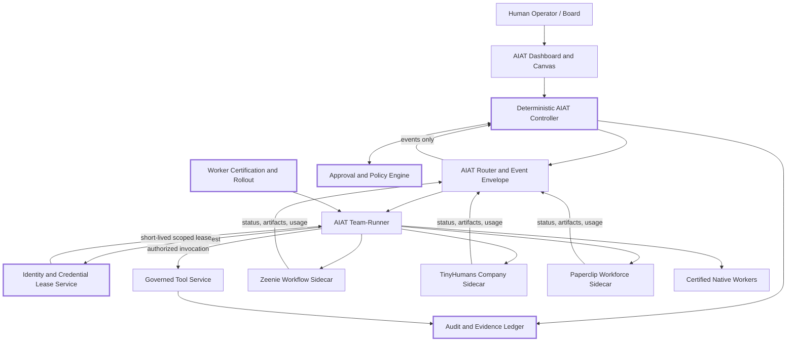
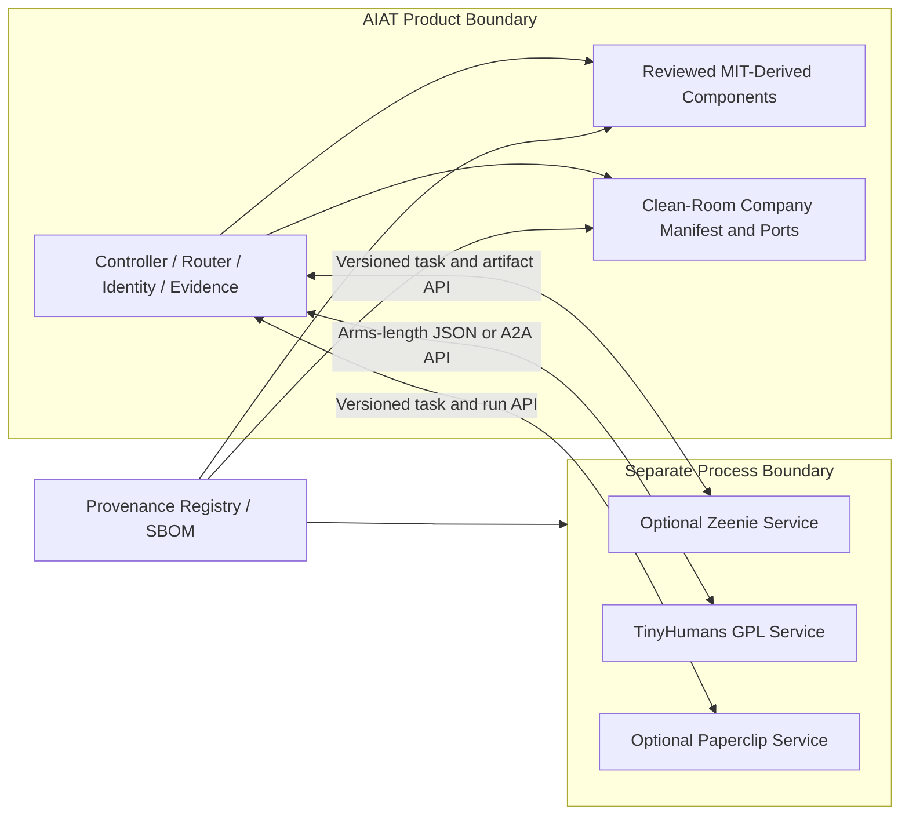

# AIAT Competitive and Open-Source Integration Assessment

> **Repository reconciliation notice (2026-08-03):** This report is a July
> 30, 2026 design/research snapshot. Its statement that the AIAT repository
> was unavailable is historical and no longer true. The code-grounded status,
> implementation decisions are maintained in
> [`AIAT_TARGET_PROGRAMME.md`](AIAT_TARGET_PROGRAMME.md) and
> [`ROADMAP.md`](ROADMAP.md). Licence, notice, and stated-use findings in this
> report are metadata only for the personal/internal instance. Do not treat
> its old distribution assumptions, licence allowlists, prohibited-component
> rules, commercial-use concerns, or licence-based build/activation exclusions
> as current authority: resources may be used normally through AIAT's current
> technical, security, compatibility, provenance, resource, and approval
> boundaries.

## Executive summary and research assumptions

This report evaluates [Zeenie OpenCompany](https://github.com/zeenie-ai/opencompany), [TinyHumans OpenCompany](https://github.com/tinyhumansai/opencompany/tree/main), and [Paperclip](https://github.com/paperclipai/paperclip) against the proposed AIAT architecture as of **July 30, 2026**. The repositories were reviewed from their default branches, including their README files, licenses, package manifests, architecture specifications, code-level extension contracts, database schemas, tests, issues, pull requests, and recent development activity.

Because the AIAT repository was not provided, this analysis treats AIAT as an in-development, technology-agnostic system whose intended primitives are:

- deterministic controller and message router;
- team-runner and external-worker adapters;
- governed tool-service;
- agent identity and credential leases;
- worker import, evaluation, certification, rollout, suspension, and retirement;
- approval gates and executive authority;
- company templates;
- dashboard and visual canvas;
- task and workspace system;
- cost and budget enforcement;
- immutable audit and execution evidence.

The central conclusion is that the three projects should be treated as **three different sources of competitive pressure and reusable design knowledge**:

| Project | Primary competitive overlap | Best source of reusable value | Recommended treatment |
|---|---|---|---|
| Zeenie OpenCompany | Agent-first visual workflows, integrations, local automation | Schema-generated plugins, visual canvas, node test contracts, Temporal execution patterns | Selective MIT-licensed reuse and adaptation |
| TinyHumans OpenCompany | Company manifests, company runtime, operator approvals, modular ports | Company-template model, port boundaries, event log, approval abstractions | Clean-room reimplementation or separate service only |
| Paperclip | AI-company control plane, agents, tasks, budgets, workspaces, governance | Task locking, heartbeat lifecycle, cost ledger, adapter contracts, audit model, test infrastructure | Highest-priority MIT-licensed adaptation |

Paperclip is the most direct product competitor. Zeenie is the strongest competitor to AIAT’s product experience and integration surface. TinyHumans is the closest conceptual match to a declarative company runtime, but its `GPL-3.0-only` license and reliance on the hosted Medulla cognition service make direct incorporation unattractive for a proprietary AIAT product. fileciteturn3file0 fileciteturn5file0 fileciteturn6file0

The recommended strategy is therefore:

1. **Adapt Paperclip’s task, run, workspace, budget, and audit semantics.**
2. **Adapt Zeenie’s backend-defined plugin contracts, invariant tests, and selected canvas patterns.**
3. **Reimplement TinyHumans’ company manifest and kernel-port ideas cleanly without copying GPL-covered code or expressive template content.**
4. **Keep AIAT’s deterministic controller, identity, credential leases, worker certification, and evidence model authoritative.**
5. **Do not adopt any external project’s orchestrator as the writer of AIAT company or project state.**

A reasonable twelve-week program requires a core team of approximately four full-time engineers—backend/control-plane, runtime/integration, frontend, and security/identity—plus part-time QA/SRE and outside open-source counsel.

## Repository inventory and comparative maturity

### Comparative inventory

| Dimension | Zeenie OpenCompany | TinyHumans OpenCompany | Paperclip |
|---|---|---|---|
| Principal languages | Python backend; TypeScript/React frontend; JavaScript CLI support | Rust 2024 backend; TypeScript/React frontend | TypeScript monorepo; Node.js server; React UI |
| Product abstraction | Visual workflow of agents, triggers, tools, services, and data nodes | A configurable company host loading a roster, charter, schedules, approvals, and adapters | Company control plane with agents, goals, tasks, workspaces, heartbeats, budgets, approvals, and plugins |
| Backend architecture | FastAPI, WebSockets, SQLModel/SQLite, native LLM SDK layer, optional Temporal | Axum host, kernel traits/ports, adapters, configurable stores, feature-gated OpenHuman/TinyAgents integrations | Node.js server, PostgreSQL through Drizzle, embedded Postgres for local use, in-process scheduler |
| Frontend | Vite/React, React Flow-style canvas, schema-rendered node configuration | Vite/React operator console, XYFlow, Recharts | React board UI, org chart, task system, workspaces, cost and governance views |
| Key extension model | Self-contained Python node plugins with Pydantic input/output contracts and automatic UI generation | Rust traits and feature-gated adapters; business types represented as `company.toml` data | Agent adapters, out-of-process plugins, shared package contracts, database-backed control-plane services |
| Durable execution | Temporal when enabled; local sequential fallback | Append-only event log and cycle runner; storage-dependent durability | Database-backed heartbeat queue, execution runs, locks, session records, recovery and watchdog concepts |
| Default storage | SQLite and separate encrypted credential database | Filesystem by default; optional SQLite and MongoDB features | Embedded PostgreSQL locally or external PostgreSQL; local or S3-compatible object storage |
| Deployment | npm-distributed CLI, local server, optional Temporal, deploy command | Rust binary; Docker Compose; DigitalOcean and AWS deployment examples | `npx`/pnpm local deployment, embedded Postgres, Docker and external Postgres options |
| Testing | Pytest contract and behavioral tests, frontend tests, CLI tests, import invariants | Rust unit/conformance testing plus Playwright frontend E2E; feature-gated integration testing | Vitest, serialized suites, Playwright E2E, authenticated multi-user E2E, release smoke tests, Storybook visual tests, Promptfoo evaluations |
| License | MIT | GPL-3.0-only | MIT |
| Maturity assessment | Broad and functional, but rapidly evolving and integration-heavy | Explicitly work in progress and not production-ready | Broadest implemented control plane and strongest test surface, but very rapid development and substantial operational churn |

The Zeenie root package currently requires Node.js 22 or newer and uses pnpm, while its Python CLI is separated from the FastAPI server environment. Its backend dependencies include FastAPI, Pydantic, SQLModel, SQLite, Temporal, OpenTelemetry, cryptography, native model-provider SDKs, MCP, browser and communication integrations, and a restricted Python sandbox. fileciteturn8file0 fileciteturn9file0 fileciteturn10file0

TinyHumans is a Rust 2024 workspace using Axum, Tokio, Serde, GraphQL, Clap, tracing, and optional integrations for SQLite, MongoDB, SMTP, IMAP, OAuth, OpenHuman, TinyAgents, MCP, and tiny.place. Its frontend uses React, Vite, TypeScript, XYFlow, Recharts, and Playwright. Its README explicitly warns that APIs and CLI behavior can break between commits and that the project is not production-ready. fileciteturn11file0 fileciteturn24file0 fileciteturn5file0

Paperclip is a pnpm monorepo requiring Node.js 20 or newer. Its root scripts show an unusually broad quality surface: general and serialized Vitest suites, Playwright E2E, authenticated multi-user E2E, release smoke tests, visual regression tests, evaluation suites, database backup and migration checks, release rollback scripts, and plugin packaging checks. Its implementation specification defines PostgreSQL as the authority store, with embedded PostgreSQL as the local default. fileciteturn14file0 fileciteturn18file0

### Architecture and key modules

**Zeenie OpenCompany**

The architectural center is a visual workflow graph. [`server/services/workflow.py`](https://github.com/zeenie-ai/OpenCompany/blob/main/server/services/workflow.py) selects Temporal or sequential execution; [`server/services/execution/`](https://github.com/zeenie-ai/OpenCompany/tree/main/server/services/execution) contains execution and recovery behavior; [`server/services/temporal/`](https://github.com/zeenie-ai/OpenCompany/tree/main/server/services/temporal) contains the distributed path; and [`client/src/components/`](https://github.com/zeenie-ai/OpenCompany/tree/main/client/src/components) implements the canvas and editor. Each execution gets an isolated context, and ready downstream nodes can begin immediately rather than waiting for an entire graph layer. fileciteturn4file0

Its most reusable architectural feature is the plugin contract documented in [`server/nodes/README.md`](https://github.com/zeenie-ai/OpenCompany/blob/main/server/nodes/README.md). A plugin subclasses `ActionNode`, `TriggerNode`, or `ToolNode`, declares Pydantic `Params` and `Output` classes, defines one or more `@Operation` methods, declares credentials and a task queue, and is emitted as a frontend-renderable node specification. Contract tests automatically inspect every registered plugin. fileciteturn16file0

Its credential system is useful as a reference but should not become AIAT’s identity architecture. Zeenie encrypts locally stored API and OAuth material and supports optional login modes, but its design is principally a local credential vault rather than a lease-oriented, policy-mediated identity service. fileciteturn3file0

**TinyHumans OpenCompany**

TinyHumans separates a kernel from adapters through Rust traits. Its specification defines layers for HTTP/CLI surfaces, a company cycle, kernel ports, adapters, and substrates. Important ports include `Brain`, `CompanyStore`, `EventLog`, `MemoryStore`, `ContextStore`, `ChannelAdapter`, `ToolProvider`, `AgentEconomy`, `ApprovalGate`, and `SecretStore`. fileciteturn12file0

The detailed contracts in [`docs/spec/runtime/ports.md`](https://github.com/tinyhumansai/opencompany/blob/main/docs/spec/runtime/ports.md) are especially relevant to AIAT. `Brain::run_cycle` receives a `CycleRequest` and a host callback interface. `CycleHost` mediates tool calls, context operations, effects, and parked approvals. `EventLog` is append-only and replayable. `ToolProvider` must reject calls outside a company’s grants before performing a side effect. `ApprovalGate` evaluates, parks, and resolves effects. fileciteturn21file0

Companies are data, not distinct programs. The host loads a `company.toml` that describes the roster, mandates, operator-reserved decisions, tools, and schedules. The repository includes nineteen examples, but those manifests and their accompanying prose remain GPL-covered expressive material and should not be copied verbatim into a proprietary AIAT distribution. fileciteturn5file0

The principal strategic limitation is that production cognition is designed around the hosted Medulla service. The open host provides the operating layer, but the README says a TinyHumans API key is required to place Medulla in control. fileciteturn5file0

**Paperclip**

Paperclip’s implementation contract is the closest match to a general AIAT control plane. Its main divisions are [`server/`](https://github.com/paperclipai/paperclip/tree/master/server), [`ui/`](https://github.com/paperclipai/paperclip/tree/master/ui), [`packages/db/`](https://github.com/paperclipai/paperclip/tree/master/packages/db), and [`packages/shared/`](https://github.com/paperclipai/paperclip/tree/master/packages/shared). A lightweight server-resident worker checks heartbeat triggers, stuck runs, and budget thresholds; the V1 architecture does not require a separate message queue. fileciteturn18file0

The canonical data model includes companies, agents, API keys, goal hierarchies, projects, issues, heartbeat runs, cost events, approvals, and an activity log. Issues include atomic checkout and execution lock fields, work modes, execution policies, workspace references, origins, billing codes, and assignees. Cost events attribute spend to company, agent, issue, project, goal, provider, model, and billing code. fileciteturn18file0

Relevant concrete schema paths include:

- [`packages/db/src/schema/heartbeat_runs.ts`](https://github.com/paperclipai/paperclip/blob/master/packages/db/src/schema/heartbeat_runs.ts)
- [`packages/db/src/schema/cost_events.ts`](https://github.com/paperclipai/paperclip/blob/master/packages/db/src/schema/cost_events.ts)
- [`packages/db/src/schema/activity_log.ts`](https://github.com/paperclipai/paperclip/blob/master/packages/db/src/schema/activity_log.ts)
- [`packages/db/src/schema/agent_task_sessions.ts`](https://github.com/paperclipai/paperclip/blob/master/packages/db/src/schema/agent_task_sessions.ts)
- [`packages/db/src/schema/heartbeat_run_events.ts`](https://github.com/paperclipai/paperclip/blob/master/packages/db/src/schema/heartbeat_run_events.ts)
- [`packages/db/src/schema/issue_execution_decisions.ts`](https://github.com/paperclipai/paperclip/blob/master/packages/db/src/schema/issue_execution_decisions.ts)
- [`packages/db/src/schema/issue_watchdogs.ts`](https://github.com/paperclipai/paperclip/blob/master/packages/db/src/schema/issue_watchdogs.ts)
- [`packages/db/src/schema/environment_leases.ts`](https://github.com/paperclipai/paperclip/blob/master/packages/db/src/schema/environment_leases.ts)

These are live schema surfaces rather than only roadmap concepts. fileciteturn19file0 fileciteturn19file4 fileciteturn19file7 fileciteturn19file9 fileciteturn19file10 fileciteturn19file14 fileciteturn19file15 fileciteturn19file18

Paperclip’s scale and development velocity also create risk. Recent public issues describe startup hangs, ESM compatibility failures, container bootstrap problems, and missing first-class local-model adapters; these do not invalidate its architecture, but they demonstrate that copying deployment code wholesale would import significant operational complexity. citeturn5search1turn5search2turn5search3turn5search11

## AIAT architecture mapping and prioritized reuse

Because AIAT’s implementation is unspecified, the “gap” column below means **capability AIAT should verify or implement**, not a confirmed defect in existing AIAT code.

| AIAT primitive | Zeenie contribution | TinyHumans contribution | Paperclip contribution | AIAT recommendation |
|---|---|---|---|---|
| Deterministic controller | Graph execution and Temporal patterns, but not constitutional state authority | Cycle host, effect disposition, event replay | Task policies, approvals, run decisions | Keep controller AIAT-native and sole state-transition authority |
| Router | WebSocket handlers, events, triggers, Temporal queues | Append-only `EventLog` and channel ports | Task/comment/event-driven wakeups | Define an AIAT event envelope, deduplication, ACK/retry, evidence IDs |
| Team-runner | Durable delegated agent tasks and CLI-backed agents | Brain/agent harness seams | Heartbeats, sessions, adapters | Use a standardized worker invocation protocol under AIAT control |
| Tool-service | Excellent typed node/tool plugin contract | `ToolProvider` with grant checking | Plugin host and agent integrations | Adapt Zeenie schema generation; enforce AIAT authorization before invocation |
| Identity | Provider credentials and optional auth | Company-scoped secrets and platform identity | User sessions, agent keys, environment leases | Build AIAT-specific worker identity, mailbox, browser profile, and lease service |
| Credential leases | Local encrypted vault | Secret source abstraction and recent token-source rotation patterns | Environment and secret injection | Never expose raw long-lived credentials directly to workers |
| Worker lifecycle | Node registration, no full certification lifecycle | Adapter feature gates | Hire/pause/terminate, adapter configuration | AIAT must add provenance, evaluation, certification, staged rollout, suspension |
| Approval gates | Workflow/user interactions | Strong `ApprovalGate` and effect parking | Board approvals and execution policies | Combine deterministic gates with policy evidence and human authority |
| Company templates | Example workflows | Strongest declarative company model | Company portability and org configuration | Create an AIAT-native manifest; do not copy Tiny templates verbatim |
| Dashboard/canvas | Strongest visual canvas and schema-rendered controls | Operator console and XYFlow | Strongest operational board/task UX | Use Zeenie patterns for composition and Paperclip patterns for operations |
| Task/workspace model | Workflow tasks and sandbox workspaces | Task and workspace ports | Strongest task, lock, workspace and session model | Adapt Paperclip semantics first |
| Cost/budgeting | Provider usage and pricing configuration | Per-cycle/per-turn metering and ledger | Strongest normalized cost event and hard-stop model | Use immutable cost events plus controller-enforced budget decisions |
| Audit/evidence | Logs and execution state | Append-only event log and effect outcomes | Activity log, run events, execution decisions | Add cryptographic actor identity, policy decision, artifact digest and causal chain |

The most important architectural rule is that **none of the imported runtimes should become authoritative over AIAT project state**. External systems may execute work, maintain their own internal sessions, and return artifacts, but only the AIAT controller should approve state transitions, consume budgets, issue credential leases, and commit evidence.

### Recommended code-level reuse candidates

| Priority | Source component | AIAT use | Effort | Main risks |
|---|---|---|---|---|
| Highest | Paperclip issue lock fields and [`doc/execution-semantics.md`](https://github.com/paperclipai/paperclip/blob/master/doc/execution-semantics.md) | Atomic task checkout, lease expiry, orphan recovery | Medium | Translating semantics into AIAT’s database and controller |
| Highest | Paperclip `cost_events`, `heartbeat_runs`, `activity_log`, run-event schemas | Immutable usage ledger, run lifecycle and audit base | Medium | Schema coupling; monetary rounding; idempotency |
| Highest | Paperclip adapter and run-session concepts | Common external-worker protocol | Medium–High | Untrusted subprocesses, cancellation, version drift |
| High | Zeenie [`server/nodes/README.md`](https://github.com/zeenie-ai/OpenCompany/blob/main/server/nodes/README.md) and `services/plugin` contract | Typed AIAT tool/worker SDK with automatic UI schema | Medium | Pydantic/Python coupling if AIAT uses another stack |
| High | Zeenie plugin invariant tests and `NodeTestHarness` pattern | Automatic certification checks for every adapter | Low–Medium | Tests must add policy and malicious-input cases |
| High | TinyHumans `ApprovalGate`, `CycleHost`, `EffectDisposition` concepts | Clear separation of decisions, parked effects and execution | Medium | GPL contamination if code is copied rather than cleanly reimplemented |
| High | TinyHumans `company.toml` concept and manifest validation | AIAT company packages | Medium | Copyright in example content; underspecified migration/versioning |
| Medium | Zeenie `client/src/components` canvas patterns | Company and workflow visualization | Medium | Frontend state complexity, accessibility and dependency coupling |
| Medium | Paperclip workspace and task-session schemas | Execution workspace ownership and resumption | Medium–High | Git cleanup, path traversal, stale processes |
| Medium | Zeenie Temporal services | Durable execution adapter | High | Workflow replay determinism, versioning, duplicate billing |
| Medium | TinyHumans append-only `EventLog` concept | Replay and audit timeline | Medium | Event schema evolution and PII retention |
| Lower | Full applications from any repository | Wholesale AIAT base | High | Conflicting control planes, migration cost, identity and policy mismatch |

The best direct-copy candidates are small MIT-licensed contracts, tests, schemas, and isolated UI components. The worst candidates are complete orchestration loops, credential stores, deployment supervisors, and whole applications.

## Integration strategies and architecture options

Effort estimates assume a four-engineer core team with part-time QA, SRE, security review, and counsel. “Weeks” are elapsed implementation time, not engineer-weeks.

### Zeenie OpenCompany strategies

| Strategy | Sequence | Estimate and staffing | Acceptance criteria | License and risk controls |
|---|---|---|---|---|
| **Direct reuse** | Identify MIT files; copy plugin base contracts and selected invariant tests; translate node metadata into AIAT capability manifests; adapt canvas components; replace Zeenie credential calls with AIAT lease APIs; preserve attribution | **5–7 weeks**; backend/plugin engineer, frontend engineer, QA/security at 50% | A sample tool registers from one manifest; UI renders it without custom frontend code; unauthorized invocation fails before side effects; tests cover schema, timeout, cancellation and malformed output | Retain MIT notice and copyright; create `THIRD_PARTY_NOTICES`; do not import the whole credential database or workflow authority |
| **External service** | Run Zeenie in a separate container; add an AIAT service identity; expose a narrow job API; translate AIAT tasks to workflow inputs; stream status and artifacts; deny direct privileged credentials | **3–4 weeks**; integration engineer, platform engineer, QA | Container can be killed without corrupting AIAT state; repeated task submission is idempotent; network policy blocks direct database and secret-store access | Preserve Zeenie license in its image; record source revision; scan bundled dependencies; treat returned content as untrusted |
| **Idea-only reimplementation** | Write an AIAT-native node specification; build schema-to-form rendering; implement plugin conformance tests; add a minimal canvas; document clean-room source notes | **4–6 weeks**; architect/backend engineer, frontend engineer, QA | Three independently written plugins pass one conformance suite; no Zeenie code appears in provenance diff; canvas can inspect policy and approval requirements | Lowest legal risk; record functional references but do not copy implementation expression |

Direct reuse is attractive for the plugin and UI layer because Zeenie is MIT-licensed, but AIAT should not inherit Zeenie’s local credential architecture as its security boundary. The MIT license permits use, modification, redistribution and commercial incorporation, subject to retaining the notice in copies or substantial portions. fileciteturn22file0

### TinyHumans OpenCompany strategies

| Strategy | Sequence | Estimate and staffing | Acceptance criteria | License and risk controls |
|---|---|---|---|---|
| **Direct reuse** | Obtain counsel opinion; decide whether an AIAT GPL edition is acceptable; isolate copied Rust crates; publish corresponding source and modifications; add license notices and source-delivery process | **8–12 weeks**; Rust engineer, platform engineer, frontend engineer, QA, counsel | Reproducible source build; complete corresponding source available; all modifications dated and identified; proprietary modules excluded unless counsel confirms separation | **Not recommended** for the main proprietary product; GPL-3.0-only may require the combined distributed work to be GPL |
| **External service** | Deploy unmodified or minimally modified OpenCompany separately; communicate over versioned HTTP/A2A messages; limit the interface to tasks, status, artifacts and usage; keep secrets and controller state in AIAT; make the integration optional | **4–6 weeks**; Rust/integration engineer, security engineer, QA/SRE | Separate process and storage; arms-length JSON contract; AIAT survives service loss; no shared libraries or internal database; revocation immediately prevents new tasks | Preserve GPL materials and provide source when distributing the service; counsel must review whether packaging and protocol semantics maintain separation |
| **Idea-only reimplementation** | Produce an independent AIAT company-manifest specification; define ports for tools, events, approvals and stores; implement from AIAT requirements without viewing/copying source during coding; create original templates | **5–7 weeks**; architect, backend engineer, product/domain designer, QA, counsel review | Manifest versioning, validation, migration and policy compilation work; original templates pass provenance review; approval tests prove allow/park/deny behavior | Recommended path; retain design-analysis records showing independent implementation and avoid copying template prose or schemas field-for-field |

The TinyHumans license is `GPL-3.0-only`. Private internal modification is generally possible without distribution obligations, and ordinary network interaction alone is not “conveying”; however, distributing a combined or derivative program can trigger source-code and GPL licensing obligations. Whether two programs are separate depends on both communication mechanics and the intimacy of their semantics, so an HTTP boundary is risk reduction, not an automatic legal safe harbor. fileciteturn23file0 citeturn6search0turn6search4

### Paperclip strategies

| Strategy | Sequence | Estimate and staffing | Acceptance criteria | License and risk controls |
|---|---|---|---|---|
| **Direct reuse** | Select schema and service modules; map identifiers to AIAT entities; implement migrations; adapt checkout and heartbeat logic; integrate cost events; add AIAT policy/evidence fields; port tests | **6–8 weeks**; data/backend engineer, runtime engineer, security engineer, QA | Concurrent checkout test admits one winner; duplicate cost events are rejected; hard budget stops new runs; orphaned run recovery is deterministic; every mutation records actor and evidence | Preserve MIT notices; copy commit-specific files only; avoid importing deployment/bootstrap code without separate testing |
| **External service** | Treat Paperclip as an external workforce manager; create a company-scoped service account; synchronize task and agent IDs; receive callbacks; reconcile state; disable Paperclip’s ability to finalize AIAT project stages | **4–5 weeks**; integration engineer, platform engineer, security/QA | State reconciliation handles retries and out-of-order callbacks; Paperclip compromise cannot read AIAT secrets or advance controller state; kill switch revokes all access | Keep its MIT notice and SBOM; document dual-control-plane limitations; isolate its Postgres and object store |
| **Idea-only reimplementation** | Specify AIAT-native task leases, heartbeats, workspaces and cost ledger; write concurrency and recovery tests first; implement services behind controller APIs; add adapter SDK | **6–9 weeks**; backend/data engineer, runtime engineer, QA | Linearizable checkout; lease expiry; session resume; cost reconciliation; budget stop; workspace cleanup; audit completeness | Lowest technical coupling but highest implementation effort; retain source-to-requirement traceability |

Paperclip’s MIT license makes direct adaptation legally simpler than TinyHumans. Its operational model is nevertheless broad enough that embedding the entire application would create two overlapping company authorities. Selective reuse of schemas and execution semantics is preferable. fileciteturn25file0

### Recommended target topology

The bold architectural boundary is conceptual: external runtimes may propose actions and return evidence, but they cannot directly mutate AIAT controller state, mint credentials, alter approvals, or certify workers.

A second distinction should exist between copied components and separately operated systems:

## Twelve-week AIAT roadmap

The roadmap deliberately implements AIAT’s differentiators before product polish. Each sprint ends with a deployable, reversible increment.

| Weeks | Milestone and sprint tasks | Deliverables | Acceptance tests | Rollback and containment |
|---|---|---|---|---|
| **One to two** | Freeze authority boundaries; define canonical IDs and event envelope; establish provenance registry; obtain preliminary counsel view; design worker invocation and evidence records | Architecture decision records; source/license inventory; `TaskRequest`, `RunEvent`, `ArtifactRef`, `PolicyDecision`, `EvidenceRecord` schemas | Schema version tests; duplicate-event idempotency; unsupported version rejection; no external runtime can call controller write methods | Feature flags default off; all imported code remains in quarantine branches; no production migrations |
| **Three to four** | Implement controller transition guard, approval states, audit/evidence append path and actor authentication; establish worker lifecycle statuses | Deterministic transition service; allow/deny/park approval engine; worker records for discovered, evaluated, certified, approved, active, suspended and retired | Invalid transition rejected; approval replay is idempotent; actor signature/identity required; evidence links policy, input and output digest | Append-only tables isolated; controller can revert to previous state machine version; migration down scripts tested |
| **Five to six** | Adapt Paperclip-inspired task checkout, heartbeat run, session and cost-event models; create workspace lease interface | Task service; atomic checkout; heartbeat queue; cost ledger; budget hard stop; workspace lease API | Fifty concurrent checkout attempts produce one winner; duplicate usage events do not double charge; expired leases recover; overspend prevents new work | New scheduler behind flag; legacy task path remains available; reconciliation job can rebuild rollups from raw events |
| **Seven to eight** | Adapt Zeenie-inspired plugin specification, schema renderer and conformance suite; build minimal capability canvas | AIAT plugin SDK; manifest-to-form UI; plugin registry; tool conformance harness; graph read view | New plugin requires no handwritten settings UI; malformed schemas fail registration; unapproved tools are invisible to workers; timeout and cancellation tests pass | Registry supports disable/quarantine; copied MIT files removable as one package; canvas remains read-only if execution path is disabled |
| **Nine to ten** | Clean-room company manifest inspired by TinyHumans; compile templates into org roles, grants, approvals and budgets; add original software-company template | Versioned `company.yaml` or equivalent; validator; migration framework; one original template; policy compiler | Unknown fields handled according to version policy; circular reporting rejected; template cannot grant privileges above operator ceiling; all prose passes provenance review | Manifest feature optional; generated entities tagged by package version and removable; no Tiny GPL code or template text enters the branch |
| **Eleven to twelve** | Implement identity and credential leases; integrate worker certification; run Zeenie/Paperclip sidecar spikes; security hardening and release candidate | Scoped short-lived leases; worker attestation and rollout records; sidecar adapters; full audit timeline; SBOM and notices | Lease expiry and revocation; worker cannot access another identity; sidecar compromise simulation; controller-state tampering blocked; end-to-end reboot and recovery; security scan clean; licence/notices metadata recorded when available | Global worker kill switch; per-adapter circuit breaker; revoke all leases; network deny policy; ability to disable all external-derived packages and operate native AIAT only |

The release candidate should not be accepted merely because workflows execute. It should demonstrate the differentiating control loop:

1. an imported worker is evaluated and certified;
2. the controller assigns a task under a policy and budget;
3. the identity service issues a narrow credential lease;
4. the worker produces an artifact and usage event;
5. the approval engine verifies the required gate;
6. the controller alone advances state;
7. the complete causal record remains queryable after restart.

The minimum recommended staffing model is:

| Role | Primary ownership |
|---|---|
| Staff backend/control-plane engineer | Controller, event contracts, approvals, evidence |
| Runtime and integrations engineer | Team-runner, adapters, heartbeat and sidecars |
| Frontend engineer | Dashboard, schema renderer, canvas and approval UX |
| Security and identity engineer | Actor authentication, leases, secret mediation, threat modeling |
| Shared QA/SRE | Concurrency, recovery, deployment, fault injection |
| Outside OSS counsel | GPL boundaries, notices, dependency and distribution review |

## Legal-risk appendix

This section is engineering-oriented risk guidance, not a substitute for jurisdiction-specific legal advice.

### MIT projects

Both Zeenie OpenCompany and Paperclip use the MIT license. The licenses permit use, modification, merging, publication, sublicensing, sale, and incorporation into proprietary products. The core obligation is to include the copyright and permission notice in copies or substantial portions. The software is provided without warranty. fileciteturn22file0 fileciteturn25file0

Safe proprietary reuse should include:

- a `THIRD_PARTY_NOTICES` file naming the repository, copyright holder, source commit and copied paths;
- the full MIT text in distributed source and binary notice bundles;
- source headers or package-level notices where practical;
- an SBOM that records direct and transitive packages;
- preservation of upstream attribution in copied documentation or UI assets;
- review of every dependency’s own license rather than assuming the repository-level MIT license covers all bundled material.

MIT does not remove patent, trademark, privacy, API-terms, dataset, or dependency risks. In particular, bundled icons, model names, external CLIs, SDKs and sample data should be reviewed independently.

### TinyHumans GPL-3.0-only

TinyHumans declares `GPL-3.0-only`, not “GPL-3.0-or-later.” Its license permits private use and modification, but distributing a modified or combined covered work generally requires prominent modification notices, GPL licensing of the covered combination, and provision of corresponding source. fileciteturn11file0 fileciteturn23file0

A proprietary AIAT product should therefore avoid:

- copying Rust modules into an AIAT binary;
- static or dynamic linking to TinyHumans libraries;
- embedding its frontend code in the AIAT frontend;
- copying its company manifests or descriptive template prose;
- publishing a tightly coupled plugin that shares internal data structures;
- shipping a single installer that makes the two systems appear to be one combined program without counsel review.

Safer patterns include an independently executable service, separate storage, separate build and release pipelines, a narrow versioned protocol, no shared-memory structures, no linked libraries, explicit optional installation, and a clear notice that the GPL service is a separate program. GNU’s own FAQ states that sockets, pipes and command-line invocation normally indicate separate programs, but sufficiently intimate communication can still support a combined-work conclusion. citeturn6search0

The distinction between GPL and AGPL is relevant for hosted use: ordinary GPL network operation does not itself create the AGPL-style source-offer obligation. Distribution of software or appliances remains a separate trigger, and modifications provided to customers, on-premises installations, desktop packages, containers, or downloadable binaries require careful analysis. citeturn6search4

### Recommended counsel actions

Counsel should provide written opinions on:

| Question | Required outcome |
|---|---|
| Is a separately containerized TinyHumans integration an aggregate or combined work? | Approved protocol and packaging pattern |
| Can AIAT distribute the Tiny service image alongside proprietary images? | Required source offer, notices, installation information and separation controls |
| Are company manifests and templates copied or independently authored? | Provenance standard for non-code expressive materials |
| Do contributor histories or vendored submodules introduce different licenses? | Contributor and submodule license inventory |
| Are trademarks usable in UI labels and compatibility claims? | Approved nominative-use wording |
| Do hosted APIs impose additional commercial or data-use terms? | Review of Medulla, model providers, external CLIs and SaaS integrations |
| What is the incident response for accidental GPL code inclusion? | Quarantine, removal, customer notification and source-release decision tree |

If a legal issue is discovered after implementation, the containment plan should be to disable the affected package through a feature flag, stop distributing its binaries, remove it from release artifacts, preserve provenance records, revert to the clean-room or external-service implementation, and obtain counsel approval before re-enabling it.

## Immediate actions and review checklists

### First seven days

| Day | Required action | Concrete output |
|---|---|---|
| **Day one** | Create an AIAT architecture and licensing working group; assign code owners | Named owners for controller, integrations, identity, frontend, QA and legal |
| **Day two** | Pin exact upstream revisions and mirror them read-only for analysis | Commit-SHA inventory, repository archives, checksums and license copies |
| **Day three** | Build a component decision matrix: copy, wrap, reimplement or reject | Decision record for every candidate named in this report |
| **Day four** | Draft canonical AIAT worker, run, event, artifact, cost and evidence schemas | Versioned interface proposal and threat model |
| **Day five** | Prototype Paperclip-style atomic checkout and Zeenie-style plugin registration | Two isolated proof-of-concept branches with no production dependencies |
| **Day six** | Run dependency, secret, vulnerability and license scans on all three projects | Initial SBOMs, vulnerability report, transitive-license report |
| **Day seven** | Hold architecture and counsel gate | Approved twelve-week scope, prohibited reuse list, staffing commitment and rollback owner |

Candidate code may enter the personal AIAT instance through the normal adapter
path. Keep source/version provenance, dependency, and security evidence
attached to the candidate; licence findings remain metadata and do not create a
quarantine or activation gate.

### Code provenance checklist

- Record repository URL, exact commit SHA, retrieval date, file paths and license for every imported file.
- Preserve original copyright and permission notices.
- Record whether a component was copied, translated, behaviorally reimplemented, or merely used as a research reference.
- Require a pull-request declaration for upstream-derived code.
- Compare clean-room implementations against upstream code for suspicious structural or textual similarity.
- Review commit history for files whose repository-level license may not accurately describe older contributions.
- Inventory vendored code, submodules, generated code, icons, fonts, fixtures, skills and template prose separately.
- Record licence values and notices for dependency inventory; do not block a
  build solely because a licence is missing, unusual, copyleft, or marked for
  non-commercial use. Build failures remain appropriate for integrity,
  vulnerability, malicious-content, sandbox, or compatibility defects.
- Generate an SBOM and third-party notice bundle for every release.
- Retain provenance records for the lifetime of the distributed product.

### Dependency and supply-chain checklist

- Scan `pnpm-lock.yaml`, Cargo lockfiles, Python dependency files and vendored binaries.
- Identify install scripts, postinstall hooks, binary downloaders and runtime package installers.
- Pin dependencies and external CLIs by version and cryptographic digest.
- Review dependency overrides and locally patched packages.
- Run vulnerability scanning in CI and fail closed on critical unresolved findings.
- Verify package signatures or checksums for downloaded binaries.
- Test builds without network access where feasible.
- Produce reproducible container images and attestations.
- Separate development-only, optional and production dependencies.
- Review model-provider and SaaS terms independently of software licenses.

Zeenie’s backend deliberately downloads or launches some optional supporting binaries and includes many third-party integrations, while Paperclip patches packages and has substantial release automation. Those capabilities are useful but expand the supply-chain review surface. fileciteturn10file0 fileciteturn14file0

### Security review checklist

- Verify that controller writes require authenticated actors and explicit policy decisions.
- Ensure external workers receive short-lived, task-scoped credentials rather than raw secrets.
- Enforce company, project, worker, tool and operation scopes at the server boundary.
- Test cross-company and cross-worker isolation.
- Treat plugin metadata, tool schemas, prompts, logs and artifacts as hostile input.
- Sandbox subprocess and code-execution adapters with filesystem, network, CPU and memory limits.
- Prevent task checkout replay and duplicate cost ingestion.
- Include idempotency keys on task assignment, callbacks and usage events.
- Test lease revocation during active work.
- Scrub secrets from prompts, logs, comments, artifacts and traces.
- Require artifact digests and immutable provenance.
- Add kill switches at global, runtime, worker, tool and credential levels.
- Test orphan recovery, server restart, database failover and out-of-order events.
- Verify approval bypass is impossible through alternate APIs or direct database access.
- Review frontend plugins and same-origin extensions as executable privileged code.

A public Paperclip issue previously described an adapter resolving a claimed API-key path from the wrong workspace, illustrating why AIAT should bind every lease to an explicit worker, task, workspace, company and expiration rather than relying on ambient paths or environment inheritance. citeturn5search10

### Final prioritization

The development order should remain:

| Rank | AIAT investment | Reason |
|---:|---|---|
| **First** | Deterministic controller, approvals, audit and evidence | Establishes AIAT’s authority and makes every later integration governable |
| **Second** | Worker certification, provenance and staged rollout | Differentiates AIAT from “hire any process” systems |
| **Third** | Identity, credential leases and workspace isolation | Enables real external operations without unrestricted secret exposure |
| **Fourth** | Paperclip-inspired task, heartbeat, session, cost and budget model | Delivers dependable day-to-day company operations |
| **Fifth** | TinyHumans-inspired company manifests and constitutional policies | Productizes complete governed companies without importing GPL code |
| **Sixth** | Zeenie-inspired plugin SDK, generated UI and visual canvas | Improves extensibility and user experience after authority boundaries are sound |
| **Seventh** | Optional external-service adapters | Expands capability without surrendering AIAT control |

The strategic objective is not to assemble three open-source products inside AIAT. It is to extract their best-tested abstractions while preserving an architecture none of them fully provides:

> **A deterministic, identity-aware and evidence-certified AI-company control plane in which every worker, tool, credential, approval and state transition is governed by AIAT.**
