# AIAT Final OSS Architecture, Simplification, and Implementation Plan

> **Status:** Canonical OSS architecture and implementation plan for the
> personal/internal AIAT instance.
>
> **Audited baseline:** `ae52ce7d64cae85e6381acc3d1f028e7a3637ab1`
> (`2026-09-09`, `docs: align published ledger state`).
>
> **Synthesis date:** `2026-09-12`.
>
> This document reconciles the three supplied research passes. The third pass
> has precedence for repository facts, current code behavior, security gaps,
> readiness, and implementation order. The second pass supplies architectural
> principles and complexity judgments. The first pass supplies useful OSS
> candidate research and historical rationale only where later passes did not
> supersede it.

This document is authoritative for AIAT OSS selection, simplification,
migration, benchmarking, and implementation sequencing. It does not replace
the [AIAT target programme](../../AIAT_TARGET_PROGRAMME.md), the
[roadmap](../../ROADMAP.md), current feature specifications, or the release
ledger for broader programme authority and release status.

## 1. Executive verdict

AIAT should keep its sovereign control plane and simplify at its existing
seams. It already has two legitimate runtime planes:

1. the governance/company-agent plane, implemented by `TeamRunner` and
   `AgentBase`; and
2. the specialist-worker plane, implemented by host placement, durable worker
   runs, `WorkerAdapter`, and runtime adapters.

`WorkerAdapter` remains the canonical specialist-worker/runtime SPI, but it is
not the only AIAT runtime plane. Do not force `TeamRunner` or `AgentBase`
through `WorkerAdapter` merely for conceptual uniformity. Do not introduce a
generic `ExecutionBackend` abstraction: the repository already has too many
execution seams, and another layer would increase duplication before it
removes any.

Keep the existing `WorkflowController`, `WorkerRunController`, host scheduler,
reservations, fencing/recovery, model governance, tool service,
identity/credentials boundary, evidence system, Redis Streams transport, and
OpenCode default. First fix the proven correctness and security gaps, then
consolidate duplicate adapter families, and only then run bounded OSS
benchmarks.

The governing rule is:

> **AIAT owns durable business authority and security boundaries. Commodity
> agent/runtime mechanics may be delegated only when measured evidence shows
> that the dependency removes more complexity than it introduces.**

| Decision area | Final guidance |
| --- | --- |
| Company, organisation, project, approvals, budgets, model policy, tools, credentials, evidence | **AIAT owns and remains authoritative** |
| Project lifecycle | **Keep `WorkflowController`**; add a project-transition outbox for the specific DB/event gap |
| Specialist-worker lifecycle | **Keep `WorkerRunController` and `WorkerAdapter`**; document legitimate host claim/recovery ownership |
| Governance/company agents | **Keep `TeamRunner`/`AgentBase` as a separate plane**; benchmark a thinner Pydantic-AI-backed shell later |
| Host scheduling, reservations, fencing, recovery | **Keep now**; harden and fault-test before considering any replacement |
| Message transport | **Keep Redis Streams** with atomic publish/requeue fixes and at-least-once semantics |
| Coding runtime | **OpenCode remains the default**; OpenHands must pass live certification and the comparative benchmark |
| New generic execution abstraction | **Do not add `ExecutionBackend`** |
| Pydantic AI | **Benchmark candidate**, not a production default |
| DBOS | **Benchmark only for worker-internal long-lived durability**; do not replace top-level AIAT scheduling/recovery now |
| Paperclip | **Deferred**; experiment only after a deletion case proves it will not create dual authority |
| Browser automation | **Deterministic Playwright baseline**; Stagehand/other agentic tooling is experimental fallback |
| Observability | **OpenTelemetry-compatible and replaceable**; never authoritative |
| External evaluation tools | **Augment AIAT certification**; they do not become certification authorities |

## 2. Scope, audit baseline, and evidence status

### Audit baseline

| Field | Value |
| --- | --- |
| Repository | `Maaroufabousaleh/AIAT` |
| Baseline commit | `ae52ce7d64cae85e6381acc3d1f028e7a3637ab1` |
| Baseline date | `2026-09-09` |
| Baseline commit message | `docs: align published ledger state` |
| Synthesis date | `2026-09-12` |
| Release/readiness at baseline | **NO-RELEASE / P0 INCOMPLETE** |
| Primary implementation workspace | `mas/` |
| Canonical OSS-plan location | `mas/docs/` |

Repository conclusions in this document are frozen to the audited SHA above.
The working copy may contain later commits or unrelated user changes; those
are not silently treated as evidence for the baseline. The release status is
from the [current release ledger](AIAT_CURRENT_RELEASE_LEDGER.md) and the
third-pass audit. It records extensive static/local verification but still
has blocked or missing live/provider/operator evidence, including OpenHands
activation evidence.

### Evidence vocabulary

| Label | Meaning | What it does not mean |
| --- | --- | --- |
| **Repository fact** | A path, symbol, manifest, schema, or behavior observed at the frozen SHA | It is not automatically production-safe |
| **Tested evidence** | A checked-in test, fixture, certificate, or ledger entry records the stated behavior | Local/static evidence is not independent-host, provider-outage, clean-host, or production proof unless the evidence says so |
| **Architectural inference** | A conclusion derived from the observed structure and the supplied reports | It is not a claim that the repository already implements the recommendation |
| **Engineering judgment** | A proposed priority, threshold, migration order, or stop rule | Numeric gates are decision aids, not universal truths |
| **Unresolved benchmark question** | A decision that must be answered by a controlled experiment | It must not be converted into a default by assumption |

### Scope and source handling

The task is documentation synthesis, not a fourth research pass. External OSS
claims below use ordinary links to official repositories or documentation when
those links were present in the supplied material. Exact version, source,
licence, notices, restrictions, image digests, and adapter provenance belong
in the [third-party metadata catalogue](provenance/third_party_components.yaml)
and [human-readable notices](../../THIRD_PARTY_NOTICES.md), not repeated as
selection gates throughout this plan.

For this personal/internal instance, licence information is metadata. Missing
or unusual terms create an operator notice; they do not create an automated
hiring, activation, installation, update, execution, or release gate.
Security, authenticity, version pinning, sandbox, privacy, compatibility,
data-loss, budget, approval, recovery, and human-operator gates remain
enforceable.

The document is placed under `mas/docs` because that directory already holds
current architecture, runtime-provenance, and release-readiness documentation.
The root `ROADMAP.md` links to it as the canonical OSS decision document. It
is intentionally not added to `Docs/current/plans/`, whose maintained-plan
count is machine-checked by the repository documentation index.

## 3. How the three research passes changed the architecture

| Topic | First pass | Second pass | Final/third-pass conclusion | Reason |
| --- | --- | --- | --- | --- |
| **Paperclip** | Proposed as a control/workforce execution substrate around the AIAT kernel | Removed from the production baseline because it duplicates company, task, budget, approval, and run authority | **Deferred**; consider only a disposable experiment after a deletion RFC demonstrates substantial code/infrastructure removal without dual authority | The repository already implements the overlapping control-plane semantics; subordinate use would retain much of Paperclip's complexity while using little of its distinctive value |
| **`ExecutionBackend`** | Proposed as a new generic layer below `WorkerAdapter` | Questioned because `WorkerAdapter` already provides the intended runtime seam | **Rejected**; do not introduce another generic execution abstraction | The third pass found two real runtime planes plus a legacy adapter family; a fourth abstraction would hide rather than resolve the duplication |
| **DBOS** | Considered as a possible replacement for recovery/scheduling infrastructure | Deferred because AIAT already has durable runs, leases, fencing, and recovery | **Worker-internal benchmark only**, if long-lived step durability remains painful | Replacing top-level AIAT state/recovery would discard implemented semantics before equivalent evidence exists |
| **Phoenix / observability** | Phoenix was the preferred observability product | The observability choice was loosened to avoid product lock-in | **OpenTelemetry-first, replaceable backend; non-authoritative** | AIAT evidence/audit already has independent persistence, and telemetry loss must not affect business truth |
| **`WorkerAdapter`** | Treated as a universal runtime boundary | Treated as the one runtime SPI | **Canonical specialist-worker SPI, but not the only runtime plane** | `TeamRunner` directly instantiates `AgentBase` descendants; governance agents have different semantics |
| **Outbox** | Broad event-platform direction | Recommended as a general DB/event consistency improvement | **Use a narrow project-transition transactional outbox; reuse existing identity/PM patterns** | A real project transition dual-write gap exists, but identity and PM already contain outbox/reconciliation implementations; no global event platform is justified |
| **Worker-run ownership** | Described as controller-centered | `WorkerRunController` treated as the sole lifecycle authority | **Split ownership is explicit**: host placement/claim/recovery own placement transitions; the controller owns post-claim execution and settlement | `HostExecutor` and recovery legitimately mutate claim/requeue state |
| **OpenCode/OpenHands** | OpenHands was a strong coding substrate alongside OpenCode | Both were candidate coding runtimes | **OpenCode remains default; OpenHands is inactive until live certification plus benchmark evidence** | OpenHands integration exists, but release evidence still records an activation blocker |
| **Pydantic AI** | Recommended as a native worker SDK | Strengthened as the best abstraction-level candidate | **Benchmark against `AgentBase`; adopt only if it deletes meaningful mechanics without moving authority** | It may simplify worker loops, tools, and structured outputs, but repository fit is not proven by upstream features alone |
| **Browser agents** | Playwright plus Stagehand-style fallback | Deterministic-first was preferred | **Playwright remains the baseline; agentic browser tooling is conditional** | Additional model-driven clicks add cost and nondeterminism unless dynamic-site reliability improves materially |
| **Framework adapter family** | Many OSS runtimes were proposed for integration | Framework accumulation was discouraged | **Inventory, consolidate, deprecate, or delete unused families** | Duplicate LangGraph/CrewAI interfaces and a legacy factory were verified in the repository |

The remainder of this document describes only the final architecture as current
guidance. Historical alternatives appear only where they explain an explicit
benchmark or stop condition.

## 4. Final architectural principles

1. **AIAT remains authoritative for business truth.** Company/org state,
   projects, workflows, approvals, budgets, model governance, privileged
   tools, identity, credentials, evidence, and audit history stay inside AIAT.
2. **Governance and specialist execution are distinct planes.**
   `TeamRunner`/`AgentBase` may remain the governance runtime while
   `HostScheduler`/`HostExecutor`/`WorkerRunController`/`WorkerAdapter` serve
   specialist workers.
3. **There is one canonical specialist-worker SPI.** Use `WorkerAdapter` for
   native, process, HTTP, MCP, OCI, Firecracker, OpenCode, OpenHands, and any
   retained framework worker. Do not add `ExecutionBackend`.
4. **External runtimes are untrusted execution.** Framework capability claims
   do not establish filesystem, network, credential, or authorization safety.
   Isolation and policy are AIAT responsibilities.
5. **Keep difficult AIAT-specific durability that already exists.** The
   workflow controller, run controller, host leases, reservations, fencing,
   recovery, and Redis transport are retained until an equivalent replacement
   wins a measured benchmark.
6. **Side effects are idempotent and reconciled.** Use a narrow transactional
   outbox where a specific canonical DB mutation must publish an external
   event; use stable effect keys for tool and runtime side effects.
7. **Model and tool decisions are governed before dispatch.** A runtime may
   request a model or tool, but AIAT resolves the model, authorizes the tool,
   leases credentials, and records evidence.
8. **Observability is non-authoritative.** OTel-compatible telemetry can be
   projected to Phoenix, Langfuse, Opik, or another backend; telemetry loss
   must not lose AIAT evidence or alter state.
9. **Unavailability is truthful.** A missing package, blocked provider, failed
   sandbox, or incomplete certification reports unavailable/pending rather
   than a successful stub.
10. **Delete only after verified replacement.** A module is not obsolete merely
    because an OSS project has a similar feature. Caller, import, manifest,
    dynamic-use, migration, and rollback analysis precede deletion.
11. **Benchmark irreversible choices.** New durable stores, control planes,
    runtimes, and side-effecting browser agents must pass a workload,
    reliability, security, cost, and rollback gate before activation.
12. **Licence metadata is not a technical authority.** Record provenance and
    operator notices, while keeping technical and human-approval controls
    independent of licence classification.

## 5. Verified current AIAT architecture

The repository at the frozen baseline is not a single runtime path. It is a
sovereign control plane with two legitimate execution planes and a legacy
adapter family that needs consolidation.

### Governance/company-agent plane

| Component | Verified role | Repository evidence |
| --- | --- | --- |
| `TeamRunner` | Owns a team process, creates agents from team configuration, subscribes to router messages, and dispatches them to governance/company agents | [`mas/apps/team-runner/team_runner/main.py`](../apps/team-runner/team_runner/main.py) |
| `AgentBase` | Provides the governance-agent reasoning loop, router interaction, checkpoint helpers, tool discovery, budget tracking, and direct `LLMGatewayClient` use | [`mas/packages/mas-core/mas_core/agent_runtime/base.py`](../packages/mas-core/mas_core/agent_runtime/base.py) |
| Executive/C-suite/admin agents | `ExecutiveAgent`, `CSuiteAgent`, `AdminAgent`, `WorkerAgent`, and `SubAgent` descendants used by the team runner | [`mas/packages/mas-core/mas_core/agent_runtime/`](../packages/mas-core/mas_core/agent_runtime/) and [`team_runner/main.py`](../apps/team-runner/team_runner/main.py) |
| Governance state interaction | Uses shared router, tool, model, storage, checkpoint, and evidence services, but does not currently construct every action as a `WorkerRunRequest` | `TeamRunner` and `AgentBase` paths above |

This plane is a real runtime path, not merely a conceptual shortcut. It must
not be forced through `WorkerAdapter` solely to make the architecture look
uniform. The orchestrator now attaches persisted model-resolution snapshots at
the fresh governance-message producer boundary in the current working tree.

Bound `AgentBase` calls, including the direct C-suite human-directive one-turn
path, use the exact bound model, suppress unrecorded fallback, record safe usage
provenance, and reject a response-model mismatch. Snapshot-bearing direct
`AgentBase` dispatch, governance checkpoint resumes, and the opt-in legacy CEO
fallback now resolve the same scoped snapshot or fail closed. Unbound
direct-AgentBase compatibility fixtures and provider-backed evidence remain
separate correctness work. The checkpoint path now persists the inbound
`model_resolution_snapshot_id`, and direct AgentBase dispatch can consume that
existing scoped decision through its storage boundary. This closes the local
restart-carrier gap without making AgentBase a model resolver or a specialist
`WorkerAdapter`.

### Specialist-worker plane

| Component | Verified role | Repository evidence |
| --- | --- | --- |
| `HostScheduler` | Deterministic host ranking, schedule-key idempotency, and placement race handling | [`host_scheduler.py`](../packages/mas-core/mas_core/worker_registry/host_scheduler.py) |
| `HostReservations` | Capacity reservation, host readiness/lease-generation checks, commit/release, and reservation expiry | [`host_reservations.py`](../packages/mas-core/mas_core/worker_registry/host_reservations.py) |
| `RunHostBinding` | Binds a worker run to a host/reservation and supports reassignment under fenced/expired conditions | [`run_host_binding.py`](../packages/mas-core/mas_core/worker_registry/run_host_binding.py) |
| `HostExecutor` | Validates placement, reservation, host lease, and generation; acquires the worker-run claim before invoking the controller | [`host_executor.py`](../packages/mas-core/mas_core/worker_registry/host_executor.py) |
| `HostRecovery` | Fences lost host leases and expires reservations from the lost host incarnation; run requeue/reassignment is performed by the separate worker-run recovery and run-host-binding paths | [`host_recovery.py`](../packages/mas-core/mas_core/worker_registry/host_recovery.py), [`memory/storage.py`](../packages/mas-core/mas_core/memory/storage.py), [`run_host_binding.py`](../packages/mas-core/mas_core/worker_registry/run_host_binding.py) |
| `WorkerRunController` | Owns post-claim validation/readiness, dispatch, running/pause/resume, tool mediation, result normalization, usage/evidence persistence, and terminal settlement | [`worker_contract/controller.py`](../packages/mas-core/mas_core/worker_contract/controller.py) |
| `WorkerAdapter` | Runtime-neutral specialist SPI for health/readiness/start/events/cancel/pause/resume/tool-response delivery/close | [`worker_contract/adapters.py`](../packages/mas-core/mas_core/worker_contract/adapters.py) |
| Runtime adapters | Current implementations include native, process, HTTP, MCP, OCI, Firecracker, gateway, OpenCode, LangGraph, and CrewAI paths | [`worker_registry/runtime_adapters.py`](../packages/mas-core/mas_core/worker_registry/runtime_adapters.py) and [`openhands_agent_server_adapter.py`](../packages/mas-core/mas_core/worker_registry/openhands_agent_server_adapter.py) |

The specialist flow is therefore:

```text
WorkerRunRequest
    -> HostScheduler / reservation / run-host binding
    -> HostExecutor claim and validation
    -> WorkerRunController
    -> WorkerAdapter
    -> runtime or sandbox
    -> WorkerEvent / WorkerResult
    -> controller validation, evidence, usage, and settlement
```

The adapter translates subordinate runtime behavior into AIAT contract events;
it does not write canonical flow or worker-run state.

### Shared governed services

| Service/capability | Current role | Repository evidence |
| --- | --- | --- |
| Project workflow authority | Validates deterministic project transitions, persists state/history with expected-state protection, and invokes event publication | [`workflow/controller.py`](../packages/mas-core/mas_core/workflow/controller.py) |
| Structured state | Postgres-first `AgentStorage` for projects, histories, worker runs, usage, checkpoints, evidence metadata, PM state, and reconciliations | [`memory/storage.py`](../packages/mas-core/mas_core/memory/storage.py), [`memory/models.py`](../packages/mas-core/mas_core/memory/models.py) |
| Model governance | Model profiles, resolution, routing, retries, audit, and provider/model usage attribution | [`llm_gateway/`](../packages/mas-core/mas_core/llm_gateway/) |
| Tool service | Governed tool registry, grants, policy, MCP, caching/rate controls, audit, and privileged-operation handling | [`mas/apps/tool-service/tool_service/`](../apps/tool-service/tool_service/) |
| Identity/credentials | Identity service, credential manager, run-scoped leases, and provider/identity boundaries | [`identity_service/`](../apps/identity-service/identity_service/) and [`credentials/`](../packages/mas-core/mas_core/credentials/) |
| Evidence/audit | Canonical project/workflow/worker evidence and audit records independent of external telemetry | [`workflow/evidence.py`](../packages/mas-core/mas_core/workflow/evidence.py), [`observability/`](../packages/mas-core/mas_core/observability/) |
| Memory/artifacts | Project-scoped context, checkpoints, document metadata, and blob/object-store integration | [`memory/checkpoints.py`](../packages/mas-core/mas_core/memory/checkpoints.py), [`memory/blob.py`](../packages/mas-core/mas_core/memory/blob.py) |
| Message routing | Redis Streams consumer groups, pending/reclaim handling, DLQ, WebSocket subscriptions, and publish-side policy/dedupe | [`mas/apps/message-router/message_router/`](../apps/message-router/message_router/) |
| Operator surface | Authenticated dashboard and API proxies for system, company, projects, workers, evidence, tools, and runtime status | [`mas/apps/mas-dashboard/`](../apps/mas-dashboard/) |

### Legacy/parallel adapter plane

The repository also contains a pre-universal-contract family. The following
inventory was rechecked at the current `HEAD` (`0f068476db908ee43bbc52900bf421394a121e6c`).
“Production caller” means an indexed import or call from `mas/apps` or the
non-test `mas_core` package; scripts, tests, compatibility checks, manifests,
and documentation are listed separately. Absence from this inventory is not a
deletion approval because runtime configuration can still introduce dynamic
use.

| Path/module | Direct production caller status | Test/tooling callers | Manifest/config references | Dynamic/importlib references | Documentation references | Later disposition |
| --- | --- | --- | --- | --- | --- | --- |
| `mas/packages/mas-core/mas_core/worker_registry/adapter_factory.py` | No indexed `create_adapter()` caller found outside the module; the package `__init__` contains a descriptive reference only | `tests/test_external_worker_adapter.py` imports `ExternalWorkerAdapter`; factory itself is exercised indirectly by its helper paths | No direct manifest/config string found in the current indexed source | `_create_langgraph_adapter`, `_create_crewai_adapter`, `_create_autogen_adapter`, `_create_letta_adapter`, and `_create_microsoft_agent_framework_adapter` import standalone modules; `_load_external_class` uses `importlib` | `mas_core/worker_registry/__init__.py`, archived external-worker plan, this plan | **DEPRECATE**, then delete only after dynamic/config inventory and rollback proof |
| `mas/packages/mas-core/mas_core/worker_registry/langgraph_adapter.py` | Compatibility re-export only; no distinct service implementation remains | `tests/test_runtime_adapter_conformance.py` now exercises the canonical class; inventory regression covers the shim | No direct manifest/config reference found | No dynamic/importlib caller remains; old import path is retained for compatibility | `Docs/current/FEATURE_WORKERS_STEWARDS_AND_MODELS.md` compatibility material and this plan | **KEEP AS SHIM**, then delete only after external import/configuration proof |
| `mas/packages/mas-core/mas_core/worker_registry/crewai_adapter.py` | Compatibility re-export only; no distinct service implementation remains | `tests/test_runtime_adapter_conformance.py` now exercises the canonical class; inventory regression covers the shim | No direct manifest/config reference found | No dynamic/importlib caller remains; old import path is retained for compatibility | `Docs/current/FEATURE_WORKERS_STEWARDS_AND_MODELS.md` compatibility material and this plan | **KEEP AS SHIM**, then delete only after external import/configuration proof |
| `mas/packages/mas-core/mas_core/worker_registry/autogen_adapter.py` | No indexed service caller found | No direct test/tooling import found beyond factory reachability | No direct manifest/config reference found | Imported by `adapter_factory.py` | This plan and archived external-worker plan | **DEPRECATE** unless an active workload is proven |
| `mas/packages/mas-core/mas_core/worker_registry/letta_adapter.py` | No indexed service caller found | `tests/test_letta_adapter.py`; `scripts/check_optional_memory_services.py` | `mas/docs/provenance/optional_memory_services.yaml` and `optional_memory_services_contract.json` select `mas_core.worker_registry.letta_adapter.LettaAdapter` | Imported by `adapter_factory.py`; optional-memory configuration is loaded as a dotted class string | Optional-memory provenance documents and this plan | **DEPRECATE** unless a memory-heavy worker is retained and ported |
| `mas/packages/mas-core/mas_core/worker_registry/microsoft_agent_framework_adapter.py` | No indexed service caller found | `tests/test_microsoft_agent_framework_adapter.py`; `scripts/check_maf_runtime.py` | MAF compatibility/certification provenance references the adapter family (`runtime_compatibility.yaml`, `maf_runtime_certification.json`) | Imported by `adapter_factory.py`; certification script imports it directly | `Docs/current/FEATURE_WORKERS_STEWARDS_AND_MODELS.md`, MAF provenance docs, and this plan | **DEFER**; port/retain only for a demonstrated inner-team workload |
| `mas/packages/mas-core/mas_core/worker_registry/runtime_adapters.py` | **Active**: imported by `orchestrator-api/main.py`, worker scripts, worker monitoring/storage paths, and other non-test runtime code | Worker governance, gateway, OpenHands, Firecracker, conformance, and registry tests | Registry/migration/storage records use the canonical `runtime_adapters` table; no legacy dotted-module activation found | No parallel legacy import mechanism required for the canonical family | `Docs/current/FEATURE_WORKERS_STEWARDS_AND_MODELS.md`, `FEATURE_WORKER_HOST_EXECUTION.md`, this plan, and roadmap entries | **KEEP/MODIFY** as the canonical specialist adapter family |

The inventory confirms that the LangGraph/CrewAI implementation duplication has
been removed without deleting their old import paths: both modules are now
compatibility shims over the canonical `runtime_adapters.py` classes. It does
not prove that every remaining legacy path is safe to delete. MAF and Letta
still have separate compatibility implementations, and Letta has
an explicit dotted-class configuration reference. Consolidation remains a
later PR after caller, import, manifest, dynamic-use, and compatibility
analysis; this PR intentionally changes none of those modules.

## 6. Canonical ownership model

The word “owner” means the authority allowed to make the canonical durable
decision. An external runtime can observe, propose, or report a subordinate
fact without owning AIAT state.

### State and execution ownership

| Domain | Canonical owner | Permitted subordinate role | Important boundary |
| --- | --- | --- | --- |
| Company/org state | AIAT company manifests/control plane | External UI or runtime may receive a versioned projection | No external company database becomes authoritative |
| Project state | `WorkflowController` as application/business authority, backed by `AgentStorage` | Workers return results/events; outbox publisher delivers notifications | Only the controller/business path may authorize a project transition; storage functions are persistence primitives, not alternate policy owners |
| Project transition history | Postgres `project_state_history` through the storage transaction | External telemetry may reference a transition ID | History must survive Redis/telemetry loss |
| Project-transition event delivery | Project-transition outbox dispatcher | Redis Streams transports the event | Dispatcher may retry; it may not decide a different project state |
| Flow definition/instance | AIAT flow definitions and controller | A worker/runtime may execute a bound node or inner graph | DBOS, LangGraph, MAF, or Paperclip cannot become the top-level flow authority without a separate approved decision |
| Worker identity/version | AIAT worker manifest, registry, steward, and certification | Runtime reports its version and provenance | Runtime cannot self-certify or change its binding |
| Worker-run eligibility | AIAT durable run state and policy | Scheduler selects an eligible host | A runtime cannot make an unapproved run eligible |
| Host placement | `HostScheduler`, `HostReservations`, and `RunHostBinding` | Host reports capacity/health | Placement state is distinct from execution state |
| Run claim/lease | `HostExecutor` plus an atomic storage primitive | Runtime receives a claimed run | Legitimate claim/recovery writers are documented; this is not a literal single-class writer rule |
| Post-claim run lifecycle | `WorkerRunController` | Adapter reports runtime facts/events | Adapter writes no canonical run/project state |
| Host-loss requeue | Host recovery subsystem | Runtime may report loss | Requeue must respect lease generation, terminal state, and idempotency |
| Runtime execution | Selected `WorkerAdapter` and subordinate runtime | Runtime owns ephemeral session/process/workspace state | Runtime facts are reconciled back into AIAT; they do not replace `worker_run_id` |
| Model resolution | AIAT model resolver/gateway and immutable resolution snapshot | Runtime receives the resolved profile/model and reports usage | Runtime fallback must not silently change the governed model |
| Tool authorization | AIAT grants, policy engine, and tool service | Runtime requests a tool or MCP operation | Privileged effects traverse AIAT policy and audit |
| Credentials | AIAT identity/credential service and lease broker | Runtime receives the narrowest possible opaque capability or bootstrap secret | Master DB/object-store/identity credentials never become runtime-owned state |
| Usage/cost | AIAT immutable usage ledger and budget reservation/settlement | Runtime reports observed usage | External cost rollups are advisory until reconciled |
| Evidence/audit | AIAT evidence and audit stores | External telemetry supplies diagnostic detail and trace references | Observability loss cannot erase canonical evidence |
| Artifacts | AIAT artifact metadata and object store after validation | Runtime creates workspace files and returns artifact candidates | Hash, provenance, workspace scope, and acceptance are AIAT decisions |
| Telemetry | OTel-compatible export boundary; backend is replaceable | Phoenix/Langfuse/Opik-class systems store engineering projections | Telemetry is non-authoritative and payload-minimized |

### Specialist worker state transitions

The state-ownership invariant is more precise than “one class writes all
states”:

```text
Placement subsystem may write:
    QUEUED -> CLAIMED
    expired CLAIMED -> QUEUED

WorkerRunController may write after a valid claim:
    CLAIMED -> VALIDATING -> READY -> DISPATCHING -> RUNNING
    RUNNING <-> PAUSING / PAUSED / RESUMING
    execution states -> SUCCEEDED / FAILED / CANCELLED / TIMED_OUT

Host recovery may fence leases, expire reservations, and requeue only when
the durable run, generation, and terminal-state guards permit it.

WorkerAdapter may write:
    no canonical project or worker-run state
```

This model preserves AIAT authority without making the controller responsible
for placement policy or pretending that host claim/recovery are unauthorized
writes.

## 7. Final target architecture

### Minimal required architecture

Every supported AIAT installation should require only:

- AIAT orchestrator API and project/company control plane;
- `WorkflowController` and Postgres canonical state;
- `WorkerRunController` and `WorkerAdapter` for specialist workers;
- `TeamRunner`/`AgentBase` governance plane while its replacement remains
  unproven;
- host scheduler, reservations, run-host binding, executor, fencing, and
  recovery;
- Redis Streams for transport, with at-least-once semantics;
- AIAT model gateway/governance;
- AIAT tool service and privileged-operation policy;
- AIAT identity/credential boundary;
- AIAT evidence/audit and project-scoped memory;
- artifact storage;
- one certified native/specialist worker path;
- OpenCode as the current/default coding runtime;
- an AIAT-approved isolation profile for untrusted code.

The mandatory baseline does not include Paperclip, DBOS, Pydantic AI,
OpenHands, Stagehand, a second workflow engine, or a specific observability
product.

### Optional/extended architecture

Install an extension only for a concrete workload and only after its admission
gate passes:

| Extension | Role if admitted | Boundary |
| --- | --- | --- |
| Pydantic AI | Internal mechanics for selected Python workers or a thinner governance shell | Behind existing AIAT worker/governance contracts |
| OpenHands Agent Server/Sandbox | Alternative coding runtime for long autonomous or isolated work | WorkerAdapter; dedicated sandbox host; candidate until certified |
| Stagehand or another agentic browser layer | Fallback for dynamic/semantic browser flows | Tool service; Playwright remains first choice |
| DBOS | Worker-internal durable steps for long-lived workflows | Below the worker, never the top-level AIAT scheduler in the initial plan |
| LangGraph or Microsoft Agent Framework | Inner graph/team implementation for a demonstrated complex worker | One governed AIAT worker identity |
| Letta | Specialized persistent-memory worker | AIAT project context and evidence remain canonical |
| Phoenix/Langfuse/Opik-class backend | Engineering trace/evaluation projection | OTel boundary; no authority |
| Paperclip | Disposable subordinate experiment only if a deletion RFC passes | Separate DB/process; never canonical company/project truth |

### Target topology

```mermaid
flowchart TB
    HUMAN[Human operator] --> DASH[AIAT dashboard]

    subgraph AIAT[AIAT sovereign control plane]
        DASH --> API[Orchestrator API]
        API --> WF[WorkflowController]
        API --> COMPANY[Company / org / approvals / budgets]
        API --> STEWARD[Worker steward / certification]
        API --> EVIDENCE[AIAT evidence / audit]
        WF --> DB[(PostgreSQL)]
        COMPANY --> DB
        STEWARD --> DB
        EVIDENCE --> DB
        EVIDENCE --> OBJ[(Artifact/object storage)]
        MODEL[Model governance / gateway]
        TOOLS[Tool service / policy / MCP]
        ID[Identity / credential leases]
    end

    subgraph GOVERNANCE[Governance/company-agent plane]
        TEAM[TeamRunner]
        AGENT[AgentBase and executive/C-suite/admin agents]
        TEAM --> AGENT
    end

    subgraph SPECIALIST[Specialist-worker plane]
        SCHED[HostScheduler / reservations / fencing / recovery]
        EXEC[HostExecutor]
        RUN[WorkerRunController]
        SPI[WorkerAdapter]
        SCHED --> EXEC --> RUN --> SPI
        OC[OpenCode default]
        OCI[OCI / gVisor]
        FC[Firecracker high-risk profile]
        HTTP[HTTP / MCP / process adapters]
        SPI --> OC
        SPI --> OCI
        SPI --> FC
        SPI --> HTTP
    end

    API --> TEAM
    API --> SCHED
    AGENT --> TOOLS
    AGENT --> MODEL
    RUN --> TOOLS
    RUN --> MODEL
    RUN --> ID
    TOOLS --> ID

    REDIS[(Redis Streams)]
    API <--> REDIS
    TEAM <--> REDIS
    RUN <--> REDIS

    subgraph OPTIONAL[Optional / experimental; not baseline]
        PY[Pydantic AI worker]
        OH[OpenHands Agent Server + sandbox]
        ST[Stagehand fallback]
        DBOS[DBOS worker-internal durability]
        INNER[LangGraph / MAF inner worker]
        OBS[OTel backend: Phoenix / equivalent]
        PAPER[Paperclip experiment]
    end

    SPI -. benchmark .-> PY
    SPI -. benchmark .-> OH
    TOOLS -. benchmark .-> ST
    SPI -. benchmark .-> DBOS
    SPI -. optional .-> INNER
    API -. OTel only .-> OBS
    API -. conditional disposable experiment .-> PAPER
```



No optional component in the diagram is a second source of AIAT business
truth. In particular, `TeamRunner` does not need to be adapted through
`WorkerAdapter`, and no `ExecutionBackend` node is present.

## 8. Verified correctness and security gaps

The gaps below are the implementation priorities established by the third
pass. “Confirmed” means the behavior follows directly from the frozen source;
“not release-proven” means local/static evidence exists but the required live
or fault-injected proof is incomplete.

| Gap | Severity | Exact area/path | Failure mode | Required fix | Test |
| --- | --- | --- | --- | --- | --- |
| Process environment inheritance | **Resolved in PR B working tree; baseline severity was Critical** | [`ProcessAdapter`](../packages/mas-core/mas_core/worker_registry/runtime_adapters.py), especially `create_subprocess_exec` | At the audited baseline, `self.environment or None` let a child inherit the adapter parent environment when no explicit mapping was supplied. The current PR B implementation passes an explicit copied mapping instead. | Keep the closed-world environment: omitted/empty means empty, required values are explicitly allow-listed by the caller, and raw `AdapterContext.secrets` is not copied to the child. Verify on the target host before untrusted activation. | Launch a fixture with canary variables in the parent and context. Assert the child cannot read unrelated variables, explicit values work, and known secret values are redacted from results/errors. Run under the intended OCI/gVisor profile. |
| Raw secret bag in generic adapter context | **High** | [`AdapterContext`](../packages/mas-core/mas_core/worker_contract/adapters.py) and runtime-specific context construction | `secrets: dict[str, str]` permits raw values to cross the generic adapter boundary. It is not proof that every runtime leaks them, but it weakens the global isolation claim. | Replace generic raw-secret passing with opaque capability/lease references where possible; separate host bootstrap secrets from worker-visible capabilities; redact context and diagnostic output. | Secret-canary fixture across Process, HTTP, MCP, OpenCode, and OpenHands candidate paths; assert no secret appears in environment, event, artifact, error, or trace output. |
| Project DB → event dual write | **Critical** | [`WorkflowController.transition`](../packages/mas-core/mas_core/workflow/controller.py), [`AgentStorage.transition_project`](../packages/mas-core/mas_core/memory/storage.py) | Project state/history commit succeeds, then process death or Redis failure prevents `SYSTEM_EVENT` publication. Canonical state changes while a downstream event is absent. | Add a narrow project-transition transactional outbox row in the same Postgres transaction. Publish stable IDs asynchronously and reconcile pending rows. Do not build a global event platform. | Kill after commit and before publication; take Redis down; restart publisher; assert eventual one-logical-delivery and unchanged canonical state. |
| Redis publish dedupe atomicity | **High** | [`routes_publish.py`](../apps/message-router/message_router/routes_publish.py), [`redis_client.py`](../apps/message-router/message_router/redis_client.py) | `SETNX` pending marker, `XADD`, and final dedupe update are separate commands. A crash after `XADD` can leave a pending marker that later expires and permits a duplicate. | Use a Redis Lua script or transaction that checks dedupe, performs `XADD`, and records the resulting entry ID atomically. Preserve at-least-once application semantics. | Inject process death at each command boundary; retry the same `message_id`; assert one logical publication and stable result. |
| Redis reclaim/requeue atomicity | **High** | [`tasks.py`](../apps/message-router/message_router/tasks.py), `reclaim_loop` and `_handle_reclaimed_entry` | Reclaim re-adds a message and then ACKs/deletes the old entry. A crash between commands can leave both entries deliverable. | Atomically add the replacement and acknowledge/delete the old entry where the Redis deployment supports it; retain durable effect idempotency for handlers. | Kill between replacement `XADD` and old-entry ACK/DEL; resume reclaim; assert no duplicate effective handling and correct retry count. |
| Generic adapter restart reconciliation | **High; bounded concrete lookup implemented, live proof pending** | [`BaseWorkerAdapter`](../packages/mas-core/mas_core/worker_contract/adapters.py), [`WorkerRunController`](../packages/mas-core/mas_core/worker_contract/controller.py), [`worker_run_runtime_bindings`](../packages/mas-core/mas_core/memory/models.py), [`runtime_adapters.py`](../packages/mas-core/mas_core/worker_registry/runtime_adapters.py), [`openhands_agent_server_adapter.py`](../packages/mas-core/mas_core/worker_registry/openhands_agent_server_adapter.py) | Queue, sequence, accepted-key, active-task, and cancellation bookkeeping remains process-local. Durable OpenCode session and OpenHands conversation references are now queried after restart; OpenCode idle and OpenHands REST finished remain non-terminal observations where completion is not proven. | Keep the minimal subordinate-runtime reconciliation capability, persist only safe runtime identity metadata at acceptance, record the observation timestamp/status, and make each adapter-specific lookup conservative. It reports runtime facts only; AIAT remains authoritative. | Restart the adapter/controller after acceptance, during events, and before result; reconcile by durable runtime binding plus `worker_run_id`/idempotency key; assert no lost or duplicate settlement. Live runtime termination/result recovery remains open. |
| Cancellation acknowledgement | **High** | `WorkerAdapter.cancel` in [`adapters.py`](../packages/mas-core/mas_core/worker_contract/adapters.py), controller cancellation path | `cancel()` returns `None`; acknowledgement of a request is indistinguishable from proof that a remote runtime stopped. A runtime may continue after canonical cancellation. | Introduce a cancellation receipt/status contract and reconcile before irreversible terminal settlement. Keep cooperative versus forced behavior explicit. | Race cancel with model call, tool call, pause, restart, and late terminal event. Assert bounded post-cancel activity and one terminal outcome. |
| Governance-agent model-provenance parity | **High; deployed TeamRunner binding boundary implemented, provider evidence pending** | [`AgentBase`](../packages/mas-core/mas_core/agent_runtime/base.py), [`CSuiteAgent`](../packages/mas-core/mas_core/agent_runtime/csuite.py), [`LLMGatewayClient`](../packages/mas-core/mas_core/llm_gateway/client.py), [`TeamRunner`](../apps/team-runner/team_runner/main.py), checkpoint/storage adapters in [`team_runner/main.py`](../apps/team-runner/team_runner/main.py), and orchestrator producer helper in [`main.py`](../apps/orchestrator-api/orchestrator_api/main.py) | At the audited baseline, governance agents could call the gateway without the specialist worker plane's equivalent run-level resolution snapshot and final provider/model validation. Fresh orchestrator `TASK`/`ADMIN_TASK`/`DIRECTIVE`/`QUERY` messages now receive a persisted snapshot before publication, bound AgentBase calls including the direct C-suite human-directive one-turn path use that decision, checkpoint/direct snapshot-bearing dispatches restore or resolve it through scoped storage, and TeamRunner/AgentBase calls fail closed when the deployed storage boundary requires a binding. Explicit direct-AgentBase compatibility fixtures remain unbound; provider evidence remains open. | Complete provider-backed model/failover evidence and retire the direct compatibility path when its callers are migrated; preserve the separate runtime plane. | Run executive/C-suite fixtures with profile changes, provider fallback, timeout, retry, direct compatibility paths, checkpoint restart, missing-snapshot rejection, and provider-backed evidence. Assert exact model attribution and policy evidence for every call. |
| Reservation/binding/settlement cross-transaction windows | **Medium-high; partially reduced in the current working tree** | [`host_reservations.py`](../packages/mas-core/mas_core/worker_registry/host_reservations.py), [`run_host_binding.py`](../packages/mas-core/mas_core/worker_registry/run_host_binding.py), [`host_executor.py`](../packages/mas-core/mas_core/worker_registry/host_executor.py), controller/storage paths | Reservation and binding commit/release settlement now share one AIAT database transaction, and a failed new assignment compensates its newly-created reservation. Host scheduling, run claim, evidence/usage, and host-loss reassignment still use separate boundaries; a crash can leave a repairable temporary inconsistency until reconciliation. | Keep the split ownership model. Reuse the in-transaction reservation primitive for normal binding settlement, retain compensation for failed new assignments, and add explicit reconciliation/idempotent retry and fault evidence for host-loss reassignment and the remaining claim/evidence/usage windows before considering further transaction merging. | Exercise normal assign/commit/release, failed-assignment compensation, failure after each remaining commit, host-loss reassignment retry, and terminal settlement replay; assert no permanent orphan reservation, stale binding, duplicate settlement, or incorrect terminal state. |
| Artifact/evidence partial settlement | **Medium-high** | [`worker_contract/controller.py`](../packages/mas-core/mas_core/worker_contract/controller.py), [`workflow/evidence.py`](../packages/mas-core/mas_core/workflow/evidence.py), [`memory/storage.py`](../packages/mas-core/mas_core/memory/storage.py) | Artifact or usage/evidence persistence may succeed before terminal run settlement, or settlement may fail after a runtime result. | Make acceptance/replay semantics explicit, use stable artifact/result IDs, and add a reconciler rather than assuming one giant transaction. | Kill before and after artifact registration, usage write, evidence write, and terminal update; replay the result and assert idempotent completion. |
| OpenHands live activation evidence | **Release blocker** | [`openhands_agent_server_adapter.py`](../packages/mas-core/mas_core/worker_registry/openhands_agent_server_adapter.py), OpenHands candidate evidence under [`mas/docs/provenance/openhands-candidate/`](provenance/openhands-candidate/), live-certification scripts under [`mas/scripts/`](../scripts/) | Offline and adapter evidence exists, but the release ledger still records incomplete live/provider completion evidence. OpenHands is not equivalent in readiness to OpenCode. | Keep OpenCode as default. Complete operator-owned live certification, then run the fixed coding benchmark before activation. | Live candidate preflight, governed model/provider run, pause/resume/cancel, artifact/diff/test verification, cleanup, and failure classification. |
| Duplicate/legacy adapter families | **Medium** | [`adapter_factory.py`](../packages/mas-core/mas_core/worker_registry/adapter_factory.py), compatibility shims `langgraph_adapter.py`/`crewai_adapter.py`, standalone `autogen_adapter.py`, `letta_adapter.py`, `microsoft_agent_framework_adapter.py`, and canonical [`runtime_adapters.py`](../packages/mas-core/mas_core/worker_registry/runtime_adapters.py) | LangGraph/CrewAI now share the canonical implementation; the remaining factory/MAF/Letta families can still diverge in policy, lifecycle, readiness, and recovery behavior. | Keep the canonical LangGraph/CrewAI implementation and compatibility shims; inventory and migrate remaining legacy families before deletion. | Import/manifest graph, conformance, lifecycle, unavailable-runtime, policy, and regression tests for every retained adapter. |

These findings do not justify a new general-purpose execution platform. They
justify narrow fixes at the existing authority and transport boundaries.

## 9. Runtime and security trust-boundary matrix

“Trusted” below means trusted code in the AIAT deployment, not trusted in the
abstract. “Sandboxed” means an isolation profile is intended and must be
certified. “External trust boundary” means AIAT can validate the protocol and
permissions but cannot assume control of the remote implementation.

| Runtime | Trust classification | Filesystem | Network | Secrets/environment | Tool boundary | Final policy |
| --- | --- | --- | --- | --- | --- | --- |
| `TeamRunner` / `AgentBase` | **Trusted governance runtime** | Team process/container permissions | Service access required | Process environment is service-controlled; do not load arbitrary worker code here | Intended AIAT router/tool-service path | Keep for governance/company agents; fix model provenance parity |
| `NativeWorkerAdapter` | **Trusted reviewed runtime** | Host-process permissions | Host-process permissions | Context is controlled by AIAT, but generic raw secret bag must be narrowed | AIAT-mediated when configured correctly | Use for reviewed AIAT-owned workers only |
| `ProcessAdapter` | **High-risk until host/sandbox validation** | Child has host-user filesystem access unless sandboxed | Child has host network unless sandboxed | PR B passes only its copied explicit mapping; raw `AdapterContext.secrets` remains compatibility-only and is not copied | External process may bypass AIAT if it has direct capabilities | Verify the closed-world environment and run untrusted processes in a certified sandbox |
| `HTTPAdapter` | **External trust boundary** | Remote implementation decides | Remote by definition | Headers/configuration may authenticate the remote runtime | AIAT sees the adapter contract, not remote internals | Certified endpoint, scoped auth, provenance, timeout, reconciliation, and egress controls |
| `MCPAdapter` | **Capability-dependent external boundary** | Depends on MCP server | Depends on MCP server | Depends on client/server configuration | MCP is explicit, but server capabilities still require grants | Per-run server/tool grants; no broad privileged server by default |
| `OCIAdapter` with gVisor | **Sandboxed runtime** | Read-only root plus scoped workspace/tmpfs under the profile | Deny by default where configured | Explicit values only; no parent environment inheritance | AIAT-mediated | Preferred boundary for untrusted local workers after host certification |
| `FirecrackerAdapter` | **Strong sandbox/high-risk profile** | MicroVM boundary and controlled rootfs | Deny-all default with explicit allowlist | Controlled launch specification or capability references | AIAT-mediated | Keep as a high-risk option; current host evidence remains separate and may be unavailable |
| OpenCode | **Governed coding runtime** | Workspace/runtime access constrained by deployment | Runtime service network is deployment-dependent | Current adapter uses run-scoped gateway/tool material; host handling still follows ProcessAdapter rules where applicable | Native capabilities denied in the inspected path; AIAT MCP bridge mediates tools | Keep as default coding runtime and retain its certification evidence |
| OpenHands Agent Server/Sandbox | **Candidate sandboxed external runtime** | Mutable sandbox workspace; upstream recommends container deployment | Sandbox/deployment dependent | Candidate gateway/profile lifecycle must be scoped and redacted | AIAT bridge/certification path exists | Candidate only until live certification and benchmark gates pass |
| LangGraph/CrewAI/AutoGen/Letta/MAF in-process workers | **Trusted only if reviewed; not a sandbox** | In-process host permissions | In-process host network | Process environment unless explicitly constrained | Depends on adapter implementation | Consolidate behind `WorkerAdapter`; only retain for a measured active workload |

Isolation is a technical control, not a framework feature. A framework's
“safe tools” or approval API does not replace filesystem, network, credential,
or host-kernel boundaries.

## 10. Repository simplification map

The actions below are deliberately conservative. `DELETE` is never asserted
until caller, import, manifest, dynamic-use, migration, and rollback analysis
is complete. Where a row says “then delete,” that is a gated future action.

| Path/module | Current purpose | Final action | Why | Prerequisite | Replacement |
| --- | --- | --- | --- | --- | --- |
| `mas/packages/mas-core/mas_core/workflow/controller.py` | Validates and executes project lifecycle transitions | **MODIFY** | Correct authority; event publication follows the DB commit | Characterization tests and outbox design | Same controller plus project-transition outbox |
| `mas/packages/mas-core/mas_core/memory/storage.py` | Canonical Postgres persistence, project transition, PM outbox, usage, evidence, and reconciliation helpers | **MODIFY** | Add atomic project outbox intent; retain existing PM/identity lessons | Migration and transaction tests | Same storage layer |
| `mas/packages/mas-core/mas_core/worker_contract/adapters.py` | Canonical specialist runtime SPI and base lifecycle behavior | **MODIFY** | Add safe credential contract, external reference/reconciliation, and cancellation semantics | Adapter compatibility tests | Same `WorkerAdapter` SPI |
| `mas/packages/mas-core/mas_core/worker_contract/controller.py` | Specialist-worker lifecycle, events, tool mediation, result/evidence settlement | **MODIFY** | Harden restart, cancellation, and partial settlement | Failure matrix | Same controller |
| `mas/packages/mas-core/mas_core/worker_registry/host_scheduler.py` | Host selection and idempotent scheduling | **KEEP** | AIAT-specific placement semantics are already implemented | Multi-host fault tests | None |
| `mas/packages/mas-core/mas_core/worker_registry/host_reservations.py` | Capacity reservation, readiness, lease generation, commit/release | **KEEP** | Valuable AIAT-specific resource and fencing primitive | Reconciliation tests | None |
| `mas/packages/mas-core/mas_core/worker_registry/run_host_binding.py` | Run-to-host/reservation binding and reassignment | **MODIFY** | Cross-transaction windows need explicit repair semantics | Failure injection | Same module plus reconciler |
| `mas/packages/mas-core/mas_core/worker_registry/host_recovery.py` | Host fencing, reservation expiry, queue recovery | **KEEP** | Correct specialized responsibility | Independent-host/live evidence | None |
| `mas/packages/mas-core/mas_core/worker_registry/host_executor.py` | Placement validation, lease/generation validation, run claim, controller invocation | **KEEP** | Legitimate owner of claim edge; should not be forced into controller | Ownership tests | Same executor/storage primitive |
| `mas/packages/mas-core/mas_core/worker_registry/runtime_adapters.py` | Canonical `ProcessAdapter`, `HTTPAdapter`, `MCPAdapter`, native, OCI, Firecracker, gateway, OpenCode, and framework implementations | **MODIFY** | Harden process environment and keep one specialist family | Contract/conformance tests | Same canonical family |
| `mas/packages/mas-core/mas_core/worker_registry/adapter_factory.py` | Legacy native/wrapper/fork/framework factory | **DEPRECATE**, then **DELETE** if safe | Parallel SPI; no indexed production caller was found, but dynamic use must be checked | Full caller/import/manifest search and release-window rollback | `WorkerAdapter` for specialists; explicit TeamRunner for governance |
| `mas/packages/mas-core/mas_core/worker_registry/langgraph_adapter.py` | Standalone LangGraph lifecycle interface | **MERGE**, then **DELETE** | Duplicates canonical `runtime_adapters.py` implementation | Move unique behavior/tests and prove no caller remains | Canonical `WorkerAdapter` LangGraph implementation |
| `mas/packages/mas-core/mas_core/worker_registry/crewai_adapter.py` | Standalone CrewAI lifecycle interface | **MERGE**, then **DELETE** | Same duplication | Move unique behavior/tests and prove no caller remains | Canonical `WorkerAdapter` CrewAI implementation |
| `mas/packages/mas-core/mas_core/worker_registry/autogen_adapter.py` | Standalone AutoGen adapter | **DEPRECATE** | No default strategic workload is established | Active manifest/workload proof | Port to `WorkerAdapter` only if benchmarked |
| `mas/packages/mas-core/mas_core/worker_registry/letta_adapter.py` | Standalone persistent-memory adapter | **DEPRECATE** | Keep only for a demonstrated memory-heavy worker | Active manifest/workload proof | Port to `WorkerAdapter` only if needed |
| `mas/packages/mas-core/mas_core/worker_registry/microsoft_agent_framework_adapter.py` | Optional MAF adapter and compatibility path | **DEFER** | MAF belongs inside a demonstrated specialist worker, not the control plane | Concrete inner-team workload and compatibility evidence | Canonical `WorkerAdapter` implementation if retained |
| `mas/apps/team-runner/team_runner/main.py` | Team process and governance-agent dispatch | **KEEP** | Verified second runtime plane, not accidental duplication | AgentBase/Pydantic benchmark | Same team runner or thinner governed shell |
| `mas/packages/mas-core/mas_core/agent_runtime/base.py` | Governance-agent loop, checkpointing, router and gateway use | **BENCHMARK** while keeping current path | Commodity mechanics may shrink, but authority semantics must remain | Pydantic AI versus AgentBase corpus | Possibly a thin AIAT governance shell around Pydantic AI |
| `mas/apps/message-router/message_router/routes_publish.py` | Authenticated publish/broadcast and dedupe | **MODIFY** | Publish dedupe has a crash window | Redis fault fixtures | Atomic Redis helper |
| `mas/apps/message-router/message_router/tasks.py` | Reclaim, retry, DLQ, and requeue | **MODIFY** | Requeue has a multi-command crash window | Reclaim fault fixtures | Atomic Redis requeue helper |
| `mas/apps/message-router/message_router/routes_ws.py` | Stream subscription and ACK/NACK | **KEEP** | At-least-once transport is appropriate; process-local LRU is not a universal effect ledger | Effect-boundary analysis | Durable effect keys only for side-effecting handlers |
| `mas/packages/mas-core/mas_core/llm_gateway/client.py` | Provider dispatch, retries, usage, and model routing | **MODIFY** | Preserve worker-plane enforcement and add governance-plane provenance | Model parity tests | Same AIAT gateway |
| `mas/apps/tool-service/tool_service/identity_client.py` | Delegated identity/credential broker client | **KEEP** | Strong boundary and secret-safe lease handling | Ongoing security tests | None |
| `mas/packages/mas-core/mas_core/workflow/evidence.py` | Canonical project evidence policy/package | **KEEP** | AIAT-specific evidence must survive telemetry loss | None | None |
| `mas/apps/identity-service/identity_service/sync/outbox.py` | Identity sync outbox and replay | **KEEP** | Existing durable at-least-once pattern | None | Reuse its design lessons |
| PM inbox/outbox code in `mas/packages/mas-core/mas_core/memory/storage.py` and related migrations | Provider projection/reconciliation | **KEEP** | Existing canonical mutation plus outbox and inbox patterns | None | Reuse, do not generalize into a global event platform |
| OpenHands candidate scripts/evidence under `mas/scripts/` and `mas/docs/provenance/openhands-candidate/` | Candidate runtime certification and provenance | **KEEP UNTIL DECISION** | Needed to finish evidence; not production authority | Live certification and bake-off | Delete/archive only if OpenHands is rejected |
| Any proposed `ExecutionBackend` module | Would add a second generic runtime abstraction | **REJECT / DO NOT CREATE** | Duplicates `WorkerAdapter` and obscures the two-plane model | None | Existing `WorkerAdapter` plus explicit governance plane |

## 11. OSS decision matrix

The statuses below are decisions for AIAT at the audited baseline, not general
endorsements of the projects. Exact version, source revision, licence, notices,
restrictions, image digest, and active adapter provenance belong in the
[metadata catalogue](provenance/third_party_components.yaml). Licence metadata
is an operator notice for this internal instance, never an admission gate.

| Candidate | Unique value | Overlap | Current status | Admission gate | Final disposition |
| --- | --- | --- | --- | --- | --- |
| [Pydantic AI](https://github.com/pydantic/pydantic-ai) | Typed Python agents, structured outputs, tools/toolsets, MCP, testing/evals, and optional durable integrations | `AgentBase` reasoning/tool/checkpoint mechanics | Strong candidate, unverified in AIAT | 48-case, three-repeat comparison with `AgentBase`; zero policy/model/tool violations and meaningful code deletion | **BENCHMARK** |
| [OpenCode](https://github.com/anomalyco/opencode) | Current provider-neutral coding runtime and existing AIAT path | OpenHands and other coding runtimes | Current/default coding runtime; baseline catalogue records a pinned available path | Preserve certification, sandbox, model, artifact, cancellation, and rollback evidence | **KEEP** |
| [OpenHands Agent Server/SDK](https://github.com/OpenHands/software-agent-sdk) | Coding-agent service boundary, remote execution, and workspace/sandbox model | OpenCode coding execution and AIAT workspace mechanics | Candidate-only; integration exists but live activation evidence is incomplete | Candidate live certification plus fixed OpenCode comparison; no credential/sandbox/policy failures | **BENCHMARK** |
| [DBOS](https://github.com/dbos-inc/dbos-transact-py) | Postgres-backed durable workflows/steps and worker-internal replay | AIAT worker checkpoints, host recovery, and scheduler | Technically credible but not justified as top-level replacement | 20 workflows, 160 injected scenarios per implementation, zero protected-effect duplicates, and worker-internal code deletion | **DEFER** |
| [Hatchet](https://github.com/hatchet-dev/hatchet) | Rich durable tasks, queues, retries, scheduling, and operational controls | AIAT scheduler/recovery and DBOS | Alternative durability engine, heavier than a local library | Only reopen if AIAT durability becomes a measured maintenance liability; compare against existing AIAT, not in addition to DBOS | **DEFER** |
| [Temporal](https://github.com/temporalio/temporal) | Mature long-lived durable workflow platform and cross-language ecosystem | AIAT flow/run recovery | Strong greenfield option, unnecessary migration now | Dedicated workflow cluster must remove more burden than it adds and preserve AIAT authority | **DEFER** |
| [Restate](https://github.com/restatedev/restate) | Journaled durable services/agents with replay and telemetry | AIAT worker and event durability | Interesting alternative with another control plane and deployment model | Same replacement and authority gate as Temporal/Hatchet; record current terms in metadata | **DEFER** |
| [Paperclip](https://github.com/paperclipai/paperclip) | Full company/agent control plane: org chart, tasks, budgets, governance, adapters, UI | AIAT company, project, worker, budget, approval, and audit domains | Explicitly not in the production baseline | First pass a deletion RFC; then one disposable sandbox-company experiment; reject any dual canonical state | **DEFER** |
| [Stagehand](https://github.com/browserbase/stagehand) | Hybrid deterministic and AI-assisted browser actions, observation, extraction, and fallback behavior | AIAT tool service and Playwright browser baseline | Conditional browser fallback | 30-workflow browser corpus; must materially improve dynamic cases with zero policy/credential violations | **BENCHMARK** |
| [LangGraph](https://github.com/langchain-ai/langgraph) | Graph-shaped inner worker logic, checkpoints, persistence, and human interruption | AIAT flows and duplicate LangGraph adapters | Optional inner-worker runtime; existing duplicate adapters require consolidation | Concrete worker whose internal graph is more maintainable and passes `WorkerAdapter` conformance | **OPTIONAL** |
| [Microsoft Agent Framework](https://github.com/microsoft/agent-framework) | Sequential/concurrent/handoff/group-chat/Magentic inner-team orchestration | TeamRunner, AgentBase, and flow orchestration | Optional adapter/inner-team candidate | One demonstrated department workload, exact compatibility/readiness, and no control-plane ownership | **OPTIONAL** |
| Letta | Persistent/stateful agent memory for a specialized worker | AIAT project context, checkpoints, and evidence | No default workload established | A memory-heavy worker must show quality/continuity gain that AIAT memory cannot provide more simply | **DEFER** |
| [Multica](https://github.com/multica-ai/multica) | Local coding-agent daemon/task compatibility | Paperclip, OpenCode, OpenHands, task/workspace state | Optional and security-sensitive; its daemon is not itself a sandbox | Isolated user/container/VM, host credential test, and coding benchmark win | **DEFER** |
| [OpenCompany](https://github.com/tinyhumansai/opencompany) | Declarative company/org templates and one-person-company concepts | AIAT company manifests, roles, and authority | Import/template inspiration only | Clean manifest import with no runtime or authority dependency | **DEFER** |
| [Phoenix](https://github.com/Arize-ai/phoenix), Langfuse, and Opik class telemetry | Rich traces, datasets, experiments, and agent analysis | AIAT observability/evidence | Backend candidates behind OTel | Redaction, correlation, retention, and telemetry-loss tests; no canonical state dependency | **OPTIONAL** |
| [Promptfoo](https://github.com/promptfoo/promptfoo) and external eval tooling | Local behavioral, regression, and red-team evaluation in CI | AIAT steward/certification checks | Useful test runner, not an authority | AIAT-invoking provider, signed result digest, secret-safe artifact, reproducible suite | **ADOPT** for certification augmentation |
| [Agno](https://github.com/agno-agi/agno) | Broad agent/team/runtime, memory, scheduling, REST, and MCP facilities | AgentBase, AIAT memory, API, scheduling, and observability | Optional specialist runtime only | Concrete capability gap and `WorkerAdapter` conformance; no control-plane duplication | **DEFER** |
| [Mastra](https://github.com/mastra-ai/mastra) | TypeScript-native agents, workflows, memory, tools, and evaluation | AIAT workflow/runtime and adds a second primary language stack | Optional TS worker only | TS-specific workload with measured quality/maintenance benefit | **DEFER** |
| AutoGen | Multi-agent/team and distributed agent patterns | TeamRunner/MAF/AgentBase | Legacy/experimental candidate; not a core dependency | Active workload, current API compatibility, and canonical `WorkerAdapter` port | **DEFER** |
| [CrewAI](https://github.com/crewAIInc/crewAI) | Role/task/crew-oriented inner collaboration | AIAT teams and duplicate CrewAI adapters | Existing optional adapter family, not a default architecture | Consolidate duplicate adapters and prove a concrete workload advantage | **DEFER** |

The supplied first-pass research also reported a 2026 arbitrary-file-read issue
in Paperclip's agent-controlled adapter configuration. The exact advisory URL
was not included in the source material, so this canonical document does not
invent one. Any future Paperclip experiment must pin a version with the issue
resolved and repeat AIAT's security certification. This is a technical
security requirement, independent of the internal licence-metadata policy.

The first-pass research likewise records that Multica's daemon is not itself a
general filesystem sandbox: its default task process can carry the daemon
user's filesystem, network, and credential reach. Any future Multica test must
place it inside an independently verified user/container/VM boundary before
comparing coding quality or cost.

The common admission rule is intentionally strict: an OSS dependency enters
AIAT only if it deletes meaningful custom infrastructure, adds a difficult
capability AIAT lacks, or produces a measured quality/reliability improvement
that justifies its operational and architectural cost.

## 12. Benchmark specifications

All numeric thresholds in this section are proposed engineering decision gates,
not universal truths. Benchmarks must pin the candidate source/image and AIAT
model profile, record results in AIAT evidence, and avoid executing consequential
side effects twice.

### Pydantic AI versus `AgentBase`

**Corpus and controls**

| Workload class | Unique cases |
| --- | ---: |
| Structured executive reasoning, no tools | 12 |
| Tool selection plus structured output | 12 |
| Multi-turn context/project-memory tasks | 8 |
| Policy denial and unauthorized-tool attempts | 6 |
| Budget/model-policy constraints | 4 |
| Checkpoint/restart/resume | 6 |
| **Total unique cases** | **48** |
| **Runs per runtime** | **144** (three runs per case) |

Both implementations must use the same prompts, AIAT `ModelProfile`, exact
model ID, temperature/seed where supported, tool schemas, grants, project
context, memory fixtures, budget, and network conditions. The Pydantic AI
implementation must remain behind the existing governance or specialist
contract; it must not acquire authority by owning an `AgentBase` replacement.

Measure schema acceptance, rubric quality, tool choice, prohibited-action
rejection, model attribution, tokens/cost, median and p95 latency, retries,
context growth, human intervention, restart/resume success, and maintainable
AIAT loop/tool/checkpoint code and interface complexity.

**Proposed pass gate**

- zero policy, credential, model, or tool-governance violations;
- protocol/schema success at least 98%;
- quality no worse than the native baseline by more than two percentage points;
- p95 latency and cost no more than 1.10 times the native baseline unless the
  quality gain is explicitly accepted;
- human intervention no greater than native;
- restart correctness at least equal to native; and
- meaningful deletion of generic mechanics, approximately 25% of the
  representative loop/tool/retry/checkpoint glue or about 1,500 maintainable
  lines plus associated edge-case tests.

**Stop:** reject Pydantic AI if it only wraps existing `AgentBase` complexity
while adding a dependency.

### OpenCode versus OpenHands

OpenCode remains the default during the experiment. OpenHands must first clear
its current live-certification blocker.

**Corpus**

| Workload | Tasks |
| --- | ---: |
| Bounded bug fixes | 10 |
| Feature additions | 10 |
| Failing-test repair | 6 |
| Behavior-preserving refactor | 6 |
| Repository analysis/documentation | 4 |
| Adversarial tool/policy/sandbox tasks | 4 |
| **Total** | **40** |

Run each task twice per candidate: 80 runs per runtime under the same AIAT
model/profile, workspace, timeout, tool grants, and artifact rules. Record
visible/hidden test success, patch correctness, unnecessary diff size, policy
violations, workspace escape/network bypass, model attribution, tokens/cost,
median/p95 duration, human intervention, restart/cancel behavior, and
artifact/evidence completeness.

Keep one runtime if it wins quality by roughly five percentage points without
an unacceptable cost/latency regression. Keep both only if each wins a useful
class by a comparable margin, such as OpenCode for short bounded work and
OpenHands for long isolated transformations. Otherwise remove the losing
runtime after a rollback window.

### Deterministic Playwright versus agent-assisted browser

Run **30 workflows with three repetitions each**. Include form fill/submit,
login/session continuation, navigation and tabs, structured extraction,
downloads/uploads, dynamic selector changes, iframe/shadow-DOM cases where
relevant, post-action verification, and intentionally changed DOM fixtures.

Playwright runs first. Agent-assisted fallback is allowed only for the failed
or semantically unstable cases. Stagehand or another candidate must improve
those cases by at least five percentage points while keeping zero credential,
policy, duplicate-effect, and cross-origin violations and an acceptable
latency/cost profile.

**Stop:** if deterministic Playwright reaches at least 98% reliability on the
required corpus, do not add an agentic browser runtime.

No shadow run may submit a form, send a message, purchase, mutate an account,
or create a duplicate external record. Compare plans, extraction, or
read-only observations for consequential workflows.

### AIAT recovery versus DBOS worker-internal durability

This is not a benchmark of top-level AIAT scheduling. It compares existing
worker-internal recovery with DBOS only for long-lived steps.

Use at least **20 representative workflows** and inject process death at eight
boundaries, producing at least **160 injected scenarios per implementation**:

```text
before step
during pure computation
after model response
after tool request
after tool response
after artifact write
during wait/pause
before terminal result
```

Hard gates are zero lost canonical outcomes, zero duplicate protected effects,
zero incorrect terminal states, zero policy bypasses, and 100% recovery in the
fixture suite. DBOS must also remove at least approximately 30% of the
relevant worker-internal checkpoint/recovery code. It must not replace the
project FSM, host scheduler, reservation ledger, or top-level run authority.

**Stop:** if native AIAT recovery passes the same matrix and remains
maintainable, do not add DBOS.

### Conditional Paperclip experiment

No Paperclip experiment starts until a deletion RFC identifies a concrete,
reviewable list of AIAT modules, services, migrations, tests, and operational
responsibilities that would become obsolete. The source reports did not
establish a fixed Paperclip corpus; the following is the minimum proposed
engineering gate for the conditional experiment:

- one disposable sandbox company and separate Paperclip database;
- at least 20 representative work units across planning, coding, review,
  approval, and budgeted execution;
- duplicate checkout, retry, webhook/callback, network-partition, stale-task,
  and restart scenarios;
- comparison of canonical concept duplication, synchronization jobs, code and
  infrastructure deleted, approval/budget/provenance fidelity, latency/cost,
  and operator recovery burden;
- zero ability for Paperclip to mutate AIAT project/company/model/approval or
  certification authority; and
- no duplicate consequential side effects during comparison.

Reject if Paperclip becomes a second canonical company/task store, requires
bidirectional reconciliation of business truth, or cannot remove roughly 20%
of the specifically targeted worker-management burden. The percentage is an
engineering decision gate, not a claim about Paperclip's general value.

## 13. Failure-injection programme

The purpose of this programme is to distinguish a durable canonical outcome
from a runtime that merely appeared to complete. Each case must record the
AIAT run/project IDs, stable idempotency keys, observed external IDs, and the
final reconciliation result without retaining secrets or unnecessary payloads.

| Failure case | CURRENT BEHAVIOR at baseline | EXPECTED BEHAVIOR | TEST | FIX IF REQUIRED |
| --- | --- | --- | --- | --- |
| Process death before project DB commit | The transition uses a database transaction; rollback safety is expected but not the specific third-pass proof | No project state/history change; retry may safely reapply the transition | Kill the process before commit and reopen Postgres | Preserve transaction/CAS behavior; add characterization coverage |
| Process death after project commit and before event publication | **Confirmed gap:** state/history remain committed while the post-commit event can be absent | Stable event intent is durable with the state; publisher eventually delivers it once logically | Kill between `transition_project` return and publisher call; restart publisher | Project-transition transactional outbox |
| Redis outage after project transition | Best-effort publisher logs failure; canonical state remains changed and event may be lost | Outbox remains pending and is retried after Redis recovers | Stop or deny Redis after Postgres commit, then restore it | Same narrow outbox; no global event platform |
| Process death after Redis `XADD` before dedupe finalization | Stream entry may exist with a pending dedupe marker; later TTL expiry can allow a duplicate | Same `message_id` produces one logical publication and stable entry identity | Kill at each publish command boundary; retry duplicate publish | Atomic Redis publish script/transaction plus idempotent consumers |
| Duplicate dispatch | Redis is at-least-once; controller/claim guards provide protection, but generic adapter acceptance bookkeeping is process-local | One AIAT run and one effective protected execution; duplicate deliveries are harmless | Submit the same run/message concurrently and after restart | Durable external-run binding and effect idempotency where side effects exist |
| Reclaim crash during replacement `XADD` → old ACK/DEL | Old and replacement entries can both remain deliverable if the process dies between commands | One logical retry with correct retry count and no duplicate effective effect | Kill during `_handle_reclaimed_entry` requeue; run reclaim again | Atomic requeue script/transaction; stable effect key |
| Tool succeeds but response is lost | **Bounded fix in the current working tree:** a per-run effect row is reserved before mediation; completed responses replay by idempotency key, while an in-flight/ambiguous effect fails closed instead of executing again | Replaying a known response is idempotent; an unknown external outcome remains explicitly ambiguous and requires reconciliation | Complete tool effect, drop response, restart controller, replay request; exercise the durable effect row | Migration `0045_worker_tool_effects` and controller replay/ambiguity handling; provider-specific effect reconciliation remains required for external systems |
| Runtime side effect followed by runtime/process crash | External runtime may have acted before AIAT observes a result | Retry must query/reconcile the external effect before re-executing | Side effect, kill runtime before response, restart, retry | Runtime-specific effect idempotency/reconciliation; never infer “not run” from missing response |
| Host lease loss | Local fencing moves a host offline, increments generation, and expires old reservations; broader live evidence remains incomplete | Stale host cannot claim or settle new work; eligible runs are safely requeued | Drop heartbeat, inject concurrent claim, reopen storage | Preserve fencing; add independent-host/live fault evidence |
| Stale lease generation | Host/reservation/binding paths reject stale generations in local checks | Old owner cannot mutate current placement or terminal state | Use old generation after recovery and attempt claim/settle/reassign | Keep generation guards and add negative-path regression tests |
| Competing hosts | Scheduler/reservation/claim logic has local race and capacity protections | Exactly one valid claim; loser observes conflict and no duplicate execution | Run concurrent schedulers/executors against one queued run | Keep CAS/locks; fix any permanent reservation/binding leak found |
| Cancellation race | At the audited baseline, `cancel()` had no terminal acknowledgement; the current working tree now adds a receipt that distinguishes a request from proven termination, while the base adapter remains process-local | AIAT distinguishes requested, acknowledged, and terminal cancellation; late result cannot create a second terminal outcome | Race cancel with model call, tool call, pause, restart, and late result | Durable runtime reconciliation and live adapter-specific termination evidence |
| Artifact/evidence partial settlement | Artifact/usage/evidence writes and terminal settlement can be separated; replay semantics need explicit proof | A replay either completes the same settlement or leaves a visible, repairable pending state | Kill before/after artifact, usage, evidence, and terminal writes | Stable result/artifact IDs and reconciliation; do not discard canonical evidence |
| Pause/resume restart | Local evidence does not sufficiently prove every `PAUSING`/`RESUMING` restart case | Restart resumes from a valid checkpoint or reports an explicit safe failure; no duplicate protected effect | Kill during pause and resume, reopen, reconcile, continue | Persist/reconcile phase and checkpoint cursor; add bounded cancellation fallback |
| Provider timeout/retry | Gateway classifies/retries transient failures, but external call duplication and usage need characterization | Bounded retry; no business side effect is hidden inside an uncertain model call; usage is reconciled | Inject timeout before response, after response, and during streaming | Preserve gateway retry policy; attach idempotency/usage reconciliation and cap retries |
| OpenHands runtime failure | Candidate has offline/preflight/certification machinery, but live completion/recovery is not release-proven | Candidate run fails closed with clean workspace, no secret disclosure, and a reconciled AIAT terminal state | Live candidate failure, timeout, pause/resume, cleanup, and provider absence cases | Do not activate; fix candidate adapter/certification or retain OpenCode |

The failure programme must be run against the current AIAT path before any
replacement runtime is allowed to claim equivalent durability. Local success
is evidence for the exercised fixture only; it does not close independent-host,
provider-outage, clean-host, disaster-recovery, or live-account gates.

## 14. Final implementation roadmap

The roadmap is divided into correctness work, benchmark work, and optional
experiments. It is intentionally ordered so that no new OSS control plane is
introduced before the existing authority and transport boundaries are
characterized and hardened.

### Required correctness work

| PR | Exact paths and purpose | Schema change | Tests and acceptance criteria | Dependencies and rollback | Code that becomes obsolete | Codex versus operator |
| --- | --- | --- | --- | --- | --- | --- |
| **PR A — Architecture invariants and characterization tests** | [`mas/packages/mas-core/mas_core/workflow/controller.py`](../packages/mas-core/mas_core/workflow/controller.py); [`worker_contract/controller.py`](../packages/mas-core/mas_core/worker_contract/controller.py); [`worker_registry/host_executor.py`](../packages/mas-core/mas_core/worker_registry/host_executor.py); [`mas/apps/team-runner/team_runner/main.py`](../apps/team-runner/team_runner/main.py); [`worker_registry/runtime_adapters.py`](../packages/mas-core/mas_core/worker_registry/runtime_adapters.py); router publish/reclaim paths; update [`mas/docs/ARCHITECTURE.md`](ARCHITECTURE.md) and this plan. Record the two runtime planes, split ownership, and no-`ExecutionBackend` rule. | None. | Characterize project authority, host claim ownership, post-claim controller ownership, adapter non-authority, TeamRunner/AgentBase separation, DB/event crash window, Redis command windows, and restart/cancel behavior. Existing behavior must remain unchanged. | Depends on no prior PR. Revert tests/docs only; no runtime rollback required. | None. | **Codex can implement autonomously** with local fixtures and reviewable docs. No operator action. |
| **PR B — ProcessAdapter secret/environment isolation** | [`worker_registry/runtime_adapters.py`](../packages/mas-core/mas_core/worker_registry/runtime_adapters.py), [`worker_contract/adapters.py`](../packages/mas-core/mas_core/worker_contract/adapters.py), and adapter/security tests. **Implemented in the current working tree:** default parent-environment inheritance is removed, explicit environments are validated/copied, known output values are redacted, and `AdapterContext` exposes opaque `secret_refs` while retaining a compatibility-only raw map. | None. | Local tests prove parent/context canaries are absent, explicit values work, invalid maps are rejected, context repr does not expose raw values, and known secret values are redacted from results/errors. Target-host OCI/gVisor verification remains operator-owned. | PR A characterization. No legacy inheritance flag was needed because no real caller was found. Revert the ProcessAdapter/context changes if a deployment compatibility issue appears; no migration is required. | Implicit `env=None` behavior and context repr exposure become obsolete; broader runtime-specific raw-secret migration remains future work. | **Codex implemented and validated locally.** Operator must validate on the actual worker host before untrusted activation. |
| **PR C — Transactional project-transition outbox (implemented in current working tree)** | [`workflow/controller.py`](../packages/mas-core/mas_core/workflow/controller.py), [`memory/storage.py`](../packages/mas-core/mas_core/memory/storage.py), [`memory/models.py`](../packages/mas-core/mas_core/memory/models.py), [`0043_project_transition_outbox.py`](../migrations/versions/0043_project_transition_outbox.py), and publisher wiring in [`mas/apps/orchestrator-api/orchestrator_api/main.py`](../apps/orchestrator-api/orchestrator_api/main.py). | Added the narrow `project_transition_outbox` with stable transition/message ID, project ID, event fields, publish status, attempts, retry time, and last error. | Local storage/controller/dispatcher tests prove the state/history/outbox transaction shape, stable-ID dispatch, and retryable failure behavior. Live Postgres/Redis outage, restart, and downstream idempotency evidence remain open. | Depends on PR A; reuses identity outbox and PM outbox/reconciliation lessons. Roll back by disabling the dispatcher while retaining rows; do not delete unprocessed intent. | The post-commit-only project notification path is now bypassed for new controller/storage paths; legacy publisher compatibility remains until live replay coverage is complete. | **Codex implemented and tested locally.** Operator must rehearse backup, upgrade, Redis outage, and rollback against the deployed database. |
| **PR D — Redis publication/requeue atomicity (implemented in current working tree)** | [`message_router/routes_publish.py`](../apps/message-router/message_router/routes_publish.py), [`message_router/redis_client.py`](../apps/message-router/message_router/redis_client.py), [`message_router/tasks.py`](../apps/message-router/message_router/tasks.py). The public routes remain unchanged. | None. Redis Lua scripts atomically combine point-to-point/broadcast dedupe with XADD and combine reclaim replacement XADD, stable requeue result, PEL ACK, and old-entry deletion. | Unit tests prove one-script publication/requeue calls, duplicate result decoding, legacy pending-marker compatibility, and that the old multi-command primitives are not used by the production reclaim loop. Live Redis crash/failover and duplicate protected-effect evidence remain open. | Depends on PR A; use the existing Redis deployment. Revert helpers without a data migration if a Redis-version constraint appears. | New publication and production reclaim paths no longer depend on the multi-command dedupe/requeue sequences; compatibility helpers remain for older direct callers. | **Codex implemented and tested locally.** Operator must exercise the actual Redis deployment/failover topology. |
| **PR E — Governance AgentBase model-provenance parity (bounded runtime complete; provider evidence pending)** | [`agent_runtime/config.py`](../packages/mas-core/mas_core/agent_runtime/config.py), [`agent_runtime/base.py`](../packages/mas-core/mas_core/agent_runtime/base.py), [`agent_runtime/csuite.py`](../packages/mas-core/mas_core/agent_runtime/csuite.py), [`agent_runtime/__init__.py`](../packages/mas-core/mas_core/agent_runtime/__init__.py), [`protocols/envelope.py`](../packages/mas-core/mas_core/protocols/envelope.py), scoped storage in [`team_runner/storage_client.py`](../apps/team-runner/team_runner/storage_client.py) and [`orchestrator-api/main.py`](../apps/orchestrator-api/orchestrator_api/main.py), model resolver/profile modules under [`llm_gateway/`](../packages/mas-core/mas_core/llm_gateway/), and [`team_runner/main.py`](../apps/team-runner/team_runner/main.py). | No database migration. Added an optional envelope snapshot reference, a scoped allowlisted snapshot read, an immutable `GovernanceModelBinding` projection, a context-local per-dispatch binding, producer-boundary snapshot attachment for fresh governance messages, checkpoint/direct-dispatch snapshot restoration, and a TeamRunner fail-closed boundary for snapshot-less model-bearing messages when control-plane storage is active. The direct C-suite human-directive one-turn path uses the bound model and records safe usage provenance. | Snapshot-bearing TeamRunner calls validate project scope, use the exact model, suppress unrecorded automatic fallback, record safe provenance details, and fail closed on an invalid/mismatched decision. The orchestrator covers fresh `TASK`/`ADMIN_TASK`/`DIRECTIVE`/`QUERY` producer paths; checkpoint/direct snapshot-bearing dispatches restore or resolve the same scoped decision. Explicit direct-AgentBase compatibility fixtures remain unbound; provider-backed evidence remains open. | Depends on A; coordinate with existing model catalogue and gateway evidence. The production TeamRunner path is now fail-closed for missing snapshots; retain the direct AgentBase compatibility path only for controlled fixtures and remove it when all direct callers are migrated. | The per-dispatch carrier/lookup, producer bridge, bound C-suite one-turn path, local restart carrier, and deployed TeamRunner rejection boundary are present; provider-backed model and failover evidence remain separate release gates. | **Codex implemented and tested the bounded runtime behavior locally.** Operator must approve model/profile policy and provide live provider evidence before declaring the broader release gate complete. |
| **PR F — Worker restart, reconciliation, cancellation, and mediated-effect hardening (bounded local implementation; live recovery partial)** | [`worker_contract/controller.py`](../packages/mas-core/mas_core/worker_contract/controller.py), [`worker_contract/adapters.py`](../packages/mas-core/mas_core/worker_contract/adapters.py), [`memory/models.py`](../packages/mas-core/mas_core/memory/models.py), [`memory/storage.py`](../packages/mas-core/mas_core/memory/storage.py), migrations [`0044_worker_run_runtime_bindings.py`](../migrations/versions/0044_worker_run_runtime_bindings.py) and [`0045_worker_tool_effects.py`](../migrations/versions/0045_worker_tool_effects.py), [`worker_registry/runtime_adapters.py`](../packages/mas-core/mas_core/worker_registry/runtime_adapters.py), [`worker_registry/openhands_agent_server_adapter.py`](../packages/mas-core/mas_core/worker_registry/openhands_agent_server_adapter.py), plus host execution/recovery modules. The current working tree adds backward-compatible `WorkerRuntimeStatus` observation, `WorkerCancellationReceipt` acknowledgement, safe runtime-reference metadata, a durable per-attempt runtime binding, OpenCode session lookup, inactive-OpenHands conversation lookup, subordinate observation persistence, and a per-run mediated-tool effect ledger that replays completed responses and blocks ambiguous re-execution. | Migrations `0044_worker_run_runtime_bindings` and `0045_worker_tool_effects` add subordinate runtime/effect records; neither makes a runtime authoritative or replaces host claim/recovery ownership. | Local tests distinguish in-process runtime knowledge from a fresh-process `UNKNOWN`, verify durable-reference lookup for concrete OpenCode/OpenHands status observations, keep canonical state non-terminal when completion is advisory, persist subordinate observation status/timestamp without transitioning the run, replay completed mediated-tool responses, fail closed on in-flight effects, and preserve the legacy adapter path. Full external-runtime termination/result recovery, provider-specific effect reconciliation, cross-transaction recovery, and live host tests remain open. | Depends on A and B; retain compatibility with adapters that still return `None`. Roll back by disabling durable binding/effect-ledger reads and retaining the legacy transition-metadata/one-shot tool path only during an explicit migration window; do not silently replay ambiguous effects. | Process-local restart facts are supplemented by durable subordinate references and mediated-effect outcomes; runtime-specific activation and terminal settlement remain separate. | **Codex implemented and tested locally.** Operator must run migration upgrade/rollback rehearsal, two-host/host-loss tests, real-runtime termination/reconciliation, and external-effect reconciliation before calling PR F complete. |
| **PR G — Legacy/runtime-adapter consolidation (LangGraph/CrewAI merged; remaining inventory pending)** | [`worker_registry/adapter_factory.py`](../packages/mas-core/mas_core/worker_registry/adapter_factory.py); compatibility shims [`langgraph_adapter.py`](../packages/mas-core/mas_core/worker_registry/langgraph_adapter.py) and [`crewai_adapter.py`](../packages/mas-core/mas_core/worker_registry/crewai_adapter.py); remaining [`autogen_adapter.py`](../packages/mas-core/mas_core/worker_registry/autogen_adapter.py), [`letta_adapter.py`](../packages/mas-core/mas_core/worker_registry/letta_adapter.py), [`microsoft_agent_framework_adapter.py`](../packages/mas-core/mas_core/worker_registry/microsoft_agent_framework_adapter.py); canonical [`runtime_adapters.py`](../packages/mas-core/mas_core/worker_registry/runtime_adapters.py); [`check_runtime_adapter_inventory.py`](../scripts/check_runtime_adapter_inventory.py); conformance tests. | None. | The canonical runtime family now owns LangGraph/CrewAI framework behavior and the old import paths are thin shims. The machine-readable inventory still records the legacy factory, Letta dotted configuration, and MAF certification references; those remaining paths are not safe to delete yet. | Depends on A–F characterization and contract stability. Migrate remaining active compatibility callers, retain a rollback window, then remove shims/families only after a clean dependency graph and release rehearsal. | The duplicate LangGraph/CrewAI implementations are obsolete; the legacy factory and unused MAF/Letta/AutoGen paths remain deletion candidates only after proof. | **Codex implemented and tested the LangGraph/CrewAI merge.** Human/operator approves permanent deletion and any worker rebind. |

The current PR F implementation also adds migration `0045_worker_tool_effects`
and a narrow per-run mediated-tool effect ledger. Completed responses replay by
idempotency key after a controller restart; an in-flight or ambiguous effect
returns a fail-closed reconciliation response instead of automatically
repeating a possible external side effect. Provider-specific effect lookup and
live external-side-effect evidence remain open.

The current working tree also narrows the host-assignment consistency window
without introducing another runtime abstraction: normal reservation and
run-host binding commit/release share one database transaction, failed new
assignments compensate their newly-created reservation, and host-loss
reassignment now replaces the binding and commits the replacement reservation
in one transaction after scheduling. The scheduler's creation of that
replacement reservation remains a separate boundary with compensation; the
remaining claim/evidence/usage windows still require explicit reconciliation
and fault evidence.

### Benchmarks

| PR | Exact paths and purpose | Schema change | Tests and acceptance criteria | Dependencies and rollback | Code that becomes obsolete | Codex versus operator |
| --- | --- | --- | --- | --- | --- | --- |
| **PR H — OpenCode/OpenHands benchmark** | Existing [`runtime_adapters.py`](../packages/mas-core/mas_core/worker_registry/runtime_adapters.py), [`openhands_agent_server_adapter.py`](../packages/mas-core/mas_core/worker_registry/openhands_agent_server_adapter.py), OpenCode evidence under [`mas/docs/opencode/`](opencode/), OpenHands evidence under [`provenance/openhands-candidate/`](provenance/openhands-candidate/), and candidate scripts/tests under [`mas/scripts/`](../scripts/). Build the 40-task comparison harness. | No canonical schema change; record comparison artifacts under `mas/docs/provenance/` or the existing evidence format. | 80 runs per candidate, same profile/workspace/grants; test/diff/artifact/evidence correctness, security, cost, latency, restart/cancel. OpenHands must clear live certification before activation. | Depends on correctness work and operator runtime/provider availability. Rollback is a worker-manifest/default flip to OpenCode; no project-state migration. | Losing runtime's adapter may become removable only after a sustained rollback window and proof of no active workload. | **Codex can implement the harness and local fixtures.** Operator supplies live runtime/provider, sandbox hosts, and final default decision. |
| **PR I — Pydantic AI benchmark** | [`agent_runtime/base.py`](../packages/mas-core/mas_core/agent_runtime/base.py) as the baseline; a new experimental benchmark under `mas/scripts/tests/test_pydantic_ai_agentbase_benchmark.py`; evidence in `mas/docs/provenance/runtime_benchmarks_live.json` or a new versioned result. Do not rewrite all agents. | None for the benchmark. | 48 cases × 3 runs per runtime; zero policy/model/tool violations; quality, schema, cost, latency, restart, and code-deletion gates in section 12. | Depends on E and G; install/use only in an explicit experimental profile. Remove the experiment and restore the current AgentBase binding if it fails. | `AgentBase` generic loop/tool/checkpoint glue becomes a deletion candidate only if the gate passes. | **Codex can build deterministic harnesses and adapter tests.** Operator supplies provider credentials and judges quality/acceptance where tests are insufficient. |
| **PR J — Browser benchmark** | Existing tool service under [`mas/apps/tool-service/tool_service/`](../apps/tool-service/tool_service/) and its browser/MCP policy boundary; new fixture `mas/scripts/tests/test_browser_runtime_benchmark.py`; no production Stagehand module until the gate passes. | None. | 30 workflows × 3; Playwright first, agentic fallback only for dynamic failures; reliability, duplicate effects, credential/policy, cost, and latency gates. | Depends on tool policy and identity fixtures. Disable the experimental fallback to return to Playwright-only. | Stagehand/browser-agent integration is deleted if Playwright meets the target or the fallback fails the gate. | **Codex can build fixture and read-only comparisons.** Operator supplies real authenticated sites/accounts and approves consequential-action tests. |

### Optional experiments

| PR | Exact paths and purpose | Schema change | Tests and acceptance criteria | Dependencies and rollback | Code that becomes obsolete | Codex versus operator |
| --- | --- | --- | --- | --- | --- | --- |
| **PR K — DBOS worker-internal durability experiment** | New isolated experiment under `mas/packages/mas-core/mas_core/worker_registry/dbos_experiment.py` or an equivalently bounded worker module; integrate only at the worker-internal step boundary; compare with [`worker_contract/controller.py`](../packages/mas-core/mas_core/worker_contract/controller.py). | Experimental DBOS metadata may use a separate schema/prefix; no ownership change to project, worker-run, host, reservation, or evidence tables. | 20 workflows × 8 injected failure points; zero lost outcomes/duplicate protected effects/incorrect terminal states/policy bypasses; at least approximate 30% deletion of relevant worker-internal recovery code. | Depends on F and operator approval. Keep existing top-level scheduling/recovery as the rollback path; remove experimental schema/dependency if it does not win. | Worker-internal checkpoint/recovery glue only, never `WorkflowController`, host scheduling, or canonical run state. | **Codex can implement a bounded experiment after approval.** Operator supplies long-running workload and fault-injection environment. |
| **PR L — Conditional Paperclip experiment** | No production module until the deletion RFC passes. If approved, use a disposable adapter under `mas/packages/mas-core/mas_core/worker_registry/paperclip_experiment.py`, separate Paperclip database/process, and evidence in `mas/docs/provenance/`. | No AIAT canonical schema ownership; any mapping is additive/disposable and external IDs never replace AIAT IDs. | One sandbox company, at least 20 work units, duplicate/retry/partition/stale/restart tests, deletion inventory, authority/security/quality/cost comparison. | Depends on all correctness work and a signed deletion RFC. Rollback is removal of the external service/configuration; AIAT state remains canonical. | Only modules explicitly named by the deletion RFC can become obsolete, and only after sustained evidence. | **Codex can build a bounded adapter once authorized.** Operator must approve the deletion case, run live service/security tests, and decide adoption. |

No PR in this roadmap adds a generic `ExecutionBackend`. No PR activates
Pydantic AI, DBOS, Paperclip, OpenHands, or Stagehand by default. Every
experimental route has a per-worker or per-feature rollback switch.

## 15. Codex versus human/manual work

### Codex can implement

Codex can perform the following as code-local, reviewable work when separately
requested:

- PR A characterization tests, ownership documentation, and invariant checks;
- PR B process-environment isolation, secret-canary tests, and adapter contract
  compatibility;
- PR C migration/storage/publisher implementation after the outbox shape is
  approved, including clean-install and upgrade tests;
- PR D Redis atomic helpers and failure-injection tests;
- PR E governance-agent model-resolution plumbing and provenance tests;
- PR F restart/cancellation/reconciliation fixtures and compatible contract
  changes;
- PR G caller/import/manifest inventory and adapter-family consolidation, but
  not premature permanent deletion;
- local benchmark harnesses, deterministic fixtures, result normalization, and
  evidence serialization for PRs H–L;
- documentation, provenance, roadmap, and rollback-plan updates.

These tasks do not authorize adding OSS dependencies or changing defaults by
themselves. A benchmark harness may remain dependency-free or use an explicit
experimental profile until the corresponding admission gate is approved.

### Requires operator/manual/live-provider action

The following cannot be honestly replaced by local mocks or static analysis:

- real provider credentials and exact model/profile selection for live runtime
  comparison;
- OpenHands Agent Server/sandbox live certification and failure cleanup;
- native Linux, gVisor, Firecracker, container, network, and filesystem
  boundary verification;
- independent-host, host-loss, Redis outage, Postgres interruption, and
  deployment failover tests;
- browser workflows using real authenticated external accounts or
  consequential mutations;
- external email, PM/SCM, identity, DNS, relay, or callback setup;
- subjective quality/review judgments where deterministic tests are incomplete;
- approval of model/provider changes, runtime activation, default switching,
  or permanent adapter deletion;
- the Paperclip deletion RFC and any decision that could create a second
  company/task authority;
- backup/restore, clean-host, disaster-recovery, and operator-owned release
  gates.

The operator must also confirm the exact upstream version, source revision,
image digest, notices, restrictions, adapter version, sandbox profile, and
certification result in the provenance catalogue whenever a candidate is
activated. This is provenance and reproducibility work; licence metadata
remains informational for this internal instance.

## 16. Stop conditions

Do not integrate, activate, or retain a candidate merely because it is
technically interesting or appeared in an earlier report.

- Reject Pydantic AI if it only wraps `AgentBase` mechanics while adding a
  dependency, or if it regresses security, model provenance, quality, or
  recovery.
- Keep `AgentBase` as the governance runtime if the Pydantic benchmark does
  not produce meaningful code deletion or a justified quality/reliability
  gain.
- Do not activate OpenHands until live certification, sandbox cleanup,
  model/tool policy, cancellation, artifact, and benchmark gates pass.
- Keep OpenCode as default until evidence says otherwise.
- Remove one coding runtime if the other dominates the required workload and
  no meaningful task-class split justifies both.
- Do not add DBOS as top-level AIAT scheduling/recovery if native AIAT recovery
  passes the same fault matrix and remains maintainable.
- Do not add Hatchet, Temporal, or Restate merely to duplicate existing host
  scheduling, reservations, fencing, and run recovery.
- Reject Paperclip if it creates dual company/project/task/budget authority,
  requires bidirectional business-state reconciliation, or fails to delete a
  meaningful portion of the specifically targeted burden.
- Do not add Stagehand or another agentic browser layer if deterministic
  Playwright meets the required corpus; never duplicate consequential effects
  in shadow mode.
- Do not force `TeamRunner`/`AgentBase` through `WorkerAdapter` merely for
  conceptual uniformity.
- Do not create a generic `ExecutionBackend` or a global event platform just
  because an outbox or external runtime is useful at one boundary.
- Do not retain framework adapters with no active manifest, caller, or
  benchmarked workload.
- Do not delete working custom infrastructure until the replacement passes the
  same authority, security, recovery, artifact, usage, and rollback fixtures.
- Do not treat static/local evidence as production proof, and do not turn
  external observability or evaluation tooling into an AIAT authority.

## 17. Final prioritized checklist

1. **PR A:** freeze architecture invariants and characterization tests.
2. **PR B:** fix `ProcessAdapter` environment inheritance and narrow secret
   handling.
3. **PR C:** add the project-transition transactional outbox, reusing existing
   identity/PM outbox lessons.
4. **PR D:** make Redis publish and reclaim/requeue operations crash-atomic.
5. **PR E:** bring governance-agent model provenance to parity with the
   specialist-worker plane.
6. **PR F:** harden worker restart reconciliation, cancellation acknowledgement,
   cross-transaction repair, and terminal settlement.
7. **PR G:** inventory and consolidate duplicate/legacy adapter families; do
   not delete until caller analysis passes.
8. **PR H:** certify OpenCode and OpenHands against the fixed coding corpus;
   keep OpenCode default during the comparison.
9. **PR I:** benchmark Pydantic AI against `AgentBase`; adopt only if it
   deletes meaningful mechanics without weakening AIAT authority.
10. **PR J:** benchmark deterministic Playwright against agent-assisted browser
    fallback; keep Playwright baseline.
11. **PR K:** run the DBOS worker-internal experiment only if durability pain
    remains after PR F.
12. **PR L:** run a Paperclip experiment only if a deletion RFC proves a
    non-duplicative, reversible simplification case.

The final architecture remains the same throughout this sequence: AIAT owns
durable business authority and security boundaries; governance agents and
specialist workers remain explicit runtime planes; `WorkerAdapter` is the one
canonical specialist SPI; and external runtimes earn their place through
measured deletion, capability, quality, reliability, and rollback evidence.
